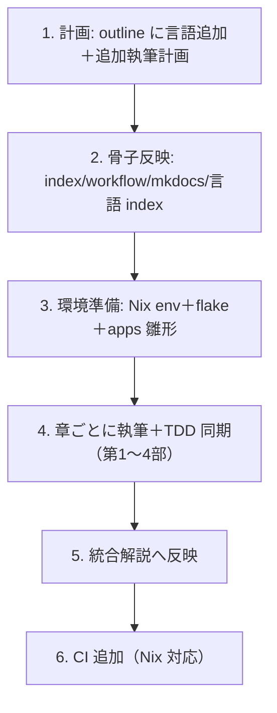

# 対象言語の記事新規追加ワークフロー

`docs/article/` の多言語 TDD シリーズに新しい言語を 1 つ追加する作業を、計画から CI 整備まで一貫して支援します。1 言語ぶん（index + 全 12 章 + 実装 + 統合解説反映 + 環境 + CI）を対象とし、部（3 章）ごとに執筆と TDD 実装を同期させながら進めます。

このスキルは「新しい言語をシリーズに加える」全体の段取りを担います。1 章ずつの執筆・実装サイクルの詳細は `orchestrating-development` と `developing-backend` を、コミット規律は `git-commit` を参照してください。

## いつ使うか

- `outline.md` の対象プログラムに新しい言語を追加してほしいと言われたとき
- 「〈言語〉を追加して」「〈言語〉の記事を執筆して」と依頼されたとき
- ある言語の第 N 部・第 N 章を増補したいとき

## 全体フロー

各ステップの区切りで `docs:` と `feat:`/`chore:`/`ci:` を分けてコミットします（`git-commit` 準拠、1 コミット 1 目的）。

## 1. 計画 — outline への追加と追加執筆計画

`docs/article/outline.md` を編集する。

- 対象言語一覧の表に行を追加（環境名・言語・エピソード数・備考）。冒頭の言語数表記も更新する。
- 「言語ごとのバリエーション」表に、その言語で第 4 部（FP）をどう扱うかを追記。
- ファイル構成・実装コード配置の図に `docs/article/{lang}/` と `apps/{lang}/` を追加。
- 新言語専用の「追加執筆計画」節を設ける。**前提整備**（Nix 環境・アプリ雛形・テスト基盤・記事ディレクトリ）と、**章別執筆計画**（全 12 章で、その言語固有の焦点を各章に 1 行）を表で示す。

第 4 部の扱いは言語の性質で決める。純粋 FP や FP ファースト（Haskell・Flix など）は全 4 部フル対応、3 エピソード言語は各言語で使える FP 機能の範囲で書く。

## 2. 骨子への反映

計画に沿って、以下を一括で更新する。

- `docs/article/index.md`: 言語別解説テーブルに 1 行、第 1〜4 部の全章構成テーブル（4 表）に 1 列追加。ファイル名は既存言語の命名に合わせる（章タイトルが言語で異なる場合は各言語のファイル名を踏襲）。冒頭の言語数も更新。
- `docs/article/workflow.md`: 進捗管理表に行を追加（着手時は 🚧、`nix develop` 一覧にも追記）。
- `mkdocs.yml`: `nav` に言語セクションの見出しを追加（章は書けたぶんだけ随時追加していく）。
- `docs/article/{lang}/index.md`: その言語の記事トップ（開発環境の表・全 12 章の目次・ソースコードへのリンク）。既存言語の `index.md`（例: `haskell/index.md`）を雛形にする。

命名・章構成・体裁は必ず既存言語（特に性質の近い言語）の実ファイルを開いて合わせること。憶測で書かない。

## 3. 環境準備

TDD 実装が回る最小構成を先に用意する。

- `ops/nix/environments/{lang}/shell.nix`: `../../shells/shell.nix` を `baseShell` として継承し、その言語のツールチェーンを `buildInputs` に足す。`shellHook` でバージョン表示と使い方を出す。既存 env（同ランタイム系。JVM 系なら `scala`/`haskell`）を雛形にする。ツールが nixpkgs に無い場合（単一 jar 配布など）は、ランタイム（JDK 等）を提供し `shellHook` で成果物をブートストラップし、ラッパー関数を定義する方式にする。
- `flake.nix`: `devShells` に `{lang} = import ./ops/nix/environments/{lang}/shell.nix { inherit packages; };` を登録。`nix flake show` でエラーなく認識されることを確認。
- `apps/{lang}/`: その言語のプロジェクトを初期化（`flix init` / `stack new` / `cargo init` など）。パッケージ定義・`src/`・`test/`・`.gitignore`・`Makefile`（既存言語に倣った `build`/`test`/`check`/`format` などのタスク）を整える。復元可能な成果物・大きなバイナリ・秘匿情報は `.gitignore` で除外する。
- 最小の 1 テストが通ることを確認してからコミットする。

## 4. 章ごとの執筆と TDD 実装（第 1〜4 部）

`docs/article/workflow.md` の詳細フローに従い、章単位で「執筆」と「実装」を同期させる。第 1 部から順に、部（3 章）ごとにまとめて進めると区切りが良い。

各章のサイクル:

1. **参照章を読む** — 性質の近い既存言語（Haskell・Scala など）の同じ章を開き、テーマ・追加仕様・段階の流れを把握する。
2. **TDD 実装（先に手を動かす）** — `apps/{lang}/` で Red → Green を回す。第 3・4 部の追加仕様（タイプ別出力、値オブジェクト、コレクション、コマンド、高階関数、パイプライン、Result／効果など）も実装する。**記事に載せるコードは、実際に動作確認済みの実コードから転記する**（憶測のコードを書かない）。
3. **記事執筆** — `docs/article/{lang}/NN-....md` を書く。参照章と同じ節構成・粒度に合わせつつ、その言語固有の観点（型システム・構文・パラダイム上の強み）を各所で解説する。コード例は実装と一字一句一致させる。
4. **mkdocs 反映** — `mkdocs.yml` の `nav` にその章を追加。
5. **コミット** — 部の実装を `feat({lang}): ...`、記事を `docs({lang}): 第 N〜M 章を執筆し第 K 部を完成` のように分けてコミット。`workflow.md` の進捗表も更新する。

執筆フォーマット（見出し、コード例、`
` での実装折りたたみ、タスク項目は一行空ける等）は `workflow.md` の「執筆フォーマット」節に従う。日本語・技術用語は英語・日本語と半角英数字の間に半角スペース。

各部の題材（このシリーズの標準）:

- 第 1 部（1〜3 章）: TDD 基本サイクル（TODO リスト・仮実装・三角測量・明白な実装・リファクタリング）
- 第 2 部（4〜6 章）: 開発環境と自動化（バージョン管理・パッケージ管理と静的解析・タスクランナーと CI/CD）
- 第 3 部（7〜9 章）: 構造化設計（カプセル化／型・ポリモーフィズム・デザインパターン・SOLID とモジュール設計）
- 第 4 部（10〜12 章）: 関数型への展開（高階関数と合成・不変データとパイプライン・エラーハンドリングと型安全性／効果）

## 5. 統合解説への反映

`docs/article/integration/` の全ファイル（index + 各比較章）に新言語を横断的に追加する。作業量が多いので、Explore で対象箇所を洗い出してからサブエージェントに一括反映を委譲してもよい。

- `index.md`: 対象言語一覧の表と冒頭の言語列挙、章タイトルの言語数。
- 概要と分類: パラダイム・型システム・ランタイムの各分類、コア実装比較。
- テストフレームワーク比較 / TDD パターン比較 / 型システム比較 / 開発環境比較 / 学習ロードマップ: 各表・各コード例・概念マップにその言語を追加。
- その言語固有の強み（例: 代数的効果、所有権、マクロ）を、対応する比較節に 1 項目として立てる。

反映後は各表のカラム数の整合と、旧言語数表記の残存がないことを確認する。実在しない事実は書かない。

## 6. CI の追加（Nix 対応）

`.github/workflows/{lang}-ci.yml` を作る。既存の Nix 対応 CI（`haskell-ci.yml` / `scala-ci.yml`）を雛形にする。

- `on.push` / `on.pull_request` の `paths` を `apps/{lang}/**`・当ワークフロー・`ops/nix/environments/{lang}/shell.nix` に絞る。
- `cachix/install-nix-action` で Nix をセットアップし、Nix store とビルド成果物をキャッシュ。
- 各ステップは `nix develop .#{lang} --command bash -c "cd apps/{lang} && <check/lint/test>"` で実行する。
- YAML の構造・ステップ数を既存 CI と突き合わせて確認してからコミット（`ci({lang}): ...`）。

## 完了確認チェックリスト

- [ ] `outline.md` に言語と追加執筆計画がある（前提整備は「完了」に更新）
- [ ] `index.md` の全 4 部の表と言語別解説に反映
- [ ] `workflow.md` の進捗表・`nix develop` 一覧に反映
- [ ] `docs/article/{lang}/` に index + 全 12 章
- [ ] `apps/{lang}/` の全テストが通り、記事のコード例と一致
- [ ] `mkdocs.yml` の nav に全章
- [ ] `ops/nix/environments/{lang}/shell.nix` と `flake.nix` 登録（`nix flake show` OK）
- [ ] `docs/article/integration/` に反映（表の整合確認）
- [ ] `.github/workflows/{lang}-ci.yml`（Nix 対応）
- [ ] 部ごとに `docs:`／`feat:` を分けてコミット済み

## 参照

- `docs/article/workflow.md` — 執筆フォーマットと章ごとの詳細フロー
- `docs/article/outline.md` — シリーズ全体の章構成と計画
- `orchestrating-development` — 章単位の執筆・実装同期
- `git-commit` — Conventional Commits 準拠のコミット
