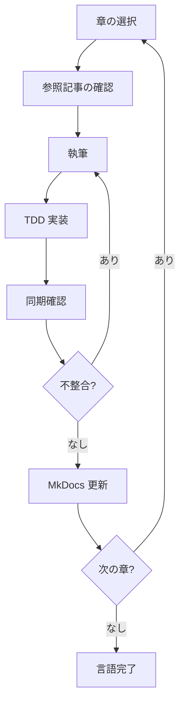
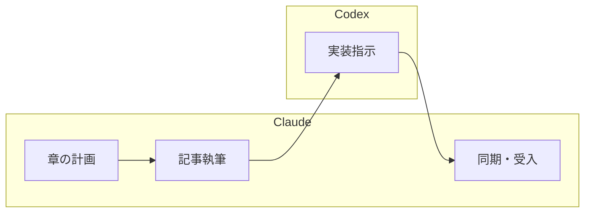

# 開発フェーズオーケストレーション

記事執筆と TDD 実装を同期しながら進める開発フェーズ全体の作業を支援します。

## Instructions

### 1. オプション

- なし : 開発フェーズ全体のワークフローを表示
- `--codex` : Claude（計画・設計・受入）と Codex（実装）の分業体制で開発
- `--chapter <言語> <章番号>` : 指定した言語・章の執筆と実装を開始
- `--sync` : 執筆内容と実装コードの同期確認

### 2. 基本例

```bash
# 開発フェーズ全体のワークフロー表示
# 「開発フェーズの全体的な進め方を説明して」

# Java の第 1 章を執筆・実装
# --chapter java 1
# 「Java の第 1 章 TODO リストと最初のテストを開始」

# Claude と Codex の分業体制で開発
# --codex
# 「Java の実装を Codex に委託して進める」

# 執筆と実装の同期確認
# --sync
# 「記事内のコード例と apps/ の実装が一致しているか確認」
```

### 3. 開発フェーズの全体像

本プロジェクトの開発は「記事執筆」と「TDD 実装」を章ごとに同期しながら進めます:



**構成要素**:

1. **記事執筆** — `docs/article/{lang}/` に章ごとの Markdown を作成
2. **TDD 実装** — `apps/{lang}/` で TDD サイクル（Red-Green-Refactor）を実行
3. **同期確認** — 記事内コード例と `apps/{lang}/` の実コードの整合性を確認

### 4. 章ごとの執筆・実装サイクル

@docs/article/workflow.md のワークフローに従い、以下のサイクルを繰り返します:

#### Step 1: 章の選択

- @docs/article/outline.md から次の章を選択
- 推奨: 1 言語ずつ第 1〜12 章を通しで進める

#### Step 2: 参照記事の確認

Wiki 記事から該当内容を読み込みます:

| 部 | 参照先（Wiki） |
|---|---|
| 第 1 部: TDD の基本サイクル | `tmp/k2works-wiki/記事/開発/テスト駆動開発から始めるプログラミング入門/` エピソード 1 |
| 第 2 部: 開発環境と自動化 | 同上 エピソード 2 |
| 第 3 部: オブジェクト指向設計 | 同上 エピソード 3 |
| 第 4 部: 関数型プログラミングへの展開 | 同上 エピソード 4（該当言語のみ） |

#### Step 3: 執筆

`docs/article/{lang}/NN-chapter-name.md` にマークダウンで記事を作成します。

**執筆フォーマット**:

```markdown
# 第N章: 章タイトル

## N.1 セクションタイトル

本文...

### コード例

\```java
// テストコード
@Test
void テスト名() {
    // Arrange
    // Act
    // Assert
}
\```

### 実装

<details>
<summary>実装コード</summary>

\```java
public class FizzBuzz {
    // ...
}
\```

</details>
```

#### Step 4: TDD 実装

Nix 環境で `apps/{lang}/` にて TDD サイクルを実行します:

```bash
# 1. Nix 環境に入る
nix develop .#{lang}

# 2. apps/{lang}/ に移動（初回はプロジェクト初期化）
cd apps/{lang}

# 3. TDD サイクル
#    Red → Green → Refactor
```

- @docs/reference/コーディングとテストガイド.md のワークフローに従う
- テストファースト（Red）→ 最小実装（Green）→ リファクタリング

#### Step 5: 同期確認

- 記事内のコード例が `apps/{lang}/` の実コードと一致しているか確認
- テスト実行結果が記事の記述と一致しているか確認
- 不整合があれば記事・実装の両方を修正

#### Step 6: MkDocs 更新

- `mkdocs.yml` の nav に章を追加
- `docs/article/{lang}/index.md` のリンクを有効化
- `npm run docs:serve` でローカルプレビュー確認

### 5. 対象言語と開発環境

各言語の開発環境は Nix で管理します:

| 環境名 | 言語 | Nix コマンド |
|--------|------|-------------|
| java | Java | `nix develop .#java` |
| node | JavaScript / TypeScript | `nix develop .#node` |
| python | Python | `nix develop .#python` |
| ruby | Ruby | `nix develop .#ruby` |
| php | PHP | `nix develop .#php` |
| go | Go | `nix develop .#go` |
| rust | Rust | `nix develop .#rust` |
| dotnet | C# / F# | `nix develop .#dotnet` |
| clojure | Clojure | `nix develop .#clojure` |
| scala | Scala | `nix develop .#scala` |
| elixir | Elixir | `nix develop .#elixir` |
| haskell | Haskell | `nix develop .#haskell` |

### 6. ファイル構成

**記事**: `docs/article/{lang}/NN-chapter-name.md`
**実装**: `apps/{lang}/`（言語固有のプロジェクト構成）

```
docs/article/{lang}/NN-chapter-name.md  ←→  apps/{lang}/
     （記事・解説）                          （実装コード）
```

記事内のコード例は `apps/{lang}/` の実際のコードと一致させます。実装を先に TDD で進め、動作確認済みのコードを記事に転記します。

### 7. TDD サイクルの実践

Red-Green-Refactor サイクルを厳密に実行:

1. **Red フェーズ**: 失敗するテストを最初に書く
2. **Green フェーズ**: テストを通す最小限のコードを実装
3. **Refactor フェーズ**: 重複を除去し設計を改善
4. @docs/reference/コーディングとテストガイド.md のワークフローに従う

### 8. Codex を活用した開発モード（--codex）

`--codex` オプションを指定すると、Claude と Codex の分業体制で開発を進めます。

**前提条件**:

- Codex MCP サーバーが設定済みであること
- @docs/reference/CodexCLIMCPサーバー設定手順.md を参照
- @docs/reference/CodexCLIMCPアプリケーション開発フロー.md を参照

**役割分担**:

| フェーズ | 担当 | 責務 |
|---------|------|------|
| 計画 | Claude | 章の選択、参照記事の確認、タスク分解 |
| 執筆 | Claude | 記事の構成・執筆、コード例の作成 |
| 実装 | Codex | `apps/{lang}/` での TDD 実装 |
| 受入 | Claude | 同期確認、MkDocs 更新、品質チェック |

**開発フロー**:



**Codex への指示例**:

```
mcp__codex__codex
  prompt: |
    apps/java/ で FizzBuzz の TDD 実装を行ってください。

    ## 開発ガイド
    docs/reference/コーディングとテストガイド.md に従って実装すること。
    TDD サイクル（Red-Green-Refactor）を厳守すること。

    ## タスク
    1. FizzBuzz クラスのユニットテストを作成
    2. テストを通す最小限の実装
    3. リファクタリング

    ## 完了条件
    - 全テストがパス
    - 静的解析エラーなし
    - TDD サイクルに従って実装

  sandbox: danger-full-access
  approval-policy: never
  cwd: プロジェクトルート
```

**Codex MCP ツールのパラメータ**:

| パラメータ | 説明 | 推奨値 |
|-----------|------|--------|
| `prompt` | 実装指示（詳細な要件を含む） | タスク単位で明確に記述 |
| `sandbox` | 実行環境の権限レベル | `danger-full-access`（推奨） |
| `approval-policy` | コマンド実行時の承認ポリシー | `never` |
| `cwd` | 作業ディレクトリ | プロジェクトルート |

**指示サイズに関する注意**:

| 粒度 | 推奨度 | 説明 |
|------|--------|------|
| 章単位（1 章分の実装） | 推奨 | 1 つの章に対応する TDD 実装 |
| 部単位（3 章分の実装） | 注意 | 進捗確認を頻繁に行う |
| 言語全体（12 章分） | 非推奨 | 章ごとに分割して実行 |

**Codex が書き込みできない場合の対処**:

1. Claude が勝手に直接編集を進めてはいけない
2. ユーザーに状況を報告し、確認を待つ
3. ユーザーの許可を得てから代替手段を実行

### 9. 実装同期チェックリスト

- [ ] `apps/{lang}/` にプロジェクトが作成されている
- [ ] テストコードが執筆内容と一致
- [ ] プロダクションコードが一致
- [ ] テスト実行結果が記事の記述と一致
- [ ] リファクタリング後のコードが反映済み
- [ ] 記事内のコード例が `apps/{lang}/` の実コードと同期している

### 10. MkDocs チェックリスト

- [ ] 章ファイルが正しいパスに配置されている
- [ ] `mkdocs.yml` の nav に章が追加されている
- [ ] `index.md` のリンクが正しい
- [ ] ローカルプレビューで表示確認済み
- [ ] PlantUML ダイアグラムが正しくレンダリングされる
- [ ] 内部リンクが正常に動作する

### 11. 参照ドキュメント

- @docs/article/outline.md : 執筆計画アウトライン（章構成・対象言語）
- @docs/article/workflow.md : 執筆ワークフロー（詳細フロー・ルール）
- @docs/reference/コーディングとテストガイド.md : TDD サイクルの実践ガイド
- @docs/reference/CodexCLIMCPアプリケーション開発フロー.md : Codex 活用フロー
- @docs/reference/CodexCLIMCPサーバー設定手順.md : Codex MCP サーバー設定手順
- 作業完了後に @docs/development/iteration_plan-N.md の進捗を更新する
- 作業完了後に @docs/article/workflow.md の進捗管理テーブルを更新する

### 12. コンテキスト管理

長時間の開発セッションでは Context limit reached エラーを回避するため、タスクの区切りごとに `/compact` を実施してコンテキストを圧縮する。

**`/compact` を実施するタイミング**:

- 1 章の執筆・実装が完了したとき
- TDD サイクル（Red-Green-Refactor）を数回繰り返した後
- Codex への実装指示と受入フェーズの間
- コミット完了後、次の章に着手する前

**運用ルール**:

1. `/compact` 実施前に、現在の作業状態と次のタスクをメモとして出力する
2. `/compact` 実施後、次のタスクの作業を継続する
3. 1 言語 12 章を通す場合、3〜4 章ごとに `/compact` を検討する

### 13. 注意事項

- **前提条件**: Nix 開発環境が利用可能であること。`ops/nix/environments/` に言語環境が定義されていること
- **制限事項**: TDD の三原則を厳密に守る（テストなしでプロダクションコードを書かない）
- **推奨事項**: 実装を先に TDD で完成させ、動作確認済みのコードを記事に転記する

### 14. ベストプラクティス

1. **1 言語通し執筆**: 1 言語ずつ第 1〜12 章を通しで執筆・実装する
2. **TDD ファースト**: 記事の前に `apps/{lang}/` で TDD 実装を完成させる
3. **小さなサイクル**: Red-Green-Refactor を 10-15 分で完了させる
4. **継続的コミット**: 各章完了時に動作する状態でコミット
5. **同期チェック**: 章完了時に記事とコードの整合性を必ず確認

### 関連スキル / ドキュメント

- Skill: `developing-backend` : バックエンド開発ガイド（TDD インサイドアウト）
- Skill: `developing-frontend` : フロントエンド開発ガイド（TDD アウトサイドイン）
- Skill: `developing-release` : リリースワークフロー（品質ゲート・バージョン管理・CHANGELOG）
- Skill: `managing-docs` : ドキュメント管理（MkDocs 更新・Lint）
