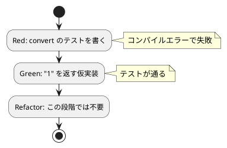

# 第 1 章: TODO リストと最初のテスト

## 1.1 はじめに

プログラムを作成するにあたって、まず何をすればよいでしょうか？私たちは、仕様を確認して **TODO リスト** を作るところから始めます。

> TODO リスト
>
> 何をテストすべきだろうか——着手する前に、必要になりそうなテストをリストに書き出しておこう。
>
> — テスト駆動開発

## 1.2 仕様の確認

今回取り組む FizzBuzz 問題の仕様は以下の通りです。

```
1 から 100 までの数をプリントするプログラムを書け。
ただし 3 の倍数のときは数の代わりに「Fizz」と、5 の倍数のときは「Buzz」とプリントし、
3 と 5 両方の倍数の場合には「FizzBuzz」とプリントすること。
```

この仕様をそのままプログラムに落とし込むには少しサイズが大きいですね。最初の作業は仕様を **TODO リスト** に分解する作業から着手しましょう。

## 1.3 TODO リストの作成

仕様を分解して TODO リストを作成します。

**TODO リスト**:

- [ ] 数を文字列にして返す
    - [ ] 1 を渡したら文字列 "1" を返す
- [ ] 3 の倍数のときは数の代わりに「Fizz」と返す
- [ ] 5 の倍数のときは「Buzz」と返す
- [ ] 3 と 5 両方の倍数の場合には「FizzBuzz」と返す
- [ ] 1 から 100 までの数
- [ ] プリントする

まず「1 を渡したら文字列 "1" を返す」という、最も小さなタスクから取り掛かります。

## 1.4 テスティングフレームワークの導入

### テストファースト

最初にプログラムする対象を決めたので、早速プロダクトコードを実装……ではなく **テストファースト** で作業を進めましょう。

> テストファースト
>
> いつテストを書くべきだろうか——それはテスト対象のコードを書く前だ。
>
> — テスト駆動開発

Flix にはテスティングフレームワークが **標準で同梱** されています。関数に `@Test` アノテーションを付けるだけでテストになり、`flix test` コマンドで実行できます。外部ライブラリの導入は不要です。

### 開発環境のセットアップ

Flix は単一の `flix.jar` として配布されます。JVM 上で動作するため、JDK があれば実行できます。

```bash
# Nix 環境に入る
$ nix develop .#flix

# プロジェクトの初期化
$ cd apps/flix
$ java -jar flix.jar init
```

`init` により以下の雛形が生成されます。

```
apps/flix/
├── flix.toml          # パッケージ定義
├── src/
│   └── Main.flix      # プロダクトコード
└── test/
    └── TestMain.flix  # テストコード
```

`flix.toml` にパッケージ情報を記述します。

```toml
[package]
name        = "fizzbuzz"
description = "FizzBuzz TDD implementation in Flix"
version     = "0.1.0"
flix        = "0.75.1"
authors     = ["k2works"]
```

## 1.5 最初のテスト（Red）

「1 を渡したら文字列 "1" を返す」テストを書きます。テスト対象となる `FizzBuzz.convert` はまだ存在しませんが、テストファーストなので先にテストを書きます。

`test/TestFizzBuzz.flix`:

```flix
mod TestFizzBuzz {
    ///
    /// 1 を渡したら文字列 "1" を返す。
    ///
    @Test
    def convert_1_returns_1(): Unit \ Assert =
        Assert.assertEq(expected = "1", FizzBuzz.convert(1))
}
```

Flix ならではのポイントを確認しましょう。

- `mod TestFizzBuzz { ... }` — テストを **モジュール** でまとめます。
- `@Test` — この関数がテストであることを示すアノテーション。
- `Unit \ Assert` — 戻り値型の `\ Assert` は、この関数が **Assert 効果** を持つことを表します。Flix では「どんな副作用（効果）を使うか」を型で明示します。テスト用のアサーションも効果として扱われるのが特徴です。
- `Assert.assertEq(expected = "1", ...)` — 期待値と実際の値を比較します。名前付き引数 `expected =` で意図が明確になります。

この時点でテストを実行すると、`FizzBuzz.convert` が未定義のためコンパイルエラー（Red）になります。

```bash
$ java -jar flix.jar test
>> Undefined name 'FizzBuzz.convert'.
```

Flix は静的型付け・コンパイル言語なので、「テストが失敗する」最初の状態は多くの場合 **コンパイルエラー** として現れます。これも立派な Red です。

## 1.6 最小実装（Green）

テストを通す最小限のコードを書きます。TODO リストの最初の項目は「1 を渡したら "1" を返す」だけなので、素直に `"1"` を返す **仮実装** で構いません。

`src/FizzBuzz.flix`:

```flix
///
/// FizzBuzz を解くモジュール。
///
mod FizzBuzz {
    ///
    /// 数 `n` を FizzBuzz の規則に従って文字列に変換する。
    ///
    pub def convert(_n: Int32): String = "1"
}
```

ここで Flix 特有のルールに触れます。Flix は **使われていない仮引数を許しません**。引数 `n` を本体で使わない場合、`_n` のようにアンダースコアを前置して「意図的に未使用」であることを示す必要があります。この規律により、うっかり引数を使い忘れるミスを型検査で防げます。

テストを実行します。

```bash
$ java -jar flix.jar test
Running 1 tests...

  TEST TestFizzBuzz.convert_1_returns_1  PASS  TestFizzBuzz.convert_1_returns_1 3.4ms

Passed: 1, Failed: 0. Skipped: 0. Elapsed: 11.1ms.
```

テストが通りました（Green）。

### TDD サイクル



## 1.7 TODO リストの更新

最初のタスクが完了しました。TODO リストを更新します。

**TODO リスト**:

- [ ] 数を文字列にして返す
    - [x] 1 を渡したら文字列 "1" を返す
- [ ] 3 の倍数のときは数の代わりに「Fizz」と返す
- [ ] 5 の倍数のときは「Buzz」と返す
- [ ] 3 と 5 両方の倍数の場合には「FizzBuzz」と返す
- [ ] 1 から 100 までの数
- [ ] プリントする

## 1.8 まとめ

この章では以下を学びました。

- 仕様を **TODO リスト** に分解し、最も小さなタスクから着手する
- **テストファースト** で失敗するテスト（Red）を先に書く
- Flix ではコンパイルエラーも Red の一形態である
- **仮実装** で最小限のコード（Green）を書く
- Flix は `@Test` と `flix test` を標準で備え、`Assert` を **効果** として型に表す
- 未使用の仮引数は `_` を前置して明示する

次章では、この仮実装を **三角測量** によって一般化していきます。

### 実装

<details>
<summary>実装コード（src/FizzBuzz.flix）</summary>

```flix
///
/// FizzBuzz を解くモジュール。
///
mod FizzBuzz {
    ///
    /// 数 `n` を FizzBuzz の規則に従って文字列に変換する。
    ///
    pub def convert(_n: Int32): String = "1"
}
```

</details>

<details>
<summary>テストコード（test/TestFizzBuzz.flix）</summary>

```flix
mod TestFizzBuzz {
    ///
    /// 1 を渡したら文字列 "1" を返す。
    ///
    @Test
    def convert_1_returns_1(): Unit \ Assert =
        Assert.assertEq(expected = "1", FizzBuzz.convert(1))
}
```

</details>
