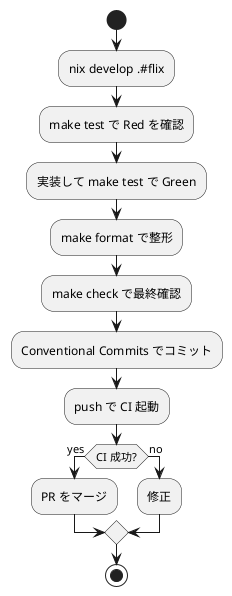

# 第 6 章: タスクランナーと CI/CD

## 6.1 はじめに

開発タスク（ビルド・テスト・型検査・整形）を毎回手打ちするのは手間がかかり、コマンドの記憶違いも起こります。この章では、Makefile によるタスク自動化、Nix 開発環境、GitHub Actions を使って、Flix プロジェクトの開発タスクを自動化します。

## 6.2 Nix による開発環境

Flix は JVM 上で動作するため、開発に必要なのは基本的に **JDK と `flix.jar`** だけです。JDK は Nix で管理し、環境を再現可能にします。

```bash
# Nix 環境に入る
$ nix develop .#flix
```

Nix 環境には JDK（Java 21 以上）が含まれます。`flix.jar` はプロジェクト直下に配置し、`java -jar flix.jar` で各種コマンドを実行します。開発者ごとの JDK バージョンの差異をなくすことで、「自分の環境では動く」問題を防ぎます。

## 6.3 Makefile によるタスク管理

`apps/flix/Makefile` に、日常的に使うタスクを定義します。長い `java -jar flix.jar ...` を短いコマンドに集約します。

```makefile
FLIX := java -jar flix.jar

.PHONY: all build test check format format-check doc run clean

all: check

build:
	$(FLIX) build

test:
	$(FLIX) test

check:
	$(FLIX) check

format:
	$(FLIX) format

format-check:
	$(FLIX) format --check

doc:
	$(FLIX) doc

run:
	$(FLIX) run

clean:
	$(FLIX) clean
```

### 各タスクの説明

| タスク | 内容 |
|--------|------|
| `make build` | プロジェクトをコンパイルする |
| `make test` | テストを実行する |
| `make check` | 型検査・効果検査を行う（実行はしない） |
| `make format` | ソースコードを整形する |
| `make format-check` | 整形が必要な箇所がないか確認する（CI 向け） |
| `make doc` | API ドキュメントを生成する |
| `make run` | `main` を実行する |
| `make clean` | ビルド成果物を削除する |

### タスクの実行

```bash
$ make test
Running 13 tests...
  ...
Passed: 13, Failed: 0. Skipped: 0.
```

`make all`（既定ターゲット）は `check` を実行し、コンパイル・型・効果の整合性をまとめて確認します。

## 6.4 GitHub Actions による CI/CD

`flix init` は CI ワークフローの雛形（`.github/workflows/build-and-test.yaml`）も生成します。これをプロジェクトルートの CI に組み込みます。

```yaml
name: Build and Test

on:
  pull_request:
  push:
    branches: [ main, master ]

jobs:
  build-and-test:
    runs-on: ubuntu-latest
    steps:
      - name: Check out
        uses: actions/checkout@v5

      - name: Install JDK 21
        uses: actions/setup-java@v4
        with:
          distribution: 'temurin'
          java-version: '21'

      - name: Read Flix version from flix.toml
        id: flix
        run: |
          version=$(grep -E '^"?flix"?[[:space:]]*=' flix.toml \
            | head -n1 \
            | sed -E 's/.*"([^"]+)"[[:space:]]*$/\1/')
          echo "version=$version" >> "$GITHUB_OUTPUT"

      - name: Download Flix
        run: |
          curl -fsSL -o flix.jar \
            "https://github.com/flix/flix/releases/download/v${{ steps.flix.outputs.version }}/flix.jar"

      - name: Check
        run: java -jar flix.jar check

      - name: Test
        run: java -jar flix.jar test
```

### ワークフローの構成

このワークフローは次のステップで構成されます。

1. **チェックアウト** -- リポジトリのコードを取得
2. **JDK のインストール** -- Temurin 21 をセットアップ
3. **Flix バージョンの読み取り** -- `flix.toml` から使用バージョンを抽出
4. **Flix のダウンロード** -- 対応する `flix.jar` を取得
5. **Check** -- 型・効果検査
6. **Test** -- テスト実行

`flix.jar` を `.gitignore` で除外している（第 4 章参照）ため、CI では `flix.toml` に記載されたバージョンを都度ダウンロードします。これによりローカルと CI で同一バージョンの Flix が使われることが保証されます。

### トリガー条件

- `pull_request` -- PR 作成・更新時に検証
- `push`（`main` / `master`） -- 主要ブランチへの反映時に検証

PR の段階で型検査とテストが自動実行されるため、壊れたコードがマージされることを防げます。

## 6.5 品質ゲートの統合

CI に整形チェックを加えると、スタイルの揺れも自動で防げます。`Test` ステップの前に次を追加します。

```yaml
      - name: Format Check
        run: java -jar flix.jar format --check
```

これにより、CI が通る条件は「型・効果が整合し、テストが全て通り、コードが整形済みである」ことになります。この 3 点を満たさない変更はマージできない **品質ゲート** が完成します。

## 6.6 開発ワークフロー

日常の開発は次の流れになります。



ローカルの `make check` と CI の検査を一致させておくことで、「ローカルで通ったのに CI で落ちる」ことがなくなります。

## 6.7 まとめ

この章では以下を学びました。

- Nix で JDK を管理し、`flix.jar` と組み合わせて再現可能な開発環境を作る
- Makefile で日常タスク（`build`, `test`, `check`, `format`, `doc`, `run`, `clean`）を短いコマンドに集約する
- `flix init` が生成する GitHub Actions ワークフローで型検査とテストを自動化する
- `flix.jar` を CI で都度ダウンロードし、`flix.toml` のバージョンと一致させる
- `format --check` を加えて型・テスト・整形の 3 点を **品質ゲート** にする

第 2 部を通じて、TDD の小さな変更を安全に積み上げるための開発基盤（版管理・パッケージ管理・静的解析・自動化）が整いました。次の第 3 部では、Flix の列挙型とトレイトを使って、FizzBuzz をオブジェクト指向的に設計し直していきます。
