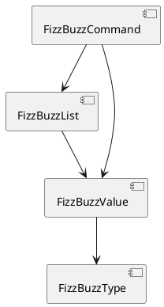

# 第 9 章: モジュール設計と SOLID 原則

## 9.1 はじめに

これまでに FizzBuzz は、タイプ（`FizzBuzzType`）、値オブジェクト（`FizzBuzzValue`）、コレクション（`FizzBuzzList`）へと構造化されてきました。この章では、これらを **モジュール** として整理し、**コマンドパターン** を導入して、SOLID 原則に基づく設計へと仕上げます。

### Before（モノリシック）

第 1 部の実装は、1 つの `FizzBuzz` モジュールにすべてが詰まっていました。

```flix
mod FizzBuzz {
    pub def convert(n: Int32): String = ...
    pub def generateList(n: Int32): List[String] = ...
}
```

### After（モジュール分割）

第 3 部を通じて、責務ごとにファイルとモジュールを分割しました。

```
src/
├── FizzBuzz.flix          # 素朴な変換（第 1 部）
├── FizzBuzzType.flix      # タイプ（列挙型・トレイト・生成）
├── FizzBuzzValue.flix     # 値オブジェクト
├── FizzBuzzList.flix      # ファーストクラスコレクション
└── FizzBuzzCommand.flix   # コマンド（本章）
```

## 9.2 モジュールシステムの基礎

### mod 宣言

Flix のモジュールは `mod` で定義します。型（`enum`・`trait`）とそれに対する操作（`def`）を同じ名前空間にまとめます。

```flix
mod FizzBuzzList {
    pub def create(count: Int32, fbType: FizzBuzzType): FizzBuzzList = ...
    pub def count(list: FizzBuzzList): Int32 = ...
    pub def values(list: FizzBuzzList): List[FizzBuzzValue] = ...
}
```

### 可視性の制御

- `pub def` … モジュール外に公開する関数
- `def`（`pub` なし） … モジュール内に閉じる関数

公開範囲を最小限に絞ることで、内部実装の変更が外部に波及しにくくなります。これは **情報隠蔽** の実践であり、言語仕様として組み込まれています。

### 型と操作の結合

Flix では、列挙型 `FizzBuzzValue` と同名のモジュール `mod FizzBuzzValue` を並べることで、「データ」と「そのデータに対するふるまい」を 1 か所に集約できます。オブジェクト指向言語のクラスに近い凝集度を、関数型のスタイルで実現します。

## 9.3 コマンドパターン

### コマンドの設計

「単一の値を生成する」「1 から n までのリストを生成する」という 2 種類の操作を、**コマンド** として統一的に扱います。列挙型でコマンドを表現します。

```flix
enum FizzBuzzCommand {
    case ValueCommand(FizzBuzzType)  // 単一の値を生成する
    case ListCommand(FizzBuzzType)   // 1 から n までのリストを生成する
}
```

各コマンドは適用するタイプ（`FizzBuzzType`）を保持します。

### execute の実装

コマンドの実行は `execute` に集約します。パターンマッチでコマンドの種類ごとに処理を分岐します。両コマンドとも戻り値を `FizzBuzzList` に統一することで、呼び出し側は結果を同じ型として扱えます。

```flix
mod FizzBuzzCommand {
    ///
    /// コマンドを数 `n` に対して実行し、結果コレクションを返す。
    ///
    pub def execute(cmd: FizzBuzzCommand, n: Int32): FizzBuzzList = match cmd {
        case FizzBuzzCommand.ValueCommand(fbType) =>
            FizzBuzzList.FizzBuzzList(FizzBuzzValue.create(fbType, n) :: Nil)
        case FizzBuzzCommand.ListCommand(fbType) =>
            FizzBuzzList.create(n, fbType)
    }
}
```

`::` は **リストの cons 演算子** で、`x :: Nil` は「要素 `x` だけを持つリスト」です。`ValueCommand` は単一の値オブジェクトを 1 要素のリストに包んで返します。

### Red / Green: コマンドのテスト

```flix
mod TestFizzBuzzCommand {
    /// ValueCommand は単一要素のコレクションを返す。
    @Test
    def value_command_returns_single(): Unit \ Assert =
        let cmd = FizzBuzzCommand.ValueCommand(FizzBuzzType.Type01);
        let result = FizzBuzzCommand.execute(cmd, 3);
        Assert.assertEq(expected = 1, FizzBuzzList.count(result))

    /// ListCommand は 1 から n までのコレクションを返す。
    @Test
    def list_command_returns_n(): Unit \ Assert =
        let cmd = FizzBuzzCommand.ListCommand(FizzBuzzType.Type01);
        let result = FizzBuzzCommand.execute(cmd, 100);
        Assert.assertEq(expected = 100, FizzBuzzList.count(result))
}
```

```bash
$ java -jar flix.jar test
Passed: 33, Failed: 0. Skipped: 0.
```

すべてのテストが通りました。

## 9.4 SOLID 原則の適用

分割後の設計を SOLID の観点で振り返ります。

| 原則 | 適用箇所 |
|------|----------|
| **単一責任（SRP）** | 各モジュールが 1 つの関心事（タイプ・値・コレクション・コマンド）だけを持つ |
| **開放閉鎖（OCP）** | 新しいタイプは `Generatable` の `instance` 追加で拡張でき、既存コードを変更しない |
| **リスコフの置換（LSP）** | `Generatable` を実装する型は、`generate` の契約を満たす限り相互に置換できる |
| **インターフェース分離（ISP）** | `Generatable` は `generate` だけの小さなトレイト。不要なメソッドを強制しない |
| **依存性逆転（DIP）** | `FizzBuzzValue` は具体的な変換ロジックではなくトレイト `Generatable` に依存する |

### 依存関係の方向



依存は一方向（コマンド → コレクション → 値 → タイプ）に流れ、循環がありません。上位のモジュールが下位のモジュールに依存し、その逆はありません。この非循環の依存グラフが、変更の影響範囲を局所化します。

## 9.5 テストのモジュール対応

テストもモジュールごとに分割しました。

```
test/
├── TestFizzBuzz.flix            # 素朴な変換
├── TestFizzBuzzType.flix        # タイプ別変換
├── TestFizzBuzzTypeCreate.flix  # タイプ生成（Result）
├── TestFizzBuzzValue.flix       # 値オブジェクト・コレクション
└── TestFizzBuzzCommand.flix     # コマンド
```

各テストモジュールは対応するプロダクションモジュールの振る舞いだけを検証します。すべてのロジックが純粋関数として書かれているため、モックやスタブを一切使わずに入力と出力の対応だけでテストが完結します。

## 9.6 まとめ

この章では以下を学びました。

- **`mod` 宣言** による名前空間の分割と、`pub` による可視性制御
- 列挙型と同名モジュールを並べて **データとふるまいを凝集** させる設計
- **コマンドパターン** を列挙型と `execute` のパターンマッチで表現する
- リストの cons 演算子 `::` による単一要素リストの生成
- **SOLID 原則**（SRP・OCP・LSP・ISP・DIP）が Flix のトレイトとモジュールで自然に実現されること
- 非循環の依存グラフによる変更影響の局所化

第 3 部を通じて、FizzBuzz を列挙型・トレイト・モジュールで構造化し、拡張しやすい設計へと育てました。次の第 4 部では、高階関数・関数合成・不変データ・代数的効果という Flix の関数型プログラミングの核心へ進みます。
