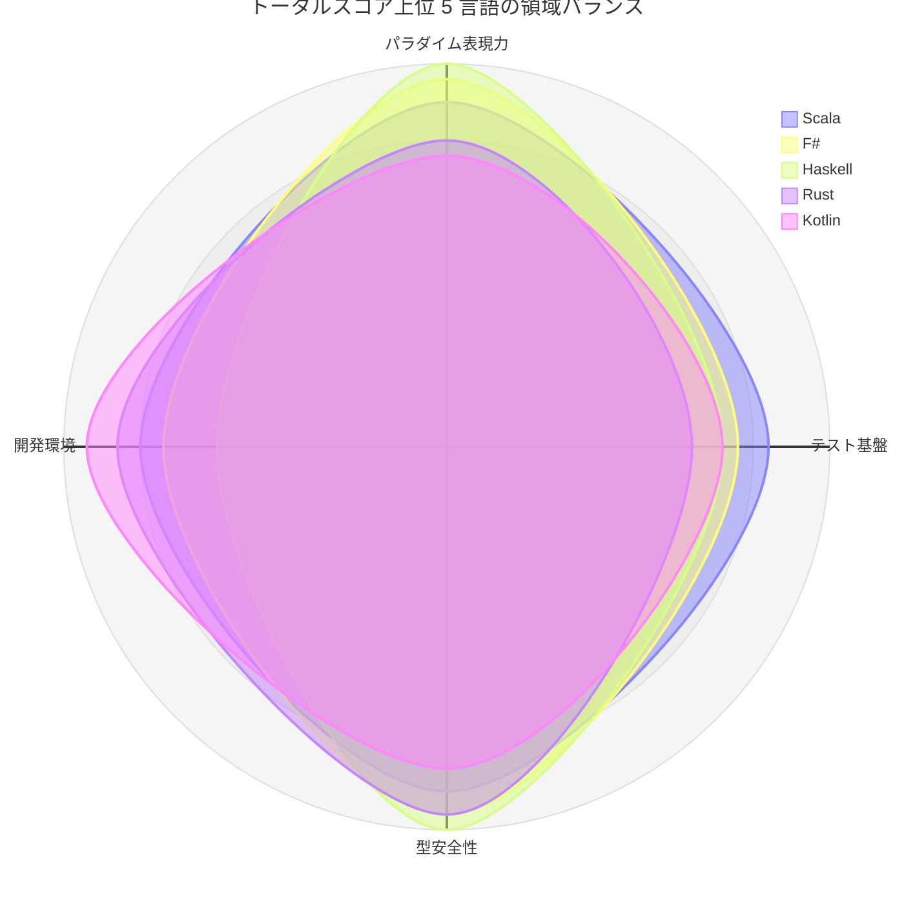
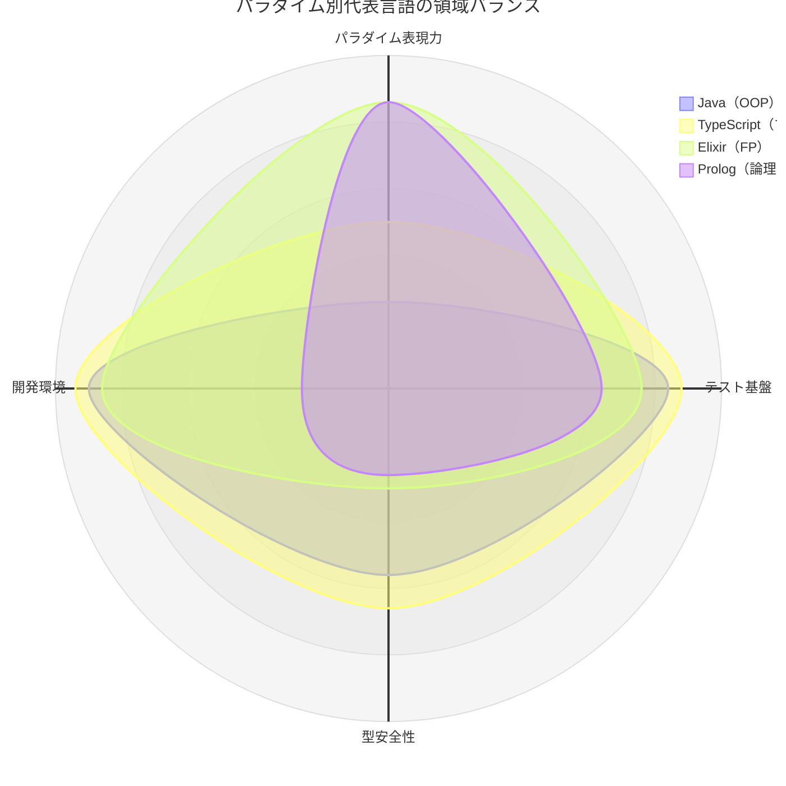

# 学習ロードマップ

本章では、16 言語を効果的に学ぶための推奨順序、各言語で習得できる概念、そして学習を深めるための次のステップを提示します。

## 推奨学習順序

### フェーズ 1: OOP の基盤（1-2 言語）

まず OOP の基本概念を確実に身につけます。

```
Java ──→ Python
 │         │
 │         └─ マルチパラダイムの基礎
 └─ OOP の王道、静的型付けの基礎
```

| 順序 | 言語 | 学習期間目安 | 習得する概念 |
|------|------|-----------|------------|
| 1 | **Java** | 2-3 週間 | クラス、インターフェース、継承、JUnit 5、Gradle |
| 2 | **Python** | 1-2 週間 | 動的型付け、ABC、デコレータ、pytest |

**Java を最初に学ぶ理由**:
- 静的型付けと OOP の概念が明確に分かれている
- JUnit 5 の構造が TDD の基本パターンを学ぶのに最適
- エコシステムが成熟しており、学習リソースが豊富

**Python を 2 番目に学ぶ理由**:
- Java との対比で動的型付けの利点と欠点を体感できる
- pytest のシンプルさが TDD の本質を理解させる
- マルチパラダイムへの橋渡し

### フェーズ 2: マルチパラダイムの拡張（2-3 言語）

OOP の基盤の上に、異なるパラダイムの要素を積み上げます。

```
TypeScript ──→ Ruby ──→ Go or Rust or Kotlin
     │           │         │
     │           │         └─ 構造化/所有権/null 安全という新概念
     │           └─ OOP + ブロック/Lambda
     └─ 型システムの拡張（ユニオン型、型ガード）
```

| 順序 | 言語 | 学習期間目安 | 習得する概念 |
|------|------|-----------|------------|
| 3 | **TypeScript** | 1-2 週間 | ユニオン型、型ガード、Vitest、ESLint |
| 4 | **Ruby** | 1-2 週間 | ブロック/Proc/Lambda、Minitest、RuboCop |
| 5a | **Go** | 1-2 週間 | 構造体、暗黙的インターフェース、テーブル駆動テスト |
| 5b | **Rust** | 2-3 週間 | 所有権、借用、trait、Result/Option、Clippy |
| 5c | **Kotlin** | 1-2 週間 | data class、sealed class、null 安全、高階関数、Result、Gradle |

**Go と Rust はどちらか一方を選択、または順に学習**:
- **Go**: シンプルさを重視する場合。インターフェースの構造的部分型が新鮮
- **Rust**: 型安全性を深く理解したい場合。所有権システムが根本的に新しい

**Kotlin を加える理由**:
- JVM 上の OOP/FP ハイブリッドで、Java の知識を活かしながら null 安全と data class・sealed class を学べる
- `when` の網羅性検査と `Result` により、型安全なエラーハンドリングへの橋渡しになる

### フェーズ 3: FP への展開（2-4 言語）

関数型プログラミングの概念を段階的に導入します。

```
F# ──→ Scala ──→ Elixir or Clojure ──→ Haskell ──→ Flix ──→ Prolog
 │       │              │                   │           │        │
 │       │              │                   │           │        └─ 論理型・宣言的思考（第 4 のパラダイム）
 │       │              │                   │           └─ 代数的効果と効果システム
 │       │              │                   └─ 純粋関数型の頂点
 │       │              └─ BEAM/LISP の世界
 │       └─ OOP + FP のハイブリッド
 └─ .NET 上の FP 入門（C# からの橋渡し）
```

| 順序 | 言語 | 学習期間目安 | 習得する概念 |
|------|------|-----------|------------|
| 6 | **F#** | 1-2 週間 | 判別共用体、パイプライン、パターンマッチング |
| 7 | **Scala** | 2-3 週間 | sealed trait、for 内包表記、Option/Either |
| 8a | **Elixir** | 1-2 週間 | パターンマッチング、パイプライン、{:ok, :error} |
| 8b | **Clojure** | 2-3 週間 | S 式、不変データ、プロトコル、REPL 駆動 |
| 9 | **Haskell** | 3-4 週間 | 型クラス、モナド、遅延評価、do 記法 |
| 10 | **Flix** | 2-3 週間 | enum/trait、Result/Option、代数的効果、効果システム |
| 11 | **Prolog** | 3-4 週間 | 述語、単一化、バックトラッキング、複数節、maplist/foldl |

**Flix を Haskell の後に学ぶ理由**:
- Haskell で純粋 FP と型システムの基礎を固めた後、Flix の代数的効果（algebraic effects）と効果システムに進むと理解しやすい
- `eff` で効果を宣言し `run ... with handler` で解釈することで、「実行」と「解釈」を分離する考え方を学べる
- JVM 上で動作するため、Java・Scala・Clojure の知識やエコシステムを活かせる

**F# を FP の入口に選ぶ理由**:
- C# と同じ .NET ランタイム上で動作し、既存知識を活かせる
- 判別共用体とパターンマッチングが FP の核心を教えてくれる
- パイプライン演算子がデータフローの思考法を身につけさせる

**Haskell を最後に学ぶ理由**:
- 純粋関数型の概念（モナド、型クラス）は他の FP 言語の基礎があると理解しやすい
- 他の言語で「なぜ FP が有用か」を体感した後に、最も厳密な FP を学ぶ

**Prolog を FP の後に学ぶ理由**:
- 論理型・宣言的という命令型/OOP/FP のいずれとも異なる「第 4 のパラダイム」であり、宣言的思考という点で純粋 FP（Haskell/Flix）と親和性がある
- 「何が真かを宣言する」思考、制約充足・探索、宣言的データ変換（maplist/foldl）という新しい視点が得られる
- 関数・代入・ループ・戻り値といった既存モデルを、述語・単一化・バックトラッキング・複数節・関係へ思考転換する必要があり、パラダイムの視野を広げる発展的な選択肢となる
- 単一化・バックトラッキング・論理変数は Prolog 独自であり、FP を学んだ後に宣言的思考をさらに広げられる

### PHP と C# の位置づけ

PHP と C# は上記のフェーズに含まれていませんが、以下のタイミングで学ぶことを推奨します。

| 言語 | 推奨タイミング | 理由 |
|------|-------------|------|
| **PHP** | フェーズ 1 の後 | Web 開発の文脈で OOP を再確認 |
| **C#** | フェーズ 2 の後 | Java の知識を .NET に転用、F# への橋渡し |

## 各言語で学べる概念マップ

### TDD の基本概念

| 概念 | 最もよく学べる言語 | 理由 |
|------|----------------|------|
| Red-Green-Refactor | Java, Python | シンプルな構造で本質に集中 |
| テストファースト | すべて | 共通概念 |
| 仮実装 | すべて | 共通概念 |
| 三角測量 | Java, Go | テストテーブルが三角測量と相性が良い |
| 明白な実装 | すべて | 共通概念 |

### OOP 概念

| 概念 | 最もよく学べる言語 | 理由 |
|------|----------------|------|
| カプセル化 | Java, C# | アクセス修飾子が明確 |
| 継承 | Java, Ruby | 単一/Mixin 継承の対比 |
| ポリモーフィズム（名前的） | Java, C#, TypeScript, Kotlin | interface の明示的実装 |
| ポリモーフィズム（構造的） | Go, TypeScript | 暗黙的インターフェース |
| デザインパターン | Java, C# | GoF パターンが直接適用 |
| SOLID 原則 | Java, TypeScript | 依存性の注入が自然 |

### FP 概念

| 概念 | 最もよく学べる言語 | 理由 |
|------|----------------|------|
| 高階関数 | Python, TypeScript, Ruby, Kotlin | 馴染みやすい構文（Kotlin はラムダ `{ x -> ... }` と関数参照 `::f`） |
| パターンマッチング | Rust, F#, Scala, Elixir, Haskell, Flix, Kotlin | 言語レベルでサポート（Flix は網羅性検査あり、Kotlin は sealed class への `when`） |
| 不変データ | Clojure, Haskell, F#, Flix | デフォルトが不変 |
| パイプライン | F#, Elixir | `\|>` 演算子 |
| モナド | Haskell | 最も純粋な実装 |
| 代数的データ型 | Haskell, F#, Rust, Scala, Flix, Kotlin | 判別共用体 / enum / sealed class |
| 遅延評価 | Haskell, Scala, Clojure | 言語レベルでサポート |
| プロトコル / 型クラス | Clojure, Haskell, Flix | ad-hoc ポリモーフィズム（Flix は trait） |
| 代数的効果 | Flix | 効果システムで副作用を型追跡、「実行」と「解釈」を分離 |
| 宣言的データ変換 | Haskell, Clojure, Prolog | Prolog は maplist/foldl による関係的な変換 |

### 論理型（宣言的）概念

| 概念 | 最もよく学べる言語 | 理由 |
|------|----------------|------|
| 述語・関係 | Prolog | 「何が真か」を関係として宣言する |
| 単一化 | Prolog | 論理変数の束縛を双方向に解決 |
| バックトラッキング | Prolog | 探索と制約充足を言語が自動で行う |
| 複数節による定義 | Prolog | 場合分けを複数の節（clause）で表現 |
| 制約論理プログラミング（CLP） | Prolog | 制約充足問題を宣言的に解く |

### 型システム概念

| 概念 | 最もよく学べる言語 | 理由 |
|------|----------------|------|
| 静的型付け | Java, Go | 明示的な型宣言 |
| 型推論 | Haskell, F#, Rust, Flix | HM 型推論 |
| ジェネリクス | Java, TypeScript, Rust | 段階的に学べる |
| Option/Result | Rust, Haskell, Flix, Kotlin | null なし / null 安全（Kotlin は `Result` と `T?`） |
| 効果システム | Flix | 代数的効果で副作用を型で追跡 |
| null 安全 | Kotlin, F#, Scala | `T` と `T?` を型で区別 |
| sealed class / ADT | Kotlin, Scala, Rust | 型で網羅的に状態を表現 |
| ユニオン型 | TypeScript, F# | 型で状態を表現 |
| 型クラス | Haskell | ad-hoc ポリモーフィズム |
| 所有権 / 借用 | Rust | メモリ安全性 |

### 開発環境概念

| 概念 | 最もよく学べる言語 | 理由 |
|------|----------------|------|
| パッケージ管理 | Node (npm), Python (pip) | 最もシンプル |
| 静的解析 | Rust (Clippy), Go (golangci-lint) | 標準ツールが強力 |
| CI/CD | すべて | Nix で統一 |
| REPL 駆動開発 | Clojure, Elixir | REPL が開発の中心 |

## 全体の学習マップ

```
                    ┌──────────────────────────────────────────┐
                    │            フェーズ 3: FP               │
                    │                                          │
                    │   F# ──→ Scala ──→ Elixir/Clojure       │
                    │    │                     │               │
                    │    └─────────┬───────────┘               │
                    │              ▼                            │
                    │          Haskell ──→ Flix ──→ Prolog      │
                    └──────────────┬───────────────────────────┘
                                   │
                    ┌──────────────┴───────────────────────────┐
                    │       フェーズ 2: マルチパラダイム        │
                    │                                          │
                    │   TypeScript ──→ Ruby ──→ Go / Rust / Kotlin │
                    │       │                    │             │
                    │       └── PHP              └── C#        │
                    └──────────────┬───────────────────────────┘
                                   │
                    ┌──────────────┴───────────────────────────┐
                    │        フェーズ 1: OOP 基盤              │
                    │                                          │
                    │         Java ──→ Python                   │
                    └──────────────────────────────────────────┘
```

## 学習のヒント

### 各フェーズで意識すべきこと

**フェーズ 1**:
- TDD の Red-Green-Refactor サイクルを体に染み込ませる
- テストを「先に」書く習慣を確立する
- 静的型付けと動的型付けの違いを体感する

**フェーズ 2**:
- 同じ FizzBuzz 仕様を異なる言語で実装し、「何が同じで何が違うか」を意識する
- 各言語のイディオムを尊重する（Go のシンプルさ、Ruby の表現力）
- リンターの指摘を通じて「その言語らしいコード」を学ぶ

**フェーズ 3**:
- 「なぜ不変データが有用か」を自分の言葉で説明できるようになる
- パターンマッチングの威力を体感する
- モナドを「怖いもの」ではなく「便利な道具」として理解する
- Prolog では「何が真かを宣言する」論理型思考に切り替え、単一化とバックトラッキングによる探索を体感する

### 効果的な学習テクニック

1. **比較学習**: 同じ仕様を 2 つの言語で実装し、差分を分析する
2. **段階的深化**: まず FizzBuzz の基本、次に OOP リファクタリング、最後に FP リファクタリング
3. **リンター活用**: リンターの指摘を「その言語のベストプラクティス」として学ぶ
4. **テストから読む**: 新しい言語のコードを読む際は、テストファイルから読み始める

## 次のステップ

### プロジェクトへの応用

本シリーズで学んだ TDD スキルを実際のプロジェクトに応用するためのガイドです。

| ステップ | 内容 | 推奨言語 |
|---------|------|---------|
| Web API 開発 | REST API を TDD で構築 | Java (Spring), TypeScript (Express), Go (net/http) |
| CLI ツール開発 | コマンドラインツールを TDD で構築 | Rust, Go, Python |
| データ処理 | パイプラインによるデータ変換 | Elixir, Scala, F# |
| 並行処理 | 並行/並列処理の実装 | Go (goroutine), Elixir (GenServer), Rust (tokio) |
| ドメインモデリング | DDD + TDD | Java, TypeScript, F# |
| ルールエンジン / 知識表現 | 宣言的なルール記述と推論 | Prolog |
| 制約充足 / 探索 | パズル・探索問題を宣言的に解く | Prolog, Rust |

### 深い学習リソース

#### TDD・設計

| 書籍 | 著者 | 対応言語 |
|------|------|---------|
| テスト駆動開発 | Kent Beck | Java (原書), 全言語に適用可能 |
| リファクタリング | Martin Fowler | Java / JavaScript |
| Clean Code | Robert C. Martin | Java |
| エクストリームプログラミング | Kent Beck | 言語非依存 |

#### 言語別の深い学習

| 言語 | 推奨書籍 / リソース |
|------|-------------------|
| Java | Effective Java (Joshua Bloch) |
| Python | Fluent Python (Luciano Ramalho) |
| TypeScript | Programming TypeScript (Boris Cherny) |
| Ruby | Practical Object-Oriented Design (Sandi Metz) |
| Go | The Go Programming Language (Donovan & Kernighan) |
| Rust | The Rust Programming Language (Klabnik & Nichols) |
| C# | C# in Depth (Jon Skeet) |
| F# | Domain Modeling Made Functional (Scott Wlaschin) |
| Clojure | Clojure for the Brave and True (Daniel Higginbotham) |
| Scala | Programming in Scala (Odersky et al.) |
| Elixir | Programming Elixir (Dave Thomas) |
| Haskell | Learn You a Haskell for Great Good! (Miran Lipovaca) |
| Flix | Flix 公式ドキュメント / 公式サイトのチュートリアル |
| Kotlin | Kotlin in Action (Isakova & Elizarov) |
| Prolog | SWI-Prolog 公式ドキュメント / 公式チュートリアル |

#### FP 全般

| 書籍 | 著者 | 特徴 |
|------|------|------|
| 関数型プログラミングの基礎 | - | FP の概念を日本語で |
| Category Theory for Programmers | Bartosz Milewski | 圏論の基礎 |
| Domain Modeling Made Functional | Scott Wlaschin | DDD + FP |

### コミュニティ

各言語のコミュニティに参加することで、学習を加速できます。

- **GitHub**: 本プロジェクトの Issues / Discussions
- **各言語の公式フォーラム**: Rust Users, Elixir Forum, Haskell Discourse 等
- **カンファレンス**: RubyKaigi, PyCon, GopherCon, RustConf, ScalaMatsuri 等

## トータルスコアによる総合比較

第 1・2・4・5 章のレーダーチャートで用いた評価軸を 4 領域に集約し、16 言語の
トータルスコアを算出します。

### スコアの算出方法

| 領域 | 元の評価軸 | 出典 |
|------|-----------|------|
| パラダイム表現力 | FP 指向・パターンマッチ・簡潔性・宣言性 | [言語概要](01-language-overview.md) |
| テスト基盤 | 標準搭載度・グルーピング・セットアップ機構・パラメータ化・アサーション表現力 | [テストフレームワーク比較](02-test-framework-comparison.md) |
| 型安全性 | 静的型付け・型の強さ・型推論・null 安全・網羅性検査・Result 型 | [型システム比較](04-type-system-comparison.md) |
| 開発環境 | 依存管理・Lint・フォーマッタ・複雑度チェック・カバレッジ・タスクランナー | [開発環境比較](05-dev-environment-comparison.md) |

各領域は元の軸（0〜5）の平均値で、トータルは 4 領域の単純合計（満点 20）です。

> **重要**: このスコアは「本シリーズで扱った 4 領域をどれだけ広くカバーするか」を
> 等重みで測ったものであり、言語の優劣を示すものではありません。実行性能、
> エコシステムの規模、求人・コミュニティの大きさ、用途への適合性は含みません。
> パラダイム表現力の軸は FP 寄りの指標で構成されているため、OOP を徹底する言語は
> 構造的に低く出ます。目的に応じて重みを置き換えて読んでください。

### トータルスコア一覧

| 順位 | 言語 | パラダイム表現力 | テスト基盤 | 型安全性 | 開発環境 | トータル |
|------|------|----------------|-----------|---------|---------|---------|
| 1 | Scala | 4.5 | 4.2 | 4.5 | 4.0 | 17.2 |
| 2 | F# | 4.8 | 3.8 | 4.8 | 3.7 | 17.1 |
| 3 | Haskell | 5.0 | 3.6 | 5.0 | 3.0 | 16.6 |
| 4 | Rust | 4.0 | 3.2 | 4.8 | 4.3 | 16.3 |
| 4 | Kotlin | 3.8 | 3.6 | 4.2 | 4.7 | 16.3 |
| 6 | TypeScript | 2.5 | 4.4 | 3.3 | 4.7 | 14.9 |
| 7 | Flix | 4.8 | 2.4 | 5.0 | 2.5 | 14.7 |
| 8 | Elixir | 4.3 | 3.8 | 1.5 | 4.3 | 13.9 |
| 9 | Ruby | 3.3 | 3.8 | 1.2 | 4.7 | 13.0 |
| 10 | Java | 1.3 | 4.2 | 2.8 | 4.5 | 12.8 |
| 11 | Python | 2.5 | 4.4 | 1.5 | 4.3 | 12.7 |
| 11 | Go | 2.0 | 3.6 | 2.8 | 4.3 | 12.7 |
| 13 | C# | 2.3 | 3.8 | 3.2 | 3.2 | 12.5 |
| 14 | Clojure | 4.0 | 4.0 | 1.2 | 3.0 | 12.2 |
| 15 | PHP | 2.0 | 3.6 | 1.2 | 4.0 | 10.8 |
| 16 | Prolog | 4.3 | 3.2 | 1.3 | 1.3 | 10.1 |

### 上位 5 言語の領域バランス



上位はいずれも 4 領域に大きな欠けがない言語です。Scala と F# はすべての領域が 3.7
以上で最もバランスが取れています。Haskell は表現力と型安全性が満点に近い一方で
開発環境（複雑度チェックの不在）が弱点となり、Rust と Kotlin は逆に開発環境の
充実で総合点を押し上げています。

### パラダイム別代表の形の違い



トータルが近い言語でも形は大きく異なります。Java と Elixir は 12.8 対 13.9 と
1 ポイント差ですが、Java はテスト基盤と開発環境に、Elixir はパラダイム表現力に
点数が偏っています。Prolog は表現力が FP 言語並みに高い一方、型安全性と開発環境の
ツール層が薄く、最も非対称な形になります。

### スコアの読み方

| 観点 | 着目する領域 | 高スコアの言語 |
|------|-------------|--------------|
| 型でバグを防ぎたい | 型安全性 | Haskell, Flix, Rust, F# |
| TDD の型を最初に身につけたい | テスト基盤 | pytest（Python）, Vitest（TypeScript）, JUnit 5（Java） |
| 品質ゲートを整えたい | 開発環境 | Kotlin, TypeScript, Ruby |
| 宣言的な記述を学びたい | パラダイム表現力 | Haskell, F#, Flix, Elixir, Prolog |
| バランスよく 1 言語を深めたい | 4 領域の均衡 | Scala, F#, Kotlin |

型安全性が低い言語（Python, Ruby, PHP, Clojure, Elixir, Prolog）はテストが品質を
支える比重が大きく、[型システム比較](04-type-system-comparison.md)で述べたとおり
TDD の効果が特に大きく現れます。トータルスコアが低いことは学ぶ価値が低いことを
意味せず、Prolog のように最も低いスコアの言語が最も新しい計算モデルを与える場合が
あります。

## コラム: 16 言語を Fate/stay night で例えると

スコアや比較表は正確ですが、記憶には残りにくいものです。ここでは各言語の「性格」を
掴むための比喩として、16 言語を『Fate/stay night』の登場人物に対応づけます。

> **注意**: あくまで性格を掴むための比喩であり、技術的な優劣を示すものではありません。
> 対応づけの根拠は前節までのスコアと各言語の特性に基づきますが、解釈は一つではありません。

| 言語 | 対応 | 理由 |
|------|------|------|
| Java | セイバー（アルトリア） | 王道・規律・堅実。派手さより誠実さで、テスト基盤と開発環境が最も整う |
| Kotlin | セイバー・オルタ | 同じ聖剣（JVM）を握りながら、簡潔さと切れ味（null 安全・`when`）に振った現代の姿 |
| Scala | ギルガメッシュ | 王の財宝にあらゆる機能を所蔵。総合スコア 1 位だが、宝具を選べる者は限られる |
| Rust | アーチャー（エミヤ） | 「所有権」という鍛錬を経て堅牢に。コンパイラとの対話が日課 |
| Haskell | キャスター（メディア） | 純粋魔術＝型。詠唱（型注釈）の段階でほぼ勝敗が決している |
| Flix | ルーラー（ジャンヌ） | 効果システムで副作用を「裁定」する新クラス。型と効果の両方に権能を持つ |
| Prolog | 遠坂臓硯 | 古く、独自の理屈（単一化とバックトラッキング）で現代の常識の外に立つ |
| TypeScript | 遠坂凛 | 素地（JavaScript）を宝石魔術（型）で強化する器用な実務家 |
| Python | 衛宮士郎 | 誰でも握れる主人公枠。才ではなく積み上げ（テスト）で押し切る |
| Ruby | ライダー（メデューサ） | 書き心地がとにかく優しい。手綱を預けると気持ちよく走る |
| Go | ランサー（クー・フーリン） | 速く実直、槍一本（goroutine）で戦う。小細工がないのが強み |
| F# | アサシン（佐々木小次郎） | 燕返し＝網羅性のある一刀。控えめだが技は最上位（総合 2 位） |
| C# | 言峰綺礼 | 巨大な組織（.NET）を背景にした隙のない実務。裏で全部揃っている |
| Elixir | バーサーカー（ヘラクレス） | 十二の試練＝スーパーバイザによる復活。倒れても立ち上がる |
| Clojure | イリヤスフィール | 千年の錬金術（Lisp の系譜）。小柄な構文に膨大な魔力（マクロ）を宿す |
| PHP | 間桐桜 | 長く軽んじられてきたが、Web の大半を支える力を内に持ち、8.x で本領を見せた |

### スコアとの対応

- **総合上位**（Scala 17.2 / F# 17.1 / Haskell 16.6）は最上位クラスの枠。ただし
  扱う側（マスター）の力量を要求します
- **バランス型**（Rust・Kotlin 16.3）は、長く戦線を維持できる現実的な布陣です
- **主人公枠**（Python・TypeScript）はスコアよりも「誰でも戦線に立てる」ことが価値です
- **最下位の Prolog 10.1** は弱いのではなく、そもそも別の戦い（論理と探索）を
  戦っています。評価軸の外にいる言語がある、という事実そのものがこの比喩の要点です

学習順序に迷ったときは、「いま自分はどのクラスを引きたいのか」で選ぶのも一つの手です。
堅実な基盤なら Java、鋭さなら Kotlin や F#、理論の極致なら Haskell や Flix、
常識の外を見たいなら Prolog です。

## まとめ

16 言語の学習は一見膨大に感じますが、以下の戦略で効率的に進めることができます。

1. **フェーズ分けして段階的に**: OOP → マルチパラダイム → FP → 論理型の順で概念を積み上げる
2. **FizzBuzz を共通題材に**: 同じ仕様を異なる言語で実装することで、差分に集中できる
3. **TDD を軸に**: Red-Green-Refactor のサイクルはすべての言語で共通であり、言語を超えた普遍的スキルとなる
4. **リンターに学ぶ**: 各言語のイディオムはリンターが教えてくれる
5. **深さと広さのバランス**: すべての言語を深く学ぶ必要はなく、2-3 言語を深く、残りは概要を理解する

本シリーズを通じて、テスト駆動開発の本質 -- 「動作するきれいなコード」を段階的に作り上げるプロセス -- は言語を超えて普遍的であることを体感していただければ幸いです。
