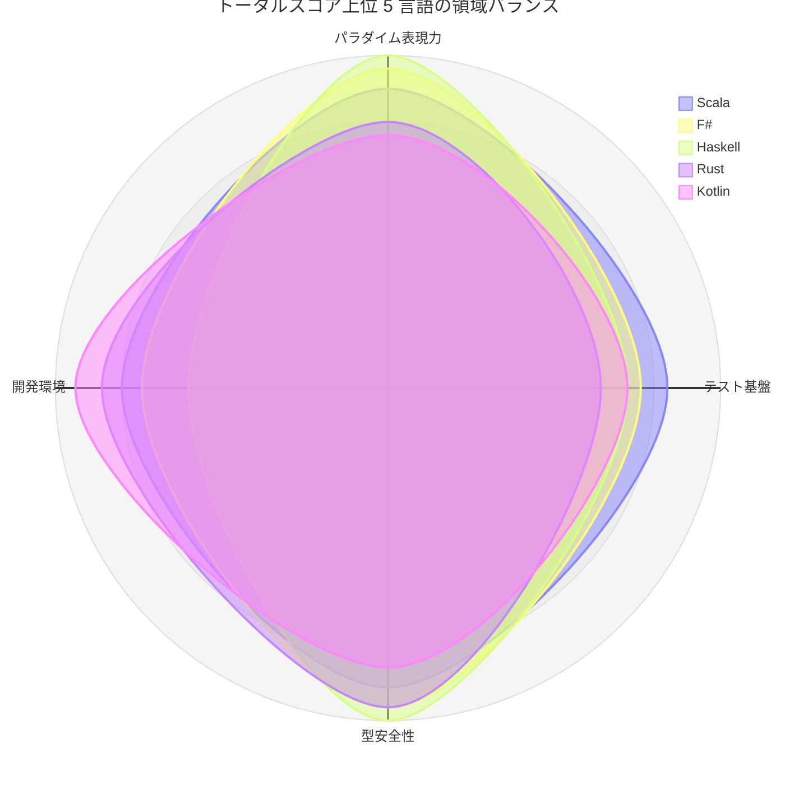
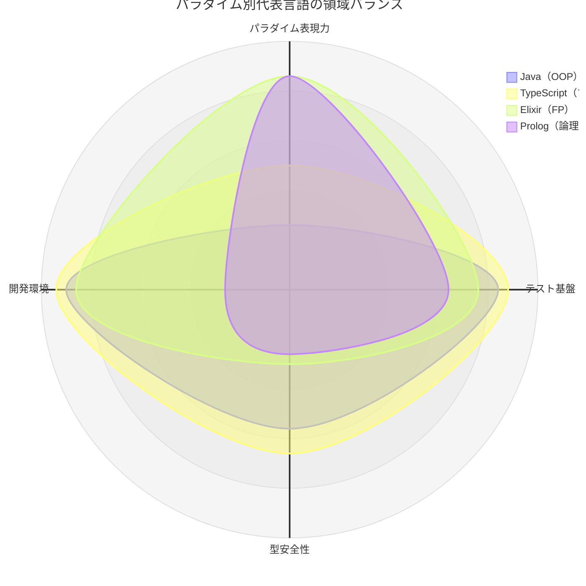

# トータルスコアによる総合比較

第 1・2・4・5 章のレーダーチャートで用いた評価軸を 4 領域に集約し、16 言語の
トータルスコアを算出します。各章では領域ごとに比較しましたが、本章では 4 領域を
横断した全体像を示します。

## スコアの算出方法

| 領域 | 元の評価軸 | 出典 |
|------|-----------|------|
| パラダイム表現力 | FP 指向・パターンマッチ・簡潔性・宣言性 | [言語概要](01-language-overview.md) |
| テスト基盤 | 標準搭載度・グルーピング・セットアップ機構・パラメータ化・アサーション表現力 | [テストフレームワーク比較](02-test-framework-comparison.md) |
| 型安全性 | 静的型付け・型の強さ・型推論・null 安全・網羅性検査・Result 型 | [型システム比較](04-type-system-comparison.md) |
| 開発環境 | 依存管理・Lint・フォーマッタ・複雑度チェック・カバレッジ・タスクランナー | [開発環境比較](05-dev-environment-comparison.md) |

各領域は元の軸（0〜5）の平均値で、トータルは 4 領域の単純合計（満点 20）です。

> **重要**: このスコアは「本シリーズで扱った 4 領域をどれだけ広くカバーするか」を
> 等重みで測ったものであり、言語の優劣を示すものではありません。実行性能、
> エコシステムの規模、求人・コミュニティの大きさ、用途への適合性は含みません。
> パラダイム表現力の軸は FP 寄りの指標で構成されているため、OOP を徹底する言語は
> 構造的に低く出ます。目的に応じて重みを置き換えて読んでください。

## トータルスコア一覧

| 順位 | 言語 | パラダイム表現力 | テスト基盤 | 型安全性 | 開発環境 | トータル |
|------|------|----------------|-----------|---------|---------|---------|
| 1 | Scala | 4.5 | 4.2 | 4.5 | 4.0 | 17.2 |
| 2 | F# | 4.8 | 3.8 | 4.8 | 3.7 | 17.1 |
| 3 | Haskell | 5.0 | 3.6 | 5.0 | 3.0 | 16.6 |
| 4 | Rust | 4.0 | 3.2 | 4.8 | 4.3 | 16.3 |
| 4 | Kotlin | 3.8 | 3.6 | 4.2 | 4.7 | 16.3 |
| 6 | TypeScript | 2.5 | 4.4 | 3.3 | 4.7 | 14.9 |
| 7 | Flix | 4.8 | 2.4 | 5.0 | 2.5 | 14.7 |
| 8 | Elixir | 4.3 | 3.8 | 1.5 | 4.3 | 13.9 |
| 9 | Ruby | 3.3 | 3.8 | 1.2 | 4.7 | 13.0 |
| 10 | Java | 1.3 | 4.2 | 2.8 | 4.5 | 12.8 |
| 11 | Python | 2.5 | 4.4 | 1.5 | 4.3 | 12.7 |
| 11 | Go | 2.0 | 3.6 | 2.8 | 4.3 | 12.7 |
| 13 | C# | 2.3 | 3.8 | 3.2 | 3.2 | 12.5 |
| 14 | Clojure | 4.0 | 4.0 | 1.2 | 3.0 | 12.2 |
| 15 | PHP | 2.0 | 3.6 | 1.2 | 4.0 | 10.8 |
| 16 | Prolog | 4.3 | 3.2 | 1.3 | 1.3 | 10.1 |

## 上位 5 言語の領域バランス

上位はいずれも 4 領域に大きな欠けがない言語です。Scala と F# はすべての領域が 3.7
以上で最もバランスが取れています。Haskell は表現力と型安全性が満点に近い一方で
開発環境（複雑度チェックの不在）が弱点となり、Rust と Kotlin は逆に開発環境の
充実で総合点を押し上げています。

## パラダイム別代表の形の違い

トータルが近い言語でも形は大きく異なります。Java と Elixir は 12.8 対 13.9 と
1 ポイント差ですが、Java はテスト基盤と開発環境に、Elixir はパラダイム表現力に
点数が偏っています。Prolog は表現力が FP 言語並みに高い一方、型安全性と開発環境の
ツール層が薄く、最も非対称な形になります。

## スコアの読み方

| 観点 | 着目する領域 | 高スコアの言語 |
|------|-------------|--------------|
| 型でバグを防ぎたい | 型安全性 | Haskell, Flix, Rust, F# |
| TDD の型を最初に身につけたい | テスト基盤 | pytest（Python）, Vitest（TypeScript）, JUnit 5（Java） |
| 品質ゲートを整えたい | 開発環境 | Kotlin, TypeScript, Ruby |
| 宣言的な記述を学びたい | パラダイム表現力 | Haskell, F#, Flix, Elixir, Prolog |
| バランスよく 1 言語を深めたい | 4 領域の均衡 | Scala, F#, Kotlin |

型安全性が低い言語（Python, Ruby, PHP, Clojure, Elixir, Prolog）はテストが品質を
支える比重が大きく、[型システム比較](04-type-system-comparison.md)で述べたとおり
TDD の効果が特に大きく現れます。トータルスコアが低いことは学ぶ価値が低いことを
意味せず、Prolog のように最も低いスコアの言語が最も新しい計算モデルを与える場合が
あります。
---

次章では、ここまでのスコアや比較表では掴みにくい各言語の「性格」を、
[コラム](08-language-personality-column.md)として比喩で整理します。
