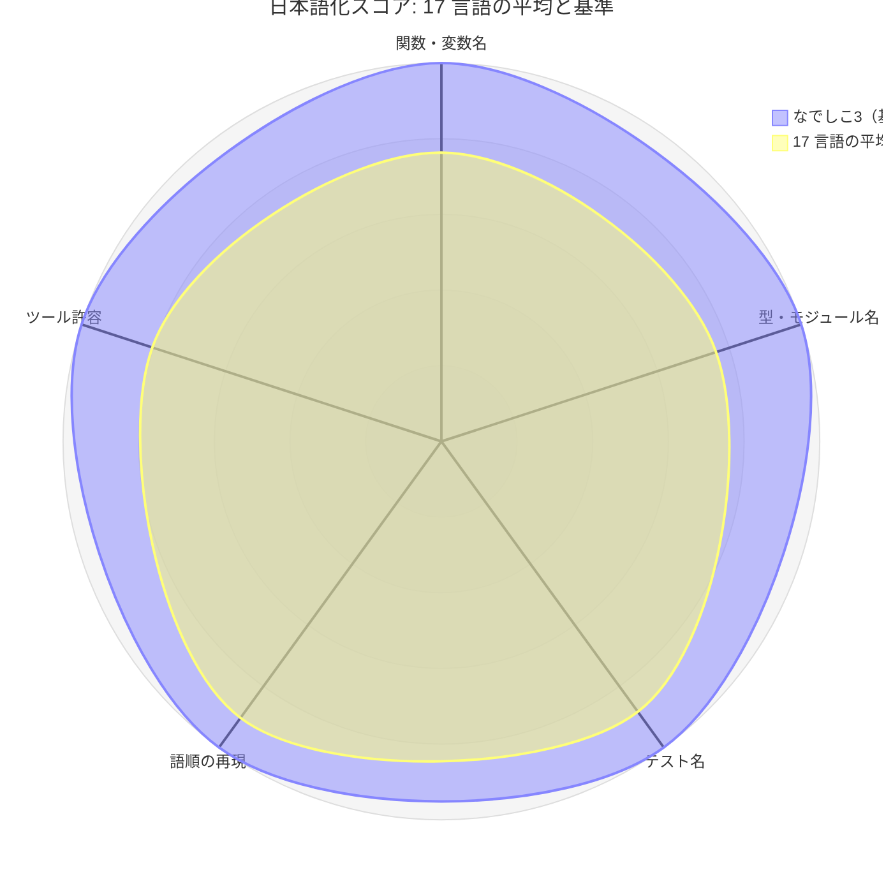
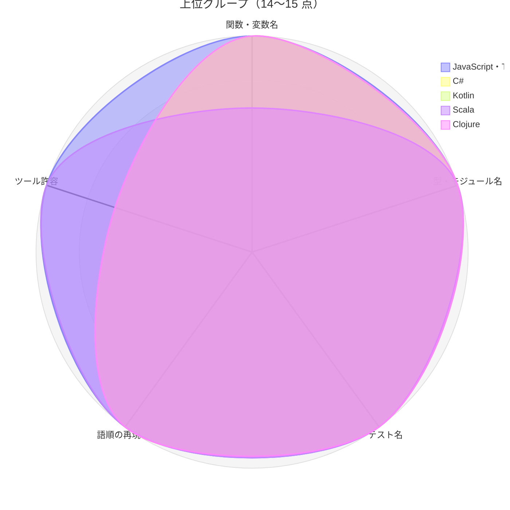
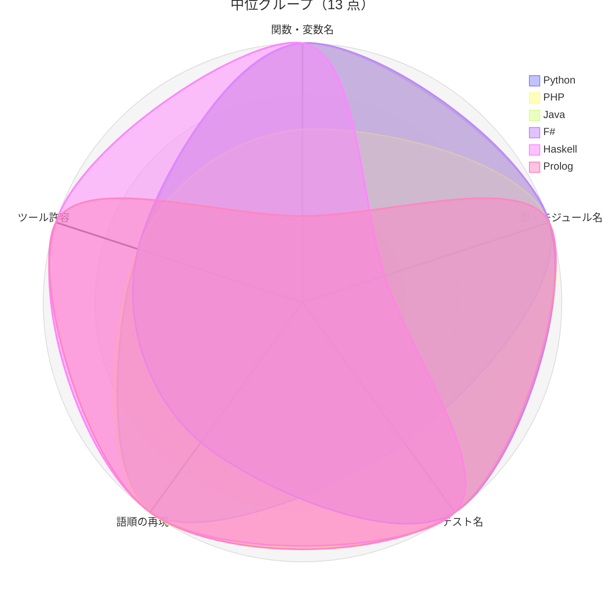
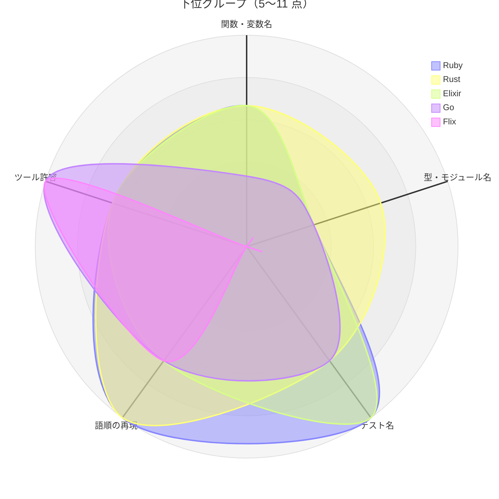
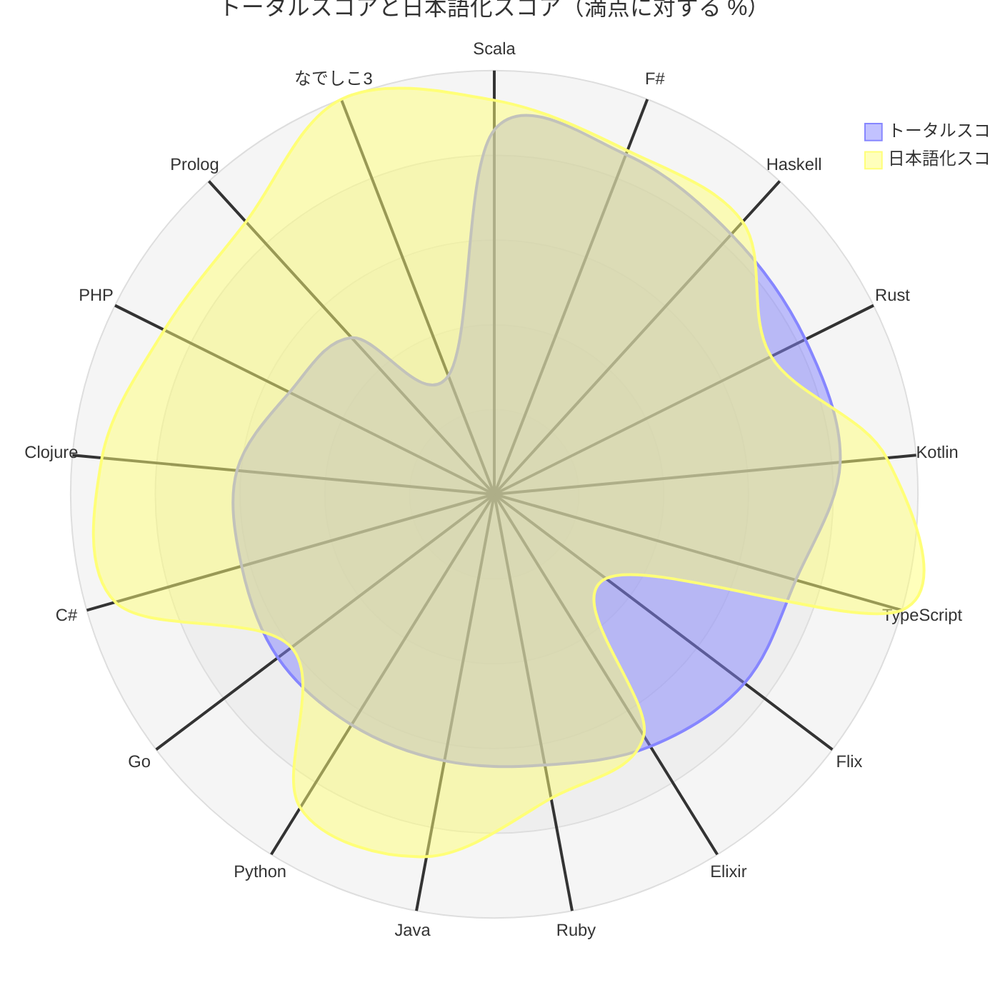

# コラム: なでしこ3 を 17 言語で日本語実装する

[第 7 章](07-total-score-comparison.md)のトータルスコアで、なでしこ3 は 6.1 点の最下位でした。
ただし、あの 4 領域には「日本語でコードとテストを書ける」という軸がありません。
本章では、この一点についてなでしこ3 を基準に置き、残りの 17 言語で同じプログラムを
**識別子・テスト名・メッセージを日本語にして** 書き直した結果を比べます。

[第 8 章](08-language-personality-column.md)のコラムは比喩で言語の性格を描きました。本章は実際のコードで比べます。
すべてのコードは `apps/jp/{lang}/` にあり、各言語の Nix 環境（`nix develop .#{lang}`）で
テストが通ることを確認しています。

> **注意**: 本章のスコアは「日本語でどこまで書けるか」という許容度の比較です。
> 日本語の識別子を推奨するものでも、言語の優劣を示すものでもありません。
> 書けることと書くべきことの区別は、最後の節で扱います。

## 問い

1. 日本語の識別子（関数・変数・型・モジュール名）は書けるか。書けないなら、どの規則が阻むのか
2. テスト名を日本語の文章にできるか
3. なでしこ3 の「助詞による引数」と「日本語の語順（SOV）」をどこまで再現できるか
4. 日本語化したとき、lint・formatter・テストランナー・ファイルシステムはどう反応するか

## 題材: なでしこ3 のコード

[なでしこ3 の実装](../nadesiko/index.md)から、比較の観点が出る 4 つを題材に選びました。
仕様の詳細は `apps/jp/SPEC.md` にあります。

| 題材 | 移植元 | 比較の観点 |
|------|--------|-----------|
| A. FizzBuzz 変換 | `src/fizzbuzz.nako3` | 関数・変数名、テスト名 |
| B. タイプ生成 | `src/type.nako3` | 型・列挙子・コンストラクタ名 |
| C. パイプライン | `src/pipeline.nako3` | 「〜して〜して」の語順 |
| D. 安全変換 | `src/error.nako3` | 日本語のエラーメッセージ、結果の型 |

基準となるなでしこ3 のコードは次のとおりです。

```text
●(Nを)FizzBuzz変換
    もし、N % 15 = 0ならば,「FizzBuzz」を戻す
    もし、N % 3 = 0ならば,「Fizz」を戻す
    もし、N % 5 = 0ならば,「Buzz」を戻す
    Nを文字列変換して戻す
ここまで

●(Nを)FizzBuzz装飾
    NをFizzBuzz変換して装飾して戻す
ここまで

「3を渡したらFizzを返す」と(3をFizzBuzz変換)と「Fizz」で検証
```

関数名・引数・テスト名・語順のすべてが日本語です。
助詞「を」が引数の役割を示し、「〜して」で命令をつなげます。
これを、各言語の正攻法でどこまで再現できるかを試しました。

## 日本語化スコア

評価軸は次の 5 つで、各 0〜3 点、満点は 15 点です。

| 軸 | 3 点 | 0 点 |
|----|------|------|
| 関数・変数名 | 制約なく日本語で書ける | 日本語を書けない |
| 型・モジュール名 | 型・列挙子・モジュール・ファイル名すべて日本語可 | すべて ASCII 必須 |
| テスト名 | 空白・記号込みの文章で書ける | ASCII の関数名のみ |
| 語順の再現 | 助詞に当たる語を置いて SOV 順で書ける | 前置の関数呼び出しのみ |
| ツール許容 | lint・formatter・テストランナーが設定変更なしで通る | 動作しない |

なでしこ3 は全軸 3 点の基準点です。残りの 17 言語は、実装して実測した結果で採点しました。

| 順位 | 言語 | 関数・変数名 | 型・モジュール名 | テスト名 | 語順の再現 | ツール許容 | 合計 |
|------|------|------------|----------------|---------|-----------|-----------|------|
| - | なでしこ3（基準） | 3 | 3 | 3 | 3 | 3 | 15 |
| 1 | JavaScript | 3 | 3 | 3 | 3 | 3 | 15 |
| 1 | TypeScript | 3 | 3 | 3 | 3 | 3 | 15 |
| 3 | C# | 3 | 3 | 3 | 3 | 2 | 14 |
| 3 | Kotlin | 3 | 3 | 3 | 3 | 2 | 14 |
| 3 | Scala | 2 | 3 | 3 | 3 | 3 | 14 |
| 3 | Clojure | 3 | 3 | 3 | 3 | 2 | 14 |
| 7 | Python | 3 | 3 | 2 | 3 | 2 | 13 |
| 7 | PHP | 2 | 3 | 3 | 3 | 2 | 13 |
| 7 | Java | 3 | 3 | 3 | 2 | 2 | 13 |
| 7 | F# | 3 | 3 | 3 | 2 | 2 | 13 |
| 7 | Haskell | 3 | 1 | 3 | 3 | 3 | 13 |
| 7 | Prolog | 1 | 3 | 3 | 3 | 3 | 13 |
| 13 | Ruby | 2 | 1 | 3 | 3 | 2 | 11 |
| 13 | Rust | 2 | 2 | 2 | 3 | 2 | 11 |
| 15 | Elixir | 2 | 1 | 3 | 2 | 2 | 10 |
| 16 | Go | 1 | 1 | 2 | 2 | 3 | 9 |
| 17 | Flix | 0 | 0 | 0 | 2 | 3 | 5 |

17 言語のうち 16 言語は、程度の差はあっても日本語で書けました。
識別子に日本語を 1 文字も書けなかったのは Flix だけです。
以下では、まず総合評価をレーダーチャートで俯瞰し、そのあと点数の差が生まれた理由を軸ごとに見ていきます。

## 総合評価

### 17 言語の平均となでしこ3

17 言語の軸ごとの平均は、関数・変数名 2.29、型・モジュール名 2.29、テスト名 2.65、
語順の再現 2.71、ツール許容 2.41 で、合計の平均は 12.35 点です。



平均が最も低いのは **名前の 2 軸**（関数・変数名と型・モジュール名）です。
語順とテスト名は、中置関数・マクロ・文字列のテスト名といった言語の機能で補えるため、平均が高くなります。
名前の軸は言語仕様（字句規則・大文字の意味論）で決まるため、工夫では埋められません。

### 上位グループ（14〜15 点）



上位はいずれも、名前の 2 軸に制約がほとんどない言語です。
C#・Kotlin・Clojure はツール許容だけが 2 点で、命名規則のルールや助詞の未解決シンボルの抑止が必要でした。
Scala は逆に、ツールは設定変更なしで通る一方、パターンの中の日本語識別子が変数に束縛されない点で 1 点を失っています。

### 中位グループ（13 点）



同じ 13 点でも形はまったく違います。Haskell は型の軸だけが大きくへこみ（型名は大文字始まりが必要）、
Prolog は関数・変数名の軸だけがへこみます（変数は大文字か `_` 始まりが必要）。
どちらも「大文字で始まるかどうか」に意味を持たせた言語で、その意味が型に付くか変数に付くかで、へこむ軸が入れ替わります。

### 下位グループ（5〜11 点）



下位の言語は、名前の 2 軸がそろってへこみます。Ruby・Elixir・Go は大文字の意味論（定数・エイリアス・公開）、
Rust はファイル名とクレート名、Flix は字句規則そのものが原因です。
一方で Go と Flix のツール許容は満点です。日本語で書ける範囲が狭い分、ツールと衝突する場面も少ないためです。

### トータルスコアとの対比

[第 7 章](07-total-score-comparison.md)のトータルスコア（満点 20）と日本語化スコア（満点 15）を、
それぞれ満点に対する割合（%）に直して重ねました。JavaScript は第 7 章の対象外のため、TypeScript で代表させています。

| 言語 | トータルスコア | 日本語化スコア | 割合（トータル / 日本語化） |
|------|--------------|--------------|--------------------------|
| Scala | 17.2 | 14 | 86% / 93% |
| F# | 17.1 | 13 | 86% / 87% |
| Haskell | 16.6 | 13 | 83% / 87% |
| Rust | 16.3 | 11 | 82% / 73% |
| Kotlin | 16.3 | 14 | 82% / 93% |
| TypeScript | 14.9 | 15 | 74% / 100% |
| Flix | 14.7 | 5 | 74% / 33% |
| Elixir | 13.9 | 10 | 70% / 67% |
| Ruby | 13.0 | 11 | 65% / 73% |
| Java | 12.8 | 13 | 64% / 87% |
| Python | 12.7 | 13 | 64% / 87% |
| Go | 12.7 | 9 | 64% / 60% |
| C# | 12.5 | 14 | 62% / 93% |
| Clojure | 12.2 | 14 | 61% / 93% |
| PHP | 10.8 | 13 | 54% / 87% |
| Prolog | 10.1 | 13 | 50% / 87% |
| なでしこ3 | 6.1 | 15 | 30% / 100% |



2 つの曲線は、ほとんどの言語で日本語化スコアが外側に出ます。
Unicode 識別子への対応は、トータルスコアの 4 領域とは独立に、ほとんどの言語で進んでいるということです。
例外は Flix・Rust・Elixir・Go の 4 言語で、トータルスコアのほうが外側にあります。

両端にあるのがなでしこ3 と Flix です。なでしこ3 はトータルスコアが最も低く（30%）、日本語化スコアが最も高い（100%）。
Flix はトータルスコアで中位（74%）ですが、日本語化スコアは最も低い（33%）。
第 7 章の 4 領域では測れない軸があり、その軸では順位がほぼ逆転する言語がある、というのが総合評価の結論です。

## 関数と変数を日本語にする

関数名と変数名は、ほとんどの言語で問題なく日本語にできます。

```typescript
// TypeScript
export function FizzBuzz変換(数: number): string {
  if (数 % 15 === 0) return "FizzBuzz";
  if (数 % 3 === 0) return "Fizz";
  if (数 % 5 === 0) return "Buzz";
  return String(数);
}
```

言語仕様で拒否されたのは、次の 4 言語です。

| 言語 | 拒否された書き方 | 理由（エラー原文） |
|------|---------------|-------------------|
| Flix | 日本語を含むすべての識別子 | `Lexer Error [E4518] >> Unexpected character '\u63DB'.` |
| Elixir | `FizzBuzz変換` のようにラテン文字と日本語が混ざる名前 | `invalid mixed-script identifier found: FizzBuzz変換` … `Characters in identifiers from different scripts must be separated by underscore (_).` |
| Haskell | 大文字で始まる `FizzBuzz変換` | `[GHC-94426] Invalid data constructor ‘FizzBuzz変換’ in type signature` |
| Prolog | 日本語で始まる変数 | エラーにならず、アトムとして扱われて単に失敗する |

Flix は字句解析器が識別子に ASCII しか受け付けないため、`fizzBuzzHenkan` のようにローマ字で書きました。
Elixir は、なりすまし攻撃を防ぐ Unicode の規則（UTS #39）により、文字種の境界に `_` が必要です
（`fizzbuzz_変換` は通ります）。

Prolog の例は、エラーにならない分だけ厄介です。Prolog では大文字か `_` で始まる名前が変数、
それ以外がアトム（定数）です。日本語で始まる `結果` はアトムになるので、`結果 = 3` は
「アトム `結果` と 3 は等しいか」という問いになり、黙って失敗します。
日本語の変数には `_結果` のように `_` を付ける必要があります。

### 大文字・小文字の区別がない文字

日本語の文字には、大文字と小文字の区別がありません。
この性質が、言語やツールによって正反対の結果を生みました。

| 扱い | 言語・ツール | 結果 |
|------|------------|------|
| 「小文字ではない」とみなす | TypeScript の `naming-convention`、C# の IDE1006 | camelCase にも PascalCase にも合格する |
| 「大文字ではない」とみなす | Go の公開判定、Ruby の定数、Haskell・Elixir の型とモジュール | 公開・定数・型として使えない |
| 「どちらでもない」とみなす | Ruff の pep8-naming、FSharpLint、detekt、ktlint、Checkstyle、SpotBugs | 命名規則違反として必ず指摘される |

Go では、大文字で始まる名前だけがパッケージの外に公開されます。
`タイプ生成` は大文字で始まらないため、パッケージの外から呼ぶと `undefined: 変換.タイプ生成` になります。
回避策として、全角のローマ字を頭に付けました（`Ｔタイプ生成`、構造体のフィールドは `Ｎ名前`）。

Ruby では、クラス名は大文字で始まる定数でなければなりません。
`class タイプ` は `class/module name must be CONSTANT` で拒否されます。
全角大文字で始めた `class Ｔタイプ` なら通ります。

## 型とモジュールを日本語にする

型・列挙子・モジュール名の軸は、言語ごとの差が最も大きく出ました。
Java・Kotlin・C#・PHP・TypeScript・Python・Clojure・Scala・F#・Prolog では、パッケージからファイル名まで日本語にできます。

```java
// Java: パッケージ名・ファイル名・列挙子まで日本語
package フィズバズ;

public enum タイプ {
    通常(FizzBuzz::FizzBuzz変換),
    数字限定(String::valueOf),
    FizzBuzz限定(タイプ::FizzBuzz限定変換);
    // ...
}
```

壁に当たった言語と、採用した回避策は次のとおりです。

| 言語 | 壁 | 回避策 |
|------|----|--------|
| Haskell | 型・データ構築子・モジュールは大文字始まりが必要（`[GHC-47568] Malformed head of type or class declaration: タイプ`） | `Tタイプ`・`T通常` と ASCII の接頭辞を付ける |
| Elixir | モジュールのエイリアスは ASCII のみ（`invalid character "日" (code point U+65E5) in alias`） | アトムをモジュール名にする（`defmodule :タイプ`） |
| Ruby | クラス・定数は大文字始まりが必要 | 全角大文字で始める（`Ｔタイプ`） |
| Go | 公開する型は大文字始まりが必要。import パスは ASCII のみ（`malformed import path … invalid char 'タ'`） | 全角大文字で始める。パッケージのディレクトリ名は ASCII にする |
| Rust | 日本語名のモジュールをファイルから読めない（``error[E0754]: trying to load file for module `変換` with non-ascii identifier name``）。クレート名も ASCII のみ | `#[path = "基本変換.rs"] mod 基本変換;` と書く |

F# では予想と逆の結果になりました。判別共用体のケース名は大文字始まりが必要ですが（FS0053）、
この規則は **ASCII の小文字** にだけ適用され、`| 通常 | 数字限定` は通ります。
ただし、そのせいで安全網が 1 つ外れます。

```fsharp
match n with
| 通常 -> "通常"
| 数値限定 -> "数字限定"   // 正しくは 数字限定。警告なしですべての値に一致する
```

綴りを間違えたケース名は、新しい変数への束縛（変数パターン）とみなされ、すべての値に一致します。
ASCII で同じ間違いをすると `warning FS0049: Uppercase variable identifiers should not generally be used in patterns` が出ますが、
大文字のない日本語ではこの警告が出ません。
`[<RequireQualifiedAccess>]` を付けて `タイプ番号.通常` と修飾すれば防げます。

Scala でも、パターンの中の日本語は常に既存の定数への参照として扱われました。
`case 変換結果.成功(値) =>` は新しい変数 `値` を作らず、`Not found: 値` のエラーになります。
`値 @ _` と書けば変数として束縛できます。

## テスト名を日本語の文章にする

なでしこ3 のテスト名「3を渡したらFizzを返す」を、各言語でどう書けたかを分類すると、次の 5 通りになります。

| 方式 | 言語 | 例 |
|------|------|----|
| 文字列 | JavaScript・TypeScript・Ruby（Minitest::Spec）・Clojure・Elixir・Haskell・Scala | `it("3を渡したらFizzを返す", …)` |
| 属性の表示名 | Java・C#・PHP | `@DisplayName("3を渡したらFizzを返す")` |
| 空白を含む識別子 | Kotlin・F#（バッククォート）、Prolog（引用符付きアトム） | ``fun `3を渡したらFizzを返す`()`` |
| 空白を含まない識別子 | Go・Rust・Python | `func Test3を渡したらFizzを返す(t *testing.T)` |
| ASCII の識別子のみ | Flix | `def sanWoWatashitaraFizzWoKaesu()` |

どの方式にも共通する壁が、**数字で始まる名前** です。
なでしこ3 のテスト名は「3を渡したら」のように数字で始まるものが多く、
識別子として書く方式では、次のように各言語で拒否されました。

| 言語 | エラー原文 | 回避策 |
|------|-----------|--------|
| Java | `error: <identifier> expected` | メソッド名は `三を渡したら…`、`@DisplayName` に原文 |
| C# | `error CS1519: Invalid token '3' in class, record, struct, or interface member declaration` | 同上（`DisplayName`） |
| Rust | ``error: expected identifier, found `3を渡したらFizzを返す` `` | `_3を渡したらFizzを返す` |
| Clojure | `Invalid number: 3を渡したらFizzを返す` | `testing` の文字列に書く |
| Python | `SyntaxError: invalid syntax` | `test_` 接頭辞（`test_3を渡したらFizzを返す`） |

Go は `Test` 接頭辞が必要なので、`Test3を渡したらFizzを返す` がそのまま書けます。
一方で、`t.Run` のサブテスト名に入れた空白は、出力では `_` に置き換わります。

Python の pytest は、`pytest.param(id="3を渡したらFizzを返す")` と書いても、
既定では id の部分が `test_変換[3\u3092\u6e21\u3057\u305f\u3089Fizz…]` のようにエスケープされます（関数名はエスケープされません）。読める表示にするには、
`disable_test_id_escaping_and_forfeit_all_rights_to_community_support = true` という設定が必要でした。
名前のとおり、この設定を使うとコミュニティのサポートを受けられなくなります。

## 語順を日本語に寄せる

最も工夫の余地があったのが語順です。
なでしこ3 の `NをFizzBuzz変換して装飾して戻す` に対して、各言語の再現方法は大きく 3 つに分かれました。

### 助詞を語として置く

中置関数・演算子定義・マクロを使えば、助詞そのものをコードに置けます。

```haskell
-- Haskell: バッククォートで関数を中置にする
infixl 1 `を`, `して`
を 値 処理 = 処理 値
して = を

fizzBuzz装飾 数 = 数 `を` fizzBuzz変換 `して` 装飾
```

```kotlin
// Kotlin: infix 拡張関数
infix fun <T, R> T.を(動詞: (T) -> R): R = 動詞(this)
infix fun <T, R> T.して(動詞: (T) -> R): R = 動詞(this)

fun FizzBuzz装飾(数: Int): String = 数 を ::FizzBuzz変換 して ::装飾
```

```scala
// Scala: extension と infix
extension [T](目的語: T)
  infix def を[R](動詞: T => R): R = 動詞(目的語)
  infix def して[R](動詞: T => R): R = 動詞(目的語)

def FizzBuzz装飾(数: Int): String = 数 を FizzBuzz変換 して 装飾
```

```prolog
% Prolog: 助詞を演算子として定義する
:- op(700, xfx, は), op(200, xfx, を), op(100, xfy, して).

'FizzBuzz装飾'(_数, _結果) :- _結果 は _数 を 'FizzBuzz変換' して 装飾.
```

```rust
// Rust: 宣言的マクロで助詞をトークンとして照合する
macro_rules! なでしこ {
    ($値:tt を $($関数:ident) して +) => {{
        let 値 = $値;
        $( let 値 = $関数(値); )+
        値
    }};
}

pub fn FizzBuzz装飾(数: i64) -> String {
    なでしこ!(数 を FizzBuzz変換 して 装飾)
}
```

```clojure
;; Clojure: 助詞を取り除いてスレッディングマクロに渡す
(def ^:private 助詞 '#{を して に で})
(defmacro なでしこ [値 & 語] `(-> ~値 ~@(remove 助詞 語)))

(defn FizzBuzz装飾 [数] (なでしこ 数 を FizzBuzz変換 して 装飾))
```

中置の仕組みを持たない言語でも、メソッドチェーンや演算子の多重定義で助詞を置けます。

| 言語 | 書き方 |
|------|--------|
| Python | `N \| を \| FizzBuzz変換 \| して \| 装飾`（助詞オブジェクトの `__ror__`） |
| JavaScript・TypeScript | `それ(15).を(FizzBuzz変換).して(装飾).戻す()` |
| C# | `数.を(FizzBuzz変換).して(装飾)`（ジェネリック拡張メソッド） |
| Ruby | `3.を.FizzBuzz変換`（refinement で `Integer` に `を` を足す） |
| PHP | `数(15)->を->FizzBuzz変換()->して->装飾()`（自分自身を指すプロパティ `を`） |

Prolog の版が、なでしこ3 に最も近い見た目になります。演算子の優先順位と結合性を
宣言できるので、`3を` のように数値の直後に助詞を空白なしで置くことさえできます。

### パイプラインで値を先に書く

F#・Elixir・Flix は、パイプライン演算子 `|>` で値を先に書けます。

```fsharp
// F#
let FizzBuzz装飾 = FizzBuzz変換 >> 装飾
3 |> FizzBuzz変換   // "Fizz"
```

```elixir
# Elixir
数 |> fizzbuzz_変換() |> 装飾()
```

語順は SOV になりますが、ユーザー定義の演算子は記号でしか作れないため、`を` を置くことはできません。
Flix はバッククォートの中置で `` 3 `wo` fizzBuzzHenkan `` と書けますが、助詞もローマ字になります。

### 後置のメソッド呼び出し

Go は名前付き型にメソッドを定義して、`変換.Ｓ数(15).FizzBuzz変換().Ｓ装飾()` と後置で書きました。
助詞 `を` に当たるメソッドも定義できますが、日本語で始まるメソッドは公開できないため、パッケージの外では使えません。

### 言語が助詞を知っているかどうか

スコア表では、JavaScript と TypeScript がなでしこ3 と同じ 15 点に並びました。
ただし、中身は同じではありません。JavaScript の `それ(3).を(FizzBuzz変換)` は、
`主題` クラスを自作して初めて書けるものです。一方、なでしこ3 では
`3をFizzBuzz変換` が **言語の文法そのもの** です。
助詞が引数の役割を示すので、`●(Nを)FizzBuzz変換` と定義すれば、語順は日本語の文として自然に決まります。

他の言語でできるのは、助詞を「何もしない関数」や「演算子」として置くところまでです。
`を` と `に` を区別して引数の役割を決める、といったことはできません。
スコアは許容度を測りますが、日本語の文法で書けることは、なでしこ3 にしかない性質です。

## ツールと環境の反応

### lint と formatter

日本語の識別子に対する lint の反応は、「大文字・小文字の区別がない文字」の扱いで決まります（前述の表）。
設定変更なしで通ったのは、JavaScript・TypeScript（既存の ESLint 設定）、Scala（scalafmt・WartRemover）、
Haskell（HLint）、Go（golangci-lint）、Prolog です。

それ以外の言語では、命名規則のルールを抑止する必要がありました。

| ツール | 反応 | 抑止方法 |
|--------|------|---------|
| RuboCop | `Naming/AsciiIdentifiers` など 143 件 | `.rubocop.yml` でルールを無効化 |
| Credo | `Function/macro/guard names should be written in snake_case.` 9 件 | `FunctionNames` チェックを無効化 |
| FSharpLint | ``Consider changing `タイプ番号` to PascalCase.`` など 44 件（既定設定） | 命名規則を無効化した設定を使う |
| detekt / ktlint | 52 件 / 43 件 | detekt は正規表現を変更、ktlint はルールごと無効化 |
| Checkstyle / SpotBugs | `Name 'タイプ' must match pattern '^[A-Z][a-zA-Z0-9]*$'.` / `The class name フィズバズ.タイプ doesn't start with an upper case letter` | 正規表現の変更、`Nm` の除外 |
| Clippy（rustc） | ``function `FizzBuzz変換` should have a snake case name`` | `#![allow(non_snake_case)]` |
| clj-kondo | 助詞を `Unresolved symbol: を` と指摘 | マクロ内の助詞を除外 |

RuboCop には、見落とすと危険な挙動がありました。
既定のパーサーは全角大文字で始まる `Ｔタイプ = Data.define(…)` を定数ではなくローカル変数への代入と解釈し、
`Lint/UselessAssignment` として自動修正で **定義ごと削除** しました。
`ParserEngine: parser_prism` にすると正しく定数として扱われます。

formatter は、多くが桁を **文字数** で数えます（scalafmt・gofmt・SWI-Prolog のテスト出力）。
全角文字は画面上で 2 桁を占めるため、整列が崩れて見えます。
逆に Prettier と Ruff は全角を幅 2 と数えるため、日本語の行が早めに折り返されます。

### ロケール

今回の検証で最も実務的な教訓は、**ロケールが UTF-8 でないと日本語のファイル名が壊れる** ことです。
Nix の開発環境では `LANG` が空だったため、ほぼすべての言語で次の現象が起きました。

| 言語 | LANG=C での現象 |
|------|---------------|
| Java・Kotlin（Gradle） | `Failed to create MD5 hash for file '…/���������������/������������.java' as it does not exist.` |
| Scala（sbt） | `java.nio.file.InvalidPathException: Malformed input or input contains unmappable characters` |
| Clojure（Leiningen） | `Ran 0 tests containing 0 assertions. 0 failures, 0 errors.`（テスト 0 件で **成功扱い**） |
| Haskell（GHC） | `recoverEncode: invalid argument (cannot encode character '\56549')` |
| Elixir | `the VM is running with native name encoding of latin1 …`、コンパイルが `{:error, :enoent}` |
| Prolog（SWI-Prolog） | `Illegal multibyte Sequence` のあと `Assertion failed` で異常終了 |

中でも Clojure の挙動は危険です。テストが 1 件も実行されないのに終了コード 0 で成功するため、
CI が緑のまま何も検証していない状態になり得ます。
`apps/jp/` のすべての Makefile と CI では、`LANG=C.UTF-8` を明示しています。

### Unicode の正規化

見た目が同じ文字の扱いも言語によって異なります。

- Python は識別子を NFKC で正規化するため、半角の `ｶﾀｶﾅ` と全角の `カタカナ` が **同じ変数** になる
- JavaScript は正規化しないため、両者は **別の変数** になる
- TypeScript の import パスを NFD（濁点を分けた形）で書くと、Linux では `Cannot find module './パイプ'` になる
- Rust は `confusable_idents` lint で、`口`（くち）と `ロ`（カタカナ）のように紛らわしい識別子の併用を警告する

## 静的型付けで消えるテスト

題材 D の「数値でなければ失敗になる」（`安全変換("a")`）は、静的型付けの言語では書けませんでした。
引数が数値型なので、文字列を渡すとコンパイルエラーになるためです。

| 言語 | エラー原文 |
|------|-----------|
| C# | `error CS1503: Argument 1: cannot convert from 'string' to 'int'` |
| F# | `error FS0001: This expression was expected to have type 'int' but here has type 'string'` |
| Haskell | `[GHC-83865] Couldn't match type ‘[Char]’ with ‘Int’` |
| Rust | `error[E0308]: mismatched types` |
| Go | `cannot use "a" (untyped string constant) as int value in argument to Ａ安全変換` |

なでしこ3・Python・Ruby・JavaScript・PHP・Clojure・Elixir・Prolog では、このテストを実行時の検査として書く必要があります。
[型システム比較](04-type-system-comparison.md)で述べた「型がテストの一部を肩代わりする」関係が、
日本語で書いても同じように現れます。

## 考察: 書けることと書くべきこと

17 言語のうち 16 言語が日本語で書けたという結果は、Unicode 識別子が
ほとんどの言語で当たり前になったことを示しています。
一方で、チームで日本語の識別子を採用するなら、次の点を考慮する必要があります。

| 観点 | 影響 |
|------|------|
| 大文字・小文字の規則 | Go の公開、Ruby の定数、Haskell の型など、言語の意味論が大文字に依存している部分で回避策が要る |
| ツールの前提 | 命名規則のルールは ASCII を前提にしている。抑止すると ASCII の名前の検査も一緒に失われる場合がある（ktlint） |
| 環境の前提 | ロケール・ファイルシステム・正規化の違いで、手元では動くが CI で壊れる |
| 検索と入力 | IME の切り替え、全角・半角の揺れ、grep や IDE の補完のしやすさ |
| 読み手 | ドメインの用語が日本語で、読み手も日本語話者なら、日本語の名前はユビキタス言語をそのままコードに写せる |

ドメイン駆動設計の観点では、業務の用語をそのまま型や関数の名前にできることには価値があります。
`タイプ生成` や `安全変換` は、英訳するよりも仕様書との対応が一目で分かります。
一方で、その価値を得るには、上の表の代償をチームで引き受ける必要があります。

なでしこ3 は、その代償を払わずに済む唯一の言語です。
日本語の文法がそのまま言語の文法なので、回避策も抑止設定も要りません。
トータルスコアでは最下位でしたが、この軸では他の 17 言語がなでしこ3 に近づこうとする側に回ります。
TDD の最初の一歩を日本語で踏み出す入口として、なでしこ3 を位置づけた理由がここにあります。

## 検証環境

| 言語 | 処理系 | テスト | 件数 |
|------|--------|--------|------|
| Java | OpenJDK 21.0.9、Gradle 8.14.3 | JUnit 5.10.2 | 19 |
| JavaScript・TypeScript | Node.js 22.21.1、TypeScript 5.9.3 | Vitest 3.2.7 | 22 + 22 |
| Python | Python 3.13.11 | pytest 9.1.1 | 20 |
| Ruby | Ruby 3.3.10 | Minitest 5.20.0 | 20 |
| PHP | PHP 8.4.16 | PHPUnit 10.5.65 | 19 |
| Go | Go 1.25.5 | testing | 11（+ サブテスト 11） |
| Rust | rustc 1.91.1 | cargo test | 19 |
| C#・F# | .NET SDK 8.0.416（C# 12.0、F# 8.0） | xUnit 2.5.3 | 21 + 20 |
| Clojure | Clojure 1.11.1、Leiningen 2.11.2 | clojure.test | 6（22 アサーション） |
| Scala | Scala 3.3.4、sbt 1.10.6 | ScalaTest 3.2.18 | 20 |
| Elixir | Elixir 1.18.4 | ExUnit | 21 |
| Haskell | GHC 9.10.3、Stack 3.7.1 | HSpec 2.11.14 | 20 |
| Flix | Flix 0.76.2 | flix test | 17 |
| Kotlin | Kotlin 2.2.20、Gradle 8.14.3 | kotlin.test | 21 |
| Prolog | SWI-Prolog 9.2.9 | plunit | 19 |

各言語の詳しい記録（拒否されたときのエラー原文、回避策、スコアの根拠）は、
`apps/jp/{lang}/FINDINGS.md` にあります。

> **Note**: Flix は、本シリーズの Nix 環境が GitHub Releases から flix.jar を取得する設計ですが、
> 検証環境から接続できなかったため、nixpkgs の Flix 0.76.2 で検証しました（`apps/flix/` は 0.75.1）。

---

次の[コラム](10-nadesiko-python-style-column.md)では向きを逆にして、なでしこ3 を Python 風に書き、
Python と TDD で並べながら FizzBuzz とボウリングゲームを育てます。
