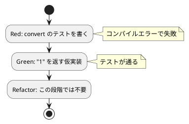

# 第 1 章: TODO リストと最初のテスト

## 1.1 はじめに

プログラムを作成するにあたって、まず何をすればよいでしょうか？私たちは、仕様を確認して **TODO リスト** を作るところから始めます。

> TODO リスト
>
> 何をテストすべきだろうか——着手する前に、必要になりそうなテストをリストに書き出しておこう。
>
> — テスト駆動開発

## 1.2 仕様の確認

今回取り組む FizzBuzz 問題の仕様は以下の通りです。

```
1 から 100 までの数をプリントするプログラムを書け。
ただし 3 の倍数のときは数の代わりに「Fizz」と、5 の倍数のときは「Buzz」とプリントし、
3 と 5 両方の倍数の場合には「FizzBuzz」とプリントすること。
```

この仕様をそのままプログラムに落とし込むには少しサイズが大きいですね。最初の作業は仕様を **TODO リスト** に分解する作業から着手しましょう。

## 1.3 TODO リストの作成

仕様を分解して TODO リストを作成します。

**TODO リスト**:

- [ ] 数を文字列にして返す
    - [ ] 1 を渡したら文字列 "1" を返す
- [ ] 3 の倍数のときは数の代わりに「Fizz」と返す
- [ ] 5 の倍数のときは「Buzz」と返す
- [ ] 3 と 5 両方の倍数の場合には「FizzBuzz」と返す
- [ ] 1 から 100 までの数
- [ ] プリントする

まず「1 を渡したら文字列 "1" を返す」という、最も小さなタスクから取り掛かります。

## 1.4 テスティングフレームワークの導入

### テストファースト

最初にプログラムする対象を決めたので、早速プロダクトコードを実装……ではなく **テストファースト** で作業を進めましょう。

> テストファースト
>
> いつテストを書くべきだろうか——それはテスト対象のコードを書く前だ。
>
> — テスト駆動開発

今回 Kotlin のテスティングフレームワークには [kotlin.test](https://kotlinlang.org/api/latest/kotlin.test/) を利用します。kotlin.test は Kotlin 公式が提供するテスト用ライブラリで、`@Test` アノテーションと `assertEquals` などのアサーション関数を備えています。バックエンドには JUnit Platform を用いるため、`gradle test` でそのまま実行できます。

### 開発環境のセットアップ

Nix 環境に入り、`apps/kotlin` に Gradle（Kotlin JVM）プロジェクトを用意します。

```bash
# Nix 環境に入る
$ nix develop .#kotlin

# プロジェクトディレクトリへ移動
$ cd apps/kotlin
```

`build.gradle.kts` に Kotlin JVM とアプリケーション実行、テスト設定を記述します。

```kotlin
// build.gradle.kts
plugins {
    kotlin("jvm") version "2.1.0"
    application
}

dependencies {
    testImplementation(kotlin("test"))
}

tasks.test {
    useJUnitPlatform()
}

kotlin {
    jvmToolchain(21)
}
```

- `kotlin("jvm")` — Kotlin/JVM のコンパイルを有効にするプラグインです。
- `application` — `gradle run` でエントリーポイントを実行できるようにします。
- `testImplementation(kotlin("test"))` — kotlin.test を依存に追加します。
- `tasks.test { useJUnitPlatform() }` — テストを JUnit Platform 上で実行します。
- `jvmToolchain(21)` — JDK 21 のツールチェーンを使用します。

テストは `gradle test`、アプリケーションの実行は `gradle run` で行います。

## 1.5 最初のテスト（Red）

「1 を渡したら文字列 "1" を返す」テストを書きます。テスト対象となる `FizzBuzz.convert` はまだ存在しませんが、テストファーストなので先にテストを書きます。

> アサートファースト
>
> いつアサーションを書くべきだろうか——最初に書こう。
>
> — テスト駆動開発

`src/test/kotlin/fizzbuzz/FizzBuzzTest.kt`:

```kotlin
package fizzbuzz

import kotlin.test.Test
import kotlin.test.assertEquals

class FizzBuzzTest {
    @Test fun `1 を渡したら文字列 1 を返す`() = assertEquals("1", FizzBuzz.convert(1))
}
```

Kotlin ならではのポイントを確認しましょう。

- バッククォート `` `...` `` で囲むことで、テスト関数名に日本語やスペースを含む説明的な名前を付けられます。テストレポートにそのまま表示されるため、意図が読み取りやすくなります。
- `assertEquals(expected, actual)` — 第 1 引数が期待値、第 2 引数が実際の値です。
- `@Test` — この関数がテストであることを示すアノテーションです。

この時点でテストを実行すると、`FizzBuzz.convert` が未定義のためコンパイルエラー（Red）になります。

```bash
$ gradle test
> Task :compileTestKotlin FAILED
e: FizzBuzzTest.kt: unresolved reference: FizzBuzz
```

Kotlin は **静的型付け** のコンパイル言語なので、「テストが失敗する」最初の状態は多くの場合 **コンパイルエラー** として現れます。これも立派な Red です。

## 1.6 最小実装（Green）

テストを通す最小限のコードを書きます。TODO リストの最初の項目は「1 を渡したら "1" を返す」だけなので、素直に `"1"` を返す **仮実装** で構いません。

> 仮実装を経て本実装へ
>
> 失敗するテストを書いてから、最初に行う実装はどのようなものだろうか——ベタ書きの値を返そう。
>
> — テスト駆動開発

`src/main/kotlin/fizzbuzz/FizzBuzz.kt`:

```kotlin
package fizzbuzz

object FizzBuzz {
    fun convert(n: Int): String = "1"
}
```

ここで Kotlin 特有のポイントに触れます。

- `object FizzBuzz` — シングルトンオブジェクトを宣言する構文です。インスタンス化せずに `FizzBuzz.convert(...)` のように呼び出せます。
- `fun convert(n: Int): String` — 引数 `n` の型が `Int`、戻り値の型が `String` であることを **静的型** で明示しています。戻り値の型が宣言されているため、うっかり別の型を返すと型エラーになります。
- この段階では引数 `n` を本体で使っていません。Kotlin では未使用の引数は **警告** として報告されます。仮実装の段階では気にせず進めますが、次章で一般化する際に解消されます。

テストを実行します。

```bash
$ gradle test
BUILD SUCCESSFUL
```

この章までのテストが通りました（Green）。こんなベタ書きのプログラムでいいの？と思われるかもしれませんが、この細かいステップに今しばらくお付き合いください。

### TDD サイクル



## 1.7 TODO リストの更新

最初のタスクが完了しました。TODO リストを更新します。

**TODO リスト**:

- [ ] 数を文字列にして返す
    - [x] 1 を渡したら文字列 "1" を返す
- [ ] 3 の倍数のときは数の代わりに「Fizz」と返す
- [ ] 5 の倍数のときは「Buzz」と返す
- [ ] 3 と 5 両方の倍数の場合には「FizzBuzz」と返す
- [ ] 1 から 100 までの数
- [ ] プリントする

ここまでの作業をバージョン管理システムにコミットしておきましょう。

```bash
$ git add .
$ git commit -m 'test(kotlin): 数を文字列にして返す'
```

## 1.8 まとめ

この章では以下のことを学びました。

- **TODO リスト** で仕様をプログラミング対象に分解する方法
- **テストファースト** で最初にテストを書く考え方
- kotlin.test を使った Kotlin のテスト実行環境（Gradle / JUnit Platform）のセットアップ
- Kotlin では静的型付けにより、コンパイルエラーも Red の一形態である
- **仮実装** でベタ書きの値を返してテストを通す手法
- **アサートファースト** でテストのアサーションから書き始めるアプローチ
- Kotlin の `object` によるシングルトン宣言と、`Int`/`String` の型注釈による戻り値の明示

次章では、この仮実装を **三角測量** によって一般化していきます。

### 実装

<details>
<summary>実装コード（src/main/kotlin/fizzbuzz/FizzBuzz.kt）</summary>

```kotlin
package fizzbuzz

object FizzBuzz {
    fun convert(n: Int): String = "1"
}
```

</details>

<details>
<summary>テストコード（src/test/kotlin/fizzbuzz/FizzBuzzTest.kt）</summary>

```kotlin
package fizzbuzz

import kotlin.test.Test
import kotlin.test.assertEquals

class FizzBuzzTest {
    @Test fun `1 を渡したら文字列 1 を返す`() = assertEquals("1", FizzBuzz.convert(1))
}
```

</details>
