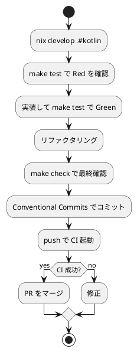

# 第 6 章: タスクランナーと CI/CD

## 6.1 はじめに

前章では Gradle によるパッケージ管理と静的解析を導入しました。ビルド、テスト、実行、品質チェックと様々なコマンドを使えるようになりましたが、毎回 `gradle ...` を手打ちするのは手間がかかり、コマンドの記憶違いも起こります。

この章では、Makefile によるタスク集約、Nix 開発環境、GitHub Actions を使って、Kotlin プロジェクトの開発タスクを自動化し、**CI/CD** パイプラインを構築します。

## 6.2 Nix による開発環境

Kotlin は JVM 上で動作するため、開発に必要なのは基本的に **JDK・Kotlin・Gradle** です。これらを Nix で管理し、環境を再現可能にします。

```bash
# Nix 環境に入る
$ nix develop .#kotlin
```

この環境（`ops/nix/environments/kotlin/shell.nix`）は、JDK 21 + kotlin + gradle を提供します。開発者ごとの JDK・Gradle バージョンの差異をなくすことで、「自分の環境では動く」問題を防ぎます。

## 6.3 Makefile によるタスク管理

`apps/kotlin/Makefile` に、日常的に使うタスクを定義します。`gradle ...` を短いコマンドに集約します。

```makefile
.PHONY: all build test check run clean

all: check

build:
	gradle build

test:
	gradle test

check:
	gradle check

run:
	gradle run

clean:
	gradle clean
```

### 各タスクの説明

| タスク | 内容 |
|--------|------|
| `make build` | プロジェクトをコンパイル・ビルドする（`gradle build`） |
| `make test` | テストを実行する（`gradle test`） |
| `make check` | ビルド・テストを含む検証をまとめて実行する（`gradle check`） |
| `make run` | `main` を実行する（`gradle run`） |
| `make clean` | ビルド成果物を削除する（`gradle clean`） |

### タスクの実行

```bash
$ make test

> Task :test

fizzbuzz.FizzBuzzTest > ... PASSED

BUILD SUCCESSFUL
```

`make all`（既定ターゲット）は `check` を実行します。`gradle check` は Gradle の集約タスクで、コンパイルとテストを含む検証をまとめて行います。detekt・ktlint を導入した場合は、それらの検証も `check` に自動的に組み込まれます。

## 6.4 GitHub Actions による CI/CD

プッシュやプルリクエスト時に自動で品質チェックを実行する CI/CD パイプラインを構築します。ワークフローは `.github/workflows/kotlin-ci.yml` に定義し、既存の Haskell・Scala の CI と同型で Nix に対応させます。

```yaml
# .github/workflows/kotlin-ci.yml
name: Kotlin CI

on:
  push:
    branches: [main, develop]
    paths:
      - "apps/kotlin/**"
      - ".github/workflows/kotlin-ci.yml"
  pull_request:
    branches: [main]
    paths:
      - "apps/kotlin/**"

permissions:
  contents: read

jobs:
  test:
    runs-on: ubuntu-latest

    steps:
      - name: Checkout the repository
        uses: actions/checkout@v4

      - name: Install Nix
        uses: cachix/install-nix-action@v30
        with:
          nix_path: nixpkgs=channel:nixos-unstable

      - name: Cache Nix store
        uses: actions/cache@v4
        with:
          path: /tmp/nix-cache
          key: ${{ runner.os }}-nix-kotlin-${{ hashFiles('flake.lock', 'ops/nix/environments/kotlin/shell.nix') }}
          restore-keys: |
            ${{ runner.os }}-nix-kotlin-

      - name: Run tests
        run: nix develop .#kotlin --command bash -c "cd apps/kotlin && gradle test"
```

### ワークフローのポイント

| 設定 | 説明 |
|------|------|
| `paths` フィルター | `apps/kotlin/**` に変更があった場合のみ実行 |
| Nix 環境 | `nix develop .#kotlin` で JDK・Kotlin・Gradle を一貫させる |
| キャッシュ | Nix ストアをキャッシュして CI を高速化 |
| `gradle test` | テストを実行し、失敗すればワークフローが落ちる |

Nix 環境を CI とローカルで共有することで、「ローカルで通ったのに CI で落ちる」ことがなくなります。

### トリガー条件

- `push`（`main` / `develop`） -- 主要ブランチへの反映時に検証
- `pull_request`（`main`） -- PR 作成・更新時に検証

PR の段階でテストが自動実行されるため、壊れたコードがマージされることを防げます。

## 6.5 品質ゲートの統合

`gradle test` を `gradle check` に置き換えると、コンパイル・テストに加え、導入済みの静的解析（detekt・ktlint など）もまとめて検証されます。

```yaml
      - name: Run quality checks
        run: nix develop .#kotlin --command bash -c "cd apps/kotlin && gradle check"
```

これにより、CI が通る条件は「コンパイルが成功し、テストが全て通り、静的解析に違反がない」ことになります。この条件を満たさない変更はマージできない **品質ゲート** が完成します。

## 6.6 開発ワークフロー

ここまでの設定により、日常の開発は次の流れになります。



ローカルの `make check` と CI の検査を一致させておくことで、フィードバックを素早く得ながら安全に変更を積み上げられます。

### ツール一覧

| カテゴリ | ツール | 用途 |
|---------|--------|------|
| テスト | kotlin.test (JUnit Platform) | テスト実行 |
| カバレッジ | Kover / JaCoCo | ライン + ブランチカバレッジ |
| パッケージ管理 | Gradle | 依存関係管理・ビルド |
| 静的解析 | detekt / ktlint | コード品質チェック + フォーマット |
| タスクランナー | Make + Gradle | タスク自動化 |
| 開発環境 | Nix | 再現可能な JDK・Kotlin・Gradle |
| CI/CD | GitHub Actions | 継続的インテグレーション |

### 各言語の CI/CD 比較

| 項目 | Kotlin | Ruby | Java | Scala |
|------|--------|------|------|-------|
| CI ツール | GitHub Actions | GitHub Actions | GitHub Actions | GitHub Actions |
| 環境管理 | Nix + Gradle | Nix + Bundler | Nix + Gradle | Nix + sbt |
| テスト | `gradle test` | `bundle exec rake test` | `./gradlew test` | `sbt test` |
| 品質チェック | `gradle check` | `bundle exec rake check` | `./gradlew fullCheck` | `sbt test` |
| タスクランナー | Make + Gradle | Rake | Gradle | sbt |

## 6.7 まとめ

この章では以下を学びました。

- Nix で JDK・Kotlin・Gradle を管理し、再現可能な開発環境を作る（`nix develop .#kotlin`）
- Makefile で日常タスク（`build`, `test`, `check`, `run`, `clean`）を短いコマンドに集約する
- GitHub Actions（`kotlin-ci.yml`）で Nix 対応の CI を構築し、テストを自動化する
- `gradle check` を使って型・テスト・静的解析を **品質ゲート** にする

第 2 部（章 4〜6）を通じて、ソフトウェア開発の三種の神器を整備しました。

| 神器 | 導入したもの |
|------|------------|
| バージョン管理 | Git + Conventional Commits |
| テスティング | kotlin.test + JUnit Platform + Kover |
| 自動化 | detekt / ktlint + Make + Gradle + GitHub Actions |

次の第 3 部では、追加仕様を題材にオブジェクト指向設計（カプセル化、ポリモーフィズム、デザインパターン）を学びます。
