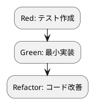

# 第 10 章: 高階関数と関数合成

## 10.1 はじめに

第 3 部ではポリモーフィズム・デザインパターン・SOLID 原則により FizzBuzz をオブジェクト指向で構造化しました。この第 4 部では、Kotlin の関数型プログラミング機能を使ってコードをさらに柔軟にします。

Kotlin はオブジェクト指向言語でありながら、**ラムダ式**・**関数参照**・**高階関数**という強力な関数型プリミティブを備えています。関数は第一級の値として扱えるため、他の値と同じように引数へ渡したり戻り値として返したりできます。本章ではこれらを使って FizzBuzz に高階関数と関数合成を導入します。

### この章で学ぶこと

- 高階関数（`map` / `filter` / `fold`）
- ラムダ式 `{ n: Int -> ... }` と関数参照 `::defaultRule`
- 変換ルールを関数として受け取る `generateWith`
- 関数型 `(Int) -> String`
- `transform` と `filterList` を組み合わせた加工パイプライン

## 10.2 高階関数とは

**高階関数** とは、関数を引数に取る、あるいは関数を返す関数のことです。Kotlin では関数は第一級の値なので、リテラルとして書いたり変数に代入したりできます。

### map — リストの変換

```kotlin
(1..5).map { n -> n * n }  // [1, 4, 9, 16, 25]
```

`map` は「各要素に関数を適用して新しいリストを作る」高階関数です。`{ n -> n * n }` は **ラムダ式**（無名関数）です。

### filter — リストの絞り込み

```kotlin
(1..10).filter { n -> n % 3 == 0 }  // [3, 6, 9]
```

`filter` は述語（`Boolean` を返す関数）を受け取り、真になる要素だけを残します。

### fold — リストの畳み込み

```kotlin
(1..5).fold(0) { acc, n -> acc + n }  // 15
```

`fold` は初期値と二項関数を受け取り、リストを 1 つの値に畳み込みます。`map`・`filter`・`fold` は関数型プログラミングの基本三種であり、ほとんどのリスト操作はこの組み合わせで表現できます。

## 10.3 ラムダ式と関数参照

Kotlin には関数を値として渡す 2 つの書き方があります。

### ラムダ式

ラムダ式は `{ 引数 -> 本体 }` の形で書く無名関数です。

```kotlin
val dbl = { x: Int -> x * 2 }
dbl(21)  // 42
```

引数が 1 つの場合は `it` で暗黙的に参照できます。

```kotlin
(1..5).filter { it % 2 == 0 }  // [2, 4]
```

ラムダは **クロージャ** として、定義時の外側の変数を捕捉できます。

```kotlin
val factor = 3
val scale = { x: Int -> x * factor }  // factor を捕捉
scale(10)  // 30
```

### 関数参照

すでに定義済みの関数やメソッドは `::` で参照して渡せます。ラムダで包み直す必要がありません。

```kotlin
(1..5).map(::square)          // トップレベル関数
(1..5).map(FizzBuzz::convert) // クラス/オブジェクトのメンバー
```

Ruby ではブロック・`Proc`・`Lambda` の 3 種があり、`method(:foo)` で `Method` オブジェクトを得ました。Kotlin ではラムダ式と関数参照という 2 種にまとまっており、いずれも `(Int) -> String` のような **関数型** の値として一様に扱えます。

## 10.4 generateWith — 高階関数の実践

変換ルール自体を **関数として外から渡せる** ようにします。これにより FizzBuzz のルールを差し替え可能にします。

### TODO リストの更新

第 4 部の作業として TODO リストへ以下を追加します。

**TODO リスト**:

- [ ] 変換ルールを関数として受け取る `generateWith`
- [ ] 標準ルール `defaultRule` を定義する
- [ ] カスタムルールを渡せる
- [ ] リスト全体にルールを適用する `transform`
- [ ] 結果を述語で絞り込む `filterList`

まず「変換ルールを関数として受け取る `generateWith`」から着手します。

### Red: カスタムルールのテスト

```kotlin
import kotlin.test.Test
import kotlin.test.assertEquals

class FizzBuzzHofTest {
    @Test
    fun generateWith は渡したルールで変換する() {
        assertEquals("Fizz", FizzBuzzHof.generateWith(FizzBuzzHof::defaultRule, 3))
    }

    @Test
    fun generateWith にカスタムルールを渡せる() {
        val rule = { n: Int -> if (n % 2 == 0) "Even" else "Odd" }
        assertEquals("Even", FizzBuzzHof.generateWith(rule, 4))
    }
}
```

### TDD サイクル



### Green: generateWith の実装

```kotlin
package fizzbuzz

object FizzBuzzHof {
    fun generateWith(rule: (Int) -> String, n: Int): String = rule(n)

    fun defaultRule(n: Int): String = when {
        n % 15 == 0 -> "FizzBuzz"
        n % 3 == 0 -> "Fizz"
        n % 5 == 0 -> "Buzz"
        else -> n.toString()
    }
}
```

`generateWith` の第 1 引数の型 `(Int) -> String` は **関数型** です。「`Int` を受け取り `String` を返す関数」を引数として受け取ります。標準ルール `defaultRule` を `FizzBuzzHof::defaultRule` として渡せば通常の FizzBuzz に、`{ n: Int -> ... }` のカスタムラムダを渡せば別のルールになります。振る舞いをデータとして注入できるのが高階関数の力です。

Kotlin の関数型 `(Int) -> String` は、Java の `Function<Integer, String>` のような冗長さがなく簡潔に書けます。

## 10.5 transform と filterList

リスト全体にルールを適用する `transform` と、結果を絞り込む `filterList` を実装します。

### Red: 加工パイプラインのテスト

```kotlin
    @Test
    fun transform はリスト全体にルールを適用する() {
        assertEquals("Fizz", FizzBuzzHof.transform(FizzBuzzHof::defaultRule, 5)[2])
    }

    @Test
    fun filterList は述語で絞り込む() {
        val xs = FizzBuzzHof.transform(FizzBuzzHof::defaultRule, 15)
        val fizzes = FizzBuzzHof.filterList({ it == "Fizz" }, xs)
        assertEquals(4, fizzes.size)
    }
```

`transform(::defaultRule, 5)` の結果は `["1", "2", "Fizz", "4", "Buzz"]` で、インデックス 2（3 番目）が `"Fizz"` です。1〜15 で純粋な "Fizz"（3・6・9・12。15 は "FizzBuzz"）は 4 件になります。

### Green: transform と filterList の実装

```kotlin
    fun transform(rule: (Int) -> String, n: Int): List<String> = (1..n).map(rule)

    fun filterList(pred: (String) -> Boolean, xs: List<String>): List<String> = xs.filter(pred)
```

`transform` は `(1..n)` の範囲に `map(rule)` を適用し、`filterList` は述語 `(String) -> Boolean` で `filter` します。`transform` でルールを適用し、`filterList` で絞り込む——高階関数を組み合わせた **加工パイプライン** が構築できました。

```bash
$ ./gradlew test

BUILD SUCCESSFUL
```

## 10.6 各言語の高階関数比較

| 概念 | Kotlin | Ruby | Java | Flix |
|------|--------|------|------|------|
| 無名関数 | `{ x -> x * 2 }` | `->(x) { x * 2 }` / ブロック | ラムダ式 | `x -> x * 2` |
| 関数参照 | `::foo` / `Type::foo` | `method(:foo)` | `Type::foo` | 関数名 |
| 高階関数 | `map` / `filter` / `fold` | `map` / `select` / `inject` | `Stream` API | `List.map` / `filter` / `foldLeft` |
| 関数型 | `(Int) -> String` | Proc / Lambda | `Function<A,B>` | `Int32 -> String` |
| 暗黙引数 | `it` | `_1` | なし | なし |

## 10.7 まとめ

この章では以下を学びました。

- **高階関数**（`map` / `filter` / `fold`）によるリスト操作
- **ラムダ式** `{ x -> ... }` と **関数参照** `::foo` による関数の受け渡し
- 変換ルールを関数として注入する `generateWith`
- 関数型 `(Int) -> String` による高階関数の型付け
- `transform` と `filterList` を組み合わせた加工パイプライン

**TODO リスト**:

- [x] 変換ルールを関数として受け取る `generateWith`
- [x] 標準ルール `defaultRule` を定義する
- [x] カスタムルールを渡せる
- [x] リスト全体にルールを適用する `transform`
- [x] 結果を述語で絞り込む `filterList`

次章では、関数を組み合わせる **関数合成** と、不変データの **パイプライン処理** を学びます。

<details>
<summary>実装コード</summary>

```kotlin
package fizzbuzz

object FizzBuzzHof {
    fun generateWith(rule: (Int) -> String, n: Int): String = rule(n)

    fun defaultRule(n: Int): String = when {
        n % 15 == 0 -> "FizzBuzz"
        n % 3 == 0 -> "Fizz"
        n % 5 == 0 -> "Buzz"
        else -> n.toString()
    }

    fun transform(rule: (Int) -> String, n: Int): List<String> = (1..n).map(rule)

    fun filterList(pred: (String) -> Boolean, xs: List<String>): List<String> = xs.filter(pred)
}
```

</details>
