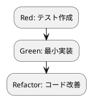

# 第 11 章: 不変データとパイプライン処理

## 11.1 はじめに

前章では高階関数でリストを加工しました。この章では、関数を組み合わせる **関数合成** と、**不変データ** を段階的に変換する **パイプライン処理** を学びます。あわせて Kotlin の `Sequence` による **遅延評価** を導入します。

### この章で学ぶこと

- `val` と読み取り専用コレクション（`List`）による不変データ
- 関数合成（`compose`）
- `Sequence`（`asSequence()`）による遅延評価と `toList()` での実体化
- パイプライン処理 `process`
- 命令型ループからの書き換え

## 11.2 不変データの原則

### val と読み取り専用コレクション

Kotlin では `val` で宣言した変数は再代入できません。また `List` は **読み取り専用**（read-only）インターフェースであり、`add` や `set` といった変更メソッドを持ちません。

```kotlin
val xs = listOf(1, 2, 3)
val ys = xs.map { it * 10 }
// xs は [1, 2, 3] のまま、ys は [10, 20, 30]
```

`map` は元の `xs` を書き換えず、**新しいリストを返します**。これにより、「どこかで知らないうちにデータが変わっていた」という副作用由来のバグが原理的に発生しません。

Ruby では `freeze` や `dup.freeze` で明示的に不変性を確保しましたが、Kotlin では `val` と読み取り専用 `List` により、追加の記述なしで不変なデータ処理を書けます。変更可能なコレクションが必要なときだけ `MutableList` を明示的に選ぶ、という設計になっています。

## 11.3 関数合成

複数の変換をひとつの関数にまとめるのが **関数合成** です。`compose` を実装します。

### TODO リストの更新

**TODO リスト**:

- [ ] 2 つの関数を合成する `compose`
- [ ] 数を FizzBuzz 文字列に変換する `convert`
- [ ] 文字列を装飾する `decorate`
- [ ] convert と decorate を合成した `convertAndDecorate`
- [ ] パイプラインで 1..n を変換・装飾する `process`

### Red: compose のテスト

```kotlin
import kotlin.test.Test
import kotlin.test.assertEquals

class FizzBuzzPipelineTest {
    @Test
    fun compose は f のあとに g を適用する() {
        val f = FizzBuzzPipeline.compose({ x: Int -> x + 1 }, { x: Int -> x * 2 })
        assertEquals(8, f(3))
    }
}
```

`compose({ x -> x + 1 }, { x -> x * 2 })` は「`x + 1` を適用してから `x * 2` を適用する」関数です。`f(3)` は `(3 + 1) * 2` = `8` になります。

### TDD サイクル



### Green: compose の実装

```kotlin
package fizzbuzz

object FizzBuzzPipeline {
    fun <A, B, C> compose(f: (A) -> B, g: (B) -> C): (A) -> C = { x -> g(f(x)) }
}
```

型パラメータ `<A, B, C>` を使ったジェネリック関数です。`f: (A) -> B` と `g: (B) -> C` を受け取り、`(A) -> C` の新しい関数 `{ x -> g(f(x)) }` を返します。型が連鎖して合致することをコンパイラが保証するため、型の合わない関数を合成しようとするとコンパイルエラーになります。

## 11.4 変換と装飾の合成

FizzBuzz の変換に「装飾」を合成してみます。

### Red: convertAndDecorate のテスト

```kotlin
    @Test
    fun 合成で変換と装飾を連結する() {
        assertEquals("[Fizz]", FizzBuzzPipeline.convertAndDecorate(3))
    }
```

### Green: convert・decorate・convertAndDecorate の実装

```kotlin
    fun convert(n: Int): String = FizzBuzz.convert(n)

    fun decorate(s: String): String = "[$s]"

    fun convertAndDecorate(n: Int): String = compose(::convert, ::decorate)(n)
```

`convert` は第 3 部で作った `FizzBuzz.convert` に委譲し、`decorate` は文字列テンプレート `"[$s]"` で括弧を付けます。`convertAndDecorate` は `compose(::convert, ::decorate)` で 2 つを合成し、その結果に `n` を適用します。

`convertAndDecorate(3)` は `decorate(convert(3))` = `decorate("Fizz")` = `"[Fizz]"` です。小さな純粋関数を合成して、より大きな変換を組み立てられました。関数参照 `::convert` / `::decorate` により、ラムダで包み直さず簡潔に合成できています。

## 11.5 Sequence による遅延評価とパイプライン

`List` に対する `map` や `filter` は **即時評価**（eager）で、各ステップごとに中間リストを生成します。一方 `Sequence` は **遅延評価**（lazy）で、要素ごとにチェーン全体を通して評価するため、中間リストを作りません。`asSequence()` で `Sequence` に変換し、`toList()` で結果を実体化します。

### Red: process のテスト

```kotlin
    @Test
    fun パイプラインは各要素を変換・装飾する() {
        assertEquals("[Buzz]", FizzBuzzPipeline.process(5)[4])
    }

    @Test
    fun パイプラインは n 件を返す() {
        assertEquals(15, FizzBuzzPipeline.process(15).size)
    }
```

### Green: process の実装

```kotlin
    fun process(n: Int): List<String> =
        (1..n).asSequence()
            .map(::convert)
            .map(::decorate)
            .toList()
```

`process` は次のように読めます。

1. `(1..n).asSequence()` で 1〜n を `Sequence` に変換する
2. `.map(::convert)` で各要素を FizzBuzz 文字列に変換する
3. `.map(::decorate)` で各要素を装飾する
4. `.toList()` で結果を `List` として実体化する

`asSequence()` から `toList()` までは遅延評価されるため、要素 1 に対して `convert` → `decorate` を通し、次に要素 2 を……という順で処理されます。`.map(::convert)` と `.map(::decorate)` の間に中間リストが生成されない点が、`List` に対する即時評価との違いです。各ステップは前段の出力を受け取り、元のデータは変更しません。

Ruby の `lazy` Enumerator に相当するのが Kotlin の `Sequence` です。無限列の一部だけを取り出すような処理でも、必要な要素だけを評価できます。

```bash
$ ./gradlew test

BUILD SUCCESSFUL
```

## 11.6 命令型スタイルからの書き換え

命令型スタイルなら、次のようにループと可変変数で書くところです。

```kotlin
val result = mutableListOf<String>()
for (i in 1..n) {
    var s = convert(i)
    s = decorate(s)
    result.add(s)  // 可変リストを破壊的に更新
}
return result
```

これをパイプラインで書き換えると、可変リスト（`result`）もループカウンタ（`i`）も消え、「何をするか」だけが残ります。

```kotlin
(1..n).asSequence().map(::convert).map(::decorate).toList()
```

命令型が「どう計算するか（手順）」を記述するのに対し、パイプラインは「何を計算するか（データの変換）」を記述します。可変状態が無いぶん、読みやすく、テストしやすく、並行化にも強くなります。

## 11.7 各言語のパイプライン比較

| 概念 | Kotlin | Ruby | Java | Flix |
|------|--------|------|------|------|
| パイプライン | メソッドチェーン | `then` / メソッドチェーン | Stream API | `\|>` |
| 関数合成 | ジェネリック `compose` | `>>` / `<<` | `andThen` / `compose` | `compose(f, g)` |
| 遅延評価 | `Sequence` / `asSequence()` | `lazy` | `Stream`（既定で遅延） | 遅延リスト |
| 実体化 | `toList()` | `to_a` / `first(n)` | `collect` | `toList` |
| 不変性 | `val` / 読み取り専用 `List` | `freeze` / `dup.freeze` | `final` / `unmodifiableList` | 既定 |

## 11.8 まとめ

この章では以下を学びました。

- `val` と読み取り専用 `List` により、追加記述なしで **不変データ** を扱える
- **関数合成** `compose` で小さな純粋関数を組み合わせる
- 関数参照 `::convert` / `::decorate` による簡潔な合成
- `Sequence`（`asSequence()` / `toList()`）による **遅延評価** のパイプライン
- 命令型のループ・可変変数をパイプラインへ書き換える利点

**TODO リスト**:

- [x] 2 つの関数を合成する `compose`
- [x] 数を FizzBuzz 文字列に変換する `convert`
- [x] 文字列を装飾する `decorate`
- [x] convert と decorate を合成した `convertAndDecorate`
- [x] パイプラインで 1..n を変換・装飾する `process`

次章では、第 4 部の締めくくりとして、`Result` 型と null 安全による安全なエラーハンドリングを学びます。

<details>
<summary>実装コード</summary>

```kotlin
package fizzbuzz

object FizzBuzzPipeline {
    fun <A, B, C> compose(f: (A) -> B, g: (B) -> C): (A) -> C = { x -> g(f(x)) }

    fun convert(n: Int): String = FizzBuzz.convert(n)

    fun decorate(s: String): String = "[$s]"

    fun convertAndDecorate(n: Int): String = compose(::convert, ::decorate)(n)

    fun process(n: Int): List<String> =
        (1..n).asSequence()
            .map(::convert)
            .map(::decorate)
            .toList()
}
```

</details>
