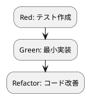

# 第 12 章: エラーハンドリングと型安全性

## 12.1 はじめに

第 4 部の締めくくりとして、Kotlin の **null 安全**、`Result` 型による安全な変換、そして sealed class と `when` の網羅性による型安全なエラー表現を学びます。Kotlin は型システムのレベルで「値が無い可能性」と「失敗する可能性」を明示させることで、実行時の `NullPointerException` や例外の握りつぶしを防ぎます。

### この章で学ぶこと

- Kotlin の **null 安全**（`String?` / `?.` / `let`）と `convertOrNull`
- `Result` 型（`success` / `failure` / `getOrNull` / `isFailure`）による安全な変換 `safeConvert`
- sealed class と `when` の網羅性による型安全なエラー表現
- Ruby の `nil` / 例外との対比
- 第 4 部の振り返り

## 12.2 null 安全

Kotlin は型システムで **null になりうる型** と **null にならない型** を区別します。`String` は決して null になりませんが、`String?` は null を取りうる型です。null 許容型の値には、そのままメンバーアクセスできません。

### セーフコール `?.` と let

`?.`（セーフコール）は、レシーバが null なら呼び出しをスキップして null を返します。`let` はレシーバを引数に取るスコープ関数で、`?.let { ... }` の形で「非 null のときだけ処理する」パターンになります。

```kotlin
val n: Int? = null
n?.let { it * 2 }  // n が null なら null、非 null なら it * 2
```

Ruby では `nil` と `&.`（safe navigation）で似たことを書けますが、Kotlin では **型に `?` が付くかどうか** が静的に決まり、null チェック漏れをコンパイラが検出します。「うっかり nil のメソッドを呼んで落ちる」ことが起こり得ません。

### TODO リストの更新

**TODO リスト**:

- [ ] null 許容の入力を安全に変換する `convertOrNull`
- [ ] 正の数のみ受け付ける安全な変換 `safeConvert`
- [ ] 失敗を型で表現する

### Red: convertOrNull のテスト

```kotlin
import kotlin.test.Test
import kotlin.test.assertEquals
import kotlin.test.assertNull
import kotlin.test.assertTrue

class FizzBuzzErrorTest {
    @Test
    fun convertOrNull は null を渡すと null を返す() {
        assertNull(FizzBuzzError.convertOrNull(null))
    }

    @Test
    fun convertOrNull は数を渡すと変換する() {
        assertEquals("Fizz", FizzBuzzError.convertOrNull(3))
    }
}
```

### TDD サイクル



### Green: convertOrNull の実装

```kotlin
package fizzbuzz

object FizzBuzzError {
    fun convertOrNull(n: Int?): String? = n?.let(FizzBuzz::convert)
}
```

引数の型は `Int?`（null 許容）、戻り値の型は `String?` です。`n?.let(FizzBuzz::convert)` は「`n` が非 null のときだけ `FizzBuzz.convert` を適用し、null ならそのまま null を返す」という意味です。関数参照 `FizzBuzz::convert` を `let` に直接渡しています。呼び出し側は戻り値が `String?` であることを型で知らされるため、null の可能性を無視できません。

## 12.3 Result による安全な変換

例外を投げる代わりに、成功と失敗を **値として返す** のが `Result` 型です。`Result.success(v)` は成功、`Result.failure(e)` は失敗を表し、`getOrNull()` で成功値を、`isFailure` で失敗かどうかを取り出せます。

### Red: safeConvert のテスト

```kotlin
    @Test
    fun safeConvert は正の数で成功を返す() {
        assertEquals("Fizz", FizzBuzzError.safeConvert(3).getOrNull())
    }

    @Test
    fun safeConvert はゼロ以下で失敗を返す() {
        assertTrue(FizzBuzzError.safeConvert(0).isFailure)
    }
```

### Green: safeConvert の実装

```kotlin
    fun safeConvert(n: Int): Result<String> =
        if (n <= 0) Result.failure(IllegalArgumentException("正の数を指定してください: $n"))
        else Result.success(FizzBuzz.convert(n))
```

戻り値が `Result<String>` なので、呼び出し側は成功と失敗の両方を扱う前提になります。正の数なら `Result.success` で変換結果を包み、ゼロ以下なら `Result.failure` に `IllegalArgumentException` を包んで返します。`safeConvert(3).getOrNull()` は `"Fizz"` を、`safeConvert(0).isFailure` は `true` を返します。

例外を投げる方式では「呼び出し側が try/catch を書き忘れる」ことがありますが、`Result` を返す方式では戻り値を扱う過程で失敗の存在に気付けます。Ruby では例外か `nil` を返す設計が一般的でしたが、Kotlin の `Result` は成功値とエラーを 1 つの型に閉じ込め、`getOrNull` / `getOrElse` / `fold` などで一様に扱えます。

```bash
$ ./gradlew test

BUILD SUCCESSFUL
```

## 12.4 sealed class による型安全なエラー表現

より複雑なエラーを扱う場合、**sealed class**（封印クラス）でエラーの種類を列挙すると、`when` の **網羅性チェック** が効きます。sealed class のサブクラスは同一モジュール内に限定されるため、コンパイラが「すべてのケースを扱ったか」を検証できます。

```kotlin
sealed class ConvertResult {
    data class Success(val value: String) : ConvertResult()
    data class Failure(val message: String) : ConvertResult()
}

fun describe(result: ConvertResult): String = when (result) {
    is ConvertResult.Success -> "成功: ${result.value}"
    is ConvertResult.Failure -> "失敗: ${result.message}"
    // else 不要: すべてのサブクラスを網羅しているとコンパイラが確認する
}
```

`when` が式として値を返す文脈では、sealed class のすべてのサブクラスを扱わない限りコンパイルエラーになります。新しいエラー種別を追加したとき、対応漏れのある `when` が自動的にコンパイルエラーとして洗い出されるため、**型システムがエラー処理の抜けを防ぎます**。Ruby の `case/when` は網羅性を保証しませんが、Kotlin の sealed class + `when` は分岐の完全性を静的に保証する点が異なります。

## 12.5 各言語のエラーハンドリング比較

| 概念 | Kotlin | Ruby | Java | Flix |
|------|--------|------|------|------|
| null 安全 | `String?` + `?.` / `let` | `nil` + `&.` | `Optional` | `Option[t]` |
| 成功/失敗 | `Result<T>` | 例外 / `nil` | `Optional` / 例外 | `Result[e, t]` |
| 成功値の取得 | `getOrNull()` | — | `orElse` | `Result.getWithDefault` |
| 網羅的分岐 | sealed class + `when` | `case/in` | sealed + `switch` | 代数的データ型 + `match` |
| 列挙型 | `enum class` | Symbol / Module 定数 | `enum` | 列挙型 |

## 12.6 第 4 部のまとめ

第 4 部（章 10〜12）を通じて、OOP の FizzBuzz に関数型プログラミングの要素を追加しました。

| 章 | テーマ | 適用した技術 |
|---|--------|-------------|
| 10 | 高階関数と関数合成 | ラムダ式、関数参照、`map` / `filter` / `fold`、`generateWith` |
| 11 | 不変データとパイプライン | `val` / 読み取り専用 `List`、`compose`、`Sequence` 遅延評価 |
| 12 | エラーハンドリングと型安全性 | null 安全、`Result`、sealed class + `when` の網羅性 |

**TODO リスト**:

- [x] null 許容の入力を安全に変換する `convertOrNull`
- [x] 正の数のみ受け付ける安全な変換 `safeConvert`
- [x] 失敗を型で表現する

### 全 12 章の学習体系

| 部 | テーマ | 章 |
|---|--------|---|
| 第 1 部 | TDD の基本サイクル | 章 1〜3: TODO リスト、仮実装と三角測量、明白な実装 |
| 第 2 部 | 開発環境と自動化 | 章 4〜6: バージョン管理、パッケージ管理、タスクランナー |
| 第 3 部 | オブジェクト指向設計 | 章 7〜9: ポリモーフィズム、デザインパターン、SOLID |
| 第 4 部 | 関数型プログラミング | 章 10〜12: 高階関数、パイプライン、型安全性 |

### Kotlin の OOP + FP 融合

Kotlin はオブジェクト指向と関数型の両パラダイムを、対立させることなく融合させています。第 3 部ではクラス・インターフェース・ポリモーフィズムで構造を与え、第 4 部ではラムダ式・関数参照・高階関数・`Sequence`・`Result`・sealed class で振る舞いを柔軟にし、型安全性を高めました。

null 安全と `Result` により「値が無い可能性」「失敗する可能性」を型に現し、sealed class と `when` の網羅性により分岐の完全性を静的に保証する——これらは実行時エラーを設計段階で締め出し、**変更を楽に安全に行える** 基盤になります。FizzBuzz という小さな題材を通じて、TDD の基本サイクルから、オブジェクト指向による構造化、そして関数型による型安全なデータ処理まで、Kotlin の設計思想を一貫して体験しました。まさに「よいソフトウェア」を支える言語だと言えます。

<details>
<summary>実装コード</summary>

```kotlin
package fizzbuzz

object FizzBuzzError {
    fun safeConvert(n: Int): Result<String> =
        if (n <= 0) Result.failure(IllegalArgumentException("正の数を指定してください: $n"))
        else Result.success(FizzBuzz.convert(n))

    fun convertOrNull(n: Int?): String? = n?.let(FizzBuzz::convert)
}
```

</details>
