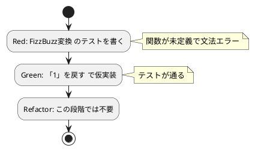

# 第 1 章: TODO リストと最初のテスト

## 1.1 はじめに

プログラムを作成するにあたって、まず何をすればよいでしょうか？私たちは、仕様を確認して **TODO リスト** を作るところから始めます。

> TODO リスト
>
> 何をテストすべきだろうか——着手する前に、必要になりそうなテストをリストに書き出しておこう。
>
> — テスト駆動開発

本シリーズでは、日本語プログラミング言語 **なでしこ3** を使います。なでしこ3 は「〜を〜する」という日本語の語順でプログラムを書く言語で、`「こんにちは」を表示` のように、引数を **助詞** で指定して命令を呼び出します。英語のキーワードを覚えなくても読み書きできるため、テスト駆動開発（TDD）の考え方そのものに集中しやすい言語です。

## 1.2 仕様の確認

今回取り組む FizzBuzz 問題の仕様は以下の通りです。

```
1 から 100 までの数をプリントするプログラムを書け。
ただし 3 の倍数のときは数の代わりに「Fizz」と、5 の倍数のときは「Buzz」とプリントし、
3 と 5 両方の倍数の場合には「FizzBuzz」とプリントすること。
```

この仕様をそのままプログラムに落とし込むには少しサイズが大きいですね。最初の作業は仕様を **TODO リスト** に分解する作業から着手しましょう。

## 1.3 TODO リストの作成

仕様を分解して TODO リストを作成します。

**TODO リスト**:

- [ ] 数を文字列にして返す
    - [ ] 1 を渡したら文字列 "1" を返す
- [ ] 3 の倍数のときは数の代わりに「Fizz」と返す
- [ ] 5 の倍数のときは「Buzz」と返す
- [ ] 3 と 5 両方の倍数の場合には「FizzBuzz」と返す
- [ ] 1 から 100 までの数
- [ ] プリントする

まず「1 を渡したら文字列 "1" を返す」という、最も小さなタスクから取り掛かります。

## 1.4 テスト環境の準備

### テストファースト

最初にプログラムする対象を決めたので、早速プロダクトコードを実装……ではなく **テストファースト** で作業を進めましょう。

> テストファースト
>
> いつテストを書くべきだろうか——それはテスト対象のコードを書く前だ。
>
> — テスト駆動開発

### 処理系 gonako

なでしこ3 の公式実装は TypeScript 版（`cnako3`）ですが、本シリーズでは Go 言語で実装された互換処理系 [nadesiko3go](https://github.com/kujirahand/nadesiko3go) の CLI 版 **`gonako`**（バージョン 3.8.8）を使います。単一の実行ファイルで動作し、文法チェック（`lint`）・整形（`format`）・表示結果の照合（`doctest`）のサブコマンドを備えているためです。

### 表明命令 ASSERT等

`gonako` には、JUnit や pytest のようなテスティングフレームワークは同梱されていません。その代わりに、2 つの値が等しいことを表明する命令 **`ASSERT等`** が組み込まれています。

```nako3
【A】と【B】がASSERT等
```

`A` と `B` が等しくなければ `ASSERT失敗` という実行時エラーを起こし、`gonako` は終了コード 1 で終了します。本シリーズではこの `ASSERT等` を土台に、テストを組み立てていきます。

### 開発環境のセットアップ

Nix 環境に入り、`apps/nadesiko` に移動します。Nix 環境に入ると、固定したバージョンの `gonako` が自動的にビルドされ、`PATH` に追加されます（詳しくは第 5 章で解説します）。

```bash
# Nix 環境に入る
$ nix develop .#nadesiko

# プロジェクトディレクトリへ移動
$ cd apps/nadesiko
```

ディレクトリ構成は、プロダクトコードを `src/`、テストコードを `test/` に置きます。なでしこ3 のソースファイルの拡張子は `.nako3` です。テストファイルは `*_test.nako3` という名前にします。

テストの実行は `make test` で行います。`Makefile` の `test` タスクは、`test/` 配下の `*_test.nako3` を 1 ファイルずつ `gonako run` で実行し、**終了コードで合否を判定** する小さなテストランナーです。

```makefile
# test/ 配下の *_test.nako3 を 1 ファイルずつ実行し、終了コードで合否を判定する
test:
	@pass=0; fail=0; \
	for f in test/*_test.nako3; do \
		echo "== $$f"; \
		if $(GONAKO) run "$$f"; then pass=$$((pass + 1)); else fail=$$((fail + 1)); fi; \
	done; \
	echo "テストファイル: $$pass 件成功、$$fail 件失敗"; \
	test $$fail -eq 0
```

- `$(GONAKO) run "$$f"` — テストファイルをなでしこ3 のプログラムとして実行します（`GONAKO` の既定値は `gonako`）。
- `ASSERT等` が失敗するとプログラムは終了コード 1 で止まるため、そのファイルは失敗として数えられます。
- 最後に失敗したファイルが 1 件でもあれば、`make test` 自体も失敗します。

## 1.5 最初のテスト（Red）

「1 を渡したら文字列 "1" を返す」テストを書きます。テスト対象となる関数 `FizzBuzz変換` はまだ存在しませんが、テストファーストなので先にテストを書きます。

> アサートファースト
>
> いつアサーションを書くべきだろうか——最初に書こう。
>
> — テスト駆動開発

`test/fizzbuzz_test.nako3`:

```nako3
!「../src/fizzbuzz.nako3」を取り込む

1をFizzBuzz変換と「1」がASSERT等
「ok: 1を渡したら文字列1を返す」を表示
```

なでしこ3 ならではのポイントを確認しましょう。

- `!「../src/fizzbuzz.nako3」を取り込む` — テスト対象のファイルを読み込みます。パスは **取り込む側のファイルの位置** からの相対パスです。
- `1をFizzBuzz変換` — 「1 を FizzBuzz 変換する」と日本語の語順で関数を呼び出しています。`FizzBuzz変換(1)` のような括弧の呼び出しではなく、**助詞「を」** で引数を渡すのがなでしこ3 の基本的な書き方です。
- `…と「1」がASSERT等` — `ASSERT等` は助詞「と」「が」で 2 つの値を受け取ります。1 行目の文全体が「1 を FizzBuzz 変換した結果と「1」が等しいことを表明する」と読めます。
- `「1」` — かぎ括弧で囲んだものが **文字列** です。
- 表明が通ったことが分かるように、次の行で `ok:` のメッセージを表示しています。

プロダクトコード `src/fizzbuzz.nako3` はまだコメントだけの空のファイルにしておき、テストを実行します。

```bash
$ make test
== test/fizzbuzz_test.nako3
[文法エラー]test/fizzbuzz_test.nako3(3行目): 未解決の単語があります: [数値1を]
次の命令の可能性があります:
 - AとBがASSERT等

テストファイル: 0 件成功、1 件失敗
make: *** [Makefile:10: test] Error 1
```

関数 `FizzBuzz変換` が定義されていないため、`1を` を受け取る命令が見つからず **文法エラー** になりました（Red）。なでしこ3 は実行前にプログラム全体を解析するので、未定義の関数の呼び出しは実行時ではなく解析の段階で見つかります。「次の命令の可能性があります」と、助詞の形が合う命令の候補まで教えてくれるのも親切ですね。関数が存在しないというエラーも、立派な Red です。

## 1.6 最小実装（Green）

テストを通す最小限のコードを書きます。TODO リストの最初の項目は「1 を渡したら "1" を返す」だけなので、素直に `「1」` を返す **仮実装** で構いません。

> 仮実装を経て本実装へ
>
> 失敗するテストを書いてから、最初に行う実装はどのようなものだろうか——ベタ書きの値を返そう。
>
> — テスト駆動開発

`src/fizzbuzz.nako3`:

```nako3
# FizzBuzz の基本変換

●(Nを)FizzBuzz変換
    「1」を戻す
ここまで
```

ここでなでしこ3 の関数定義の書き方を確認します。

- `●(Nを)FizzBuzz変換` — 行頭の `●` が関数定義の合図です。`(Nを)` は **引数とその助詞** の宣言で、「`を` で渡された値を `N` という名前で受け取る」という意味になります。呼び出し側の `1をFizzBuzz変換` と助詞が対応しているのがポイントです。
- `「1」を戻す` — `戻す` で値を返します。
- `ここまで` — 関数の本体の終わりを示します。なでしこ3 では関数・条件分岐・繰り返しのブロックを `ここまで` で閉じます。
- `#` で始まる行はコメントです。

テストを実行します。

```bash
$ make test
== test/fizzbuzz_test.nako3
ok: 1を渡したら文字列1を返す
テストファイル: 1 件成功、0 件失敗
```

テストが通りました（Green）。こんなベタ書きのプログラムでいいの？と思われるかもしれませんが、この細かいステップに今しばらくお付き合いください。

### TDD サイクル



## 1.7 TODO リストの更新

最初のタスクが完了しました。TODO リストを更新します。

**TODO リスト**:

- [ ] 数を文字列にして返す
    - [x] 1 を渡したら文字列 "1" を返す
- [ ] 3 の倍数のときは数の代わりに「Fizz」と返す
- [ ] 5 の倍数のときは「Buzz」と返す
- [ ] 3 と 5 両方の倍数の場合には「FizzBuzz」と返す
- [ ] 1 から 100 までの数
- [ ] プリントする

ここまでの作業をバージョン管理システムにコミットしておきましょう。

```bash
$ git add .
$ git commit -m 'test(nadesiko): 数を文字列にして返す'
```

## 1.8 まとめ

この章では以下のことを学びました。

- **TODO リスト** で仕様をプログラミング対象に分解する方法
- **テストファースト** で最初にテストを書く考え方
- なでしこ3 の Go 実装 `gonako` と、組み込みの表明命令 `【A】と【B】がASSERT等` によるテスト
- テストファイルを 1 つずつ実行し、終了コードで合否を判定する `make test` のテストランナー
- `●(Nを)FizzBuzz変換 … ここまで` による関数定義と、**助詞で引数を受け渡す** なでしこ3 の呼び出し方（`1をFizzBuzz変換`）
- 未定義の関数の呼び出しは、実行前の解析で **文法エラー** として見つかること
- **仮実装** でベタ書きの値を返し、まずテストを通す手法
- **アサートファースト** で `ASSERT等` の表明から書き始めるアプローチ

次章では、この仮実装を **三角測量** によって一般化していきます。

### 実装

<details>
<summary>実装コード（src/fizzbuzz.nako3）</summary>

```nako3
# FizzBuzz の基本変換

●(Nを)FizzBuzz変換
    「1」を戻す
ここまで
```

</details>

<details>
<summary>テストコード（test/fizzbuzz_test.nako3）</summary>

```nako3
!「../src/fizzbuzz.nako3」を取り込む

1をFizzBuzz変換と「1」がASSERT等
「ok: 1を渡したら文字列1を返す」を表示
```

</details>
