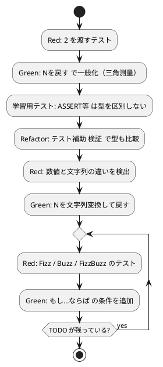

# 第 2 章: 仮実装と三角測量

## 2.1 はじめに

前章では、`「1」を戻す` という仮実装でテストを通しました。この章では、**三角測量** によって仮実装を一般化し、さらに Fizz・Buzz・FizzBuzz の変換を順に実装していきます。途中で、テストの数が増えてきたことに合わせて **テストコードのリファクタリング** も行います。

**TODO リスト**:

- [ ] 数を文字列にして返す
    - [x] 1 を渡したら文字列 "1" を返す
    - [ ] 2 を渡したら文字列 "2" を返す
- [ ] 3 の倍数のときは数の代わりに「Fizz」と返す
- [ ] 5 の倍数のときは「Buzz」と返す
- [ ] 3 と 5 両方の倍数の場合には「FizzBuzz」と返す
- [ ] 1 から 100 までの数
- [ ] プリントする

## 2.2 三角測量

> 三角測量
>
> テストから最も慎重に一般化を引き出すやり方はどのようなものだろうか——2 つ以上の例があるときだけ、一般化を行うようにしよう。
>
> — テスト駆動開発

### Red: 2 つ目のテストを書く

「2 を渡したら文字列 "2" を返す」テストを追加します。

```nako3
!「../src/fizzbuzz.nako3」を取り込む

1をFizzBuzz変換と「1」がASSERT等
「ok: 1を渡したら文字列1を返す」を表示
2をFizzBuzz変換と「2」がASSERT等
「ok: 2を渡したら文字列2を返す」を表示
```

```bash
$ make test
== test/fizzbuzz_test.nako3
ok: 1を渡したら文字列1を返す
[実行時エラー]test/fizzbuzz_test.nako3(5行目): ASSERT失敗: 『1』と『2』が一致しません。
テストファイル: 0 件成功、1 件失敗
make: *** [Makefile:10: test] Error 1
```

今度は文法エラーではなく、`ASSERT等` による **実行時エラー** です。仮実装は常に `「1」` を返すので、`2` を渡したときの期待値 `「2」` と一致しません（Red）。1 つ目の表明は通っているので、`ok:` の行が 1 つだけ表示されています。

### Green: 一般化する

2 つの例がそろったので、一般化します。受け取った `N` をそのまま返せば、1 でも 2 でもテストが通るはずです。

```nako3
# FizzBuzz の基本変換

●(Nを)FizzBuzz変換
    Nを戻す
ここまで
```

```bash
$ make test
== test/fizzbuzz_test.nako3
ok: 1を渡したら文字列1を返す
ok: 2を渡したら文字列2を返す
テストファイル: 1 件成功、0 件失敗
```

テストが通りました（Green）。……ところで、テストの名前は「文字列 1 を返す」でした。`Nを戻す` が返しているのは **数値** のはずです。本当にこれで仕様を満たしているのでしょうか。

### 学習用テスト: ASSERT等 の比較の仕方

疑問に思ったら、テストで確かめるのが TDD 流です。`ASSERT等` がどのように値を比較するのかを、小さなプログラムで調べてみましょう。

> 学習用テスト
>
> 外部のソフトウェアのテストを書くべきだろうか——そのソフトウェアに対して新しいことを初めて行おうとした際に書いてみよう。
>
> — テスト駆動開発

```nako3
1と「1」がASSERT等
「数値の1と文字列の1は等しいとみなされる」を表示
1の変数型確認を表示
「1」の変数型確認を表示
```

```bash
$ gonako run learn.nako3
数値の1と文字列の1は等しいとみなされる
number
string
```

`ASSERT等` は数値の `1` と文字列の `「1」` を **等しいとみなす** ことが分かりました。なでしこ3 は動的型付けの言語で、比較のときに型を柔軟に変換します。一方、`変数型確認` を使うと、数値は `number`、文字列は `string` と型を区別して調べられます。

つまり、今のテストは「文字列を返す」ことを確かめられていません。テストが仕様を正しく表現できるように、テストコードの方を改善しましょう。

## 2.3 テストコードのリファクタリング

テストの数が増えてきたので、テストコードにも手を入れます。現在のテストには次の課題があります。

- 型を区別しない `ASSERT等` だけでは、数値と文字列の違いを検出できない
- テストの名前（`ok:` のメッセージ）を毎回別の行に書いている
- 最初に失敗した表明でプログラムが止まり、後続のテストが実行されない

そこで、テスト補助のファイル `test/helper.nako3` を作り、1 件の検証を行う関数 `検証` と、最後に結果を報告する関数 `テスト結果報告` を用意します。

`test/helper.nako3`:

```nako3
# テスト補助: 検証結果を集計し、失敗があれば最後にエラーで終了する
成功数 = 0
失敗数 = 0

●(名前と実際と期待で)検証
    エラー監視
        (実際の変数型確認)と(期待の変数型確認)がASSERT等
        実際と期待がASSERT等
        「  ok: {名前}」を表示
        成功数 = 成功数 + 1
    エラーならば
        「  NG: {名前}: {エラーメッセージ}」を表示
        失敗数 = 失敗数 + 1
    ここまで
ここまで

●テスト結果報告
    「  {成功数}件成功、{失敗数}件失敗」を表示
    もし、失敗数 > 0ならば
        「{失敗数}件のテストが失敗しました」のエラー発生
    ここまで
ここまで
```

- `●(名前と実際と期待で)検証` — 引数を 3 つ受け取る関数です。助詞「と」「と」「で」で区切って、テスト名・実際の値・期待値を受け取ります。
- `(実際の変数型確認)と(期待の変数型確認)がASSERT等` — 値を比べる前に、**型が同じであること** を表明します。これで数値と文字列の取り違えを検出できます。
- `エラー監視 … エラーならば … ここまで` — ブロック内でエラーが起きると `エラーならば` 以降に処理が移ります。`ASSERT等` の失敗を捕まえて `NG:` を表示し、次のテストへ進めます。エラーの内容は `エラーメッセージ` で取り出せます。
- `「  ok: {名前}」` — 文字列の中の `{変数名}` は、その変数の値に置き換えられます（文字列の展開）。
- `テスト結果報告` — 成功数と失敗数を表示し、失敗が 1 件でもあれば `エラー発生` で実行時エラーを起こします。これにより `gonako` が終了コード 1 で終わり、`make test` が失敗を検出できます。

テストファイルは、この補助を取り込んで書き直します。

```nako3
!「./helper.nako3」を取り込む
!「../src/fizzbuzz.nako3」を取り込む

「1を渡したら文字列1を返す」と(1をFizzBuzz変換)と「1」で検証
「2を渡したら文字列2を返す」と(2をFizzBuzz変換)と「2」で検証
テスト結果報告
```

「〈名前〉と〈実際〉と〈期待〉で検証」と、テスト 1 件を 1 行の日本語の文で表現できるようになりました。実際の値の部分は `(1をFizzBuzz変換)` のように括弧で囲み、ひとまとまりの式であることを明示しています。

### Red: 型の違いが検出される

```bash
$ make test
== test/fizzbuzz_test.nako3
  NG: 1を渡したら文字列1を返す: ASSERT失敗: 『number』と『string』が一致しません。
  NG: 2を渡したら文字列2を返す: ASSERT失敗: 『number』と『string』が一致しません。
  0件成功、2件失敗
[実行時エラー]test/fizzbuzz_test.nako3(20行目): 2件のテストが失敗しました
テストファイル: 0 件成功、1 件失敗
make: *** [Makefile:10: test] Error 1
```

型の比較によって、`Nを戻す` が数値を返していることが明らかになりました（Red）。1 件目が失敗しても 2 件目が実行され、最後に件数が報告されていることも確認できます。なお、エラーの行番号には取り込んだ補助ファイル側の `エラー発生` の位置が表示されます。

### Green: 文字列に変換する

`文字列変換` で数値を文字列にしてから返します。

```nako3
# FizzBuzz の基本変換

●(Nを)FizzBuzz変換
    Nを文字列変換して戻す
ここまで
```

`Nを文字列変換して戻す` は「N を文字列変換して（その結果を）戻す」と読めます。なでしこ3 では **「〜して」で命令をつなげる** と、前の命令の結果が次の命令に渡されます。

```bash
$ make test
== test/fizzbuzz_test.nako3
  ok: 1を渡したら文字列1を返す
  ok: 2を渡したら文字列2を返す
  2件成功、0件失敗
テストファイル: 1 件成功、0 件失敗
```

テストが通りました（Green）。

**TODO リスト**:

- [x] 数を文字列にして返す
    - [x] 1 を渡したら文字列 "1" を返す
    - [x] 2 を渡したら文字列 "2" を返す
- [ ] 3 の倍数のときは数の代わりに「Fizz」と返す
- [ ] 5 の倍数のときは「Buzz」と返す
- [ ] 3 と 5 両方の倍数の場合には「FizzBuzz」と返す
- [ ] 1 から 100 までの数
- [ ] プリントする

```bash
$ git commit -am 'refactor(nadesiko): テスト補助で型も検証する'
```

## 2.4 3 の倍数 — Fizz

### Red: 3 の倍数のテスト

`テスト結果報告` の前に 1 行追加します。

```nako3
「3を渡したらFizzを返す」と(3をFizzBuzz変換)と「Fizz」で検証
```

```bash
$ make test
== test/fizzbuzz_test.nako3
  ok: 1を渡したら文字列1を返す
  ok: 2を渡したら文字列2を返す
  NG: 3を渡したらFizzを返す: ASSERT失敗: 『3』と『Fizz』が一致しません。
  2件成功、1件失敗
[実行時エラー]test/fizzbuzz_test.nako3(20行目): 1件のテストが失敗しました
テストファイル: 0 件成功、1 件失敗
make: *** [Makefile:10: test] Error 1
```

### Green: 条件分岐を追加する

3 で割り切れるかどうかは、剰余演算子 `%` で調べられます。これは実装の方針が明白なので、仮実装を経ずに **明白な実装** で進めます。

```nako3
# FizzBuzz の基本変換

●(Nを)FizzBuzz変換
    もし、N % 3 = 0ならば,「Fizz」を戻す
    Nを文字列変換して戻す
ここまで
```

- `もし、〈条件〉ならば,〈文〉` — 条件が成り立つときだけ文を実行する、1 行で書く条件分岐です。
- `N % 3 = 0` — なでしこ3 では、比較の「等しい」を `=` で書きます。代入と同じ記号ですが、`もし` の条件の中では比較として扱われます。
- `ならば` の後ろの `,` は、`gonako format`（第 5 章で扱う整形コマンド）が 1 行形式の `もし` を整形したときの区切りです。`、` で書いても同じように動きますが、本シリーズでは整形後の形で掲載します。

```bash
$ make test
== test/fizzbuzz_test.nako3
  ok: 1を渡したら文字列1を返す
  ok: 2を渡したら文字列2を返す
  ok: 3を渡したらFizzを返す
  3件成功、0件失敗
テストファイル: 1 件成功、0 件失敗
```

## 2.5 5 の倍数 — Buzz

### Red: 5 の倍数のテスト

```nako3
「5を渡したらBuzzを返す」と(5をFizzBuzz変換)と「Buzz」で検証
```

```bash
$ make test
...
  NG: 5を渡したらBuzzを返す: ASSERT失敗: 『5』と『Buzz』が一致しません。
  3件成功、1件失敗
```

### Green: Buzz の条件を追加する

```nako3
# FizzBuzz の基本変換

●(Nを)FizzBuzz変換
    もし、N % 3 = 0ならば,「Fizz」を戻す
    もし、N % 5 = 0ならば,「Buzz」を戻す
    Nを文字列変換して戻す
ここまで
```

```bash
$ make test
...
  4件成功、0件失敗
テストファイル: 1 件成功、0 件失敗
```

## 2.6 3 と 5 の倍数 — FizzBuzz

### Red: 15 の倍数のテスト

```nako3
「15を渡したらFizzBuzzを返す」と(15をFizzBuzz変換)と「FizzBuzz」で検証
```

```bash
$ make test
== test/fizzbuzz_test.nako3
  ok: 1を渡したら文字列1を返す
  ok: 2を渡したら文字列2を返す
  ok: 3を渡したらFizzを返す
  ok: 5を渡したらBuzzを返す
  NG: 15を渡したらFizzBuzzを返す: ASSERT失敗: 『Fizz』と『FizzBuzz』が一致しません。
  4件成功、1件失敗
[実行時エラー]test/fizzbuzz_test.nako3(20行目): 1件のテストが失敗しました
テストファイル: 0 件成功、1 件失敗
make: *** [Makefile:10: test] Error 1
```

15 は 3 の倍数でもあるので、最初の条件で `「Fizz」` が返ってしまいました。

### Green: 条件の順序を見直す

`戻す` は値を返した時点で関数を抜けるため、**条件を書く順序** が結果を左右します。最も限定的な「15 の倍数」を先頭に置きます。

```nako3
# FizzBuzz の基本変換

●(Nを)FizzBuzz変換
    もし、N % 15 = 0ならば,「FizzBuzz」を戻す
    もし、N % 3 = 0ならば,「Fizz」を戻す
    もし、N % 5 = 0ならば,「Buzz」を戻す
    Nを文字列変換して戻す
ここまで
```

```bash
$ make test
== test/fizzbuzz_test.nako3
  ok: 1を渡したら文字列1を返す
  ok: 2を渡したら文字列2を返す
  ok: 3を渡したらFizzを返す
  ok: 5を渡したらBuzzを返す
  ok: 15を渡したらFizzBuzzを返す
  5件成功、0件失敗
テストファイル: 1 件成功、0 件失敗
```

すべてのテストが通りました（Green）。

**TODO リスト**:

- [x] 数を文字列にして返す
- [x] 3 の倍数のときは数の代わりに「Fizz」と返す
- [x] 5 の倍数のときは「Buzz」と返す
- [x] 3 と 5 両方の倍数の場合には「FizzBuzz」と返す
- [ ] 1 から 100 までの数
- [ ] プリントする

```bash
$ git commit -am 'feat(nadesiko): Fizz・Buzz・FizzBuzz を返す'
```

## 2.7 TDD サイクル



## 2.8 まとめ

この章では以下のことを学びました。

- **三角測量** で 2 つ目の例を追加し、仮実装を一般化する手法
- `ASSERT等` は数値の `1` と文字列の `「1」` を等しいとみなすことを、**学習用テスト** で確かめる姿勢
- `変数型確認` による型の確認と、型も比較するテスト補助 `検証` へのテストコードのリファクタリング
- `エラー監視 … エラーならば … ここまで` と `エラー発生` による、失敗を集計して最後に報告するテストの仕組み
- `Nを文字列変換して戻す` のように、**「〜して」で命令をつなぐ** なでしこ3 の書き方
- `もし、〈条件〉ならば,〈文〉` の 1 行の条件分岐と、`%` による剰余の判定
- `戻す` で関数を抜けるため、**条件の順序**（15 の倍数を先に）が結果を左右すること

次章では、1 から 100 までの数の変換とプリント機能を **明白な実装** で仕上げ、コード全体を整えます。

### 実装

<details>
<summary>実装コード（src/fizzbuzz.nako3）</summary>

```nako3
# FizzBuzz の基本変換

●(Nを)FizzBuzz変換
    もし、N % 15 = 0ならば,「FizzBuzz」を戻す
    もし、N % 3 = 0ならば,「Fizz」を戻す
    もし、N % 5 = 0ならば,「Buzz」を戻す
    Nを文字列変換して戻す
ここまで
```

</details>

<details>
<summary>テストコード（test/fizzbuzz_test.nako3）</summary>

```nako3
!「./helper.nako3」を取り込む
!「../src/fizzbuzz.nako3」を取り込む

「1を渡したら文字列1を返す」と(1をFizzBuzz変換)と「1」で検証
「2を渡したら文字列2を返す」と(2をFizzBuzz変換)と「2」で検証
「3を渡したらFizzを返す」と(3をFizzBuzz変換)と「Fizz」で検証
「5を渡したらBuzzを返す」と(5をFizzBuzz変換)と「Buzz」で検証
「15を渡したらFizzBuzzを返す」と(15をFizzBuzz変換)と「FizzBuzz」で検証
テスト結果報告
```

</details>

<details>
<summary>テスト補助（test/helper.nako3）</summary>

```nako3
# テスト補助: 検証結果を集計し、失敗があれば最後にエラーで終了する
成功数 = 0
失敗数 = 0

●(名前と実際と期待で)検証
    エラー監視
        (実際の変数型確認)と(期待の変数型確認)がASSERT等
        実際と期待がASSERT等
        「  ok: {名前}」を表示
        成功数 = 成功数 + 1
    エラーならば
        「  NG: {名前}: {エラーメッセージ}」を表示
        失敗数 = 失敗数 + 1
    ここまで
ここまで

●テスト結果報告
    「  {成功数}件成功、{失敗数}件失敗」を表示
    もし、失敗数 > 0ならば
        「{失敗数}件のテストが失敗しました」のエラー発生
    ここまで
ここまで
```

</details>
