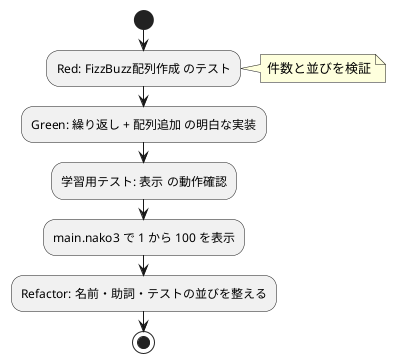

# 第 3 章: 明白な実装とリファクタリング

## 3.1 はじめに

前章までで、1 つの数を FizzBuzz の文字列に変換する関数 `FizzBuzz変換` が完成しました。この章では、残りの TODO である「1 から 100 までの数」と「プリントする」を **明白な実装** で仕上げ、最後にコード全体を見直して **動作するきれいなコード** に整えます。

> 明白な実装
>
> シンプルな操作を実現するにはどうすればいいだろうか——そのまま実装しよう。
>
> — テスト駆動開発

**TODO リスト**:

- [x] 数を文字列にして返す
- [x] 3 の倍数のときは数の代わりに「Fizz」と返す
- [x] 5 の倍数のときは「Buzz」と返す
- [x] 3 と 5 両方の倍数の場合には「FizzBuzz」と返す
- [ ] 1 から 100 までの数
- [ ] プリントする

## 3.2 1 から N までの配列生成

### Red: 配列生成のテスト

1 から N までの数をそれぞれ変換した **配列** を返す関数 `FizzBuzz配列作成` を考えます。100 件すべてを期待値に書くのは大変なので、15 までで確かめます。件数と、並びの両方をテストします。

```nako3
「15まで作ると15件になる」と(15までFizzBuzz配列作成の配列要素数)と15で検証
「15まで作った配列の並び」と(15までFizzBuzz配列作成を「,」で配列結合)と「1,2,Fizz,4,Buzz,Fizz,7,8,Fizz,Buzz,11,Fizz,13,14,FizzBuzz」で検証
```

- `15までFizzBuzz配列作成` — 助詞 **「まで」** で引数を渡します。「15 まで FizzBuzz 配列を作成する」と自然に読めるよう、関数は `●(Nまで)FizzBuzz配列作成` と定義する予定です。
- `…の配列要素数` — 配列の要素数を返す組み込み命令です。助詞 **「の」** で引数を受け取ります。
- `…を「,」で配列結合` — 配列の要素を `,` でつないだ 1 つの文字列にします。配列の中身を文字列として比較できるので、並びをまとめて検証できます。

テストを実行します。

```bash
$ make test
== test/fizzbuzz_test.nako3
  ok: 3を渡したらFizzを返す
  ok: 5を渡したらBuzzを返す
  ok: 15を渡したらFizzBuzzを返す
  ok: 1を渡したら文字列1を返す
  ok: 2を渡したら文字列2を返す
  NG: 15まで作ると15件になる: ASSERT失敗: 『1』と『15』が一致しません。
  NG: 15まで作った配列の並び: ASSERT失敗: 『undefined』と『1,2,Fizz,4,Buzz,Fizz,7,8,Fizz,Buzz,11,Fizz,13,14,FizzBuzz』が一致しません。
  5件成功、2件失敗
[実行時エラー]test/fizzbuzz_test.nako3(20行目): 2件のテストが失敗しました
テストファイル: 0 件成功、1 件失敗
make: *** [Makefile:10: test] Error 1
```

関数 `FizzBuzz配列作成` はまだ定義していないので、期待とは異なる値（`undefined` など）になり、2 件とも失敗しました（Red）。第 1 章のように文法エラーにはならず、値の食い違いとして現れている点に注意してください。未定義の関数がいつも文法エラーで止まるとは限らないからこそ、**テストで期待値を確かめる** ことが大切です。

なお、テストの並びは「Fizz・Buzz・FizzBuzz・数」と仕様の順に並べ替えました。テストは仕様書の役割も果たすので、読みやすい順序に整えておきます。

### Green: 明白な実装

1 から N まで繰り返し、変換した結果を配列に追加していきます。実装の方針が明白なので、そのまま書きます。

```nako3
●(Nまで)FizzBuzz配列作成
    結果 = []
    Iを1からNまで繰り返す
        結果に(IをFizzBuzz変換)を配列追加
    ここまで
    結果を戻す
ここまで
```

- `結果 = []` — 空の配列で変数を初期化します。
- `Iを1からNまで繰り返す … ここまで` — 変数 `I` を 1 から N まで 1 ずつ増やしながら、ブロックを繰り返します。ここでも「を」「から」「まで」の助詞で繰り返しの範囲を指定しています。
- `結果に(IをFizzBuzz変換)を配列追加` — 「結果に 〜 を配列追加する」。配列の末尾に要素を追加します。

```bash
$ make test
...
  ok: 15まで作ると15件になる
  ok: 15まで作った配列の並び
  7件成功、0件失敗
テストファイル: 1 件成功、0 件失敗
```

テストが通りました（Green）。

**TODO リスト**:

- [x] 数を文字列にして返す
- [x] 3 の倍数のときは数の代わりに「Fizz」と返す
- [x] 5 の倍数のときは「Buzz」と返す
- [x] 3 と 5 両方の倍数の場合には「FizzBuzz」と返す
- [x] 1 から 100 までの数
- [ ] プリントする

## 3.3 プリント機能

### 学習用テスト: 表示命令の確認

プリントには組み込み命令 `表示` を使います。文字列と配列を表示するとどうなるか、確かめておきます。

```nako3
「Fizz」を表示
[1, 2, 「Fizz」]を表示
```

```bash
$ gonako run learn.nako3
Fizz
1,2,Fizz
```

`表示` は値を 1 行に出力し、配列は要素を `,` でつないで表示することが分かりました。仕様は「1 つずつプリントする」なので、配列の要素を 1 行ずつ表示します。

### メインプログラムの作成

`src/main.nako3` を作成します。

```nako3
# 1 から 100 までの FizzBuzz を表示する
!「./fizzbuzz.nako3」を取り込む

文字列で(100までFizzBuzz配列作成)を反復
    文字列を表示
ここまで
```

- `文字列で(配列)を反復 … ここまで` — 配列の要素を 1 つずつ変数 `文字列` に入れながら、ブロックを繰り返します。書式は「〈変数名〉で〈配列〉を反復」です。

`Makefile` の `run` タスクで実行します。

```bash
$ make run
gonako run src/main.nako3
1
2
Fizz
4
Buzz
Fizz
7
8
Fizz
Buzz
11
Fizz
13
14
FizzBuzz
...
98
Fizz
Buzz
```

1 から 100 までの FizzBuzz が表示されました。表示そのものは画面への出力（副作用）なので自動テストの対象にはせず、変換のロジックを `FizzBuzz配列作成` に閉じ込めてテストしています。表示結果を自動で確かめる方法は、第 5 章の `gonako doctest` で扱います。

**TODO リスト**:

- [x] 数を文字列にして返す
- [x] 3 の倍数のときは数の代わりに「Fizz」と返す
- [x] 5 の倍数のときは「Buzz」と返す
- [x] 3 と 5 両方の倍数の場合には「FizzBuzz」と返す
- [x] 1 から 100 までの数
- [x] プリントする

```bash
$ git add .
$ git commit -m 'feat(nadesiko): 1 から 100 までの FizzBuzz を表示する'
```

## 3.4 動作するきれいなコード

> 動作するきれいなコード
>
> ——テスト駆動開発のゴール
>
> — テスト駆動開発

すべての TODO が完了しました。最後にコード全体を見直します。

- **関数名と助詞**: `NをFizzBuzz変換`・`NまでFizzBuzz配列作成` と、呼び出す文がそのまま日本語として読めるように、関数名と引数の助詞を選びました。なでしこ3 では **名前付けに加えて助詞の選び方も設計の一部** です。
- **責務の分離**: 1 つの数の変換（`FizzBuzz変換`）、配列の生成（`FizzBuzz配列作成`）、表示（`main.nako3`）を分けたので、表示を除く部分はすべて自動テストで守られています。
- **テストの読みやすさ**: 「〈名前〉と〈実際〉と〈期待〉で検証」の 1 行 1 テストの形にそろえ、仕様の順序に並べました。
- **整形**: `gonako format` の出力と一致するように、演算子の前後の空白やインデント（4 スペース）をそろえています。

リファクタリングの後も、テストを実行してすべて通ることを確認します。

```bash
$ make test
== test/fizzbuzz_test.nako3
  ok: 3を渡したらFizzを返す
  ok: 5を渡したらBuzzを返す
  ok: 15を渡したらFizzBuzzを返す
  ok: 1を渡したら文字列1を返す
  ok: 2を渡したら文字列2を返す
  ok: 15まで作ると15件になる
  ok: 15まで作った配列の並び
  7件成功、0件失敗
テストファイル: 1 件成功、0 件失敗
```

### TDD サイクルの振り返り



## 3.5 他言語との比較

| 観点 | なでしこ3 | Python | Prolog |
|------|-----------|--------|--------|
| 関数定義 | `●(Nを)FizzBuzz変換 … ここまで` | `def fizzbuzz(n):` | `fizzbuzz(N, R) :- ...` |
| 呼び出し | `3をFizzBuzz変換`（助詞で引数） | `fizzbuzz(3)` | `fizzbuzz(3, R)` |
| テスト | `ASSERT等` + 自作のテスト補助 | pytest の `assert` | plunit の `assertion/1` |
| 条件分岐 | `もし、…ならば` | `if ...:` | 複数節とカット |
| 繰り返し | `Iを1からNまで繰り返す` | `for i in range(1, n + 1):` | `numlist/3` + `maplist/3` |

なでしこ3 の最大の特徴は、**引数の役割を位置ではなく助詞で表す** ことです。`15までFizzBuzz配列作成` のように、呼び出しの文そのものが仕様の説明になります。

## 3.6 まとめ

この章では以下のことを学びました。

- **明白な実装** で、方針の見えている処理をそのまま実装する手法
- `結果 = []`・`Iを1からNまで繰り返す`・`配列追加` による配列の生成
- `配列要素数` と `配列結合` を使った、配列の件数と並びの検証
- 未定義の関数が、文法エラーではなく値の食い違いとして現れる場合もあること
- **学習用テスト** で `表示` の動作を確かめてから、`〈変数〉で〈配列〉を反復` でプリント機能を作ること
- 表示（副作用）とロジックを分け、ロジックを自動テストで守る設計
- なでしこ3 では、関数名と **助詞の選び方** が読みやすさを左右すること

第 1 部はここまでです。次の第 2 部では、バージョン管理・静的解析・タスクランナー・CI/CD といった、開発を支える環境を整えていきます。

### 実装

<details>
<summary>実装コード（src/fizzbuzz.nako3）</summary>

```nako3
# FizzBuzz の基本変換

●(Nを)FizzBuzz変換
    もし、N % 15 = 0ならば,「FizzBuzz」を戻す
    もし、N % 3 = 0ならば,「Fizz」を戻す
    もし、N % 5 = 0ならば,「Buzz」を戻す
    Nを文字列変換して戻す
ここまで

●(Nまで)FizzBuzz配列作成
    結果 = []
    Iを1からNまで繰り返す
        結果に(IをFizzBuzz変換)を配列追加
    ここまで
    結果を戻す
ここまで
```

</details>

<details>
<summary>メインプログラム（src/main.nako3、この章の時点）</summary>

```nako3
# 1 から 100 までの FizzBuzz を表示する
!「./fizzbuzz.nako3」を取り込む

文字列で(100までFizzBuzz配列作成)を反復
    文字列を表示
ここまで
```

</details>

<details>
<summary>テストコード（test/fizzbuzz_test.nako3）</summary>

```nako3
!「./helper.nako3」を取り込む
!「../src/fizzbuzz.nako3」を取り込む

「3を渡したらFizzを返す」と(3をFizzBuzz変換)と「Fizz」で検証
「5を渡したらBuzzを返す」と(5をFizzBuzz変換)と「Buzz」で検証
「15を渡したらFizzBuzzを返す」と(15をFizzBuzz変換)と「FizzBuzz」で検証
「1を渡したら文字列1を返す」と(1をFizzBuzz変換)と「1」で検証
「2を渡したら文字列2を返す」と(2をFizzBuzz変換)と「2」で検証
「15まで作ると15件になる」と(15までFizzBuzz配列作成の配列要素数)と15で検証
「15まで作った配列の並び」と(15までFizzBuzz配列作成を「,」で配列結合)と「1,2,Fizz,4,Buzz,Fizz,7,8,Fizz,Buzz,11,Fizz,13,14,FizzBuzz」で検証
テスト結果報告
```

</details>
