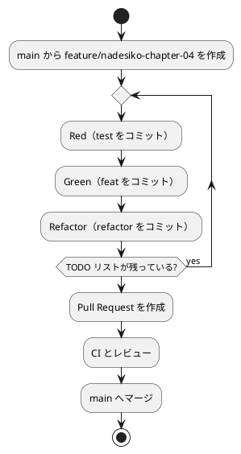

# 第 4 章: バージョン管理と Conventional Commits

## 4.1 はじめに

ソフトウェア開発では、変更履歴を安全に管理し、チームで追跡可能にする仕組みが重要です。Git による版管理とコミットメッセージ規約を整えることで、TDD の小さな変更を確実に積み上げられます。この章では、なでしこ3 プロジェクト（`apps/nadesiko`）における Git の基本操作と Conventional Commits の実践方法を学びます。

第 1 部では TDD の Red-Green-Refactor サイクルを通じて、日本語で書く FizzBuzz を完成させました。この章からは「動作するきれいなコード」を書き続けるために必要な **ソフトウェア開発の三種の神器** を整備していきます。

> 今日のソフトウェア開発の世界において絶対になければならない 3 つの技術的な柱があります。三本柱と言ったり、三種の神器と言ったりしていますが、それらは
>
> - バージョン管理
> - テスティング
> - 自動化
>
> の 3 つです。
>
> — 和田卓人

**バージョン管理** と **テスティング** に関しては第 1 部で触れました。本章ではバージョン管理をさらに深掘りし、**コミットメッセージの規約** について解説します。

Git の使い方そのものは言語に依存しません。なでしこ3 のソースは `.nako3` という拡張子の UTF-8 のテキストファイルなので、他の言語と同じように行単位で差分を取り、レビューできます。日本語で書かれたプログラムであっても、版管理の考え方は変わりません。

## 4.2 Git によるバージョン管理

なでしこ3 プロジェクト（`apps/nadesiko`）では、次の基本フローで変更を記録します。

```bash
cd apps/nadesiko
git init
git add .
git commit -m "chore(nadesiko): なでしこ3 プロジェクトを初期化"
```

`git init` でリポジトリを初期化し、`git add` でステージング、`git commit` で履歴を確定します。TDD では Red → Green → Refactor の小さな単位でコミットすると、変更意図を追いやすくなります。

### 基本操作のループ

日常的な作業は次のコマンドの繰り返しです。

```bash
# 変更確認
git status

# 差分確認
git diff

# ステージング
git add src/fizzbuzz.nako3 test/fizzbuzz_test.nako3

# コミット
git commit -m "test(nadesiko): 15 を渡したら FizzBuzz を返すテストを追加"

# 履歴確認
git log --oneline --decorate -n 10
```

### プロジェクトの構成

`apps/nadesiko` の構成は次の通りです。手で書くファイルはすべて版管理の対象です。

```text
apps/nadesiko/
├── .gitignore
├── Makefile              # タスクランナー（第 6 章）
├── doctest/
│   └── fizzbuzz.txt      # 受け入れテスト（第 5 章）
├── src/
│   ├── fizzbuzz.nako3    # 実装
│   └── main.nako3        # 1 から 100 までを表示するエントリポイント
└── test/
    ├── helper.nako3      # テスト補助（検証・テスト結果報告）
    └── fizzbuzz_test.nako3
```

実際にはこの後の章で `src/` と `test/` にファイルが増えていきます。テストファイルは `*_test.nako3` という名前にそろえ、テスト補助の `helper.nako3` と区別します。この命名規則は第 6 章の test runner が「どれがテストファイルか」を見分けるために使います。

### .gitignore の設定

なでしこ3 の実行系 `gonako` はソースを直接実行するため、ビルド成果物は生まれません。除外が必要なのは、第 5 章で導入する `gonako` 本体のバイナリだけです。`apps/nadesiko/.gitignore` は次の 1 行です。

```gitignore
bin/
```

`bin/` は Nix 開発環境が `go install` で `gonako` を置く場所（`GOBIN`）です。`.gitignore` の要点は、**復元可能な成果物を履歴に含めない** ことです。`gonako` は `shell.nix` に書かれた固定コミットからいつでも再ビルドできるため、リポジトリには含めません。バイナリを履歴に入れると、OS や CPU ごとに異なるファイルがコミットされ、履歴が肥大化してしまいます。

一方で、`.nako3`（ソースとテスト）、`doctest/*.txt`（受け入れテスト）、`Makefile` は版管理の対象です。これらはプロジェクトの本体であり、他の開発者と共有すべき成果物だからです。

## 4.3 Conventional Commits

本プロジェクトでは [Angular ルール](https://github.com/angular/angular.js/blob/master/DEVELOPERS.md#type) に由来する **Conventional Commits** の書式を採用します。基本フォーマットは次の通りです。

```text
<type>(<scope>): <subject>
<空行>
<body>
<空行>
<footer>
```

- **ヘッダ**（`<type>(<scope>): <subject>`）は必須です
- `type`: 変更種別
- `scope`: 変更対象（任意）
- `subject`: 変更内容の要約（50 文字前後を目安に簡潔に）

### type の種類

| type | 用途 |
|------|------|
| `feat` | 新機能の追加 |
| `fix` | バグ修正 |
| `docs` | ドキュメント変更 |
| `style` | 振る舞いに影響しない整形（`gonako format` の適用、空白など） |
| `refactor` | 振る舞いを変えない構造改善 |
| `perf` | パフォーマンス改善 |
| `test` | テスト追加・修正 |
| `chore` | ビルドや設定などの雑務 |

### scope と subject の書き方

- `scope` は変更対象を短く書きます。このリポジトリは多言語の記事と実装を 1 つにまとめているため、なでしこ3 版の変更には `nadesiko` を使います（CI の変更なら `ci`）。
- `subject` は 50 文字前後を目安に、何をしたかを明確に書きます。
- 末尾の句点は付けません。

なでしこ3 では関数名そのものが日本語（`FizzBuzz変換` など）なので、subject に関数名をそのまま書いても日本語の文として自然に読めます。一方で、識別子の中にひらがなの助詞を含められないという言語上の制約（第 1 部で `数字のみ変換` が分割されてしまった件）で改名したときは、`refactor` で理由を残しておくと後から経緯を追えます。

### コミットメッセージの例

```text
test(nadesiko): 3 を渡したら Fizz を返すテストを追加
feat(nadesiko): FizzBuzz変換 で 3 の倍数を Fizz に変換
refactor(nadesiko): 助詞を含む関数名を FizzBuzz装飾 に改名
style(nadesiko): gonako format を適用
docs(nadesiko): パッケージ管理と静的解析の章を追加
chore(ci): なでしこ3 の CI ワークフローを追加
```

## 4.4 TDD でのコミット戦略

TDD の Red-Green-Refactor サイクルにおいて、コミットする適切なタイミングは以下の通りです。

```text
Red（テスト作成）→ Green（テスト成功）→ コミット → Refactor（リファクタリング）→ コミット
```

各段階でコミットすることで、変更の意図を明確に保てます。

### Red — 失敗するテストを追加

```bash
git add test/fizzbuzz_test.nako3
git commit -m "test(nadesiko): 15 を渡したら FizzBuzz を返すテストを追加"
```

テストファイルのみをコミットし、テストが失敗する状態を記録します。なでしこ3 のテストは `検証` の後に `テスト結果報告` を呼び、失敗があればエラーで終了するため、Red の状態は `gonako run` の終了コードが 1 になることで確認できます。

### Green — テストを通す最小実装

```bash
git add src/fizzbuzz.nako3
git commit -m "feat(nadesiko): FizzBuzz変換 で 15 の倍数を FizzBuzz に変換"
```

実装ファイルのみをコミットし、全テストが通過する状態を記録します。

### Refactor — 振る舞いを変えない整理

```bash
git add src/fizzbuzz.nako3
git commit -m "refactor(nadesiko): FizzBuzz変換 の条件を 15・3・5 の順に整理"
```

テストが通り続けていることを確認した上で、コードの改善をコミットします。

ポイントは、**1 コミット 1 意図** です。`feat` と `refactor` を同一コミットに混ぜないことで、レビューしやすくなります。同じ理由で、`gonako format` による整形だけの変更は `style` として独立したコミットにします。整形の差分（インデントや演算子の前後の空白）がロジックの変更に混ざると、何が本質的な変更なのかが読み取りにくくなるからです。

### 実際のコミット例

FizzBuzz の開発過程では、以下のようなコミット履歴になります（ハッシュは例示です）。

```bash
$ git log --oneline

abc1234 refactor(nadesiko): FizzBuzz変換 の条件を 15・3・5 の順に整理
def5678 feat(nadesiko): 15 の倍数で FizzBuzz を返す
ghi9012 feat(nadesiko): 5 の倍数で Buzz を返す
jkl3456 feat(nadesiko): 3 の倍数で Fizz を返す
mno7890 feat(nadesiko): 三角測量で数を文字列に変換する処理を一般化
pqr1234 test(nadesiko): 1 を渡したら文字列 1 を返すテストを追加
stu5678 chore(nadesiko): なでしこ3 プロジェクトを初期化（gonako + helper.nako3）
```

各コミットが小さく、明確な目的を持っていることがわかります。

## 4.5 ブランチ戦略

### Git Flow の基本概念

Git Flow では、主に次のブランチを使います。

- `main`: リリース済みの安定コード
- `develop`: 開発統合ブランチ
- `feature/*`: 機能開発ブランチ
- `release/*`: リリース準備ブランチ
- `hotfix/*`: 緊急修正ブランチ

学習用プロジェクトでは、まず `main` と `feature/*` の運用から始めると実践しやすいです。



### feature ブランチの作成と運用

```bash
git switch main
git pull origin main
git switch -c feature/nadesiko-chapter-04
```

運用ポイントは次の通りです。

- 1 ブランチ 1 テーマに絞ります。
- Red / Green / Refactor の区切りで小さくコミットします。
- 完了後に Pull Request を作成し、レビュー後に `main` へマージします。

## 4.6 まとめ

この章では、なでしこ3 の TDD 開発を支える版管理の基礎を整理しました。

- Git の基本操作で変更履歴を安全に管理する。日本語で書かれた `.nako3` も通常のテキストとして差分を取れる
- `.gitignore` で再ビルドできる `gonako` のバイナリ（`bin/`）を除外し、`.nako3`・`doctest/*.txt`・`Makefile` は版管理する
- Conventional Commits（スコープは `nadesiko`）で履歴を読みやすくする
- TDD の Red → Green → Refactor の各段階でコミットし、`gonako format` による整形は `style` として分ける
- `feature` ブランチ運用で変更を分離する

次章では、なでしこ3 の実行系 `gonako` のバージョン固定と、静的解析（`gonako lint`・`gonako format`）および受け入れテスト（`gonako doctest`）の整備を進めます。

### 実装

<details>
<summary>実装コード（apps/nadesiko/.gitignore）</summary>

```gitignore
bin/
```

</details>
