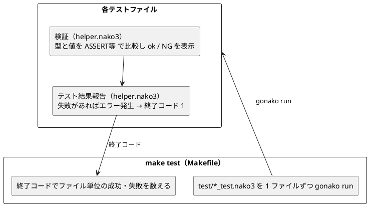
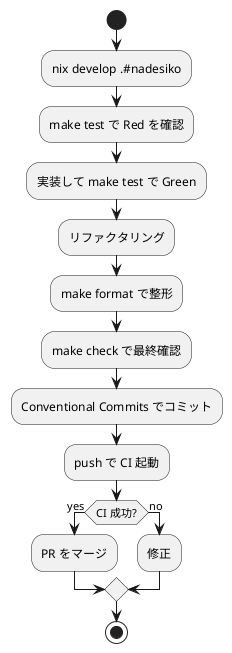

# 第 6 章: タスクランナーと CI/CD

## 6.1 はじめに

前章では `gonako` の導入とバージョン固定、静的解析（`gonako lint`）、整形（`gonako format`）、受け入れテスト（`gonako doctest`）を導入しました。使えるコマンドは増えましたが、テストファイルを 1 つずつ `gonako run` したり、すべての `.nako3` に `gonako lint` をかけたりするのを毎回手で打つのは手間がかかり、実行漏れも起こります。

この章では、Makefile によるタスク集約、test runner の仕組み、Nix 開発環境、GitHub Actions を使って、なでしこ3 プロジェクトの開発タスクを自動化し、**CI/CD** パイプラインを構築します。

## 6.2 Nix による開発環境

なでしこ3 の開発に必要なのは、実行系の **gonako** と、タスクランナーの **make** です。前章で見た `ops/nix/environments/nadesiko/shell.nix` がこれらを用意し、リポジトリ直下の `flake.nix` に `nadesiko` という名前で登録されています。

```nix
          nadesiko = import ./ops/nix/environments/nadesiko/shell.nix { inherit packages; };
```

```bash
# Nix 環境に入る
$ nix develop .#nadesiko
```

環境に入ると、`shellHook` が `gonako` を固定コミットから `apps/nadesiko/bin` に導入し（初回のみ）、`PATH` に加えます。Go と make は nixpkgs から、`gonako` はコミットハッシュで固定したソースから入るため、開発者ごと・CI ごとの実行系の差異がなくなり、「自分の環境では動く」問題を防げます。

## 6.3 Makefile によるタスク管理

`apps/nadesiko/Makefile` に、日常的に使うタスクを定義します。実ファイルは次の通りです。

```makefile
GONAKO ?= gonako
SOURCES := $(wildcard src/*.nako3) $(wildcard test/*.nako3)

.PHONY: all test lint format format-check doctest check run clean

all: check

# test/ 配下の *_test.nako3 を 1 ファイルずつ実行し、終了コードで合否を判定する
test:
	@pass=0; fail=0; \
	for f in test/*_test.nako3; do \
		echo "== $$f"; \
		if $(GONAKO) run "$$f"; then pass=$$((pass + 1)); else fail=$$((fail + 1)); fi; \
	done; \
	echo "テストファイル: $$pass 件成功、$$fail 件失敗"; \
	test $$fail -eq 0

# 文法エラーがないかを検査する
lint:
	@for f in $(SOURCES); do \
		$(GONAKO) lint "$$f" > /dev/null || exit 1; \
	done
	@echo "lint: OK"

# gonako format の整形結果と差分がないかを検査する
format-check:
	@for f in $(SOURCES); do \
		$(GONAKO) format "$$f" | diff -u "$$f" - || { echo "要整形: $$f（make format で修正）"; exit 1; }; \
	done
	@echo "format: OK"

# ソースを整形して書き戻す
format:
	@for f in $(SOURCES); do $(GONAKO) format -f "$$f" > /dev/null; done

# 受け入れテスト（doctest/*.txt の表示結果を照合する）
doctest:
	$(GONAKO) doctest doctest

check: lint format-check test doctest

run:
	$(GONAKO) run src/main.nako3

clean:
	rm -rf bin
```

### 各タスクの説明

| タスク | 内容 |
|--------|------|
| `make test` | `test/*_test.nako3` を 1 ファイルずつ `gonako run` し、終了コードで合否を判定する |
| `make lint` | `src/` と `test/` の全 `.nako3` に `gonako lint` をかけ、文法エラーを検査する |
| `make format` | `gonako format -f` で全 `.nako3` を整形して書き戻す |
| `make format-check` | 整形結果と差分がないかを検査する（書き戻さない） |
| `make doctest` | `doctest/` の受け入れテストで表示結果を照合する |
| `make check` | `lint`・`format-check`・`test`・`doctest` をまとめて実行する |
| `make run` | `src/main.nako3` を実行し、1 から 100 までの FizzBuzz を表示する |
| `make clean` | `go install` で導入した `bin/` を削除する |

`make all`（既定ターゲット）は `check` を実行します。先頭の `GONAKO ?= gonako` は、`make test GONAKO=/path/to/gonako` のように別の場所の `gonako` を指定できるようにするための既定値です。

`make run` の実行結果の先頭は次の通りです（100 行続きます）。

```bash
$ make run
gonako run src/main.nako3
1
2
Fizz
4
Buzz
```

## 6.4 test runner の仕組み

なでしこ3 のテストには、他言語にはない固有の事情があります。

pytest や plunit のようなテストフレームワークは、テストを 1 件ずつ登録・実行し、成功数と失敗数を集計してくれます。`gonako` にはそのような仕組みはなく、あるのは **1 つのファイルを実行し、エラーがあれば終了コード 1 で終わる** という `gonako run` の振る舞いだけです。そこでこのプロジェクトでは、次の 2 層で test runner を組み立てています。



### ファイルの中: helper.nako3 による集計

テストファイルの中で集計を担うのが `test/helper.nako3` です。

```nako3
# テスト補助: 検証結果を集計し、失敗があれば最後にエラーで終了する
成功数 = 0
失敗数 = 0

●(名前と実際と期待で)検証
    エラー監視
        (実際の変数型確認)と(期待の変数型確認)がASSERT等
        実際と期待がASSERT等
        「  ok: {名前}」を表示
        成功数 = 成功数 + 1
    エラーならば
        「  NG: {名前}: {エラーメッセージ}」を表示
        失敗数 = 失敗数 + 1
    ここまで
ここまで

●テスト結果報告
    「  {成功数}件成功、{失敗数}件失敗」を表示
    もし、失敗数 > 0ならば
        「{失敗数}件のテストが失敗しました」のエラー発生
    ここまで
ここまで
```

- `検証` は `エラー監視 … エラーならば … ここまで` で `ASSERT等` の失敗を捕まえ、1 件の失敗でテストファイル全体が止まらないようにします。そのうえで成功なら `ok:`、失敗なら `NG:` とエラーメッセージを表示し、成功数・失敗数を数えます。
- `ASSERT等` は数値の 1 と文字列の "1" を等しいとみなす緩い比較なので、先に `変数型確認` で型どうしを比較しています。動的型付けのなでしこ3 で、「文字列 1 を返す」ことを確かめるための工夫です。
- `テスト結果報告` は各テストファイルの最後に呼び、失敗が 1 件でもあれば `エラー発生` で実行時エラーにします。捕まえられなかったエラーによって `gonako run` は終了コード 1 で終わります。

`検証` は `(名前と実際と期待で)` という助詞付きの引数で定義しているので、テストは「名前と実際と期待で検証」という日本語の語順で書けます。

```nako3
「3を渡したらFizzを返す」と(3をFizzBuzz変換)と「Fizz」で検証
```

### ファイルの外: Makefile による集計

Makefile の `test` ターゲットは、`test/*_test.nako3` に一致するファイルを 1 つずつ `gonako run` し、終了コードで `pass` と `fail` を数えます。`helper.nako3` は `_test` で終わらないので、テストファイルとしては実行されません。途中のファイルが失敗しても残りのファイルは最後まで実行し、最後の `test $$fail -eq 0` で 1 件でも失敗があれば `make` を失敗させます。

すべて成功した場合の出力は次の通りです（途中は省略しています）。

```bash
$ make test
== test/command_test.nako3
  ok: 値コマンドは1件の値を返す
  ok: 値コマンドの値はBuzz
  ok: リストコマンドは5件の値を返す
  ok: リストコマンドの最後の値はBuzz
  ok: コマンドは名前を持つ
  5件成功、0件失敗
...
== test/fizzbuzz_test.nako3
  ok: 3を渡したらFizzを返す
  ok: 5を渡したらBuzzを返す
  ok: 15を渡したらFizzBuzzを返す
  ok: 1を渡したら文字列1を返す
  ok: 2を渡したら文字列2を返す
  ok: 15まで作ると15件になる
  ok: 15まで作った配列の並び
  7件成功、0件失敗
...
テストファイル: 7 件成功、0 件失敗
```

失敗するテストファイルがある場合の様子も確認しておきます。次のテストは、`FizzBuzz変換` が文字列の "1" を返すのに数値の 1 を期待しているので失敗します。

```nako3
!「./helper.nako3」を取り込む
!「../src/fizzbuzz.nako3」を取り込む

「3を渡したらFizzを返す」と(3をFizzBuzz変換)と「Fizz」で検証
「1を渡したら数値1を返す」と(1をFizzBuzz変換)と1で検証
テスト結果報告
```

これを `test/ng_test.nako3` として置いて `make test` を実行すると、該当部分と最後の集計は次のようになります。

```bash
$ make test
...
== test/ng_test.nako3
  ok: 3を渡したらFizzを返す
  NG: 1を渡したら数値1を返す: ASSERT失敗: 『string』と『number』が一致しません。
  1件成功、1件失敗
[実行時エラー]test/ng_test.nako3(20行目): 1件のテストが失敗しました
== test/pipeline_test.nako3
...
テストファイル: 7 件成功、1 件失敗
make: *** [Makefile:10: test] Error 1
```

型の比較が先に行われるため、`ASSERT等` だけなら通ってしまう「文字列と数値の取り違え」を `『string』と『number』が一致しません` として検出できています。エラーメッセージの `20行目` は、エラーを発生させた `helper.nako3` の `テスト結果報告` の行を指しています。また、失敗したファイルの後の `pipeline_test.nako3` も実行されていることがわかります。

この仕組みのおかげで、テストファイルを増やしても Makefile や CI を変更する必要はありません。`*_test.nako3` を `test/` に追加するだけで、次回の `make test` から自動的に対象になります。

## 6.5 GitHub Actions による CI/CD

プッシュやプルリクエスト時に自動で品質チェックを実行する CI/CD パイプラインを構築します。ワークフローは `.github/workflows/nadesiko-ci.yml` に定義し、他の言語の CI と同型で Nix に対応させます。

```yaml
name: Nadesiko3 CI

on:
  push:
    branches: [main, develop]
    paths:
      - "apps/nadesiko/**"
      - ".github/workflows/nadesiko-ci.yml"
      - "ops/nix/environments/nadesiko/shell.nix"
  pull_request:
    branches: [main]
    paths:
      - "apps/nadesiko/**"
      - ".github/workflows/nadesiko-ci.yml"
      - "ops/nix/environments/nadesiko/shell.nix"

permissions:
  contents: read

jobs:
  build-and-test:
    runs-on: ubuntu-latest

    steps:
      - name: Checkout the repository
        uses: actions/checkout@v4

      - name: Install Nix
        uses: cachix/install-nix-action@v30
        with:
          nix_path: nixpkgs=channel:nixos-unstable

      - name: Cache Nix store
        uses: actions/cache@v4
        with:
          path: /tmp/nix-cache
          key: ${{ runner.os }}-nix-nadesiko-${{ hashFiles('flake.lock', 'ops/nix/environments/nadesiko/shell.nix') }}
          restore-keys: |
            ${{ runner.os }}-nix-nadesiko-

      - name: Cache gonako binary and Go modules
        uses: actions/cache@v4
        with:
          path: |
            apps/nadesiko/bin
            ~/go/pkg/mod
          key: ${{ runner.os }}-gonako-${{ hashFiles('ops/nix/environments/nadesiko/shell.nix') }}

      - name: Lint
        run: nix develop .#nadesiko --command bash -c "cd apps/nadesiko && make lint"

      - name: Format check
        run: nix develop .#nadesiko --command bash -c "cd apps/nadesiko && make format-check"

      - name: Test
        run: nix develop .#nadesiko --command bash -c "cd apps/nadesiko && make test"

      - name: Acceptance test (doctest)
        run: nix develop .#nadesiko --command bash -c "cd apps/nadesiko && make doctest"
```

### ワークフローのポイント

| 設定 | 説明 |
|------|------|
| `paths` フィルター | `apps/nadesiko/**` などに変更があった場合のみ実行 |
| Nix 環境 | `nix develop .#nadesiko` で Go・make・`gonako` を一貫させる |
| Nix ストアのキャッシュ | Nix ストアをキャッシュして CI を高速化 |
| gonako のキャッシュ | `apps/nadesiko/bin` と Go のモジュールキャッシュを保存し、`gonako` のビルドを省く |
| `make lint` | 文法エラーがあればワークフローが落ちる |
| `make format-check` | 未整形のファイルがあればワークフローが落ちる |
| `make test` | 失敗するテストファイルがあればワークフローが落ちる |
| `make doctest` | 表示結果が期待と異なればワークフローが落ちる |

`gonako` のキャッシュキーは `shell.nix` のハッシュだけから作っています。`gonako` のバージョン（固定コミット）は `shell.nix` に書かれているので、`shell.nix` を変えない限り同じバイナリを再利用し、コミットを更新すればキーが変わって新しい `gonako` がビルドされます。キャッシュが復元されると `bin/gonako` が既に存在するため、`shellHook` の `go install` は実行されません。

CI のステップはローカルの Makefile ターゲットをそのまま呼び出します。`nix develop .#nadesiko --command bash -c "cd apps/nadesiko && make lint"` のように、Nix 環境に入ってから `make` を実行するため、ローカルと CI で全く同じコマンド・同じ `gonako` が使われます。「ローカルで通ったのに CI で落ちる」ことがなくなります。

### トリガー条件

- `push`（`main` / `develop`） -- 主要ブランチへの反映時に検証
- `pull_request`（`main`） -- PR 作成・更新時に検証

PR の段階で lint・整形・テスト・受け入れテストが自動実行されるため、壊れたコードがマージされることを防げます。

## 6.6 品質ゲートの統合

CI では 4 つの検査を独立したステップに分け、どの検査で落ちたのかがすぐわかるようにしています。ローカルでは `make check`（= `lint format-check test doctest`）で、同じ 4 つを 1 コマンドでまとめて検証できます。

```bash
$ make check
lint: OK
format: OK
== test/command_test.nako3
  ok: 値コマンドは1件の値を返す
...
テストファイル: 7 件成功、0 件失敗
gonako doctest doctest
[DocTest] 1件のサンプルコードを実行します。
[DocTest] 1件成功・0件省略・失敗なし。
```

これにより、CI が通る条件は「文法エラーがなく、整形済みで、全テストが通り、表示結果が期待通りである」ことになります。この条件を満たさない変更はマージできない **品質ゲート** が完成します。

## 6.7 開発ワークフロー

ここまでの設定により、日常の開発は次の流れになります。



ローカルの `make check` と CI の検査を一致させておくことで、フィードバックを素早く得ながら安全に変更を積み上げられます。

### ツール一覧

| カテゴリ | ツール | 用途 |
|---------|--------|------|
| 実行系 | gonako v3.8.8 | なでしこ3 プログラムの実行 |
| テスト | `検証` / `テスト結果報告`（test/helper.nako3） | 型と値の検証と集計 |
| test runner | Makefile の `test` ターゲット | `test/*_test.nako3` をファイル単位で実行 |
| 静的解析 | `gonako lint` | 文法チェック |
| フォーマッタ | `gonako format` | コード整形 |
| 受け入れテスト | `gonako doctest` | 表示結果の照合 |
| タスクランナー | Make | タスク自動化 |
| 開発環境 | Nix + `go install @固定コミット` | 再現可能な gonako |
| CI/CD | GitHub Actions | 継続的インテグレーション |

### 各言語の CI/CD 比較

| 項目 | なでしこ3 | Python | Prolog |
|------|--------|--------|--------|
| CI ツール | GitHub Actions | GitHub Actions | GitHub Actions |
| 環境管理 | Nix + Go（gonako を固定コミットでビルド） | Nix + uv | Nix + SWI-Prolog |
| テスト | `make test` | `uv run tox -e test` | `make test` |
| 品質チェック | `make check` | `uv run tox` | `make check` |
| タスクランナー | Make | tox | Make |

## 6.8 まとめ

この章では以下を学びました。

- Nix で Go・make・固定コミットの `gonako` を用意し、再現可能な開発環境を作る（`nix develop .#nadesiko`）
- Makefile で日常タスク（`test`, `lint`, `format`, `format-check`, `doctest`, `check`, `run`, `clean`）を短いコマンドに集約する
- test runner を 2 層で組み立てる。ファイルの中では `helper.nako3` が型と値を比較して集計し、失敗があればエラーで終了する。ファイルの外では Makefile が `*_test.nako3` を 1 ファイルずつ実行し、終了コードで合否を数える
- GitHub Actions（`nadesiko-ci.yml`）で Nix 対応の CI を構築し、lint・format-check・test・doctest を自動化する。`gonako` のバイナリはキャッシュで再利用する
- `make check` で 4 つの検査を **品質ゲート** にする

第 2 部（章 4〜6）を通じて、ソフトウェア開発の三種の神器を整備しました。

| 神器 | 導入したもの |
|------|------------|
| バージョン管理 | Git + Conventional Commits |
| テスティング | helper.nako3 + test runner（Makefile）+ gonako doctest |
| 自動化 | gonako lint / format + Make + Nix + GitHub Actions |

次の第 3 部では、追加仕様を題材にオブジェクト指向設計（カプセル化、ポリモーフィズム、デザインパターン）を、クラス構文を持たないなでしこ3 の流儀で学びます。

### 実装

<details>
<summary>実装コード（apps/nadesiko/test/helper.nako3）</summary>

```nako3
# テスト補助: 検証結果を集計し、失敗があれば最後にエラーで終了する
成功数 = 0
失敗数 = 0

●(名前と実際と期待で)検証
    エラー監視
        (実際の変数型確認)と(期待の変数型確認)がASSERT等
        実際と期待がASSERT等
        「  ok: {名前}」を表示
        成功数 = 成功数 + 1
    エラーならば
        「  NG: {名前}: {エラーメッセージ}」を表示
        失敗数 = 失敗数 + 1
    ここまで
ここまで

●テスト結果報告
    「  {成功数}件成功、{失敗数}件失敗」を表示
    もし、失敗数 > 0ならば
        「{失敗数}件のテストが失敗しました」のエラー発生
    ここまで
ここまで
```

</details>
