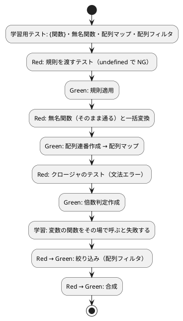

# 第 10 章: 高階関数と関数合成

## 10.1 はじめに

第 3 部では、関数を格納した辞書によるポリモーフィズム、値オブジェクトやファーストクラスコレクション、Command パターン、そして取り込みによるモジュール分割で FizzBuzz を構造化しました。この第 4 部では、関数型プログラミングの考え方を取り入れて、コードをさらに柔軟にします。

なでしこ3 にはクラス構文がありませんが、**関数を値として扱う** ことができます。第 3 部のタイプでは `{関数}FizzBuzz変換` で関数を取り出して辞書に入れ、あとから `変換(N)` として呼び出しました。この「関数を値として渡し、あとで呼ぶ」仕組みを正面から使うのが **高階関数** です。本章では、変換の規則を引数として受け取る関数、`配列マップ` による一括変換、`配列フィルタ` による絞り込み、クロージャ、関数合成を TDD で実装します。

### この章で学ぶこと

- `{関数}関数名` による関数の取り出しと、`関数(X) … ここまで` による無名関数
- 関数を引数に取る関数（`規則適用`）
- `配列連番作成` と `配列マップ` による一括変換
- `配列フィルタ` による絞り込み
- 外側の変数を覚えている関数（クロージャ）を返す `倍数判定作成`
- 2 つの関数をつなぐ `合成`

## 10.2 なでしこ3 の関数は値である

実装に入る前に、なでしこ3 で関数がどのように扱えるのかを学習用テストで確かめておきます。

> 学習用テスト
>
> 外部のソフトウェアのテストを書くべきだろうか——そのソフトウェアに対して新しいことを初めて行おうとした際に書いてみよう。
>
> — テスト駆動開発

### 名前付きの関数を値として取り出す

```nako3
!「./src/fizzbuzz.nako3」を取り込む
規則 = {関数}FizzBuzz変換
規則(15)を表示
(規則の変数型確認)を表示
```

```bash
$ gonako run learn2.nako3
FizzBuzz
function
```

`{関数}FizzBuzz変換` と書くと、関数を呼び出さずに **関数そのもの** を取り出せます。変数 `規則` の型は `function` で、`規則(15)` のように括弧で引数を渡して呼び出せます。なでしこ3 の普段の呼び出しは `15をFizzBuzz変換` という助詞による書き方ですが、変数に入れた関数は `規則(15)` のように括弧で呼び出します。

### 無名関数と配列マップ・配列フィルタ

```nako3
二倍 = 関数(X)
    (X × 2)を戻す
ここまで
偶数判定 = 関数(X)
    (X % 2 = 0)を戻す
ここまで
(1から5までの配列連番作成)を「,」で配列結合を表示
(二倍を[1, 2, 3]へ配列マップ)を「,」で配列結合を表示
(偶数判定で[1, 2, 3, 4]を配列フィルタ)を「,」で配列結合を表示
```

```bash
$ gonako run learn.nako3
1,2,3,4,5
2,4,6
2,4
```

- `関数(X) … ここまで` は名前を持たない **無名関数** です。変数に代入して使います。なお、`gonako format` は掛け算の `*` を `×` に置き換えるため、本書のコードも `×` で表記しています。
- `AからBまでの配列連番作成` は A から B までの整数の配列を作ります。
- `関数をAへ配列マップ` は配列の各要素に関数を適用した **新しい配列** を返します。
- `関数でAを配列フィルタ` は関数が真を返す要素だけを集めた **新しい配列** を返します。

`配列マップ` と `配列フィルタ` は関数を引数に取る、なでしこ3 組み込みの高階関数です。これらを使って FizzBuzz を組み立て直していきましょう。

## 10.3 TODO リストの更新

第 4 部の最初の作業として、TODO リストへ以下を追加します。

**TODO リスト**:

- [ ] 変換の規則を関数として受け取る `規則適用`
- [ ] 無名関数を規則として渡せる
- [ ] 1 から N までを規則で一括変換する `一括変換`
- [ ] 3 の倍数かどうかを判定する関数を作る `倍数判定作成`（クロージャ）
- [ ] 判定関数で配列を絞り込む `絞り込み`
- [ ] 2 つの関数を合成する `合成`

実装は新しいファイル `src/hof.nako3`（higher-order function）に置き、テストは `test/hof_test.nako3` に書きます。

## 10.4 規則適用 — 関数を引数に取る

### Red: 規則を渡して変換するテスト

```nako3
!「./helper.nako3」を取り込む
!「../src/hof.nako3」を取り込む

規則 = {関数}FizzBuzz変換
「規則を渡して変換する」と(規則で3を規則適用)と「Fizz」で検証
テスト結果報告
```

`src/hof.nako3` には、まだ取り込みの行しかありません。

```nako3
# 高階関数と関数合成
!「./fizzbuzz.nako3」を取り込む
```

```bash
$ gonako run test/hof_test.nako3
  NG: 規則を渡して変換する: ASSERT失敗: 『undefined』と『string』が一致しません。
  0件成功、1件失敗
[実行時エラー]test/hof_test.nako3(20行目): 1件のテストが失敗しました
```

第 1 章では未定義の関数の呼び出しが文法エラーとして見つかりましたが、今回のように `検証` に渡す括弧の中で呼んだ場合は、文法エラーにならず `undefined` として評価されました。それでも第 2 章で作ったテスト補助 `検証` が型（`undefined` と `string`）を比較しているので、テストは確実に失敗します（Red）。行番号が取り込んだ helper 側の `エラー発生` の位置を指すのは、第 2 章で見たとおりです。

### Green: 規則適用の実装

```nako3
# 高階関数と関数合成
!「./fizzbuzz.nako3」を取り込む

●(規則でNを)規則適用
    規則(N)を戻す
ここまで
```

```bash
$ gonako run test/hof_test.nako3
  ok: 規則を渡して変換する
  1件成功、0件失敗
```

`●(規則でNを)規則適用` は、助詞「で」で規則（関数）を、助詞「を」で数を受け取ります。呼び出し側は `規則で3を規則適用` と、定義と同じ助詞で引数を渡します。関数の本体は受け取った `規則` を `規則(N)` で呼ぶだけです。**どの規則で変換するか** が関数の外から注入されるようになりました。

## 10.5 無名関数と一括変換

### Red: 無名関数と配列マップのテスト

規則には `{関数}` で取り出した名前付きの関数だけでなく、無名関数も渡せるはずです。あわせて、1 から N までをまとめて変換する `一括変換` のテストも追加します。

```nako3
大文字規則 = 関数(N)
    もし、N % 3 = 0ならば,「FIZZ」を戻す
    Nを文字列変換して戻す
ここまで
「無名関数を規則として渡す」と(大文字規則で3を規則適用)と「FIZZ」で検証
「配列マップで一括変換する」と(規則で5まで一括変換を「,」で配列結合)と「1,2,Fizz,4,Buzz」で検証
```

```bash
$ gonako run test/hof_test.nako3
  ok: 規則を渡して変換する
  ok: 無名関数を規則として渡す
  NG: 配列マップで一括変換する: ASSERT失敗: 『undefined』と『1,2,Fizz,4,Buzz』が一致しません。
  2件成功、1件失敗
[実行時エラー]test/hof_test.nako3(20行目): 1件のテストが失敗しました
```

無名関数のテストは、実装を変えずにそのまま通りました。`規則適用` は渡された値が名前付きの関数か無名関数かを区別せず、ただ呼び出すだけだからです。一方、`一括変換` は未実装なので失敗します（Red）。

### Green: 配列マップで一括変換する

```nako3
●(規則でNまで)一括変換
    規則を(1からNまでの配列連番作成)へ配列マップ
ここまで
```

```bash
$ gonako run test/hof_test.nako3
  ok: 規則を渡して変換する
  ok: 無名関数を規則として渡す
  ok: 配列マップで一括変換する
  3件成功、0件失敗
```

`1からNまでの配列連番作成` で `[1, 2, …, N]` を作り、`配列マップ` で各要素に規則を適用します。第 1 部で作った `FizzBuzz配列作成` では空の配列を用意して `繰り返す` の中で `配列追加` していましたが、`一括変換` にはループ変数も途中で書き換わる配列も登場しません。「1 から N までの数に規則を当てはめる」という **何をするか** だけが 1 行で書かれています。

## 10.6 倍数判定作成 — クロージャ

次は、絞り込みに使う判定関数を **作って返す** 関数です。

### Red: クロージャのテスト

```nako3
Fizz判定 = 3の倍数判定作成
判定結果 = Fizz判定(9)
「クロージャで3の倍数を判定する」と判定結果と(はい)で検証
```

```bash
$ gonako run test/hof_test.nako3
[文法エラー]test/hof_test.nako3(14行目): 未解決の単語があります: [数値3の]
次の命令の可能性があります:

```

代入文の右辺で未定義の関数を呼んだ場合は、実行前に文法エラーとして見つかりました（Red）。変数名を `三の倍数` ではなく `Fizz判定` としているのは、識別子の中にひらがなの助詞「の」を含めると、そこで単語が分割されて文法エラーになるためです。

また、期待値の `はい` を括弧で囲んで `(はい)` としている点にも注意してください。`と はいで検証` と続けて書くと `とは` が一つの語として読まれてしまうため、括弧で区切っています。

### Green: 関数を返す関数

```nako3
●(Nの)倍数判定作成
    判定 = 関数(X)
        (X % N = 0)を戻す
    ここまで
    判定を戻す
ここまで
```

```bash
$ gonako run test/hof_test.nako3
  ok: 規則を渡して変換する
  ok: 無名関数を規則として渡す
  ok: 配列マップで一括変換する
  ok: クロージャで3の倍数を判定する
  4件成功、0件失敗
```

`倍数判定作成` の中で作った無名関数は、外側の引数 `N` を参照しています。`3の倍数判定作成` が戻ったあとも、返された関数 `Fizz判定` は `N = 3` を覚えていて、`Fizz判定(9)` は `9 % 3 = 0` を評価して `はい`（表示は `true`）を返します。このように、定義されたときの環境を閉じ込めて持ち歩く関数を **クロージャ** と呼びます。

### 変数の関数をその場で呼ぶと失敗する

テストでは `判定結果 = Fizz判定(9)` と、いったん変数に受けてから `検証` に渡しています。これを 1 行にまとめて、引数の並びの中でその場で呼び出すとどうなるでしょうか。

```nako3
「クロージャで3の倍数を判定する」とFizz判定(9)と(はい)で検証
```

```bash
$ gonako run test/hof_test.nako3
  ok: 規則を渡して変換する
  ok: 無名関数を規則として渡す
  ok: 配列マップで一括変換する
[実行時エラー]test/hof_test.nako3(16行目): 関数ではない値を呼び出そうとしました。
```

`検証` まで届かず、実行時エラーで止まってしまいました。助詞で引数を並べる文の中では、変数に入った関数の呼び出しと前後の括弧とがどう結び付くのかが、書き手の意図どおりに解釈されないことがあります。試してみると、今回の gonako では `Fizz判定(9)と「true」` のように後ろが括弧でない引数なら呼び出しは実行され、`(Fizz判定(9))` と呼び出し全体を括弧で囲んでも通りました。失敗したのは `Fizz判定(9)と(はい)` のように、呼び出しの直後に括弧で囲んだ引数が続く場合です。後の 10.8 節の `変換(3)と「Fizz」` がそのまま書けているのはこのためです。

こうした細かな解釈の違いに振り回されないよう、また読み手が迷わないよう、本書では **一度変数に受けてから渡す** 形を採用しています。

## 10.7 絞り込み — 配列フィルタ

### Red: 絞り込みのテスト

作った `Fizz判定` を使って、配列から 3 の倍数だけを取り出します。

```nako3
「配列フィルタで絞り込む」と(Fizz判定で[1,3,5,6,9]を絞り込みを「,」で配列結合)と「3,6,9」で検証
```

```bash
$ gonako run test/hof_test.nako3
  ok: 規則を渡して変換する
  ok: 無名関数を規則として渡す
  ok: 配列マップで一括変換する
  ok: クロージャで3の倍数を判定する
  NG: 配列フィルタで絞り込む: ASSERT失敗: 『undefined』と『3,6,9』が一致しません。
  4件成功、1件失敗
[実行時エラー]test/hof_test.nako3(20行目): 1件のテストが失敗しました
```

### Green: 絞り込みの実装

```nako3
●(判定で配列を)絞り込み
    判定で配列を配列フィルタ
ここまで
```

```bash
$ gonako run test/hof_test.nako3
  ok: 規則を渡して変換する
  ok: 無名関数を規則として渡す
  ok: 配列マップで一括変換する
  ok: クロージャで3の倍数を判定する
  ok: 配列フィルタで絞り込む
  5件成功、0件失敗
```

`絞り込み` は組み込みの `配列フィルタ` に処理を委ねているだけですが、`Fizz判定で[1,3,5,6,9]を絞り込み` と、**判定する関数** と **対象の配列** を助詞で区別して渡せる日本語の名前を与えています。クロージャで作った判定関数を、そのまま高階関数の引数に渡せることも確認できました。

## 10.8 合成 — 2 つの関数をつなぐ

最後に、2 つの関数から「先に F を適用し、その結果に G を適用する」新しい関数を作る **関数合成** です。

### Red: 合成のテスト

```nako3
二倍 = 関数(X)
    (X × 2)を戻す
ここまで
変換 = 二倍と規則を合成
「関数を合成する」と変換(3)と「Fizz」で検証
```

```bash
$ gonako run test/hof_test.nako3
[文法エラー]test/hof_test.nako3(22行目): 未解決の単語があります: [単語『hof_test__二倍』と,単語『hof_test__規則』を]
次の命令の可能性があります:

```

エラーメッセージの `hof_test__二倍` は、ファイル内の変数が `ファイル名__名前` という名前空間で修飾されていることを表しています（取り込んだ関数が `ファイル名__関数名` で修飾されるのと同じ仕組みです）。`合成` が未定義なので、`二倍と規則を` を受け取る命令が見つかりません（Red）。

### Green: 合成の実装

```nako3
●(関数Fと関数Gを)合成
    合成関数 = 関数(X)
        関数G(関数F(X))を戻す
    ここまで
    合成関数を戻す
ここまで
```

```bash
$ gonako run test/hof_test.nako3
  ok: 規則を渡して変換する
  ok: 無名関数を規則として渡す
  ok: 配列マップで一括変換する
  ok: クロージャで3の倍数を判定する
  ok: 配列フィルタで絞り込む
  ok: 関数を合成する
  6件成功、0件失敗
```

`合成` は、2 つの関数を覚えたクロージャを返します。`二倍と規則を合成` で作った `変換` は、`変換(3)` で `規則(二倍(3))`、すなわち `3 × 2 = 6` を FizzBuzz 変換して `「Fizz」` を返します。`二倍` も `規則` も、`合成` から見ればただの「1 引数の関数」です。小さな関数を組み合わせて、より大きな変換を組み立てられるようになりました。

## 10.9 TDD サイクル



## 10.10 各言語の高階抽象比較

| 概念 | なでしこ3 | Python | Prolog |
|------|-----------|--------|--------|
| 無名の振る舞い | `関数(X) … ここまで` | `lambda x: ...` | `[X, Y]>>Goal`（yall） |
| 名前による参照 | `{関数}FizzBuzz変換` | 関数名をそのまま渡す | 述語名（項） |
| 呼び出し | `規則(N)` | `rule(n)` | `call/N` |
| 写像 | `配列マップ` | `map` / リスト内包表記 | `maplist` |
| 絞り込み | `配列フィルタ` | `filter` / 内包表記の `if` | `include` |
| 範囲生成 | `配列連番作成` | `range` | `numlist` |

なでしこ3 の特徴は、高階関数も **助詞で引数の役割を区別する** 点です。`規則で5まで一括変換`、`Fizz判定で配列を絞り込み` のように、関数を受け取る引数と、データを受け取る引数とが日本語の文として読み分けられます。

## 10.11 まとめ

この章では以下のことを学びました。

- `{関数}関数名` で関数を値として取り出し、`規則(N)` のように括弧で呼び出す方法
- `関数(X) … ここまで` による無名関数と、それを規則として渡す高階関数 `規則適用`
- `配列連番作成` と `配列マップ` による、ループも可変の配列も使わない一括変換
- 外側の `N` を覚えた関数を返す **クロージャ**（`倍数判定作成`）
- `配列フィルタ` による絞り込みと、2 つの関数をつなぐ **関数合成**（`合成`）
- 識別子に助詞を含めない、変数の関数は一度変数に受けてから渡す、といったなでしこ3 ならではの注意点

**TODO リスト**:

- [x] 変換の規則を関数として受け取る `規則適用`
- [x] 無名関数を規則として渡せる
- [x] 1 から N までを規則で一括変換する `一括変換`
- [x] 3 の倍数かどうかを判定する関数を作る `倍数判定作成`（クロージャ）
- [x] 判定関数で配列を絞り込む `絞り込み`
- [x] 2 つの関数を合成する `合成`

```bash
$ git commit -am 'feat(nadesiko): 高階関数・クロージャ・関数合成を追加'
```

次章では、「〜して〜して」という日本語の連鎖によるパイプライン処理と、配列を書き換えない **不変データ** の扱いを学びます。

### 実装

<details>
<summary>実装コード（src/hof.nako3）</summary>

```nako3
# 高階関数と関数合成
!「./fizzbuzz.nako3」を取り込む

●(規則でNを)規則適用
    規則(N)を戻す
ここまで

●(規則でNまで)一括変換
    規則を(1からNまでの配列連番作成)へ配列マップ
ここまで

●(判定で配列を)絞り込み
    判定で配列を配列フィルタ
ここまで

●(Nの)倍数判定作成
    判定 = 関数(X)
        (X % N = 0)を戻す
    ここまで
    判定を戻す
ここまで

●(関数Fと関数Gを)合成
    合成関数 = 関数(X)
        関数G(関数F(X))を戻す
    ここまで
    合成関数を戻す
ここまで
```

</details>

<details>
<summary>テストコード（test/hof_test.nako3）</summary>

```nako3
!「./helper.nako3」を取り込む
!「../src/hof.nako3」を取り込む

規則 = {関数}FizzBuzz変換
「規則を渡して変換する」と(規則で3を規則適用)と「Fizz」で検証

大文字規則 = 関数(N)
    もし、N % 3 = 0ならば,「FIZZ」を戻す
    Nを文字列変換して戻す
ここまで
「無名関数を規則として渡す」と(大文字規則で3を規則適用)と「FIZZ」で検証
「配列マップで一括変換する」と(規則で5まで一括変換を「,」で配列結合)と「1,2,Fizz,4,Buzz」で検証

Fizz判定 = 3の倍数判定作成
判定結果 = Fizz判定(9)
「クロージャで3の倍数を判定する」と判定結果と(はい)で検証
「配列フィルタで絞り込む」と(Fizz判定で[1,3,5,6,9]を絞り込みを「,」で配列結合)と「3,6,9」で検証

二倍 = 関数(X)
    (X × 2)を戻す
ここまで
変換 = 二倍と規則を合成
「関数を合成する」と変換(3)と「Fizz」で検証
テスト結果報告
```

</details>
