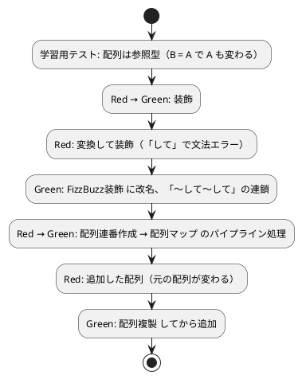

# 第 11 章: 不変データとパイプライン処理

## 11.1 はじめに

前章では、関数を値として渡す高階関数と、2 つの関数をつなぐ関数合成を学びました。この章では、データを段階的に変換していく **パイプライン処理** と、元のデータを書き換えない **不変データ** の扱いを学びます。

なでしこ3 には、他の言語にはない強力なパイプラインの書き方があります。それは日本語そのものです。`Nを文字列変換して戻す` のように「〜して」で命令をつなげると、前の命令の結果が次の命令に渡されます。一方で、なでしこ3 の配列は **参照型** で、うっかりすると元のデータを書き換えてしまいます。本章ではその両面を TDD で確かめます。

### この章で学ぶこと

- なでしこ3 の配列は参照型であること（学習用テスト）
- 文字列を装飾する `装飾`
- 「〜して〜して」の連鎖による変換と装飾のパイプライン（`FizzBuzz装飾`）
- 識別子に「して」を含めると壊れる理由
- `配列連番作成` → `配列マップ` のパイプライン処理（`パイプライン処理`）
- `配列複製` で元の配列を変えずに要素を追加する `追加した配列`

## 11.2 不変データの原則と、なでしこ3 の配列

**不変データ**（immutable data）とは、一度作ったら中身を変えないデータのことです。変換のたびに新しい値を作り、元の値には手を触れません。「関数に渡した配列が、いつの間にか書き換わっていた」という副作用由来のバグを防げます。

なでしこ3 では、変数への再代入も配列への追加も自由にできます。言語が不変性を強制してくれるわけではないので、どこでデータが共有されるのかを知っておく必要があります。学習用テストで配列の振る舞いを確かめてみましょう。

```nako3
A = [1, 2]
B = A
Bに3を配列追加
Aを「,」で配列結合を表示
C = Aを配列複製
Cに4を配列追加
Aを「,」で配列結合を表示
Cを「,」で配列結合を表示
```

```bash
$ gonako run ref.nako3
1,2,3
1,2,3
1,2,3,4
```

`B = A` のあとで `B` に `3` を追加したのに、`A` を表示すると `1,2,3` になっています。`B = A` は配列をコピーするのではなく、**同じ配列を指す名前をもう一つ作る** だけだからです。これが参照型の振る舞いです。

一方、`配列複製` で作った `C` に `4` を追加しても、`A` は `1,2,3` のままでした。`配列複製` は中身を写した **新しい配列** を返すので、元の配列とは独立しています。なでしこ3 で不変データを扱うには、「元の配列には追加しない。必要なら複製してから追加する」という規律を、自分たちで守る必要があります。

## 11.3 TODO リストの更新

**TODO リスト**:

- [ ] 文字列を `[` と `]` で囲んで装飾する `装飾`
- [ ] FizzBuzz 変換してから装飾する `FizzBuzz装飾`
- [ ] 1 から N までを変換・装飾するパイプライン `パイプライン処理`
- [ ] 元の配列を変えずに要素を追加した新しい配列を返す `追加した配列`

実装は `src/pipeline.nako3` に置き、前章の `hof.nako3` を取り込みます。テストは `test/pipeline_test.nako3` に書きます。

## 11.4 装飾

### Red: 装飾のテスト

```nako3
!「./helper.nako3」を取り込む
!「../src/pipeline.nako3」を取り込む

「文字列を装飾する」と(「Fizz」を装飾)と「[Fizz]」で検証
テスト結果報告
```

```nako3
# 不変データとパイプライン処理
!「./hof.nako3」を取り込む
```

```bash
$ gonako run test/pipeline_test.nako3
  NG: 文字列を装飾する: ASSERT失敗: 『undefined』と『string』が一致しません。
  0件成功、1件失敗
[実行時エラー]test/pipeline_test.nako3(20行目): 1件のテストが失敗しました
```

### Green: 装飾の実装

```nako3
●(文字列を)装飾
    「[{文字列}]」を戻す
ここまで
```

```bash
$ gonako run test/pipeline_test.nako3
  ok: 文字列を装飾する
  1件成功、0件失敗
```

`「[{文字列}]」` は文字列の中に `{変数名}` で値を埋め込む書き方です。受け取った `文字列` を変更するのではなく、新しい文字列を作って返しています。

## 11.5 「〜して〜して」によるパイプライン

### Red: 変換してから装飾するテスト

次は、FizzBuzz 変換の結果を装飾する関数です。テストと関数の名前を、やっていることそのままに「変換して装飾」としてみました。

```nako3
「文字列を装飾する」と(「Fizz」を装飾)と「[Fizz]」で検証
「変換してから装飾する」と(15を変換して装飾)と「[FizzBuzz]」で検証
テスト結果報告
```

```nako3
# 不変データとパイプライン処理
!「./hof.nako3」を取り込む

●(文字列を)装飾
    「[{文字列}]」を戻す
ここまで

●(Nを)変換して装飾
    NをFizzBuzz変換して装飾して戻す
ここまで
```

```bash
$ gonako run test/pipeline_test.nako3
[文法エラー].../src/pipeline.nako3(10行目): 構文解析でエラー。『ここまで』の使い方が間違っています。
```

（パスの前半は省略しています。）

テストが失敗する以前に、関数定義そのものが文法エラーになりました。なでしこ3 では、ひらがなの「して」は **命令をつなぐ語** です。`変換して装飾` という名前は「`変換` して `装飾`」と分割されて読まれてしまい、関数定義として成り立たなくなります。識別子に助詞や「して」を含めてはいけない、というなでしこ3 の制約です。

### Green: FizzBuzz装飾に改名する

名前から「して」を取り除き、`FizzBuzz装飾` とします。テストの呼び出しも `(15をFizzBuzz装飾)` に合わせます。

```nako3
●(Nを)FizzBuzz装飾
    NをFizzBuzz変換して装飾して戻す
ここまで
```

```nako3
「文字列を装飾する」と(「Fizz」を装飾)と「[Fizz]」で検証
「変換してから装飾する」と(15をFizzBuzz装飾)と「[FizzBuzz]」で検証
テスト結果報告
```

```bash
$ gonako run test/pipeline_test.nako3
  ok: 文字列を装飾する
  ok: 変換してから装飾する
  2件成功、0件失敗
```

`NをFizzBuzz変換して装飾して戻す` は、次のように左から右へ読めます。

1. `N` を `FizzBuzz変換` する
2. その結果を `装飾` する
3. その結果を `戻す`

「〜して」でつながれた命令は、前の命令の結果を次の命令の引数として受け取ります。Unix のパイプ `|` や、他言語のメソッドチェーン、パイプ演算子に相当するものが、日本語の文として自然に書けるのです。入れ子の関数呼び出しで書いた場合と比べてみましょう。

```nako3
!「./pipeline.nako3」を取り込む
3をFizzBuzz変換して装飾して表示
装飾(FizzBuzz変換(5))を表示
15をFizzBuzz変換
それを表示
```

```bash
$ gonako run src/demo.nako3
[Fizz]
[Buzz]
FizzBuzz
```

`装飾(FizzBuzz変換(5))` は内側から外側へ読む必要がありますが、「〜して」の連鎖は処理の順番どおりに読めます。また、直前の命令の結果は `それ` という特別な変数に入っており、`15をFizzBuzz変換` のあとで `それを表示` と書くこともできます。「〜して」は、この `それ` を次の命令に受け渡す仕組みだと考えると分かりやすいでしょう。

前章の関数合成 `合成` が「関数をつないで新しい関数を作る」ものだったのに対し、「〜して」は「値を命令から命令へ流す」パイプラインです。

## 11.6 配列連番作成 → 配列マップのパイプライン

### Red: パイプライン処理のテスト

1 から N までの数を、変換・装飾した配列にします。

```nako3
「パイプラインで1から5を処理する」と(5までパイプライン処理を「,」で配列結合)と「[1],[2],[Fizz],[4],[Buzz]」で検証
```

```bash
$ gonako run test/pipeline_test.nako3
  ok: 文字列を装飾する
  ok: 変換してから装飾する
  NG: パイプラインで1から5を処理する: ASSERT失敗: 『undefined』と『[1],[2],[Fizz],[4],[Buzz]』が一致しません。
  2件成功、1件失敗
[実行時エラー]test/pipeline_test.nako3(20行目): 1件のテストが失敗しました
```

### Green: パイプライン処理の実装

```nako3
●(Nまで)パイプライン処理
    {関数}FizzBuzz装飾を(1からNまでの配列連番作成)へ配列マップ
ここまで
```

```bash
$ gonako run test/pipeline_test.nako3
  ok: 文字列を装飾する
  ok: 変換してから装飾する
  ok: パイプラインで1から5を処理する
  3件成功、0件失敗
```

`パイプライン処理` は次の段階で構成されています。

1. `1からNまでの配列連番作成` で `[1, 2, …, N]` を生成する
2. `{関数}FizzBuzz装飾` を `配列マップ` で各要素に適用する（各要素の中では、さらに「FizzBuzz変換して装飾して」のパイプラインが流れる）

`配列マップ` は元の配列を変更せず、**新しい配列** を返します。パイプラインのどの段も、前の段の出力を受け取って新しい値を作るだけで、元のデータには手を触れません。

## 11.7 追加した配列 — 配列複製による非破壊的な追加

最後に、11.2 節で確かめた参照型の問題に TDD で向き合います。配列に要素を追加した **新しい配列** を返し、元の配列は変えない関数を作ります。

### Red: 元の配列が変わってしまう

まず、`B = A` と同じ形の素朴な実装で試してみます。

```nako3
元 = [1, 2]
新 = 元に3を追加した配列
「新しい配列には追加されている」と(新を「,」で配列結合)と「1,2,3」で検証
「元の配列は変わらない」と(元を「,」で配列結合)と「1,2」で検証
テスト結果報告
```

```nako3
●(配列にXを)追加した配列
    新配列 = 配列
    新配列にXを配列追加
    新配列を戻す
ここまで
```

```bash
$ gonako run test/pipeline_test.nako3
  ok: 文字列を装飾する
  ok: 変換してから装飾する
  ok: パイプラインで1から5を処理する
  ok: 新しい配列には追加されている
  NG: 元の配列は変わらない: ASSERT失敗: 『1,2,3』と『1,2』が一致しません。
  4件成功、1件失敗
[実行時エラー]test/pipeline_test.nako3(20行目): 1件のテストが失敗しました
```

`新配列 = 配列` は、引数で受け取った配列と **同じ配列** を指すだけです。そのため `新配列` への追加が呼び出し元の `元` にも及び、`元` が `1,2,3` に変わってしまいました（Red）。「元の配列は変わらない」というテストを書いておいたからこそ、この副作用を捕まえられました。

### Green: 配列複製してから追加する

```nako3
●(配列にXを)追加した配列
    新配列 = 配列を配列複製
    新配列にXを配列追加
    新配列を戻す
ここまで
```

```bash
$ gonako run test/pipeline_test.nako3
  ok: 文字列を装飾する
  ok: 変換してから装飾する
  ok: パイプラインで1から5を処理する
  ok: 新しい配列には追加されている
  ok: 元の配列は変わらない
  5件成功、0件失敗
```

`配列を配列複製` で新しい配列を作ってから追加するので、元の配列は `1,2` のままです（Green）。関数の外から見れば、`追加した配列` は入力を変更せずに新しい値を返す **純粋な関数** として振る舞います。名前も「追加する」という動作ではなく「追加した配列」という **結果の名詞** にして、元の配列を変えないことを表しています。

## 11.8 命令型スタイルからの書き換え

第 1 部で作った `FizzBuzz配列作成` は、命令型のスタイルで書かれていました。

```nako3
●(Nまで)FizzBuzz配列作成
    結果 = []
    Iを1からNまで繰り返す
        結果に(IをFizzBuzz変換)を配列追加
    ここまで
    結果を戻す
ここまで
```

空の配列 `結果` を用意し、ループ変数 `I` を動かしながら `配列追加` で破壊的に更新していきます。これに対して、本章の `パイプライン処理` にはループ変数も、途中で書き換わる配列もありません。

```nako3
●(Nまで)パイプライン処理
    {関数}FizzBuzz装飾を(1からNまでの配列連番作成)へ配列マップ
ここまで
```

命令型が「どう計算するか（手順）」を書くのに対し、パイプラインは「何を計算するか（データの変換）」を書きます。可変の状態が減るほど、読みやすく、テストしやすくなります。ただし、なでしこ3 は不変性を言語として保証してくれません。`配列追加` のような破壊的な命令を使う場面では、`追加した配列` のように **複製してから変更する** ことを関数の中に閉じ込め、テストでその性質を守るのが実践的なやり方です。

## 11.9 TDD サイクル



## 11.10 各言語のパイプライン比較

| 概念 | なでしこ3 | Python | Prolog |
|------|-----------|--------|--------|
| パイプライン | 「〜して〜して」の連鎖 | ジェネレータ / 関数の入れ子 | `numlist` → `maplist` |
| 直前の結果 | `それ` | （なし） | 中間変数 |
| 範囲生成 | `配列連番作成` | `range` | `numlist/3` |
| 写像 | `配列マップ` | `map` / 内包表記 | `maplist/3` |
| 不変性 | 言語では保証しない（`配列複製` で規律を守る） | 非破壊的な `add()`（コピーを返す） | 単一化（言語の性質） |

## 11.11 まとめ

この章では以下のことを学びました。

- なでしこ3 の配列は **参照型** で、`B = A` のあとに `B` へ追加すると `A` も変わること
- `NをFizzBuzz変換して装飾して戻す` のように、「〜して」で命令をつなげる日本語のパイプライン
- 直前の結果が入る `それ` と、「して」を識別子に含めると文法エラーになる制約（`変換して装飾` → `FizzBuzz装飾`）
- `配列連番作成` → `配列マップ` による、元の配列を変更しないパイプライン処理
- `配列複製` してから追加する `追加した配列` と、元の配列が変わらないことを確かめるテスト

**TODO リスト**:

- [x] 文字列を `[` と `]` で囲んで装飾する `装飾`
- [x] FizzBuzz 変換してから装飾する `FizzBuzz装飾`
- [x] 1 から N までを変換・装飾するパイプライン `パイプライン処理`
- [x] 元の配列を変えずに要素を追加した新しい配列を返す `追加した配列`

```bash
$ git commit -am 'feat(nadesiko): パイプライン処理と非破壊的な配列追加を追加'
```

次章では、第 4 部の締めくくりとして、エラーを値として返す結果辞書と、動的型付け言語での型安全性を学びます。

### 実装

<details>
<summary>実装コード（src/pipeline.nako3）</summary>

```nako3
# 不変データとパイプライン処理
!「./hof.nako3」を取り込む

●(文字列を)装飾
    「[{文字列}]」を戻す
ここまで

●(Nを)FizzBuzz装飾
    NをFizzBuzz変換して装飾して戻す
ここまで

●(Nまで)パイプライン処理
    {関数}FizzBuzz装飾を(1からNまでの配列連番作成)へ配列マップ
ここまで

●(配列にXを)追加した配列
    新配列 = 配列を配列複製
    新配列にXを配列追加
    新配列を戻す
ここまで
```

</details>

<details>
<summary>テストコード（test/pipeline_test.nako3）</summary>

```nako3
!「./helper.nako3」を取り込む
!「../src/pipeline.nako3」を取り込む

「文字列を装飾する」と(「Fizz」を装飾)と「[Fizz]」で検証
「変換してから装飾する」と(15をFizzBuzz装飾)と「[FizzBuzz]」で検証
「パイプラインで1から5を処理する」と(5までパイプライン処理を「,」で配列結合)と「[1],[2],[Fizz],[4],[Buzz]」で検証

元 = [1, 2]
新 = 元に3を追加した配列
「新しい配列には追加されている」と(新を「,」で配列結合)と「1,2,3」で検証
「元の配列は変わらない」と(元を「,」で配列結合)と「1,2」で検証
テスト結果報告
```

</details>
