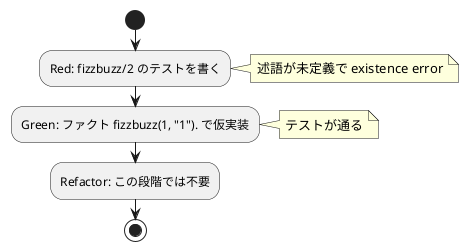

# 第 1 章: TODO リストと最初のテスト

## 1.1 はじめに

プログラムを作成するにあたって、まず何をすればよいでしょうか？私たちは、仕様を確認して **TODO リスト** を作るところから始めます。

> TODO リスト
>
> 何をテストすべきだろうか——着手する前に、必要になりそうなテストをリストに書き出しておこう。
>
> — テスト駆動開発

## 1.2 仕様の確認

今回取り組む FizzBuzz 問題の仕様は以下の通りです。

```
1 から 100 までの数をプリントするプログラムを書け。
ただし 3 の倍数のときは数の代わりに「Fizz」と、5 の倍数のときは「Buzz」とプリントし、
3 と 5 両方の倍数の場合には「FizzBuzz」とプリントすること。
```

この仕様をそのままプログラムに落とし込むには少しサイズが大きいですね。最初の作業は仕様を **TODO リスト** に分解する作業から着手しましょう。

## 1.3 TODO リストの作成

仕様を分解して TODO リストを作成します。

**TODO リスト**:

- [ ] 数を文字列にして返す
    - [ ] 1 を渡したら文字列 "1" を返す
- [ ] 3 の倍数のときは数の代わりに「Fizz」と返す
- [ ] 5 の倍数のときは「Buzz」と返す
- [ ] 3 と 5 両方の倍数の場合には「FizzBuzz」と返す
- [ ] 1 から 100 までの数
- [ ] プリントする

まず「1 を渡したら文字列 "1" を返す」という、最も小さなタスクから取り掛かります。

## 1.4 テスティングフレームワークの導入

### テストファースト

最初にプログラムする対象を決めたので、早速プロダクトコードを実装……ではなく **テストファースト** で作業を進めましょう。

> テストファースト
>
> いつテストを書くべきだろうか——それはテスト対象のコードを書く前だ。
>
> — テスト駆動開発

今回 Prolog のテスティングフレームワークには [plunit](https://www.swi-prolog.org/pldoc/package/plunit.html) を利用します。plunit は SWI-Prolog に標準で同梱されているユニットテストフレームワークで、`:- begin_tests(名前).` と `:- end_tests(名前).` でテストブロックを囲み、その中に `test(名前) :- ...` の形でテストを記述します。アサーションには `assertion/1` を使います。追加のライブラリをインストールする必要はありません。

### 開発環境のセットアップ

Nix 環境に入り、`apps/prolog` に SWI-Prolog（`swipl`）のプロジェクトを用意します。

```bash
# Nix 環境に入る
$ nix develop .#prolog

# プロジェクトディレクトリへ移動
$ cd apps/prolog
```

ディレクトリ構成は、プロダクトコードを `src/`、テストコードを `test/` に置きます。テストファイルの拡張子は plunit の慣習にならって `.plt` とします。

テストの実行は `make test` で行います。`Makefile` は次のように、`test/` 配下の `.plt` をまとめて読み込むランナー `test/run.pl` を呼び出します。

```makefile
# Makefile
test:
	swipl -q test/run.pl
```

ランナー `test/run.pl` は、`test/` 配下の全 `.plt` を読み込んでから `run_tests/0` で plunit をまとめて実行します。

```prolog
% test/run.pl
:- initialization(main, main).

main :-
    expand_file_name('test/*.plt', Files),
    forall(member(F, Files), consult(F)),
    ( run_tests -> halt(0) ; halt(1) ).
```

- `swipl -q` — バナー表示を抑制して SWI-Prolog を起動します。
- `expand_file_name/2` — `test/*.plt` のワイルドカードを実ファイル名のリストに展開します。
- `run_tests/0` — 読み込んだ plunit のテストをすべて実行し、成功なら `true` を返します。

## 1.5 最初のテスト（Red）

「1 を渡したら文字列 "1" を返す」テストを書きます。テスト対象となる述語 `fizzbuzz/2` はまだ存在しませんが、テストファーストなので先にテストを書きます。

> アサートファースト
>
> いつアサーションを書くべきだろうか——最初に書こう。
>
> — テスト駆動開発

`test/fizzbuzz.plt`:

```prolog
:- use_module('../src/fizzbuzz').

:- begin_tests(fizzbuzz).

test(returns_number_otherwise) :-
    fizzbuzz(1, R),
    assertion(R == "1").

:- end_tests(fizzbuzz).
```

Prolog ならではのポイントを確認しましょう。

- `fizzbuzz(1, R)` — Prolog には関数の「戻り値」という概念がありません。代わりに述語 `fizzbuzz(+N, -Result)` を呼び出し、第 1 引数 `N` に入力の `1` を渡し、第 2 引数 `Result` を **単一化**（変数 `R` への束縛）で受け取ります。呼び出しが成功すると `R` に結果の文字列が束縛されます。
- `assertion(R == "1")` — `R` が文字列 `"1"` と一致することを表明します。`==` は完全一致（同一性）の比較です。表明が偽ならテストは失敗します。
- `"1"` は SWI-Prolog の **string 型**（ダブルクォート）です。シングルクォートの `'1'` は atom、ダブルクォートの `"1"` は string と、別の型である点に注意してください。
- `:- use_module('../src/fizzbuzz').` — テスト対象の述語 `fizzbuzz/2` をプロダクトコードから読み込みます。

この時点でテストを実行すると、述語 `fizzbuzz/2` がまだ定義されていないため **existence error**（存在エラー）で失敗します（Red）。

```bash
$ make test
Warning: .../test/fizzbuzz.plt:... test returns_number_otherwise: received error
Warning: Unknown procedure: fizzbuzz/2
```

Prolog は **動的型付け** の言語で、テストの失敗は主に 2 つの形で現れます。1 つは今回のように **述語が未定義** のために起きる existence error、もう 1 つは述語はあるものの結果が期待と食い違う **単一化の失敗**（`assertion/1` が偽になる）です。述語が存在しないというエラーも、立派な Red です。

## 1.6 最小実装（Green）

テストを通す最小限のコードを書きます。TODO リストの最初の項目は「1 を渡したら "1" を返す」だけなので、素直に `"1"` を返す **仮実装** で構いません。

> 仮実装を経て本実装へ
>
> 失敗するテストを書いてから、最初に行う実装はどのようなものだろうか——ベタ書きの値を返そう。
>
> — テスト駆動開発

Prolog では、この仮実装をなんと **ファクト（事実）** 一行で書けます。

`src/fizzbuzz.pl`:

```prolog
:- module(fizzbuzz, [fizzbuzz/2]).

fizzbuzz(1, "1").
```

ここで Prolog 特有のポイントに触れます。

- `:- module(fizzbuzz, [fizzbuzz/2]).` — このファイルをモジュール `fizzbuzz` として宣言し、述語 `fizzbuzz/2` を外部に公開します。`fizzbuzz/2` は「アリティ（引数の数）が 2 の述語 `fizzbuzz`」を表す記法です。
- `fizzbuzz(1, "1").` — これは **ルール**（`:- ...` を持つ節）ではなく、本体を持たない **ファクト** です。「`fizzbuzz(1, "1")` は無条件に真である」と宣言しています。呼び出し側が `fizzbuzz(1, R)` と問い合わせると、Prolog は `1` を第 1 引数と単一化し、第 2 引数の `"1"` を変数 `R` に束縛して成功します。
- 関数の戻り値を書くのではなく「入力と出力の **関係** を事実として宣言する」——これが Prolog らしい仮実装です。ちょうどベタ書きの値を返すのと同じ効果を、宣言的に表現できます。

なお、他の数値を文字列化して返す場合は `format(string(R), "~w", [N])` のように `format/3` で数値 `N` を string 型に変換できます。次章以降でこのファクトを一般化する際に用いますが、この段階では不要です。

テストを実行します。

```bash
$ make test
% PL-Unit: fizzbuzz . done
% All 1 tests passed
```

この章までのテストが通りました（Green）。こんなベタ書きのプログラムでいいの？と思われるかもしれませんが、この細かいステップに今しばらくお付き合いください。

### TDD サイクル



## 1.7 TODO リストの更新

最初のタスクが完了しました。TODO リストを更新します。

**TODO リスト**:

- [ ] 数を文字列にして返す
    - [x] 1 を渡したら文字列 "1" を返す
- [ ] 3 の倍数のときは数の代わりに「Fizz」と返す
- [ ] 5 の倍数のときは「Buzz」と返す
- [ ] 3 と 5 両方の倍数の場合には「FizzBuzz」と返す
- [ ] 1 から 100 までの数
- [ ] プリントする

ここまでの作業をバージョン管理システムにコミットしておきましょう。

```bash
$ git add .
$ git commit -m 'test(prolog): 数を文字列にして返す'
```

## 1.8 まとめ

この章では以下のことを学びました。

- **TODO リスト** で仕様をプログラミング対象に分解する方法
- **テストファースト** で最初にテストを書く考え方
- plunit を使った Prolog のテスト実行環境（`begin_tests`/`end_tests`/`test`/`assertion`、`make test`）のセットアップ
- Prolog では述語 `fizzbuzz(+N, -Result)` の第 2 引数を **単一化** で返し、関数の戻り値という概念を持たないこと
- Prolog は動的型付けで、Red は「述語が未定義（existence error）」または「単一化の失敗」として現れること
- **仮実装** を **ファクト**（事実）一行 `fizzbuzz(1, "1").` で宣言的に書く手法
- **アサートファースト** で `assertion/1` のアサーションから書き始めるアプローチ
- SWI-Prolog の string 型（ダブルクォート）と、`format(string(R), "~w", [N])` による数値の文字列化

次章では、このファクトによる仮実装を **三角測量** によって一般化していきます。

### 実装

<details>
<summary>実装コード（src/fizzbuzz.pl）</summary>

```prolog
:- module(fizzbuzz, [fizzbuzz/2]).

fizzbuzz(1, "1").
```

</details>

<details>
<summary>テストコード（test/fizzbuzz.plt）</summary>

```prolog
:- use_module('../src/fizzbuzz').

:- begin_tests(fizzbuzz).

test(returns_number_otherwise) :-
    fizzbuzz(1, R),
    assertion(R == "1").

:- end_tests(fizzbuzz).
```

</details>
