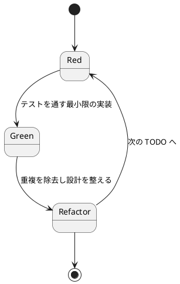

# 第 2 章: 仮実装と三角測量

## 2.1 はじめに

前章では、FizzBuzz の仕様を TODO リストに分解し、最初のテストを仮実装で通しました。この章では、**三角測量** によってプログラムを一般化し、さらに FizzBuzz のコアロジックを実装していきます。

Prolog では、まず具体的な **ファクト**（fact）で仮実装し、テストが増えたところで複数の **節**（clause）と `mod` 演算による一般化へ進めていきます。

**TODO リスト**:

- [ ] 数を文字列にして返す
    - [x] 1 を渡したら文字列 "1" を返す
    - [ ] 2 を渡したら文字列 "2" を返す
- [ ] 3 の倍数のときは数の代わりに「Fizz」と返す
- [ ] 5 の倍数のときは「Buzz」と返す
- [ ] 3 と 5 両方の倍数の場合には「FizzBuzz」と返す
- [ ] 1 から 100 までの数
- [ ] プリントする

## 2.2 三角測量

1 を渡したら文字列 "1" を返すようにできました。前章の実装は引数を無視してファクトで `"1"` を返すだけの仮実装です。では、2 を渡したらどうなるでしょうか？

### Red: 2 つ目のテストを書く

plunit では、期待する結果を `assertion/1` で検証します。テストは次の形で記述します。

```prolog
test(returns_number_otherwise) :-
    fizzbuzz(1, R),
    assertion(R == "1").
```

ここでもう 1 つ、2 を渡したケースのテストを加えて実行します。ファクトによる仮実装は `1` に対する結果しか持たないため、`fizzbuzz(2, R)` は解が得られず失敗します。

```bash
$ swipl -g run_tests -t halt test/fizzbuzz.plt
ERROR: fizzbuzz:2 test failed
```

テストが失敗しました。`fizzbuzz(1, "1").` というファクトしか持たないプログラムなのですから当然です。

### Green: 一般化する

2 つ以上の例が揃ったので、ファクトの列挙をやめて **一般化** します。任意の数値 `N` を文字列に変換して返すよう、`format/3` を使って `Result` を組み立てます。

```prolog
fizzbuzz(N, Result) :- format(string(Result), "~w", [N]).
```

`format(string(Result), "~w", [N])` は、書式 `~w` に `N` を適用した結果を文字列として `Result` に束縛します。`~w` は「write と同じ表現」を意味し、整数 `N` をそのまま文字列化します。

ここで重要なのは、Prolog の `=` は **単一化**（unification）であって算術評価ではないという点です。`Result = N` と書いても `Result` が「数値そのもの」に束縛されるだけで、文字列 `"1"` にはなりません。算術評価や書式付き変換を行うには `format/3`（や後述の `is/2`）といった述語を明示的に使う必要があります。

テストを実行します。

```bash
$ swipl -g run_tests -t halt test/fizzbuzz.plt
% PL-Unit: fizzbuzz .. done
% All 2 tests passed
```

この章までのテストが通りました。2 つ目のテストによって `fizzbuzz/2` の一般化を実現できました。このようなアプローチを **三角測量** と言います。

> 三角測量
>
> テストから最も慎重に一般化を引き出すやり方はどのようなものだろうか——2 つ以上の例があるときだけ、一般化を行うようにしよう。
>
> — テスト駆動開発

Ruby では `n.to_s`、Kotlin では `n.toString()` と書くところを、Prolog では `format(string(Result), "~w", [N])` で文字列を組み立てます。Prolog には「値を返す関数」という概念がなく、述語の引数を **単一化** で結び付けるのが基本スタイルである点が特徴です。

**TODO リスト**:

- [x] 数を文字列にして返す
    - [x] 1 を渡したら文字列 "1" を返す
    - [x] 2 を渡したら文字列 "2" を返す
- [ ] 3 の倍数のときは数の代わりに「Fizz」と返す
- [ ] 5 の倍数のときは「Buzz」と返す
- [ ] 3 と 5 両方の倍数の場合には「FizzBuzz」と返す
- [ ] 1 から 100 までの数
- [ ] プリントする

## 2.3 3 の倍数 — Fizz

次は「3 の倍数のときは数の代わりに Fizz と返す」に取り掛かります。

### Red: 3 の倍数のテスト

```prolog
test(returns_fizz_for_multiple_of_3) :-
    fizzbuzz(3, R),
    assertion(R == "Fizz").
```

```bash
$ swipl -g run_tests -t halt test/fizzbuzz.plt
ERROR: fizzbuzz:returns_fizz_for_multiple_of_3 failed
    assertion failed: R == "Fizz" (R = "3")
```

`fizzbuzz(3, R)` は一般化した節にマッチし、"3" を返してしまいました。

### Green: 節を追加する

3 の倍数のときは "Fizz" を返す **節** を追加します。剰余は算術述語 `is/2` と `mod` 演算子で求めます。

```prolog
fizzbuzz(N, "Fizz")  :- 0 is N mod 3.
fizzbuzz(N, Result)  :- format(string(Result), "~w", [N]).
```

`0 is N mod 3` は「`N` を 3 で割った剰余が 0 である」というガード条件です。`is/2` は右辺の式を **算術評価** し、その結果を左辺と単一化します。ここでも `=` ではなく `is` を使う点が要です。`0 = N mod 3` と書くと、`N mod 3` は評価されず「`mod` という項」との単一化になってしまい、意図した剰余判定になりません。算術評価が必要な場面では必ず `is/2` を使います。

Prolog は上の節から順に照合を試み、ガードが成立した最初の節を採用します。3 の倍数なら 1 つ目の節が成立して "Fizz" を返し、そうでなければ 2 つ目の節にフォールバックします。これは Kotlin の `when` 式で分岐を上から評価するのと同じ考え方です。

```bash
$ swipl -g run_tests -t halt test/fizzbuzz.plt
% All 3 tests passed
```

テストが通りました。

**TODO リスト**:

- [x] 数を文字列にして返す
- [x] 3 の倍数のときは数の代わりに「Fizz」と返す
- [ ] 5 の倍数のときは「Buzz」と返す
- [ ] 3 と 5 両方の倍数の場合には「FizzBuzz」と返す
- [ ] 1 から 100 までの数
- [ ] プリントする

## 2.4 5 の倍数 — Buzz

### Red: 5 の倍数のテスト

```prolog
test(returns_buzz_for_multiple_of_5) :-
    fizzbuzz(5, R),
    assertion(R == "Buzz").
```

```bash
$ swipl -g run_tests -t halt test/fizzbuzz.plt
ERROR: fizzbuzz:returns_buzz_for_multiple_of_5 failed
    assertion failed: R == "Buzz" (R = "5")
```

### Green: Buzz の節を追加する

5 の倍数の節を追加します。

```prolog
fizzbuzz(N, "Fizz")  :- 0 is N mod 3.
fizzbuzz(N, "Buzz")  :- 0 is N mod 5.
fizzbuzz(N, Result)  :- format(string(Result), "~w", [N]).
```

```bash
$ swipl -g run_tests -t halt test/fizzbuzz.plt
% All 4 tests passed
```

**TODO リスト**:

- [x] 数を文字列にして返す
- [x] 3 の倍数のときは数の代わりに「Fizz」と返す
- [x] 5 の倍数のときは「Buzz」と返す
- [ ] 3 と 5 両方の倍数の場合には「FizzBuzz」と返す
- [ ] 1 から 100 までの数
- [ ] プリントする

## 2.5 15 の倍数 — FizzBuzz

### Red: 15 の倍数のテスト

```prolog
test(returns_fizzbuzz_for_multiple_of_15) :-
    fizzbuzz(15, R),
    assertion(R == "FizzBuzz").
```

```bash
$ swipl -g run_tests -t halt test/fizzbuzz.plt
ERROR: fizzbuzz:returns_fizzbuzz_for_multiple_of_15 failed
    assertion failed: R == "FizzBuzz" (R = "Fizz")
```

15 は 3 の倍数でもあるため、"Fizz" が返されてしまいました。節は上から順に照合されるので、3 の倍数の節に先にマッチしてしまいます。3 と 5 の両方の倍数（つまり 15 の倍数）の判定を **先に** 行う必要があります。

### Green: 節の順序を修正する

最も限定的な条件である 15 の倍数の節を先頭に配置します。

```prolog
fizzbuzz(N, "FizzBuzz") :- 0 is N mod 15, !.
fizzbuzz(N, "Fizz")     :- 0 is N mod 3, !.
fizzbuzz(N, "Buzz")     :- 0 is N mod 5, !.
fizzbuzz(N, Result)     :- format(string(Result), "~w", [N]).
```

各節の末尾に付けた `!` は **カット**（cut）です。カットは「この節で解が得られたら、以降の節へのバックトラックを打ち切る」ことを Prolog に指示します。カットを入れることで、`fizzbuzz(15, R)` は 1 つ目の節で "FizzBuzz" を返した時点で確定し、後続の "Fizz" や "Buzz" の節を試みなくなります。

カットがない場合、`fizzbuzz(3, R)` に対してバックトラックすると 4 つ目の節も成立し、"3" という別解が得られてしまいます。FizzBuzz 変換は 1 入力に対して 1 出力の **決定的**（deterministic）な述語であってほしいので、カットで解を一意に確定させます。

節を上から順に評価し、限定的な条件を先に置くという発想は Kotlin の `when` 式でガード条件を並べる順序と同じですが、Prolog では加えて **カットによる決定性の制御** が必要になる点が特徴です。

```bash
$ swipl -g run_tests -t halt test/fizzbuzz.plt
% All 5 tests passed
```

この章までのテストが通りました。

**TODO リスト**:

- [x] 数を文字列にして返す
- [x] 3 の倍数のときは数の代わりに「Fizz」と返す
- [x] 5 の倍数のときは「Buzz」と返す
- [x] 3 と 5 両方の倍数の場合には「FizzBuzz」と返す
- [ ] 1 から 100 までの数
- [ ] プリントする

ここまでの作業をコミットしておきましょう。

```bash
$ git add .
$ git commit -m 'feat(prolog): FizzBuzz のコアロジックを実装'
```

## 2.6 TDD サイクル

ここまで繰り返してきた作業は、次の TDD サイクルに沿っています。



- **Red**: 失敗するテストを 1 つ書く（例: 2、3、5、15 のケース）
- **Green**: テストを通す最小限の実装を行う（ファクト → 一般化 → 節の追加 → 順序の修正）
- **Refactor**: 重複や不明確さを取り除く（カットによる決定性の確保、節の並び順）

三角測量では、Red で 2 つ目の例を用意した時点で初めて一般化に踏み切りました。1 つの例だけでは仮実装で十分であり、例が 2 つ以上揃ってから一般化するというリズムが、過剰な設計を避けつつ着実に前進させます。

## 2.7 まとめ

この章では以下のことを学びました。

- **三角測量** で 2 つ以上の例を使ってプログラムを一般化する手法
- **ファクト** による仮実装から、複数の **節**（clause）による一般化への移行
- `format(string(Result), "~w", [N])` による整数から文字列への変換
- `is/2` と `mod` による剰余の算術評価
- `=`（**単一化**）と `is`（**算術評価**）の違い
- 節の **照合順序** の重要性（限定的な条件を先に配置）
- **カット**（`!`）による決定性の制御（1 入力 1 出力の述語にする）
- Kotlin の `when` 式との対比（Prolog では順序に加えてカットで解を確定させる）

次章では、残りの TODO（リスト生成とプリント）を実装し、リファクタリングで「動作するきれいなコード」を目指します。

### 実装

<details>
<summary>実装コード（src/fizzbuzz.pl）</summary>

```prolog
:- module(fizzbuzz, [fizzbuzz/2]).

%% fizzbuzz(+N:integer, -Result:string) is det.
%
%  数 N を FizzBuzz 変換した文字列 Result を返す。
%  3 の倍数は "Fizz"、5 の倍数は "Buzz"、両方の倍数は "FizzBuzz"、
%  それ以外は数値そのものを文字列化して返す。

fizzbuzz(N, "FizzBuzz") :- 0 is N mod 15, !.
fizzbuzz(N, "Fizz")     :- 0 is N mod 3, !.
fizzbuzz(N, "Buzz")     :- 0 is N mod 5, !.
fizzbuzz(N, Result)     :- format(string(Result), "~w", [N]).
```

</details>

<details>
<summary>テストコード（test/fizzbuzz.plt）</summary>

```prolog
:- use_module('../src/fizzbuzz').

:- begin_tests(fizzbuzz).

test(returns_fizz_for_multiple_of_3) :-
    fizzbuzz(3, R),
    assertion(R == "Fizz").

test(returns_buzz_for_multiple_of_5) :-
    fizzbuzz(5, R),
    assertion(R == "Buzz").

test(returns_fizzbuzz_for_multiple_of_15) :-
    fizzbuzz(15, R),
    assertion(R == "FizzBuzz").

test(returns_number_otherwise) :-
    fizzbuzz(1, R),
    assertion(R == "1").

:- end_tests(fizzbuzz).
```

</details>
