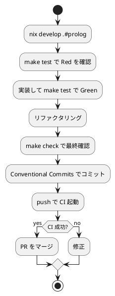

# 第 6 章: タスクランナーと CI/CD

## 6.1 はじめに

前章では SWI-Prolog のパッケージ管理と静的解析（lint）を導入しました。テスト、lint、実行と様々なコマンドを使えるようになりましたが、毎回 `swipl ...` を手打ちするのは手間がかかり、コマンドの記憶違いも起こります。

この章では、Makefile によるタスク集約、Nix 開発環境、GitHub Actions を使って、Prolog プロジェクトの開発タスクを自動化し、**CI/CD** パイプラインを構築します。

## 6.2 Nix による開発環境

Prolog の開発に必要なのは基本的に **SWI-Prolog** です。これを Nix で管理し、環境を再現可能にします。

```bash
# Nix 環境に入る
$ nix develop .#prolog
```

この環境（`ops/nix/environments/prolog/shell.nix`）は、`swi-prolog` を提供します。

```nix
{ packages ? import <nixpkgs> {} }:
let
  baseShell = import ../../shells/shell.nix { inherit packages; };
in
packages.mkShell {
  inherit (baseShell) pure;
  buildInputs = baseShell.buildInputs ++ (with packages; [
    swi-prolog
  ]);
  shellHook = ''
    ${baseShell.shellHook}
    echo "Prolog development environment activated"
    echo "  - SWI-Prolog: $(swipl --version)"
    echo "  使い方: cd apps/prolog && make test   （= swipl -g run_tests でユニットテスト）"
  '';
}
```

開発者ごとの SWI-Prolog バージョンの差異をなくすことで、「自分の環境では動く」問題を防ぎます。

## 6.3 Makefile によるタスク管理

`apps/prolog/Makefile` に、日常的に使うタスクを定義します。`swipl ...` を短いコマンドに集約します。

```makefile
.PHONY: all test check lint run clean

all: check

# test/ 配下の全 .plt を読み込んで plunit を実行する
test:
	swipl -q test/run.pl

# 構文・特異点（singleton 変数など）を検査する
lint:
	@for f in src/*.pl; do \
		swipl -q -g "halt(0)" -t "halt(1)" "$$f" || exit 1; \
	done
	@echo "lint: OK"

check: lint test

run:
	swipl -q -g "main, halt(0)" -t "halt(1)" src/main.pl

clean:
	@echo "nothing to clean"
```

### 各タスクの説明

| タスク | 内容 |
|--------|------|
| `make test` | `test/run.pl` 経由で `test/*.plt` を一括ロードし plunit を実行する |
| `make lint` | `src/*.pl` を読み込み、構文エラーや singleton 変数などを検査する |
| `make check` | `lint` と `test` をまとめて実行する |
| `make run` | `src/main.pl` の `main` を実行する |
| `make clean` | 削除対象の成果物はないため何もしない |

`make all`（既定ターゲット）は `check` を実行します。

## 6.4 test runner の仕組み

Prolog のテスト実行には、他言語にはない固有の事情があります。

SWI-Prolog をスクリプトモードで起動すると、**コマンドライン引数の最初のファイルだけをスクリプトとして読み込む**仕様になっています。つまり `swipl test/foo.plt test/bar.plt` のように複数の `.plt` を並べても、最初の 1 本しか実行されません。テストファイルが増えるたびにコマンドを書き換えるのは現実的ではありません。

そこでこのプロジェクトでは、`test/*.plt` を一括ロードしてから `run_tests` を呼ぶ **test runner**（`test/run.pl`）を採用しました。

```prolog
% test/ 配下の全 .plt を読み込んで plunit をまとめて実行するランナー。
:- initialization(main, main).

main :-
    expand_file_name('test/*.plt', Files),
    forall(member(F, Files), consult(F)),
    ( run_tests -> halt(0) ; halt(1) ).
```

### ランナーの流れ

- `expand_file_name('test/*.plt', Files)` -- グロブパターンを展開し、`test/` 配下の全 `.plt` ファイルを `Files` に集める
- `forall(member(F, Files), consult(F))` -- 集めたファイルを一つずつ `consult`（ロード）し、各 `.plt` 内の plunit テストブロックを登録する
- `run_tests` -- 登録された全テストを実行する
- `( run_tests -> halt(0) ; halt(1) )` -- 全テスト成功なら終了コード 0、失敗が一つでもあれば 1 で終了する

Makefile の `test` ターゲットが `swipl -q test/run.pl` としてこのランナーを起動するため、テストファイルを増やしても Makefile や CI を変更する必要はありません。`.plt` を `test/` に追加するだけで、次回の `make test` から自動的に対象になります。

## 6.5 GitHub Actions による CI/CD

プッシュやプルリクエスト時に自動で品質チェックを実行する CI/CD パイプラインを構築します。ワークフローは `.github/workflows/prolog-ci.yml` に定義し、既存の Haskell・Scala・Kotlin の CI と同型で Nix に対応させます。

```yaml
# .github/workflows/prolog-ci.yml
name: Prolog CI

on:
  push:
    branches: [main, develop]
    paths:
      - "apps/prolog/**"
      - ".github/workflows/prolog-ci.yml"
      - "ops/nix/environments/prolog/shell.nix"
  pull_request:
    branches: [main]
    paths:
      - "apps/prolog/**"
      - ".github/workflows/prolog-ci.yml"
      - "ops/nix/environments/prolog/shell.nix"

permissions:
  contents: read

jobs:
  build-and-test:
    runs-on: ubuntu-latest

    steps:
      - name: Checkout the repository
        uses: actions/checkout@v4

      - name: Install Nix
        uses: cachix/install-nix-action@v30
        with:
          nix_path: nixpkgs=channel:nixos-unstable

      - name: Cache Nix store
        uses: actions/cache@v4
        with:
          path: /tmp/nix-cache
          key: ${{ runner.os }}-nix-prolog-${{ hashFiles('flake.lock', 'ops/nix/environments/prolog/shell.nix') }}
          restore-keys: |
            ${{ runner.os }}-nix-prolog-

      - name: Lint
        run: nix develop .#prolog --command bash -c "cd apps/prolog && make lint"

      - name: Test
        run: nix develop .#prolog --command bash -c "cd apps/prolog && make test"
```

### ワークフローのポイント

| 設定 | 説明 |
|------|------|
| `paths` フィルター | `apps/prolog/**` などに変更があった場合のみ実行 |
| Nix 環境 | `nix develop .#prolog` で SWI-Prolog を一貫させる |
| キャッシュ | Nix ストアをキャッシュして CI を高速化 |
| `make lint` | `src/*.pl` の構文・特異点を検査し、違反があればワークフローが落ちる |
| `make test` | `test/*.plt` を一括実行し、失敗すればワークフローが落ちる |

CI のステップはローカルの Makefile ターゲットをそのまま呼び出します。`nix develop .#prolog --command bash -c "cd apps/prolog && make lint"` のように、Nix 環境に入ってから `make` を実行するため、ローカルと CI で全く同じコマンド・同じ SWI-Prolog が使われます。「ローカルで通ったのに CI で落ちる」ことがなくなります。

### トリガー条件

- `push`（`main` / `develop`） -- 主要ブランチへの反映時に検証
- `pull_request`（`main`） -- PR 作成・更新時に検証

PR の段階で lint とテストが自動実行されるため、壊れたコードがマージされることを防げます。

## 6.6 品質ゲートの統合

CI では `make lint` と `make test` を独立したステップに分けています。`make check`（= `lint test`）を使えば、この 2 つを 1 コマンドでまとめて検証できます。

```bash
$ make check
lint: OK

% ... plunit の結果 ...
```

これにより、CI が通る条件は「構文・特異点の検査を通過し、全テストが通る」ことになります。この条件を満たさない変更はマージできない **品質ゲート** が完成します。

## 6.7 開発ワークフロー

ここまでの設定により、日常の開発は次の流れになります。



ローカルの `make check` と CI の検査を一致させておくことで、フィードバックを素早く得ながら安全に変更を積み上げられます。

### ツール一覧

| カテゴリ | ツール | 用途 |
|---------|--------|------|
| テスト | plunit（SWI-Prolog 標準） | テスト実行 |
| test runner | `test/run.pl` | `test/*.plt` の一括ロードと実行 |
| パッケージ管理 | SWI-Prolog pack | 依存関係管理 |
| 静的解析 | swipl（構文・特異点検査） | コード品質チェック |
| タスクランナー | Make | タスク自動化 |
| 開発環境 | Nix | 再現可能な SWI-Prolog |
| CI/CD | GitHub Actions | 継続的インテグレーション |

### 各言語の CI/CD 比較

| 項目 | Prolog | Kotlin | Ruby | Scala |
|------|--------|--------|------|-------|
| CI ツール | GitHub Actions | GitHub Actions | GitHub Actions | GitHub Actions |
| 環境管理 | Nix + SWI-Prolog | Nix + Gradle | Nix + Bundler | Nix + sbt |
| テスト | `make test` | `gradle test` | `bundle exec rake test` | `sbt test` |
| 品質チェック | `make check` | `gradle check` | `bundle exec rake check` | `sbt test` |
| タスクランナー | Make | Make + Gradle | Rake | sbt |

## 6.8 まとめ

この章では以下を学びました。

- Nix で SWI-Prolog を管理し、再現可能な開発環境を作る（`nix develop .#prolog`）
- Makefile で日常タスク（`test`, `lint`, `check`, `run`, `clean`）を短いコマンドに集約する
- `test/run.pl` で `test/*.plt` を一括ロードする test runner を用意する。SWI-Prolog が最初のファイルしかスクリプトとして読まない仕様に対処するための、このプロジェクト固有の工夫である
- GitHub Actions（`prolog-ci.yml`）で Nix 対応の CI を構築し、lint とテストを自動化する
- `make check` で構文・特異点検査とテストを **品質ゲート** にする

第 2 部（章 4〜6）を通じて、ソフトウェア開発の三種の神器を整備しました。

| 神器 | 導入したもの |
|------|------------|
| バージョン管理 | Git + Conventional Commits |
| テスティング | plunit + test runner（`test/run.pl`） |
| 自動化 | swipl lint + Make + GitHub Actions |

次の第 3 部では、追加仕様を題材にオブジェクト指向設計（カプセル化、ポリモーフィズム、デザインパターン）を Prolog の流儀で学びます。
