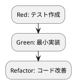

# 第 10 章: 高階述語と述語合成

## 10.1 はじめに

第 3 部ではポリモーフィズム・デザインパターン・SOLID 原則により FizzBuzz を構造化しました。この第 4 部では、Prolog の宣言的プログラミング機能を使ってコードをさらに柔軟にします。

Prolog はオブジェクト指向言語のような「第一級関数」を持ちませんが、**述語（ゴール）を引数として受け取り**、`call/N` で呼び出すことで同等の抽象化を実現できます。これが **高階述語** です。`maplist/3`・`include/3`・`foldl/4` といった標準ライブラリの高階述語を使い、本章では FizzBuzz に高階述語と述語合成を導入します。

### この章で学ぶこと

- 高階述語（`maplist` / `include` / `foldl`）
- `call/N` による述語の呼び出し
- ラムダ記法 `[X, Y]>>Goal`（`library(yall)`）
- 変換ルールを述語として受け取る `generate_with`
- `transform` と `filter_list` を組み合わせた加工パイプライン

## 10.2 高階述語とは

**高階述語** とは、述語（ゴール）を引数に取る述語のことです。Prolog では関数は第一級の値ではありませんが、述語名やゴールを項として引数に渡し、`call/N` で呼び出すことで「振る舞いをデータとして注入する」ことができます。

### maplist — リストの変換

```prolog
?- maplist([X, Y]>>(Y is X * X), [1,2,3,4,5], Rs).
Rs = [1, 4, 9, 16, 25].
```

`maplist/3` は「リストの各要素に述語を適用して新しいリストを作る」高階述語です。`[X, Y]>>(Y is X * X)` は `library(yall)` の **ラムダ記法** です。

### include — リストの絞り込み

```prolog
?- include([X]>>(0 is X mod 3), [1,2,3,4,5,6,7,8,9,10], Rs).
Rs = [3, 6, 9].
```

`include/3` は述語（真偽を判定するゴール）を受け取り、成功する要素だけを残します。

### foldl — リストの畳み込み

```prolog
?- foldl([X, A0, A1]>>(A1 is A0 + X), [1,2,3,4,5], 0, Sum).
Sum = 15.
```

`foldl/4` は初期値と三引数の述語を受け取り、リストを 1 つの値に畳み込みます。`maplist`・`include`・`foldl` は宣言的なリスト操作の基本三種であり、ほとんどのリスト操作はこの組み合わせで表現できます。

## 10.3 call/N とラムダ記法

Prolog には述語を値として渡す 2 つの書き方があります。

### call/N による部分適用

`call/N` はゴールに追加の引数を与えて呼び出します。述語名だけを渡し、`call/3` で 2 つの引数を補って呼び出せます。

```prolog
?- G = succ, call(G, 41, R).
R = 42.
```

述語名 `succ` をそのまま項として渡し、`call(G, 41, R)` で `succ(41, R)` を呼び出しています。これにより「どの述語を使うか」を外から差し替えられます。

### ラムダ記法

`library(yall)` を使うと、その場で無名のゴール（ラムダ）を書けます。`[引数...]>>Goal` の形です。

```prolog
?- call([N, R]>>format(string(R), "~w!", [N]), 7, R).
R = "7!".
```

`[N, R]>>format(string(R), "~w!", [N])` は「`N` を受け取り、`~w!` の形の文字列 `R` を返す」ラムダです。`call/3` が引数 `7` と結果変数を渡し、`N = 7`、`R = "7!"` に束縛されます。

Kotlin ではラムダ式 `{ x -> ... }` と関数参照 `::foo` の 2 種があり、いずれも `(Int) -> String` のような関数型の値でした。Prolog では述語名（項）とラムダ `[...]>>Goal` の 2 種で、いずれも `call/N` で一様に呼び出せます。

## 10.4 generate_with — 高階述語の実践

変換ルール自体を **述語として外から渡せる** ようにします。これにより FizzBuzz のルールを差し替え可能にします。

### TODO リストの更新

第 4 部の作業として TODO リストへ以下を追加します。

**TODO リスト**:

- [ ] 変換ルールを述語として受け取る `generate_with`
- [ ] 標準ルール `default_rule` を定義する
- [ ] カスタムルール（ラムダ）を渡せる
- [ ] リスト全体にルールを適用する `transform`
- [ ] 結果を述語で絞り込む `filter_list`

まず「変換ルールを述語として受け取る `generate_with`」から着手します。

### Red: カスタムルールのテスト

```prolog
:- use_module('../src/fizzbuzz_hof').

:- begin_tests(fizzbuzz_hof).

test(generate_with_default_rule) :-
    generate_with(default_rule, 15, R),
    assertion(R == "FizzBuzz").

test(generate_with_lambda_rule) :-
    generate_with([N, R]>>format(string(R), "~w!", [N]), 7, R),
    assertion(R == "7!").
```

### TDD サイクル



### Green: generate_with の実装

```prolog
:- module(fizzbuzz_hof, [generate_with/3, default_rule/2, transform/3, filter_list/3]).

%% generate_with(:Rule, +N:integer, -Result:string) is det.
%
%  変換ルールを述語（ゴール）として受け取り、数 N を変換する。
generate_with(Rule, N, Result) :-
    call(Rule, N, Result).

%% default_rule(+N:integer, -Result:string) is det.
%
%  標準の FizzBuzz ルール。
default_rule(N, "FizzBuzz") :- 0 is N mod 15, !.
default_rule(N, "Fizz")     :- 0 is N mod 3, !.
default_rule(N, "Buzz")     :- 0 is N mod 5, !.
default_rule(N, R)          :- format(string(R), "~w", [N]).
```

`generate_with/3` の第 1 引数 `Rule` は **呼び出すべきゴール** です。`call(Rule, N, Result)` で 2 つの引数を補い、実際のルールを実行します。標準ルール `default_rule` を渡せば通常の FizzBuzz に、`[N, R]>>...` のカスタムラムダを渡せば別のルールになります。振る舞いを項として注入できるのが高階述語の力です。

モジュール宣言のヘッド `:- module(...)` と述語指示子 `generate_with/3` の `:Rule` という記法は、その引数がモジュール修飾を受けるメタ述語引数であることを表します。

## 10.5 transform と filter_list

リスト全体にルールを適用する `transform` と、結果を絞り込む `filter_list` を実装します。

### Red: 加工パイプラインのテスト

```prolog
test(transform_maps_over_range) :-
    transform(default_rule, 5, Rs),
    assertion(Rs == ["1", "2", "Fizz", "4", "Buzz"]).

test(filter_list_keeps_matching) :-
    filter_list([X]>>(X == "Fizz"), ["1", "2", "Fizz", "4", "Buzz"], Ys),
    assertion(Ys == ["Fizz"]).

:- end_tests(fizzbuzz_hof).
```

`transform(default_rule, 5, Rs)` の結果は `["1", "2", "Fizz", "4", "Buzz"]` で、3 番目が `"Fizz"` です。`filter_list` にラムダ `[X]>>(X == "Fizz")` を渡すと、`"Fizz"` に一致する要素だけが残ります。

### Green: transform と filter_list の実装

```prolog
%% transform(:Rule, +N:integer, -Results:list) is det.
%
%  1 から N までのリストに変換ルールを適用する（maplist による高階処理）。
transform(Rule, N, Results) :-
    numlist(1, N, Ns),
    maplist(Rule, Ns, Results).

%% filter_list(:Pred, +Xs:list, -Ys:list) is det.
%
%  リストを述語で絞り込む（include による高階処理）。
filter_list(Pred, Xs, Ys) :-
    include(Pred, Xs, Ys).
```

`transform/3` は `numlist(1, N, Ns)` で `1..N` のリストを作り、`maplist(Rule, Ns, Results)` でルールを適用します。`filter_list/3` は `include(Pred, Xs, Ys)` で述語を満たす要素を残します。`transform` でルールを適用し、`filter_list` で絞り込む——高階述語を組み合わせた **加工パイプライン** が構築できました。

```bash
$ swipl -g run_tests -t halt test/fizzbuzz_hof.plt

% PL-Unit: fizzbuzz_hof .... done
% All 4 tests passed
```

## 10.6 各言語の高階抽象比較

| 概念 | Prolog | Kotlin | Ruby | Java |
|------|--------|--------|------|------|
| 無名の振る舞い | `[X, Y]>>Goal`（yall） | `{ x -> x * 2 }` | `->(x) { x * 2 }` / ブロック | ラムダ式 |
| 名前による参照 | 述語名（項） | `::foo` / `Type::foo` | `method(:foo)` | `Type::foo` |
| 高階処理 | `maplist` / `include` / `foldl` | `map` / `filter` / `fold` | `map` / `select` / `inject` | `Stream` API |
| 呼び出し | `call/N` | `(Int) -> String` の適用 | `.call` / `.()` | `.apply` |
| メタ引数記法 | `:Arg`（module 宣言） | 関数型 | Proc / Lambda | `Function<A,B>` |

## 10.7 まとめ

この章では以下を学びました。

- **高階述語**（`maplist` / `include` / `foldl`）によるリスト操作
- `call/N` による述語の呼び出しと、ラムダ記法 `[X, Y]>>Goal`
- 変換ルールを述語として注入する `generate_with`
- メタ述語引数 `:Rule` によるモジュール修飾
- `transform` と `filter_list` を組み合わせた加工パイプライン

**TODO リスト**:

- [x] 変換ルールを述語として受け取る `generate_with`
- [x] 標準ルール `default_rule` を定義する
- [x] カスタムルール（ラムダ）を渡せる
- [x] リスト全体にルールを適用する `transform`
- [x] 結果を述語で絞り込む `filter_list`

次章では、述語を組み合わせる **述語合成** と、宣言的な **パイプライン処理** を学びます。

<details>
<summary>実装コード</summary>

```prolog
:- module(fizzbuzz_hof, [generate_with/3, default_rule/2, transform/3, filter_list/3]).

%% generate_with(:Rule, +N:integer, -Result:string) is det.
%
%  変換ルールを述語（ゴール）として受け取り、数 N を変換する。
generate_with(Rule, N, Result) :-
    call(Rule, N, Result).

%% default_rule(+N:integer, -Result:string) is det.
%
%  標準の FizzBuzz ルール。
default_rule(N, "FizzBuzz") :- 0 is N mod 15, !.
default_rule(N, "Fizz")     :- 0 is N mod 3, !.
default_rule(N, "Buzz")     :- 0 is N mod 5, !.
default_rule(N, R)          :- format(string(R), "~w", [N]).

%% transform(:Rule, +N:integer, -Results:list) is det.
%
%  1 から N までのリストに変換ルールを適用する（maplist による高階処理）。
transform(Rule, N, Results) :-
    numlist(1, N, Ns),
    maplist(Rule, Ns, Results).

%% filter_list(:Pred, +Xs:list, -Ys:list) is det.
%
%  リストを述語で絞り込む（include による高階処理）。
filter_list(Pred, Xs, Ys) :-
    include(Pred, Xs, Ys).
```

</details>
