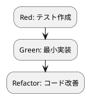

# 第 11 章: 不変データとパイプライン処理

## 11.1 はじめに

前章では高階述語でリストを加工しました。この章では、述語を組み合わせる **述語合成** と、**不変データ** を段階的に変換する **パイプライン処理** を学びます。あわせて Prolog の宣言的な性質がなぜ本質的に「不変」なのかを解説します。

### この章で学ぶこと

- 単一化と不変データ
- 述語合成（`compose`）
- 変換と装飾の合成（`convert_and_decorate`）
- `numlist` → `maplist` によるパイプライン処理（`process`）
- 命令型ループからの書き換え

## 11.2 不変データの原則

### 単一化による束縛

Prolog の変数は、単一化（unification）によって **一度だけ** 束縛されます。いったん値が決まった変数を、あとから別の値へ書き換えることはできません。多くの手続き型言語が持つ「破壊的代入」が Prolog には存在しないのです。

```prolog
?- X = 3, X = 3.
X = 3.

?- X = 3, X = 4.
false.
```

`X = 3` で `X` を `3` に束縛したあと、`X = 4` は「`3` と `4` を単一化する」ことになり失敗します。変数は箱ではなく、「まだ決まっていない値の名前」であり、いちど決まればそのままです。

この性質により、データは本質的に **不変**（immutable）です。ある述語に渡したリストが、呼び出しの副作用で書き換わることはありません。「どこかで知らないうちにデータが変わっていた」という副作用由来のバグが原理的に発生しないのです。

Ruby では `freeze` や `dup.freeze` で明示的に不変性を確保し、Kotlin では `val` と読み取り専用 `List` を選びました。Prolog では、追加の記述をいっさいせずとも、言語の宣言的な性質として不変性が保証されます。

## 11.3 述語合成

複数の変換をひとつの述語にまとめるのが **述語合成** です。`compose` を実装します。

### TODO リストの更新

**TODO リスト**:

- [ ] 2 つの述語を合成する `compose`
- [ ] 文字列を装飾する `decorate`
- [ ] convert と decorate を合成した `convert_and_decorate`
- [ ] パイプラインで 1..N を変換・装飾する `process`

### Red: decorate のテスト

まず装飾述語 `decorate` から始めます。

```prolog
test(decorate_wraps_in_brackets) :-
    decorate("Fizz", R),
    assertion(R == "[Fizz]").
```

### TDD サイクル



### Green: decorate の実装

```prolog
%% decorate(+S:string, -Decorated:string) is det.
%
%  文字列を括弧で装飾する。
decorate(S, Decorated) :-
    format(string(Decorated), "[~w]", [S]).
```

`decorate("Fizz", R)` は `R` を `"[Fizz]"` に束縛します。`format/3` の `string(Decorated)` 出力先を使い、`~w` に `S` を埋め込んで新しい文字列を生成します。入力 `S` は変更されません。

### compose の実装

続いて 2 つの述語を合成する `compose` を実装します。

```prolog
%% compose(:F, :G, +X, -Y) is det.
%
%  2 つの述語を合成する（F を適用してから G を適用）。
compose(F, G, X, Y) :-
    call(F, X, Tmp),
    call(G, Tmp, Y).
```

`compose(F, G, X, Y)` は「`F` を `X` に適用してから `G` を適用する」述語です。`call(F, X, Tmp)` で `F` を呼び出して中間値 `Tmp` を得て、`call(G, Tmp, Y)` で `G` を適用し最終結果 `Y` を得ます。これが関数合成の Prolog 版です。

高階言語の関数合成 `g(f(x))` に対応しますが、Prolog では述語を `call/N` で呼び出す点が特徴です。第 1 引数・第 2 引数の `F`・`G` には述語（の名前や部分適用）を渡します。中間結果を保持する `Tmp` も、いちど束縛されれば変わらない不変な値です。

## 11.4 変換と装飾の合成

FizzBuzz の変換に「装飾」を合成してみます。第 3 部で作った `fizzbuzz/2` を再利用します。

### Red: convert_and_decorate のテスト

```prolog
test(convert_and_decorate_composes) :-
    convert_and_decorate(3, R),
    assertion(R == "[Fizz]").
```

### Green: convert_and_decorate の実装

```prolog
%% convert_and_decorate(+N:integer, -Result:string) is det.
%
%  convert と decorate を合成した変換。
convert_and_decorate(N, Result) :-
    compose(fizzbuzz:fizzbuzz, decorate, N, Result).
```

`compose` の第 1 引数に `fizzbuzz:fizzbuzz` を渡しています。これは **モジュール修飾** で、`fizzbuzz` モジュールの `fizzbuzz/2` 述語を指します。`compose` は `fizzbuzz_pipeline` モジュールの中で `call` するため、どのモジュールの述語を呼ぶのかを明示するのです。第 2 引数の `decorate` は同一モジュール内の述語なので修飾は不要です。

`convert_and_decorate(3, R)` は `decorate(fizzbuzz(3))` に相当し、`fizzbuzz(3)` = `"Fizz"`、`decorate("Fizz")` = `"[Fizz]"` となって `R = "[Fizz]"` です。小さな述語を合成して、より大きな変換を組み立てられました。

## 11.5 numlist と maplist によるパイプライン

範囲を生成する `numlist/3` と、リストへ写像する `maplist/3` を組み合わせて、パイプライン処理を作ります。

### Red: process のテスト

```prolog
test(process_maps_pipeline_over_range) :-
    process(5, Rs),
    assertion(Rs == ["[1]", "[2]", "[Fizz]", "[4]", "[Buzz]"]).
```

### Green: process の実装

```prolog
%% process(+N:integer, -Results:list) is det.
%
%  パイプラインで 1..N を変換・装飾する。元のデータは変更しない（不変）。
process(N, Results) :-
    numlist(1, N, Ns),
    maplist(convert_and_decorate, Ns, Results).
```

`process` は次のように読めます。

1. `numlist(1, N, Ns)` で `1` から `N` までの整数リスト `Ns` を生成する
2. `maplist(convert_and_decorate, Ns, Results)` で各要素に `convert_and_decorate` を適用し、結果リスト `Results` を得る

`process(5, Rs)` は `Ns = [1, 2, 3, 4, 5]` を生成し、各要素を変換・装飾して `Rs = ["[1]", "[2]", "[Fizz]", "[4]", "[Buzz]"]` を束縛します。

ここで重要なのは、`maplist` は元のリスト `Ns` を **変更せず、新しいリスト** `Results` を生成する点です。単一化によって `Ns` はすでに束縛されており、書き換えることはできません。パイプラインの各段は前段の出力を受け取り、元のデータには手を触れません。

```bash
$ swipl -g run_tests -t halt test/fizzbuzz_pipeline.plt

% PL-Unit: fizzbuzz_pipeline ... done
% All 3 tests passed
```

## 11.6 命令型スタイルからの書き換え

命令型スタイルなら、次のようにループと可変変数で書くところです（擬似コード）。

```text
result = []
for i in 1..n:
    s = convert(i)
    s = decorate(s)
    result.append(s)   // 可変リストを破壊的に更新
return result
```

これを Prolog のパイプラインで書き換えると、可変リスト（`result`）もループカウンタ（`i`）も消え、「何をするか」だけが残ります。

```prolog
process(N, Results) :-
    numlist(1, N, Ns),
    maplist(convert_and_decorate, Ns, Results).
```

命令型が「どう計算するか（手順）」を記述するのに対し、パイプラインは「何を計算するか（データの変換）」を記述します。Prolog では破壊的代入そのものが存在しないため、可変状態を排除するために努力する必要すらありません。可変状態が無いぶん、読みやすく、テストしやすく、宣言的です。

## 11.7 各言語のパイプライン比較

| 概念 | Prolog | Kotlin | Ruby | Java |
|------|--------|--------|------|------|
| パイプライン | `numlist` → `maplist` | メソッドチェーン | `then` / メソッドチェーン | Stream API |
| 述語・関数合成 | `compose/4` + `call/N` | ジェネリック `compose` | `>>` / `<<` | `andThen` / `compose` |
| 範囲生成 | `numlist/3` | `1..n` | `Range` | `IntStream.range` |
| 写像 | `maplist/3` | `map` | `map` | `map` |
| 不変性 | 単一化（言語の性質） | `val` / 読み取り専用 `List` | `freeze` / `dup.freeze` | `final` / `unmodifiableList` |

## 11.8 まとめ

この章では以下を学びました。

- 単一化により変数は一度だけ束縛され、破壊的代入が無いため **不変データ** を自然に扱える
- **述語合成** `compose` で小さな述語を組み合わせる
- モジュール修飾 `fizzbuzz:fizzbuzz` による他モジュール述語の合成
- `numlist` → `maplist` による **パイプライン処理**（元のリストは変更せず新しいリストを生成）
- 命令型のループ・可変変数をパイプラインへ書き換える利点

**TODO リスト**:

- [x] 2 つの述語を合成する `compose`
- [x] 文字列を装飾する `decorate`
- [x] convert と decorate を合成した `convert_and_decorate`
- [x] パイプラインで 1..N を変換・装飾する `process`

次章では、第 4 部の締めくくりとして、失敗と例外による安全なエラーハンドリングを学びます。

<details>
<summary>実装コード</summary>

```prolog
:- module(fizzbuzz_pipeline, [compose/4, decorate/2, convert_and_decorate/2, process/2]).

:- use_module(fizzbuzz).

%% compose(:F, :G, +X, -Y) is det.
%
%  2 つの述語を合成する（F を適用してから G を適用）。
compose(F, G, X, Y) :-
    call(F, X, Tmp),
    call(G, Tmp, Y).

%% decorate(+S:string, -Decorated:string) is det.
%
%  文字列を括弧で装飾する。
decorate(S, Decorated) :-
    format(string(Decorated), "[~w]", [S]).

%% convert_and_decorate(+N:integer, -Result:string) is det.
%
%  convert と decorate を合成した変換。
convert_and_decorate(N, Result) :-
    compose(fizzbuzz:fizzbuzz, decorate, N, Result).

%% process(+N:integer, -Results:list) is det.
%
%  パイプラインで 1..N を変換・装飾する。元のデータは変更しない（不変）。
process(N, Results) :-
    numlist(1, N, Ns),
    maplist(convert_and_decorate, Ns, Results).
```

</details>
</content>
</invoke>
