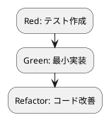

# 第 12 章: エラーハンドリングと型安全性

## 12.1 はじめに

第 4 部の締めくくりとして、Prolog における **エラーを値として表現する** 直和項アプローチ、`Option`（Maybe）相当の `nil` による欠損表現、そして動的型言語ながら型検査述語で実行時の安全性を担保する手法を学びます。Prolog には `throw/1`・`catch/3` による例外機構がありますが、それとは別に、成功と失敗を `ok(V)`/`error(Msg)` という **項の値** として返すことで、呼び出し側が節のパターンマッチで網羅的にエラーを扱えるようになります。

### この章で学ぶこと

- Prolog の例外機構 `throw/1` / `catch/3` と、エラーを値として返す直和項アプローチの対比
- `ok(V)` / `error(Msg)` の直和項による安全な変換 `safe_convert/2`
- `Option` 相当の `nil` による欠損表現 `convert_or_nil/2`
- 型検査述語（`integer/1` など）と単一化の失敗による実行時の型安全性
- Kotlin の `Result` / null 安全との対比
- 第 4 部の振り返り

## 12.2 例外機構と「エラーを値として返す」アプローチ

Prolog には ISO 標準の例外機構があります。`throw(E)` で項 `E` を例外として送出し、`catch(Goal, Catcher, Recovery)` で `Goal` を実行しつつ、送出された例外が `Catcher` と単一化できれば `Recovery` を実行します。

```prolog
catch(
    ( X =< 0 -> throw(error(non_positive, X)) ; true ),
    error(non_positive, N),
    format("正の数を指定してください: ~w~n", [N])
).
```

例外は「大域脱出」を伴うため、通常の制御フローから外れた失敗を扱うのに向いています。しかし例外は、呼び出し側が `catch/3` を書き忘れると、そのままトップレベルまで伝播してしまいます。

これに対して、成功と失敗を **項の値** として返すのが直和項アプローチです。`ok(Value)` は成功、`error(Message)` は失敗を表す項で、呼び出し側は節（パターンマッチ）で両方の場合を **網羅的に** 記述できます。

```prolog
handle(ok(Value))     :- format("成功: ~w~n", [Value]).
handle(error(Message)) :- format("失敗: ~w~n", [Message]).
```

値としてエラーを返すと、戻り値を扱う過程で失敗の存在に必ず気付けます。Kotlin の `Result<T>` が成功値とエラーを 1 つの型に閉じ込めるのと同じ発想を、Prolog では項の構造（ファンクタ）で表現します。

### TODO リストの更新

**TODO リスト**:

- [ ] 欠損入力を安全に変換する `convert_or_nil/2`
- [ ] 正の数のみ受け付ける安全な変換 `safe_convert/2`
- [ ] 失敗を値（直和項）で表現する

### Red: convert_or_nil のテスト

`convert_or_nil/2` は、入力が `nil` のときは `nil` を返し、整数のときは変換結果を返す `Option` 相当の述語です。

```prolog
:- use_module('../src/fizzbuzz_error').

:- begin_tests(fizzbuzz_error).

test(convert_or_nil_with_nil) :-
    convert_or_nil(nil, R),
    assertion(R == nil).

test(convert_or_nil_with_number) :-
    convert_or_nil(5, R),
    assertion(R == "Buzz").

:- end_tests(fizzbuzz_error).
```

### TDD サイクル



### Green: convert_or_nil の実装

```prolog
%% convert_or_nil(+N, -Result) is det.
%
%  入力が nil の場合は nil を返す。整数なら変換結果を返す（Option 相当）。
convert_or_nil(nil, nil) :- !.
convert_or_nil(N, Value) :-
    integer(N),
    fizzbuzz(N, Value).
```

第 1 節（`convert_or_nil(nil, nil)`）は、第 1 引数が `nil` アトムと単一化できたときだけ成立し、`nil` を返します。カット `!` により、`nil` に一致した場合は第 2 節を試みません。第 2 節は `integer(N)` で入力が整数であることを検査し、整数のときだけ `fizzbuzz/2` に委譲します。

ここで欠損値を `nil` アトムで表しましたが、より明示的に `some(X)` / `none` という項で表す設計も可能です。いずれも「値が無いかもしれない」ことを項の構造で示す点で、Kotlin の `String?`（null 許容型）や `Option[t]` と同じ役割を果たします。Prolog では単一化の成否がそのまま分岐になるため、`nil` と整数を別々の節で自然に振り分けられます。

## 12.3 直和項による安全な変換

例外を投げる代わりに、成功と失敗を **値として返す** のが `safe_convert/2` です。`ok(Value)` は成功、`error(Message)` は失敗を表し、ゼロ以下の入力に対しては `error(Message)` を返します。

### Red: safe_convert のテスト

```prolog
test(safe_convert_positive_is_ok) :-
    safe_convert(3, R),
    assertion(R == ok("Fizz")).

test(safe_convert_zero_is_error) :-
    safe_convert(0, R),
    assertion(R = error(_)).
```

正の数 `3` では `ok("Fizz")` に厳密一致（`==`）し、ゼロでは `error(_)` に単一化（`=`）できることを確認します。`error(_)` の無名変数 `_` は、メッセージの中身を問わず「`error` ファンクタの項であること」だけを検査しています。

### Green: safe_convert の実装

```prolog
%% safe_convert(+N:integer, -Result) is det.
%
%  正の数のみ受け付ける安全な変換。ゼロ以下は error(Message) を返す。
%  ok(Value) / error(Message) の直和型でエラーを値として表現する。
safe_convert(N, error(Message)) :-
    N =< 0, !,
    format(string(Message), "正の数を指定してください: ~w", [N]).
safe_convert(N, ok(Value)) :-
    fizzbuzz(N, Value).
```

第 1 節はゼロ以下（`N =< 0`）のとき成立し、カット `!` で第 2 節を切り、`format/3` でエラーメッセージを組み立てて `error(Message)` を返します。第 2 節は正の数のときに `fizzbuzz/2` へ委譲し、結果を `ok(Value)` に包みます。

戻り値が `ok(_)` か `error(_)` のいずれかの項なので、呼び出し側は両方の場合を節で扱う前提になります。`safe_convert(3, R)` は `R = ok("Fizz")` を、`safe_convert(0, R)` は `R = error("正の数を指定してください: 0")` を返します。例外を投げる方式では「`catch/3` を書き忘れる」ことがありますが、値で返す方式では戻り値のパターンマッチを通じて失敗を無視できません。

```bash
$ swipl -g run_tests -t halt test/fizzbuzz_error.plt

% PL-Unit: fizzbuzz_error .... done
% All 4 tests passed
```

## 12.4 動的型と型検査による安全性

Prolog は **動的型** の言語で、変数には整数・アトム・文字列・複合項など任意の項を束縛できます。静的な型注釈はありませんが、安全性は次の 2 つの仕組みで実行時に担保されます。

1. **型検査述語**: `integer/1`、`atom/1`、`number/1`、`string/1`、`is_list/1` などで、引数が期待した種類の項かどうかを実行時に検査できます。`convert_or_nil/2` の第 2 節では `integer(N)` を置くことで、整数以外の入力に対してその節が成立しないようにしています。

2. **単一化の失敗**: 節のヘッドや本体での単一化が失敗すると、その節は選ばれません。`convert_or_nil(nil, nil)` の第 1 引数 `nil` は、`nil` アトムとしか単一化できないため、整数や別のアトムを渡すと自然に第 2 節へ振り分けられます。単一化の失敗が、いわば「型の不一致」を静かに弾くフィルタとして働きます。

```prolog
?- convert_or_nil(foo, R).
false.   % foo は nil でも integer でもないため、どの節も成立しない
```

Kotlin では `String?` のように型で null の可能性を静的に示し、コンパイル時に検査します。Prolog は静的検査こそ持ちませんが、型検査述語と単一化により「不正な入力ではそもそも述語が成立しない（`false` になる）」という形で安全性を確保します。検査を明示的な節として書くため、どの条件で成立するのかがコードそのものに現れる点が特徴です。

## 12.5 各言語のエラーハンドリング比較

| 概念 | Prolog | Kotlin | Ruby | Java |
|------|--------|--------|------|------|
| 欠損値の表現 | `nil` アトム / `some(X)` / `none` | `String?` + `?.` / `let` | `nil` + `&.` | `Optional` |
| 成功/失敗 | `ok(V)` / `error(Msg)` 直和項 | `Result<T>` | 例外 / `nil` | `Optional` / 例外 |
| 大域脱出 | `throw/1` / `catch/3` | `throw` / `try` | `raise` / `rescue` | `throw` / `try` |
| 網羅的分岐 | 節（パターンマッチ）| sealed class + `when` | `case/in` | sealed + `switch` |
| 型の検査 | 型検査述語 + 単一化 | 静的型 | 実行時 `is_a?` | 静的型 |

Prolog は静的型を持たない代わりに、**エラーを項として表し、節のパターンマッチで網羅的に扱う** ことで、他言語の代数的データ型や sealed class に相当する表現力を得ています。

## 12.6 第 4 部のまとめ

第 4 部（章 10〜12）を通じて、FizzBuzz に関数型プログラミングの要素を追加しました。

| 章 | テーマ | 適用した技術 |
|---|--------|-------------|
| 10 | 高階関数と関数合成 | `maplist/3`、`foldl/4`、`include/3`、述語の高階合成 |
| 11 | 不変データとパイプライン | 論理変数の単一代入性、リスト処理のパイプライン、遅延評価 |
| 12 | エラーハンドリングと型安全性 | `ok`/`error` 直和項、`nil` による Option、型検査述語と単一化 |

**TODO リスト**:

- [x] 欠損入力を安全に変換する `convert_or_nil/2`
- [x] 正の数のみ受け付ける安全な変換 `safe_convert/2`
- [x] 失敗を値（直和項）で表現する

### 全 12 章の学習体系

| 部 | テーマ | 章 |
|---|--------|---|
| 第 1 部 | TDD の基本サイクル | 章 1〜3: TODO リスト、仮実装と三角測量、明白な実装 |
| 第 2 部 | 開発環境と自動化 | 章 4〜6: バージョン管理、パッケージ管理、タスクランナー |
| 第 3 部 | オブジェクト指向設計 | 章 7〜9: ポリモーフィズム、デザインパターン、SOLID |
| 第 4 部 | 関数型プログラミング | 章 10〜12: 高階関数、パイプライン、型安全性 |

### Prolog の論理型 + 宣言的スタイル

Prolog は論理プログラミングの言語であり、事実と規則（節）を宣言し、単一化とバックトラッキングで解を導きます。第 3 部では述語の多重定義とモジュールで構造を与え、第 4 部では高階述語（`maplist`・`foldl`）で振る舞いを組み立て、直和項でエラーを型として表現しました。

`ok`/`error` の直和項により「失敗する可能性」を項の構造に現し、`nil` により「値が無い可能性」を表し、型検査述語と単一化の失敗によって不正な入力を実行時に弾く——これらは例外の握りつぶしや想定外の入力によるクラッシュを設計段階で締め出し、**変更を楽に安全に行える** 基盤になります。FizzBuzz という小さな題材を通じて、TDD の基本サイクルから、述語による構造化、そして論理型ならではの宣言的なデータ処理と安全なエラー表現まで、Prolog の設計思想を一貫して体験しました。まさに「よいソフトウェア」を支える言語だと言えます。

<details>
<summary>実装コード</summary>

```prolog
:- module(fizzbuzz_error, [safe_convert/2, convert_or_nil/2]).

:- use_module(fizzbuzz).

%% safe_convert(+N:integer, -Result) is det.
%
%  正の数のみ受け付ける安全な変換。ゼロ以下は error(Message) を返す。
%  ok(Value) / error(Message) の直和型でエラーを値として表現する。
safe_convert(N, error(Message)) :-
    N =< 0, !,
    format(string(Message), "正の数を指定してください: ~w", [N]).
safe_convert(N, ok(Value)) :-
    fizzbuzz(N, Value).

%% convert_or_nil(+N, -Result) is det.
%
%  入力が nil の場合は nil を返す。整数なら変換結果を返す（Option 相当）。
convert_or_nil(nil, nil) :- !.
convert_or_nil(N, Value) :-
    integer(N),
    fizzbuzz(N, Value).
```

</details>
</content>
</invoke>
