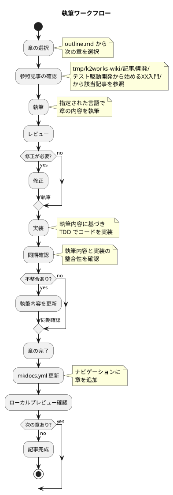
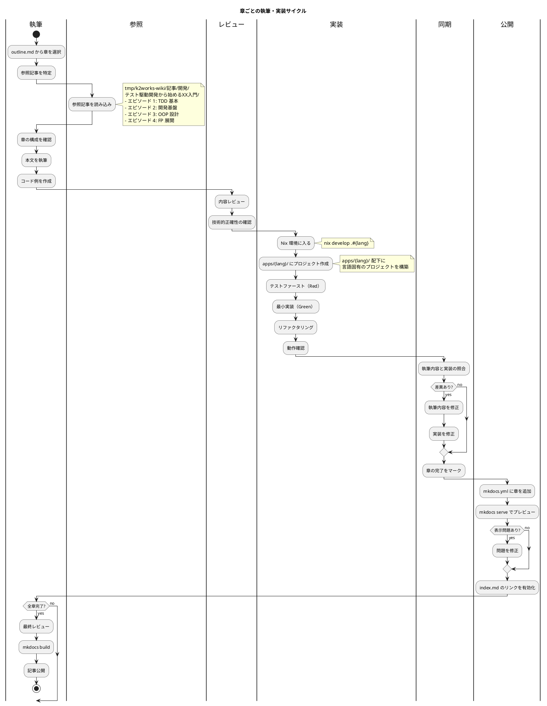
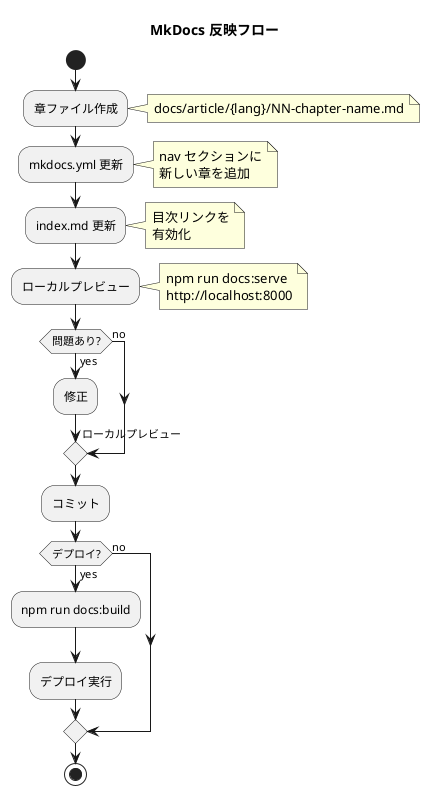

# 執筆ワークフロー

## 概要

本記事は `outline.md` に定義された構成に従い、章ごとに執筆と実装を同期しながら進める。

## ワークフロー図



## 詳細フロー



## MkDocs 反映ワークフロー



### MkDocs 更新手順

#### 1. mkdocs.yml への章追加

```yaml
nav:
  - テスト駆動開発から始めるXX入門:
      - 概要: article/index.md
      - Java:
          - 第1章 TODO リストと最初のテスト: article/java/01-todo-list-and-first-test.md
          - 第2章 仮実装と三角測量: article/java/02-fake-it-and-triangulation.md
```

#### 2. ローカルプレビュー

```bash
# サーバー起動
npm run docs:serve

# ブラウザで確認
# http://localhost:8000
```

#### 3. ビルド・デプロイ

```bash
# 静的サイト生成
npm run docs:build
```

### MkDocs チェックリスト

- [ ] 章ファイルが正しいパスに配置されている
- [ ] mkdocs.yml の nav に章が追加されている
- [ ] index.md のリンクが正しい
- [ ] ローカルプレビューで表示確認済み
- [ ] PlantUML ダイアグラムが正しくレンダリングされる
- [ ] 内部リンクが正常に動作する

## 執筆ルール

### 1. 章の選択

- `outline.md` の順序に従って進める
- 言語間の依存はないため、1 言語ずつ全 12 章を通しで書いても、1 章ずつ全言語横断で書いてもよい
- 推奨: 1 言語ずつ第 1〜12 章を通しで執筆し、実装も同時に完成させる

### 2. 参照記事

| 部 | 参照先（Wiki） |
|---|---|
| 第 1 部: TDD の基本サイクル | エピソード 1（各言語） |
| 第 2 部: 開発環境と自動化 | エピソード 2（各言語） |
| 第 3 部: オブジェクト指向設計 | エピソード 3（各言語） |
| 第 4 部: 関数型プログラミングへの展開 | エピソード 4（該当言語のみ） |

### 3. 執筆フォーマット

```markdown
# 第N章: 章タイトル

## N.1 セクションタイトル

本文...

### コード例

\```java
// テストコード
@Test
void テスト名() {
    // Arrange
    // Act
    // Assert
}
\```

### TDD サイクル

\```plantuml
@startuml
:Red: テスト作成;
:Green: 最小実装;
:Refactor: コード改善;
@enduml
\```

### 実装

<details>
<summary>実装コード</summary>

\```java
public class FizzBuzz {
    // ...
}
\```

</details>
```

- タスク項目などは一行開けて記述する

- NG

  ```markdown
    **受入条件**:
    - [ ] テストが通る
    - [ ] リファクタリング済み
  ```

- OK

  ```markdown
    **受入条件**:

    - [ ] テストが通る
    - [ ] リファクタリング済み
  ```

### 4. 実装同期チェックリスト

- [ ] `apps/{lang}/` にプロジェクトが作成されている
- [ ] テストコードが執筆内容と一致
- [ ] プロダクションコードが一致
- [ ] テスト実行結果が記事の記述と一致
- [ ] リファクタリング後のコードが反映済み
- [ ] 記事内のコード例が `apps/{lang}/` の実コードと同期している

## ファイル構成

### 記事（docs/article/）

```
docs/article/
├── index.md              # 記事トップページ（目次）
├── outline.md            # 執筆計画アウトライン
├── workflow.md           # 本ファイル（執筆ワークフロー）
├── java/                 # Java
│   ├── index.md
│   ├── 01-todo-list-and-first-test.md
│   ├── 02-fake-it-and-triangulation.md
│   ├── ...
│   └── 12-error-handling-and-type-safety.md
├── node/                 # JavaScript / TypeScript
├── python/               # Python
├── ruby/                 # Ruby
├── php/                  # PHP
├── go/                   # Go
├── rust/                 # Rust
├── dotnet/               # C# / F#
├── clojure/              # Clojure
├── scala/                # Scala
├── elixir/               # Elixir
├── haskell/              # Haskell
└── all/                  # 多言語統合解説
```

### 実装コード（apps/）

各言語の実装コードは `apps/` ディレクトリ配下に言語ごとのディレクトリを作成して配置する。ディレクトリ名は `ops/nix/environments/` と一致させる。

```
apps/
├── java/                 # Java（Maven/Gradle プロジェクト）
│   ├── src/
│   │   ├── main/java/
│   │   └── test/java/
│   └── pom.xml or build.gradle
├── node/                 # JavaScript / TypeScript（npm プロジェクト）
│   ├── src/
│   ├── test/
│   └── package.json
├── python/               # Python（uv/poetry プロジェクト）
│   ├── src/
│   ├── tests/
│   └── pyproject.toml
├── ruby/                 # Ruby（Bundler プロジェクト）
│   ├── lib/
│   ├── test/
│   └── Gemfile
├── php/                  # PHP（Composer プロジェクト）
│   ├── src/
│   ├── tests/
│   └── composer.json
├── go/                   # Go（Go Modules プロジェクト）
│   ├── fizzbuzz/
│   ├── fizzbuzz_test.go
│   └── go.mod
├── rust/                 # Rust（Cargo プロジェクト）
│   ├── src/
│   ├── tests/
│   └── Cargo.toml
├── dotnet/               # C# / F#（.NET プロジェクト）
│   ├── src/
│   ├── test/
│   └── *.sln
├── clojure/              # Clojure（Leiningen/deps.edn プロジェクト）
│   ├── src/
│   ├── test/
│   └── deps.edn or project.clj
├── scala/                # Scala（sbt プロジェクト）
│   ├── src/
│   └── build.sbt
├── elixir/               # Elixir（Mix プロジェクト）
│   ├── lib/
│   ├── test/
│   └── mix.exs
└── haskell/              # Haskell（Cabal/Stack プロジェクト）
    ├── src/
    ├── test/
    └── package.yaml or *.cabal
```

### 記事と実装の対応関係

```
docs/article/{lang}/NN-chapter-name.md  ←→  apps/{lang}/
     （記事・解説）                          （実装コード）
```

記事内のコード例は `apps/{lang}/` の実際のコードと一致させる。実装を先に TDD で進め、動作確認済みのコードを記事に転記する。

## 開発環境

各言語の開発環境は Nix で管理する。

```bash
# 言語別環境に入る
nix develop .#java
nix develop .#node
nix develop .#python
nix develop .#ruby
nix develop .#php
nix develop .#go
nix develop .#rust
nix develop .#dotnet
nix develop .#clojure
nix develop .#scala
nix develop .#elixir
nix develop .#haskell
```

### 実装の始め方

```bash
# 1. Nix 環境に入る
nix develop .#java

# 2. apps/{lang}/ に移動（初回はディレクトリ作成）
cd apps/java

# 3. 言語固有のプロジェクトを初期化
#    例: Java の場合
#    gradle init --type java-application
#    例: Node の場合
#    npm init -y

# 4. TDD サイクル開始
#    テスト作成 → 実行（Red） → 実装（Green） → リファクタリング
```

## 進捗管理

| 言語 | 第 1 部 | 第 2 部 | 第 3 部 | 第 4 部 | ステータス |
|------|--------|--------|--------|--------|----------|
| Java | ✅ 完了 | ✅ 完了 | ✅ 完了 | ✅ 完了 | IT1 完了 |
| JavaScript/TypeScript | 未着手 | 未着手 | 未着手 | 未着手 | - |
| Python | ✅ 完了 | ✅ 完了 | ✅ 完了 | ✅ 完了 | IT2 完了 |
| Ruby | 未着手 | 未着手 | 未着手 | 未着手 | - |
| PHP | 未着手 | 未着手 | 未着手 | 未着手 | - |
| Go | 未着手 | 未着手 | 未着手 | 未着手 | - |
| Rust | 未着手 | 未着手 | 未着手 | 未着手 | - |
| C#/F# | 未着手 | 未着手 | 未着手 | 未着手 | - |
| Clojure | 未着手 | 未着手 | 未着手 | 未着手 | - |
| Scala | 未着手 | 未着手 | 未着手 | 未着手 | - |
| Elixir | 未着手 | 未着手 | 未着手 | 未着手 | - |
| Haskell | 未着手 | 未着手 | 未着手 | 未着手 | - |
| 統合解説 | 未着手 | 未着手 | 未着手 | 未着手 | - |
