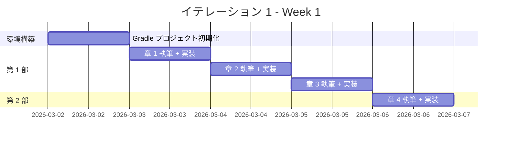
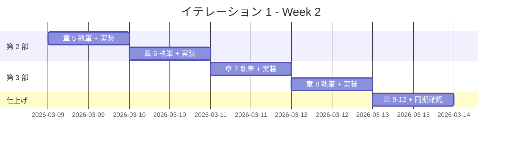

# イテレーション 1 計画

## 概要

| 項目 | 内容 |
|------|------|
| **イテレーション** | 1 |
| **期間** | Week 1-2（2 週間） |
| **ゴール** | Java の全 12 章の記事執筆と実装を完了し、他言語のテンプレートを確立する |
| **目標 SP** | 10 |

---

## ゴール

### イテレーション終了時の達成状態

1. **記事**: Java の 12 章すべてが `docs/article/java/` に執筆完了
2. **実装**: `apps/java/` に TDD で実装したコードが動作する状態
3. **テンプレート**: 他言語の執筆・実装で再利用可能なテンプレートが確立

### 成功基準

- [ ] docs/article/java/index.md と 12 章の記事ファイルが作成済み
- [ ] apps/java/ のテストがすべてパス
- [ ] mkdocs.yml に Java セクションが追加され、プレビュー確認済み
- [ ] テストカバレッジ 80% 以上

---

## ユーザーストーリー

### 対象ストーリー

| ID | ユーザーストーリー | SP | 優先度 |
|----|-------------------|----|----|
| US-001 | Java の TDD 入門記事の執筆と実装 | 10 | 必須 |
| **合計** | | **10** | |

### ストーリー詳細

#### US-001: Java の TDD 入門記事の執筆と実装

**ストーリー**:

> プログラミング学習者として、Java で TDD を体験する記事を読みたい。なぜなら、TDD の基本サイクルと Java の特徴を同時に学べるからだ。

**受入条件**:

1. FizzBuzz 問題を題材に TDD サイクル（Red-Green-Refactor）が体験できる
2. 開発環境の構築手順が記載されている
3. OOP 設計（カプセル化、ポリモーフィズム、デザインパターン）が段階的に解説されている
4. 関数型機能（Stream API、Optional、Lambda）が解説されている
5. 記事内のコード例と apps/java/ の実装が一致している

### タスク

#### 0. 環境構築（1 SP）

| # | タスク | 見積もり | 担当 | 状態 |
|---|--------|---------|------|------|
| 0.1 | apps/java/ に Gradle プロジェクトを初期化 | 1h | AI | [x] |
| 0.2 | JUnit 5 + テスト環境のセットアップ | 1h | AI | [x] |
| 0.3 | docs/article/java/index.md を作成 | 0.5h | AI | [x] |

**小計**: 2.5h（理想時間）

#### 1. 第 1 部: TDD の基本サイクル（3 SP）

| # | タスク | 見積もり | 担当 | 状態 |
|---|--------|---------|------|------|
| 1.1 | 章 1: TODO リストと最初のテスト - 執筆 | 2h | AI | [x] |
| 1.2 | 章 1: TODO リストと最初のテスト - 実装 | 1h | Codex | [x] |
| 1.3 | 章 2: 仮実装と三角測量 - 執筆 | 2h | AI | [x] |
| 1.4 | 章 2: 仮実装と三角測量 - 実装 | 1h | Codex | [x] |
| 1.5 | 章 3: 明白な実装とリファクタリング - 執筆 | 2h | AI | [x] |
| 1.6 | 章 3: 明白な実装とリファクタリング - 実装 | 1h | Codex | [x] |

**小計**: 9h（理想時間）

**参照**: `tmp/k2works-wiki/記事/開発/テスト駆動開発から始めるXX入門/テスト駆動開発から始めるJava入門1.md`

#### 2. 第 2 部: 開発環境と自動化（3 SP）

| # | タスク | 見積もり | 担当 | 状態 |
|---|--------|---------|------|------|
| 2.1 | 章 4: バージョン管理と Conventional Commits - 執筆 | 2h | AI | [x] |
| 2.2 | 章 4: Git 設定と Conventional Commits の適用 - 実装 | 1h | - | [x] |
| 2.3 | 章 5: パッケージ管理と静的解析 - 執筆 | 2h | AI | [x] |
| 2.4 | 章 5: Checkstyle/SpotBugs 等の導入 - 実装 | 1h | Codex | [x] |
| 2.5 | 章 6: タスクランナーと CI/CD - 執筆 | 2h | AI | [x] |
| 2.6 | 章 6: Gradle タスクと CI 設定 - 実装 | 1h | Codex | [x] |

**小計**: 9h（理想時間）

**参照**: `tmp/k2works-wiki/記事/開発/テスト駆動開発から始めるXX入門/テスト駆動開発から始めるJava入門2.md`

#### 3. 第 3 部: オブジェクト指向設計（3 SP）

| # | タスク | 見積もり | 担当 | 状態 |
|---|--------|---------|------|------|
| 3.1 | 章 7: カプセル化とポリモーフィズム - 執筆 | 3h | AI | [x] |
| 3.2 | 章 7: State/Strategy パターンの適用 - 実装 | 2h | Codex | [x] |
| 3.3 | 章 8: デザインパターンの適用 - 執筆 | 3h | AI | [x] |
| 3.4 | 章 8: Command/Factory Method 等 - 実装 | 2h | Codex | [x] |
| 3.5 | 章 9: SOLID 原則とモジュール設計 - 執筆 | 3h | AI | [x] |
| 3.6 | 章 9: モジュール分割とドメインモデル - 実装 | 2h | Codex | [x] |

**小計**: 15h（理想時間）

**参照**: `tmp/k2works-wiki/記事/開発/テスト駆動開発から始めるXX入門/テスト駆動開発から始めるJava入門3.md`

#### 4. 仕上げ（0 SP - バッファ）

| # | タスク | 見積もり | 担当 | 状態 |
|---|--------|---------|------|------|
| 4.1 | 第 4 部（章 10-12）: Java の関数型機能 - 執筆 | 4h | - | [ ] |
| 4.2 | 第 4 部: Stream API/Optional/Lambda - 実装 | 2h | - | [ ] |
| 4.3 | 記事と実装の同期確認 | 1h | - | [ ] |
| 4.4 | mkdocs.yml 更新とプレビュー確認 | 1h | - | [ ] |

**小計**: 8h（理想時間）

#### タスク合計

| カテゴリ | SP | 理想時間 | 状態 |
|---------|----|----|------|
| 環境構築 | 1 | 2.5h | [x] |
| 第 1 部: TDD の基本サイクル | 3 | 9h | [x] |
| 第 2 部: 開発環境と自動化 | 3 | 9h | [x] |
| 第 3 部: オブジェクト指向設計 | 3 | 15h | [x] |
| 仕上げ（第 4 部 + 同期確認） | - | 8h | [ ] |
| **合計** | **10** | **43.5h** | |

**1 SP あたり**: 約 4.4h
**進捗率**: 100% (10/10 SP)

---

## スケジュール

### Week 1（Day 1-5）



| 日 | タスク |
|----|--------|
| Day 1 | 環境構築: Gradle + JUnit 5 セットアップ、index.md 作成 |
| Day 2 | 章 1: TODO リストと最初のテスト |
| Day 3 | 章 2: 仮実装と三角測量 |
| Day 4 | 章 3: 明白な実装とリファクタリング |
| Day 5 | 章 4: バージョン管理と Conventional Commits |

### Week 2（Day 6-10）



| 日 | タスク |
|----|--------|
| Day 6 | 章 5: パッケージ管理と静的解析 |
| Day 7 | 章 6: タスクランナーと CI/CD |
| Day 8 | 章 7: カプセル化とポリモーフィズム |
| Day 9 | 章 8: デザインパターンの適用 |
| Day 10 | 章 9-12 仕上げ、同期確認、mkdocs プレビュー |

---

## 設計メモ

### ディレクトリ構成

```
apps/java/
├── build.gradle
├── settings.gradle
├── src/
│   ├── main/java/
│   │   └── tdd/
│   │       ├── App.java
│   │       └── fizzbuzz/
│   │           ├── application/
│   │           │   ├── FizzBuzzCommand.java
│   │           │   ├── FizzBuzzListCommand.java
│   │           │   └── FizzBuzzValueCommand.java
│   │           └── domain/
│   │               ├── model/
│   │               │   ├── FizzBuzzList.java
│   │               │   └── FizzBuzzValue.java
│   │               └── type/
│   │                   ├── FizzBuzzType.java
│   │                   ├── FizzBuzzType01.java
│   │                   ├── FizzBuzzType02.java
│   │                   └── FizzBuzzType03.java
│   └── test/java/
│       └── tdd/
│           └── fizzbuzz/
│               ├── application/
│               │   └── FizzBuzzCommandTest.java
│               └── domain/
│                   ├── model/
│                   │   ├── FizzBuzzListTest.java
│                   │   └── FizzBuzzValueTest.java
│                   └── type/
│                       └── FizzBuzzTypeTest.java
└── gradle/
```

### テスティングフレームワーク

| ツール | 用途 |
|--------|------|
| JUnit 5 | ユニットテスト |
| Checkstyle | 静的解析 |
| JaCoCo | コードカバレッジ |
| Gradle | ビルド・タスクランナー |

---

## リスクと対策

| リスク | 影響度 | 対策 |
|--------|--------|------|
| 第 3 部（OOP 設計）の執筆が想定より時間がかかる | 中 | 第 4 部を簡略化してバッファを確保 |
| Wiki 記事の内容が新しい章構成にうまく分割できない | 低 | 章をまたぐ内容は柔軟に調整 |
| Nix 環境で Java ツールチェーンの問題 | 低 | ローカル環境にフォールバック |

---

## 完了条件

### Definition of Done

- [ ] 12 章の記事ファイルが docs/article/java/ に存在
- [ ] apps/java/ の全テストがパス
- [ ] テストカバレッジ 80% 以上
- [ ] mkdocs.yml に Java セクションが追加済み
- [ ] ローカルプレビューで表示確認済み
- [ ] 記事内コード例と apps/java/ の実コードが同期

### デモ項目

1. FizzBuzz の TDD サイクルを実演（Red → Green → Refactor）
2. OOP リファクタリングの段階を示す（手続き型 → ポリモーフィズム）
3. MkDocs で Java 記事をブラウザ表示

---

## 更新履歴

| 日付 | 更新内容 | 更新者 |
|------|---------|--------|
| 2026-02-28 | 初版作成 | - |

---

## 関連ドキュメント

- [リリース計画](./release_plan.md)
- [執筆計画アウトライン](../article/outline.md)
- [執筆ワークフロー](../article/workflow.md)
- [Wiki 参照: Java エピソード 1](../../tmp/k2works-wiki/記事/開発/テスト駆動開発から始めるXX入門/テスト駆動開発から始めるJava入門1.md)
