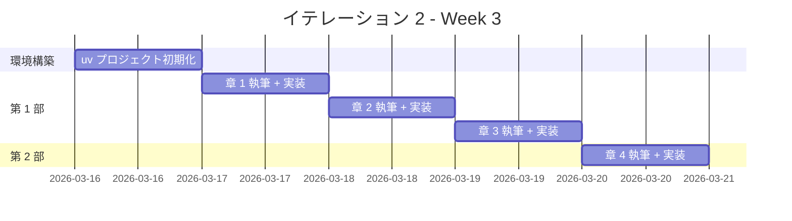
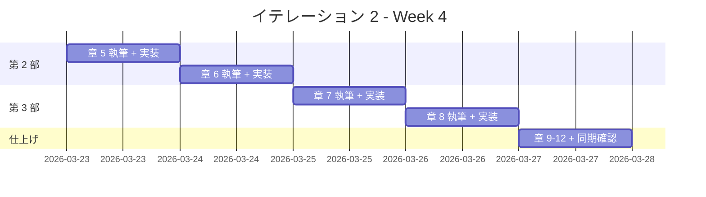

# イテレーション 2 計画

## 概要

| 項目 | 内容 |
|------|------|
| **イテレーション** | 2 |
| **期間** | Week 3-4（2 週間） |
| **ゴール** | Python の全 12 章の記事執筆と実装を完了する |
| **目標 SP** | 10 |

---

## ゴール

### イテレーション終了時の達成状態

1. **記事**: Python の 12 章すべてが `docs/article/python/` に執筆完了
2. **実装**: `apps/python/` に TDD で実装したコードが動作する状態
3. **テンプレート**: IT1（Java）で確立したテンプレートを Python に適用し、言語横断の再利用性を検証

### 成功基準

- [ ] docs/article/python/index.md と 12 章の記事ファイルが作成済み
- [ ] apps/python/ のテストがすべてパス
- [ ] mkdocs.yml に Python セクションが追加され、プレビュー確認済み
- [ ] テストカバレッジ 80% 以上
- [ ] Ruff（リンター + フォーマッター）違反ゼロ
- [ ] mypy 型チェックエラーゼロ

---

## ユーザーストーリー

### 対象ストーリー

| ID | ユーザーストーリー | SP | 優先度 |
|----|-------------------|----|----|
| US-002 | Python の TDD 入門記事の執筆と実装 | 10 | 必須 |
| **合計** | | **10** | |

### ストーリー詳細

#### US-002: Python の TDD 入門記事の執筆と実装

**ストーリー**:

> プログラミング学習者として、Python で TDD を体験する記事を読みたい。なぜなら、TDD の基本サイクルと Python の特徴を同時に学べるからだ。

**受入条件**:

1. FizzBuzz 問題を題材に TDD サイクル（Red-Green-Refactor）が体験できる
2. 開発環境の構築手順（uv、pytest、Ruff、mypy、tox）が記載されている
3. OOP 設計（カプセル化、ポリモーフィズム、デザインパターン）が段階的に解説されている
4. 関数型機能（ジェネレータ、デコレータ、functools）が解説されている
5. 記事内のコード例と apps/python/ の実装が一致している

### タスク

#### 0. 環境構築（1 SP）

| # | タスク | 見積もり | 担当 | 状態 |
|---|--------|---------|------|------|
| 0.1 | apps/python/ に uv プロジェクトを初期化 | 1h | AI | [ ] |
| 0.2 | pytest + Ruff + mypy + tox 環境のセットアップ | 1h | AI | [ ] |
| 0.3 | docs/article/python/index.md を作成 | 0.5h | AI | [ ] |

**小計**: 2.5h（理想時間）

#### 1. 第 1 部: TDD の基本サイクル（3 SP）

| # | タスク | 見積もり | 担当 | 状態 |
|---|--------|---------|------|------|
| 1.1 | 章 1: TODO リストと最初のテスト - 執筆 | 2h | AI | [ ] |
| 1.2 | 章 1: TODO リストと最初のテスト - 実装 | 1h | Codex | [ ] |
| 1.3 | 章 2: 仮実装と三角測量 - 執筆 | 2h | AI | [ ] |
| 1.4 | 章 2: 仮実装と三角測量 - 実装 | 1h | Codex | [ ] |
| 1.5 | 章 3: 明白な実装とリファクタリング - 執筆 | 2h | AI | [ ] |
| 1.6 | 章 3: 明白な実装とリファクタリング - 実装 | 1h | Codex | [ ] |

**小計**: 9h（理想時間）

**参照**: `tmp/k2works-wiki/記事/開発/テスト駆動開発から始めるXX入門/テスト駆動開発から始めるPython入門1.md`

#### 2. 第 2 部: 開発環境と自動化（3 SP）

| # | タスク | 見積もり | 担当 | 状態 |
|---|--------|---------|------|------|
| 2.1 | 章 4: バージョン管理と Conventional Commits - 執筆 | 2h | AI | [ ] |
| 2.2 | 章 4: Git 設定と Conventional Commits の適用 - 実装 | 1h | - | [ ] |
| 2.3 | 章 5: パッケージ管理と静的解析 - 執筆 | 2h | AI | [ ] |
| 2.4 | 章 5: Ruff/mypy/pytest-cov の導入 - 実装 | 1h | Codex | [ ] |
| 2.5 | 章 6: タスクランナーと CI/CD - 執筆 | 2h | AI | [ ] |
| 2.6 | 章 6: tox タスクと CI 設定 - 実装 | 1h | Codex | [ ] |

**小計**: 9h（理想時間）

**参照**: `tmp/k2works-wiki/記事/開発/テスト駆動開発から始めるXX入門/テスト駆動開発から始めるPython入門2.md`

#### 3. 第 3 部: オブジェクト指向設計（3 SP）

| # | タスク | 見積もり | 担当 | 状態 |
|---|--------|---------|------|------|
| 3.1 | 章 7: カプセル化とポリモーフィズム - 執筆 | 3h | AI | [ ] |
| 3.2 | 章 7: @property/ABC によるポリモーフィズム - 実装 | 2h | Codex | [ ] |
| 3.3 | 章 8: デザインパターンの適用 - 執筆 | 3h | AI | [ ] |
| 3.4 | 章 8: Command/Factory Method/Null Object - 実装 | 2h | Codex | [ ] |
| 3.5 | 章 9: SOLID 原則とモジュール設計 - 執筆 | 3h | AI | [ ] |
| 3.6 | 章 9: モジュール分割とドメインモデル - 実装 | 2h | Codex | [ ] |

**小計**: 15h（理想時間）

**参照**: `tmp/k2works-wiki/記事/開発/テスト駆動開発から始めるXX入門/テスト駆動開発から始めるPython入門3.md`

#### 4. 第 4 部: 関数型プログラミング（0 SP - バッファ）

| # | タスク | 見積もり | 担当 | 状態 |
|---|--------|---------|------|------|
| 4.1 | 章 10: 高階関数と関数合成 - 執筆 | 2h | AI | [ ] |
| 4.2 | 章 10: lambda/functools/デコレータ - 実装 | 1h | Codex | [ ] |
| 4.3 | 章 11: 不変データとパイプライン処理 - 執筆 | 2h | AI | [ ] |
| 4.4 | 章 11: ジェネレータ/内包表記/パイプライン - 実装 | 1h | Codex | [ ] |
| 4.5 | 章 12: エラーハンドリングと型安全性 - 執筆 | 2h | AI | [ ] |
| 4.6 | 章 12: Optional 風パターン/型ヒント - 実装 | 1h | Codex | [ ] |
| 4.7 | 記事と実装の同期確認 | 1h | AI | [ ] |
| 4.8 | mkdocs.yml 更新とプレビュー確認 | 0.5h | AI | [ ] |

**小計**: 10.5h（理想時間）

**参照**:

- `tmp/k2works-wiki/記事/関数型プログラミング/Pythonで学ぶ関数型プログラミング入門.md`
- `tmp/k2works-wiki/記事/関数型プログラミング/Pythonで学ぶ関数型プログラミング実践入門.md`

#### タスク合計

| カテゴリ | SP | 理想時間 | 状態 |
|---------|----|----|------|
| 環境構築 | 1 | 2.5h | [ ] |
| 第 1 部: TDD の基本サイクル | 3 | 9h | [ ] |
| 第 2 部: 開発環境と自動化 | 3 | 9h | [ ] |
| 第 3 部: オブジェクト指向設計 | 3 | 15h | [ ] |
| 第 4 部: 関数型プログラミング + 同期確認 | - | 10.5h | [ ] |
| **合計** | **10** | **46h** | |

**1 SP あたり**: 約 4.6h
**進捗率**: 0% (0/10 SP)

---

## スケジュール

### Week 3（Day 1-5）



| 日 | タスク |
|----|--------|
| Day 1 | 環境構築: uv + pytest + Ruff + mypy + tox セットアップ、index.md 作成 |
| Day 2 | 章 1: TODO リストと最初のテスト |
| Day 3 | 章 2: 仮実装と三角測量 |
| Day 4 | 章 3: 明白な実装とリファクタリング |
| Day 5 | 章 4: バージョン管理と Conventional Commits |

### Week 4（Day 6-10）



| 日 | タスク |
|----|--------|
| Day 6 | 章 5: パッケージ管理と静的解析（uv、Ruff、pytest-cov） |
| Day 7 | 章 6: タスクランナーと CI/CD（tox、GitHub Actions） |
| Day 8 | 章 7: カプセル化とポリモーフィズム（@property、ABC） |
| Day 9 | 章 8: デザインパターンの適用（Command、Factory Method） |
| Day 10 | 章 9-12 仕上げ、同期確認、mkdocs プレビュー |

---

## 設計メモ

### Java との対比

| 概念 | Java（IT1） | Python（IT2） |
|------|-----------|-------------|
| テストフレームワーク | JUnit 5 | pytest |
| パッケージマネージャ | Gradle | uv |
| リンター | Checkstyle + PMD | Ruff |
| フォーマッター | Checkstyle | Ruff（統合） |
| バグ検出 | SpotBugs | mypy（型チェック） |
| カバレッジ | JaCoCo | pytest-cov |
| タスクランナー | Gradle タスク | tox |
| 抽象クラス | abstract class | abc.ABC + @abstractmethod |
| カプセル化 | private + getter | @property |
| 型安全 | コンパイル時型検査 | mypy（静的型チェック） |

### ディレクトリ構成（予定）

```
apps/python/
├── pyproject.toml
├── .ruff.toml
├── tox.ini
├── lib/
│   ├── __init__.py
│   ├── domain/
│   │   ├── __init__.py
│   │   ├── model/
│   │   │   ├── __init__.py
│   │   │   ├── fizz_buzz_value.py
│   │   │   └── fizz_buzz_list.py
│   │   └── type/
│   │       ├── __init__.py
│   │       ├── fizz_buzz_type.py
│   │       ├── fizz_buzz_type_01.py
│   │       ├── fizz_buzz_type_02.py
│   │       └── fizz_buzz_type_03.py
│   └── application/
│       ├── __init__.py
│       ├── fizz_buzz_command.py
│       ├── fizz_buzz_value_command.py
│       └── fizz_buzz_list_command.py
├── test/
│   ├── __init__.py
│   ├── domain/
│   │   ├── model/
│   │   │   ├── test_fizz_buzz_value.py
│   │   │   └── test_fizz_buzz_list.py
│   │   └── type/
│   │       └── test_fizz_buzz_type.py
│   └── application/
│       └── test_fizz_buzz_command.py
└── main.py
```

### テスティングフレームワーク

| ツール | 用途 |
|--------|------|
| pytest | ユニットテスト |
| Ruff | リンター + フォーマッター |
| mypy | 静的型チェック |
| pytest-cov | コードカバレッジ |
| tox | タスクランナー |

### Python 固有の特徴（第 4 部）

| 機能 | 章 | 内容 |
|------|-----|------|
| lambda / functools.partial | 10 | 高階関数、カリー化、部分適用 |
| デコレータ | 10 | 関数を装飾するメタプログラミング |
| ジェネレータ | 11 | 遅延評価、メモリ効率 |
| リスト内包表記 | 11 | Pythonic なパイプライン処理 |
| 型ヒント（typing） | 12 | Optional、Union、TypeGuard |
| dataclasses | 12 | 値オブジェクトの簡潔な定義 |

---

## IT1 からの学び（適用事項）

| 学び | IT2 での適用 |
|------|-------------|
| 1 章単位の Codex 委託が最適 | 同じ粒度で委託する |
| 部完了時に進捗更新 | 部完了ごとに進捗ドキュメントを更新する |
| カバレッジは equals/hashCode 等の分岐に注意 | Python の `__eq__`/`__hash__` テストを最初から含める |
| fullCheck を CI で自動化推奨 | tox による全品質チェックを CI に統合する |

---

## リスクと対策

| リスク | 影響度 | 対策 |
|--------|--------|------|
| Python の型ヒントが記事の複雑さを増す | 低 | 第 3-4 部で段階的に導入 |
| uv の設定で Nix 環境と競合 | 低 | Nix 環境内で uv を使用、パス設定を確認 |
| Wiki 記事にエピソード 4（FP）がない | 中 | 別途 FP 入門記事を参照して構成 |

---

## 完了条件

### Definition of Done

- [ ] 12 章の記事ファイルが docs/article/python/ に存在
- [ ] apps/python/ の全テストがパス
- [ ] テストカバレッジ 80% 以上
- [ ] Ruff 違反ゼロ、mypy エラーゼロ
- [ ] mkdocs.yml に Python セクションが追加済み
- [ ] ローカルプレビューで表示確認済み
- [ ] 記事内コード例と apps/python/ の実コードが同期

### デモ項目

1. FizzBuzz の TDD サイクルを実演（Red → Green → Refactor）
2. OOP リファクタリングの段階を示す（関数 → クラス → ABC ポリモーフィズム）
3. Python 固有の FP 機能を示す（ジェネレータ、デコレータ、内包表記）
4. MkDocs で Python 記事をブラウザ表示

---

## 更新履歴

| 日付 | 更新内容 | 更新者 |
|------|---------|--------|
| 2026-02-28 | 初版作成 | - |

---

## 関連ドキュメント

- [リリース計画](./release_plan.md)
- [イテレーション 1 計画](./iteration_plan-1.md)
- [イテレーション 1 完了報告書](./iteration_report-1.md)
- [執筆計画アウトライン](../article/outline.md)
- [執筆ワークフロー](../article/workflow.md)
- [Wiki 参照: Python エピソード 1](../../tmp/k2works-wiki/記事/開発/テスト駆動開発から始めるXX入門/テスト駆動開発から始めるPython入門1.md)
- [Wiki 参照: Python エピソード 2](../../tmp/k2works-wiki/記事/開発/テスト駆動開発から始めるXX入門/テスト駆動開発から始めるPython入門2.md)
- [Wiki 参照: Python エピソード 3](../../tmp/k2works-wiki/記事/開発/テスト駆動開発から始めるXX入門/テスト駆動開発から始めるPython入門3.md)
- [Wiki 参照: Python FP 入門](../../tmp/k2works-wiki/記事/関数型プログラミング/Pythonで学ぶ関数型プログラミング入門.md)
