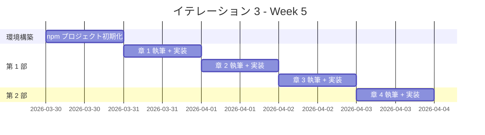
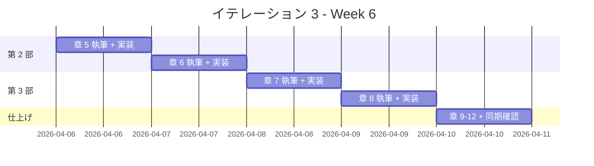

# イテレーション 3 計画

## 概要

| 項目 | 内容 |
|------|------|
| **イテレーション** | 3 |
| **期間** | Week 5-6（2 週間） |
| **ゴール** | Node（JavaScript/TypeScript）の全 12 章の記事執筆と実装を完了する |
| **目標 SP** | 13 |

---

## ゴール

### イテレーション終了時の達成状態

1. **記事**: Node（JS/TS）の 12 章すべてが `docs/article/node/` に執筆完了
2. **実装**: `apps/node/` に TDD で実装したコードが動作する状態
3. **テンプレート**: IT1（Java）・IT2（Python）で確立したテンプレートを JS/TS に適用し、3 言語目の横断的な再利用性を検証

### 成功基準

- [ ] docs/article/node/index.md と 12 章の記事ファイルが作成済み
- [ ] apps/node/ のテストがすべてパス
- [ ] mkdocs.yml に Node セクションが追加され、プレビュー確認済み
- [ ] テストカバレッジ 80% 以上
- [ ] ESLint エラーゼロ
- [ ] TypeScript コンパイルエラーゼロ

---

## ユーザーストーリー

### 対象ストーリー

| ID | ユーザーストーリー | SP | 優先度 |
|----|-------------------|----|----|
| US-003 | Node（JS/TS）の TDD 入門記事の執筆と実装 | 13 | 必須 |
| **合計** | | **13** | |

### ストーリー詳細

#### US-003: Node（JS/TS）の TDD 入門記事の執筆と実装

**ストーリー**:

> プログラミング学習者として、JavaScript と TypeScript で TDD を体験する記事を読みたい。なぜなら、TDD の基本サイクルと JS/TS の特徴を同時に学べるからだ。

**受入条件**:

1. FizzBuzz 問題を題材に TDD サイクル（Red-Green-Refactor）が体験できる
2. 開発環境の構築手順（npm、Jest、ESLint、Prettier、TypeScript）が記載されている
3. OOP 設計（カプセル化、ポリモーフィズム、デザインパターン）が段階的に解説されている
4. 関数型機能（Arrow Functions、Promises、Generics、Union Types、Type Guards）が解説されている
5. 記事内のコード例と apps/node/ の実装が一致している
6. JavaScript と TypeScript の両方のコード例が適切に提示されている

### タスク

#### 0. 環境構築（1 SP）

| # | タスク | 見積もり | 担当 | 状態 |
|---|--------|---------|------|------|
| 0.1 | apps/node/ に npm プロジェクトを初期化 | 1h | AI | [x] |
| 0.2 | Jest + ESLint + Prettier + TypeScript 環境のセットアップ | 1h | AI | [x] |
| 0.3 | docs/article/node/index.md を作成 | 0.5h | AI | [x] |

**小計**: 2.5h（理想時間）

#### 1. 第 1 部: TDD の基本サイクル（3 SP）

| # | タスク | 見積もり | 担当 | 状態 |
|---|--------|---------|------|------|
| 1.1 | 章 1: TODO リストと最初のテスト - 執筆 | 2h | AI | [x] |
| 1.2 | 章 1: TODO リストと最初のテスト - 実装 | 1h | AI | [x] |
| 1.3 | 章 2: 仮実装と三角測量 - 執筆 | 2h | AI | [x] |
| 1.4 | 章 2: 仮実装と三角測量 - 実装 | 1h | Codex | [x] |
| 1.5 | 章 3: 明白な実装とリファクタリング - 執筆 | 2h | AI | [x] |
| 1.6 | 章 3: 明白な実装とリファクタリング - 実装 | 1h | Codex | [x] |

**小計**: 9h（理想時間）

**参照**:

- `tmp/k2works-wiki/記事/開発/テスト駆動開発から始めるXX入門/テスト駆動開発から始めるJavaScript入門1.md`
- `tmp/k2works-wiki/記事/開発/テスト駆動開発から始めるXX入門/テスト駆動開発から始めるTypeScript入門1.md`

#### 2. 第 2 部: 開発環境と自動化（3 SP）

| # | タスク | 見積もり | 担当 | 状態 |
|---|--------|---------|------|------|
| 2.1 | 章 4: バージョン管理と Conventional Commits - 執筆 | 2h | AI | [ ] |
| 2.2 | 章 4: Git 設定と Conventional Commits の適用 - 実装 | 1h | - | [ ] |
| 2.3 | 章 5: パッケージ管理と静的解析 - 執筆 | 2h | AI | [ ] |
| 2.4 | 章 5: ESLint/Prettier/tsc の導入 - 実装 | 1h | Codex | [ ] |
| 2.5 | 章 6: タスクランナーと CI/CD - 執筆 | 2h | AI | [ ] |
| 2.6 | 章 6: npm scripts と CI 設定 - 実装 | 1h | Codex | [ ] |

**小計**: 9h（理想時間）

**参照**:

- `tmp/k2works-wiki/記事/開発/テスト駆動開発から始めるXX入門/テスト駆動開発から始めるJavaScript入門2.md`
- `tmp/k2works-wiki/記事/開発/テスト駆動開発から始めるXX入門/テスト駆動開発から始めるTypeScript入門2.md`

#### 3. 第 3 部: オブジェクト指向設計（3 SP）

| # | タスク | 見積もり | 担当 | 状態 |
|---|--------|---------|------|------|
| 3.1 | 章 7: カプセル化とポリモーフィズム - 執筆 | 3h | AI | [ ] |
| 3.2 | 章 7: クラス構文と interface によるポリモーフィズム - 実装 | 2h | Codex | [ ] |
| 3.3 | 章 8: デザインパターンの適用 - 執筆 | 3h | AI | [ ] |
| 3.4 | 章 8: Command/Factory Method/Null Object - 実装 | 2h | Codex | [ ] |
| 3.5 | 章 9: SOLID 原則とモジュール設計 - 執筆 | 3h | AI | [ ] |
| 3.6 | 章 9: モジュール分割とドメインモデル - 実装 | 2h | Codex | [ ] |

**小計**: 15h（理想時間）

**参照**:

- `tmp/k2works-wiki/記事/開発/テスト駆動開発から始めるXX入門/テスト駆動開発から始めるJavaScript入門3.md`
- `tmp/k2works-wiki/記事/開発/テスト駆動開発から始めるXX入門/テスト駆動開発から始めるTypeScript入門3.md`

#### 4. 第 4 部: 関数型プログラミング（3 SP）

| # | タスク | 見積もり | 担当 | 状態 |
|---|--------|---------|------|------|
| 4.1 | 章 10: 高階関数と関数合成 - 執筆 | 2h | AI | [ ] |
| 4.2 | 章 10: Arrow Functions/クロージャ/カリー化 - 実装 | 1h | Codex | [ ] |
| 4.3 | 章 11: 不変データとパイプライン処理 - 執筆 | 2h | AI | [ ] |
| 4.4 | 章 11: Array メソッドチェーン/Spread/Object.freeze - 実装 | 1h | Codex | [ ] |
| 4.5 | 章 12: エラーハンドリングと型安全性 - 執筆 | 2h | AI | [ ] |
| 4.6 | 章 12: Generics/Union Types/Type Guards/Promise - 実装 | 1h | Codex | [ ] |
| 4.7 | 記事と実装の同期確認 | 1h | AI | [ ] |
| 4.8 | mkdocs.yml 更新とプレビュー確認 | 0.5h | AI | [ ] |

**小計**: 10.5h（理想時間）

**参照**:

- `tmp/k2works-wiki/記事/関数型プログラミング/JavaScriptで学ぶ関数型プログラミング.md`
- `tmp/k2works-wiki/記事/関数型プログラミング/JavaScriptで学ぶ関数型プログラミング実践入門.md`

#### タスク合計

| カテゴリ | SP | 理想時間 | 状態 |
|---------|----|----|------|
| 環境構築 | 1 | 2.5h | [x] |
| 第 1 部: TDD の基本サイクル | 3 | 9h | [x] |
| 第 2 部: 開発環境と自動化 | 3 | 9h | [ ] |
| 第 3 部: オブジェクト指向設計 | 3 | 15h | [ ] |
| 第 4 部: 関数型プログラミング + 同期確認 | 3 | 10.5h | [ ] |
| **合計** | **13** | **46h** | |

**1 SP あたり**: 約 3.5h
**進捗率**: 31% (4/13 SP) — 環境構築 + 第 1 部（章 1-3）完了

---

## スケジュール

### Week 5（Day 1-5）



| 日 | タスク |
|----|--------|
| Day 1 | 環境構築: npm + Jest + ESLint + Prettier + TypeScript セットアップ、index.md 作成 |
| Day 2 | 章 1: TODO リストと最初のテスト |
| Day 3 | 章 2: 仮実装と三角測量 |
| Day 4 | 章 3: 明白な実装とリファクタリング |
| Day 5 | 章 4: バージョン管理と Conventional Commits |

### Week 6（Day 6-10）



| 日 | タスク |
|----|--------|
| Day 6 | 章 5: パッケージ管理と静的解析（npm、ESLint、Prettier、tsc） |
| Day 7 | 章 6: タスクランナーと CI/CD（npm scripts、GitHub Actions） |
| Day 8 | 章 7: カプセル化とポリモーフィズム（class 構文、interface） |
| Day 9 | 章 8: デザインパターンの適用（Command、Factory Method） |
| Day 10 | 章 9-12 仕上げ、同期確認、mkdocs プレビュー |

---

## 設計メモ

### Java/Python との対比

| 概念 | Java（IT1） | Python（IT2） | Node/JS/TS（IT3） |
|------|-----------|-------------|-----------------|
| テストフレームワーク | JUnit 5 | pytest | Jest |
| パッケージマネージャ | Gradle | uv | npm |
| リンター | Checkstyle + PMD | Ruff | ESLint |
| フォーマッター | Checkstyle | Ruff（統合） | Prettier |
| バグ検出 | SpotBugs | mypy（型チェック） | tsc（TypeScript コンパイラ） |
| カバレッジ | JaCoCo | pytest-cov | Jest --coverage |
| タスクランナー | Gradle タスク | tox | npm scripts |
| 抽象クラス | abstract class | abc.ABC + @abstractmethod | abstract class（TS） |
| カプセル化 | private + getter | @property | private フィールド（TS）/ # プライベート（JS） |
| 型安全 | コンパイル時型検査 | mypy（静的型チェック） | tsc（静的型チェック） |
| インターフェース | interface | Protocol / ABC | interface（TS） |

### ディレクトリ構成（予定）

```
apps/node/
├── package.json
├── tsconfig.json
├── jest.config.js
├── .eslintrc.js
├── .prettierrc
├── src/
│   ├── index.ts
│   ├── domain/
│   │   ├── model/
│   │   │   ├── fizz-buzz-value.ts
│   │   │   └── fizz-buzz-list.ts
│   │   └── type/
│   │       ├── fizz-buzz-type.ts
│   │       ├── fizz-buzz-type-01.ts
│   │       ├── fizz-buzz-type-02.ts
│   │       └── fizz-buzz-type-03.ts
│   └── application/
│       ├── fizz-buzz-command.ts
│       ├── fizz-buzz-value-command.ts
│       └── fizz-buzz-list-command.ts
├── test/
│   ├── domain/
│   │   ├── model/
│   │   │   ├── fizz-buzz-value.test.ts
│   │   │   └── fizz-buzz-list.test.ts
│   │   └── type/
│   │       └── fizz-buzz-type.test.ts
│   └── application/
│       └── fizz-buzz-command.test.ts
└── dist/
```

### テスティングフレームワーク

| ツール | 用途 |
|--------|------|
| Jest | ユニットテスト + カバレッジ |
| ESLint | リンター（静的解析） |
| Prettier | コードフォーマッター |
| tsc | TypeScript コンパイラ（型チェック） |
| npm scripts | タスクランナー |

### Node/TS 固有の特徴（第 4 部）

| 機能 | 章 | 内容 |
|------|-----|------|
| Arrow Functions / クロージャ | 10 | 高階関数、カリー化、部分適用 |
| Array メソッドチェーン | 11 | map/filter/reduce によるパイプライン処理 |
| Spread / Object.freeze | 11 | 不変データの実現 |
| Promises / async-await | 12 | 非同期処理のエラーハンドリング |
| Generics | 12 | 型パラメータによる汎用プログラミング |
| Union Types / Type Guards | 12 | 型安全な分岐処理 |

---

## Nix 環境

```
nix develop .#node
```

| パッケージ | バージョン |
|-----------|-----------|
| Node.js | 20.x |
| npm | (Node.js 20 同梱) |
| TypeScript | (nodePackages) |
| TS Language Server | (nodePackages) |

---

## IT1/IT2 からの学び（適用事項）

| 学び | IT3 での適用 |
|------|-------------|
| 1 章単位の Codex 委託が最適 | 同じ粒度で委託する |
| 部完了時に進捗更新 | 部完了ごとに進捗ドキュメントを更新する |
| カバレッジは equals/hashCode 等の分岐に注意 | JS/TS の `===` 比較と `toString()` テストを最初から含める |
| fullCheck を CI で自動化推奨 | npm scripts による全品質チェック（lint + format + type-check + test）を CI に統合する |
| テンプレート再利用が効果的 | IT1/IT2 の記事テンプレートを JS/TS 向けに適用する |

---

## リスクと対策

| リスク | 影響度 | 対策 |
|--------|--------|------|
| JS/TS 両方のカバーによる記事量増加 | 中 | 各章で JS → TS の段階的移行として構成、冗長な重複を避ける |
| ESM vs CJS のモジュール問題 | 中 | ESM をデフォルトとし、tsconfig.json の module 設定で統一 |
| Jest と TypeScript の設定が複雑 | 低 | ts-jest または @swc/jest を使用して簡素化 |
| Nix 環境で npm パッケージのインストール問題 | 低 | Nix 環境内で npm を使用、node_modules はローカル管理 |

---

## 完了条件

### Definition of Done

- [ ] 12 章の記事ファイルが docs/article/node/ に存在
- [ ] apps/node/ の全テストがパス
- [ ] テストカバレッジ 80% 以上
- [ ] ESLint 違反ゼロ、TypeScript コンパイルエラーゼロ
- [ ] mkdocs.yml に Node セクションが追加済み
- [ ] ローカルプレビューで表示確認済み
- [ ] 記事内コード例と apps/node/ の実コードが同期

### デモ項目

1. FizzBuzz の TDD サイクルを実演（Red → Green → Refactor）
2. OOP リファクタリングの段階を示す（関数 → クラス → interface ポリモーフィズム）
3. JS/TS 固有の FP 機能を示す（Arrow Functions、Array メソッドチェーン、Generics）
4. MkDocs で Node 記事をブラウザ表示

---

## 更新履歴

| 日付 | 更新内容 | 更新者 |
|------|---------|--------|
| 2026-03-01 | 初版作成 | - |

---

## 関連ドキュメント

- [リリース計画](./release_plan.md)
- [イテレーション 1 計画](./iteration_plan-1.md)
- [イテレーション 1 完了報告書](./iteration_report-1.md)
- [イテレーション 2 計画](./iteration_plan-2.md)
- [イテレーション 2 完了報告書](./iteration_report-2.md)
- [執筆計画アウトライン](../article/outline.md)
- [執筆ワークフロー](../article/workflow.md)
- [Wiki 参照: JavaScript エピソード 1](../../tmp/k2works-wiki/記事/開発/テスト駆動開発から始めるXX入門/テスト駆動開発から始めるJavaScript入門1.md)
- [Wiki 参照: JavaScript エピソード 2](../../tmp/k2works-wiki/記事/開発/テスト駆動開発から始めるXX入門/テスト駆動開発から始めるJavaScript入門2.md)
- [Wiki 参照: JavaScript エピソード 3](../../tmp/k2works-wiki/記事/開発/テスト駆動開発から始めるXX入門/テスト駆動開発から始めるJavaScript入門3.md)
- [Wiki 参照: TypeScript エピソード 1](../../tmp/k2works-wiki/記事/開発/テスト駆動開発から始めるXX入門/テスト駆動開発から始めるTypeScript入門1.md)
- [Wiki 参照: TypeScript エピソード 2](../../tmp/k2works-wiki/記事/開発/テスト駆動開発から始めるXX入門/テスト駆動開発から始めるTypeScript入門2.md)
- [Wiki 参照: TypeScript エピソード 3](../../tmp/k2works-wiki/記事/開発/テスト駆動開発から始めるXX入門/テスト駆動開発から始めるTypeScript入門3.md)
- [Wiki 参照: JavaScript FP](../../tmp/k2works-wiki/記事/関数型プログラミング/JavaScriptで学ぶ関数型プログラミング.md)
- [Wiki 参照: JavaScript FP 実践](../../tmp/k2works-wiki/記事/関数型プログラミング/JavaScriptで学ぶ関数型プログラミング実践入門.md)
