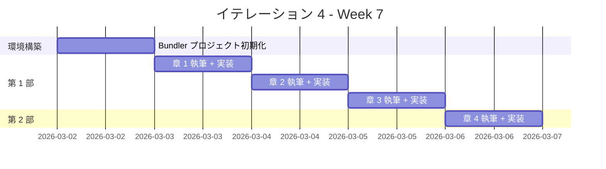
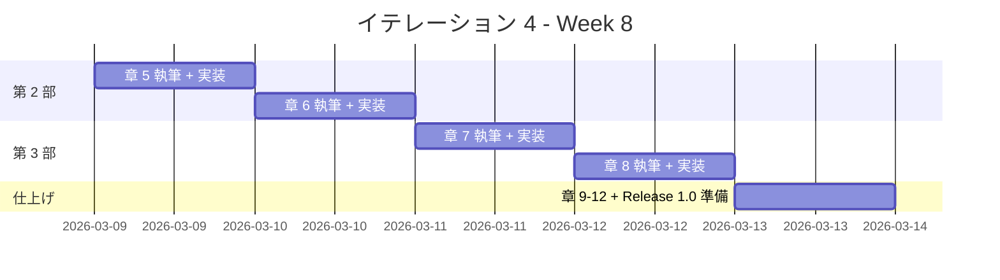

# イテレーション 4 計画

## 概要

| 項目 | 内容 |
|------|------|
| **イテレーション** | 4 |
| **期間** | Week 7-8（2 週間） |
| **ゴール** | Ruby の全 12 章の記事執筆と実装を完了し、Release 1.0 をリリースする |
| **目標 SP** | 13 |

---

## ゴール

### イテレーション終了時の達成状態

1. **記事**: Ruby の 12 章すべてが `docs/article/ruby/` に執筆完了
2. **実装**: `apps/ruby/` に TDD で実装したコードが動作する状態
3. **Release 1.0**: Phase 1（Java、Python、Node/TS、Ruby）の全記事・実装が完了し、リリース条件を満たす

### 成功基準

- [ ] docs/article/ruby/index.md と 12 章の記事ファイルが作成済み
- [ ] apps/ruby/ の Minitest テストがすべてパス
- [ ] mkdocs.yml に Ruby セクションが追加され、プレビュー確認済み
- [ ] テストカバレッジ 80% 以上
- [ ] RuboCop 違反ゼロ
- [ ] Release 1.0 の全リリース条件を満たす

---

## ベロシティトレンド分析（3 イテレーション実績）

### 実績データ

| イテレーション | 言語 | 計画 SP | 実績 SP | 達成率 |
|---------------|------|---------|---------|--------|
| IT1 | Java | 10 | 10 | 100% |
| IT2 | Python | 10 | 10 | 100% |
| IT3 | Node（JS/TS） | 13 | 13 | 100% |
| **平均** | | **11** | **11** | **100%** |

### 分析

- **平均ベロシティ**: 11 SP/イテレーション
- **最大ベロシティ**: 13 SP（IT3）
- **達成率**: 全イテレーション 100%
- **トレンド**: 安定上昇（テンプレート再利用効果により 13 SP も消化可能）

### IT4 見通し

- IT4 の目標 13 SP は IT3 と同等で、3 IT の実績から達成可能と判断
- Ruby は 4 エピソード言語のため第 4 部がフル対応（Enumerable、ブロック/Proc/Lambda、ベンチマーク）
- Wiki に Ruby エピソード 1-4 の参照資料が揃っており、テンプレート適用が容易

---

## ユーザーストーリー

### 対象ストーリー

| ID | ユーザーストーリー | SP | 優先度 |
|----|-------------------|----|----|
| US-004 | Ruby の TDD 入門記事の執筆と実装 | 13 | 必須 |
| **合計** | | **13** | |

### ストーリー詳細

#### US-004: Ruby の TDD 入門記事の執筆と実装

**ストーリー**:

> プログラミング学習者として、Ruby で TDD を体験する記事を読みたい。なぜなら、TDD の基本サイクルと Ruby の特徴（ブロック、Enumerable、メタプログラミング）を同時に学べるからだ。

**受入条件**:

1. FizzBuzz 問題を題材に TDD サイクル（Red-Green-Refactor）が体験できる
2. 開発環境の構築手順（Bundler、Minitest、RuboCop）が記載されている
3. OOP 設計（カプセル化、ポリモーフィズム、デザインパターン）が段階的に解説されている
4. Ruby 固有の関数型機能（Enumerable、ブロック/Proc/Lambda、ベンチマーク）が解説されている
5. 記事内のコード例と apps/ruby/ の実装が一致している
6. エピソード 4（パフォーマンスチューニングとベンチマーク）が含まれている

### タスク

#### 0. 環境構築（1 SP）

| # | タスク | 見積もり | 担当 | 状態 |
|---|--------|---------|------|------|
| 0.1 | apps/ruby/ に Bundler プロジェクトを初期化 | 1h | AI | [x] |
| 0.2 | Minitest + minitest-reporters + RuboCop 環境のセットアップ | 1h | AI | [x] |
| 0.3 | Rakefile（テスト実行タスク）の作成 | 0.5h | AI | [x] |
| 0.4 | docs/article/ruby/index.md を作成 | 0.5h | AI | [x] |

**小計**: 3h（理想時間）

#### 1. 第 1 部: TDD の基本サイクル（3 SP）

| # | タスク | 見積もり | 担当 | 状態 |
|---|--------|---------|------|------|
| 1.1 | 章 1: TODO リストと最初のテスト - 執筆 | 2h | AI | [x] |
| 1.2 | 章 1: TODO リストと最初のテスト - 実装 | 1h | AI | [x] |
| 1.3 | 章 2: 仮実装と三角測量 - 執筆 | 2h | AI | [x] |
| 1.4 | 章 2: 仮実装と三角測量 - 実装 | 1h | Codex | [x] |
| 1.5 | 章 3: 明白な実装とリファクタリング - 執筆 | 2h | AI | [x] |
| 1.6 | 章 3: 明白な実装とリファクタリング - 実装 | 1h | Codex | [x] |

**小計**: 9h（理想時間）

**参照**:

- `tmp/k2works-wiki/記事/開発/テスト駆動開発から始めるXX入門/テスト駆動開発から始めるRuby入門1.md`
- `tmp/k2works-wiki/記事/開発/テスト駆動開発から始めるXX入門/エピソード1_example_ruby.md`

#### 2. 第 2 部: 開発環境と自動化（3 SP）

| # | タスク | 見積もり | 担当 | 状態 |
|---|--------|---------|------|------|
| 2.1 | 章 4: バージョン管理と Conventional Commits - 執筆 | 2h | AI | [x] |
| 2.2 | 章 4: Git 設定と Conventional Commits の適用 - 実装 | 1h | - | [x] |
| 2.3 | 章 5: パッケージ管理と静的解析 - 執筆 | 2h | AI | [x] |
| 2.4 | 章 5: Bundler/RuboCop の導入と設定 - 実装 | 1h | Codex | [x] |
| 2.5 | 章 6: タスクランナーと CI/CD - 執筆 | 2h | AI | [x] |
| 2.6 | 章 6: Rake + GitHub Actions CI 設定 - 実装 | 1h | Codex | [x] |

**小計**: 9h（理想時間）

**参照**:

- `tmp/k2works-wiki/記事/開発/テスト駆動開発から始めるXX入門/テスト駆動開発から始めるRuby入門2.md`

#### 3. 第 3 部: オブジェクト指向設計（3 SP）

| # | タスク | 見積もり | 担当 | 状態 |
|---|--------|---------|------|------|
| 3.1 | 章 7: カプセル化とポリモーフィズム - 執筆 | 3h | AI | [ ] |
| 3.2 | 章 7: attr_reader/ダックタイピングによるポリモーフィズム - 実装 | 2h | Codex | [ ] |
| 3.3 | 章 8: デザインパターンの適用 - 執筆 | 3h | AI | [ ] |
| 3.4 | 章 8: Value Object/First-Class Collection/Command - 実装 | 2h | Codex | [ ] |
| 3.5 | 章 9: SOLID 原則とモジュール設計 - 執筆 | 3h | AI | [ ] |
| 3.6 | 章 9: モジュール分割（domain/type, domain/model, application） - 実装 | 2h | Codex | [ ] |

**小計**: 15h（理想時間）

**参照**:

- `tmp/k2works-wiki/記事/開発/テスト駆動開発から始めるXX入門/テスト駆動開発から始めるRuby入門3.md`

#### 4. 第 4 部: 関数型プログラミング + ベンチマーク（3 SP）

| # | タスク | 見積もり | 担当 | 状態 |
|---|--------|---------|------|------|
| 4.1 | 章 10: 高階関数と関数合成 - 執筆 | 2h | AI | [ ] |
| 4.2 | 章 10: ブロック/Proc/Lambda/カリー化 - 実装 | 1h | Codex | [ ] |
| 4.3 | 章 11: 不変データとパイプライン処理 - 執筆 | 2h | AI | [ ] |
| 4.4 | 章 11: Enumerable/freeze/then パイプライン - 実装 | 1h | Codex | [ ] |
| 4.5 | 章 12: エラーハンドリングと型安全性 - 執筆 | 2h | AI | [ ] |
| 4.6 | 章 12: パターンマッチング/Benchmark/プロファイリング - 実装 | 1h | Codex | [ ] |
| 4.7 | 記事と実装の同期確認 | 1h | AI | [ ] |
| 4.8 | mkdocs.yml 更新とプレビュー確認 | 0.5h | AI | [ ] |

**小計**: 10.5h（理想時間）

**参照**:

- `tmp/k2works-wiki/記事/開発/テスト駆動開発から始めるXX入門/テスト駆動開発から始めるRuby入門4.md`

#### 5. Release 1.0 準備（0 SP — バッファ）

| # | タスク | 見積もり | 担当 | 状態 |
|---|--------|---------|------|------|
| 5.1 | Java/Python/Node/Ruby 全記事のクロスレビュー | 2h | AI | [ ] |
| 5.2 | MkDocs 全体プレビュー確認 | 1h | AI | [ ] |
| 5.3 | Release 1.0 タグ付けとリリースノート作成 | 1h | AI | [ ] |

**小計**: 4h（理想時間）

#### タスク合計

| カテゴリ | SP | 理想時間 | 状態 |
|---------|----|----|------|
| 環境構築 | 1 | 3h | [x] |
| 第 1 部: TDD の基本サイクル | 3 | 9h | [x] |
| 第 2 部: 開発環境と自動化 | 3 | 9h | [ ] |
| 第 3 部: オブジェクト指向設計 | 3 | 15h | [ ] |
| 第 4 部: 関数型プログラミング + ベンチマーク + 同期確認 | 3 | 10.5h | [ ] |
| Release 1.0 準備 | 0 | 4h | [ ] |
| **合計** | **13** | **50.5h** | |

**1 SP あたり**: 約 3.9h

---

## スケジュール

### Week 7（Day 1-5）



| 日 | タスク |
|----|--------|
| Day 1 | 環境構築: Bundler + Minitest + RuboCop セットアップ、index.md 作成 |
| Day 2 | 章 1: TODO リストと最初のテスト |
| Day 3 | 章 2: 仮実装と三角測量 |
| Day 4 | 章 3: 明白な実装とリファクタリング |
| Day 5 | 章 4: バージョン管理と Conventional Commits |

### Week 8（Day 6-10）



| 日 | タスク |
|----|--------|
| Day 6 | 章 5: パッケージ管理と静的解析（Bundler、RuboCop） |
| Day 7 | 章 6: タスクランナーと CI/CD（Rake、GitHub Actions） |
| Day 8 | 章 7: カプセル化とポリモーフィズム（attr_reader、ダックタイピング） |
| Day 9 | 章 8: デザインパターンの適用（Command、Factory Method） |
| Day 10 | 章 9-12 仕上げ、Release 1.0 準備 |

---

## 設計メモ

### 他言語との対比

| 概念 | Java（IT1） | Python（IT2） | Node/TS（IT3） | Ruby（IT4） |
|------|-----------|-------------|---------------|------------|
| テストフレームワーク | JUnit 5 | pytest | Vitest | Minitest |
| パッケージマネージャ | Gradle | uv | npm | Bundler |
| リンター | Checkstyle + PMD | Ruff | ESLint | RuboCop |
| フォーマッター | Checkstyle | Ruff（統合） | Prettier | RuboCop（統合） |
| カバレッジ | JaCoCo | pytest-cov | c8 | SimpleCov |
| タスクランナー | Gradle タスク | tox | npm scripts / Gulp | Rake |
| 抽象クラス | abstract class | abc.ABC | abstract class（TS） | モジュール / ダックタイピング |
| カプセル化 | private + getter | @property | private（TS） | attr_reader / attr_accessor |
| 型安全 | コンパイル時型検査 | mypy | tsc | RBS / Steep（任意） |
| インターフェース | interface | Protocol / ABC | interface（TS） | ダックタイピング / module |

### ディレクトリ構成（予定）

```
apps/ruby/
├── Gemfile
├── Gemfile.lock
├── Rakefile
├── .rubocop.yml
├── .simplecov
├── lib/
│   └── fizz_buzz/
│       ├── fizz_buzz.rb           (バレルファイル)
│       ├── domain/
│       │   ├── model/
│       │   │   ├── fizz_buzz_value.rb    (値オブジェクト)
│       │   │   └── fizz_buzz_list.rb     (ファーストクラスコレクション)
│       │   └── type/
│       │       ├── fizz_buzz_type.rb     (基底クラス + ファクトリ)
│       │       ├── fizz_buzz_type_01.rb  (タイプ 1: 通常)
│       │       ├── fizz_buzz_type_02.rb  (タイプ 2: 数値のみ)
│       │       └── fizz_buzz_type_03.rb  (タイプ 3: FizzBuzz のみ)
│       └── application/
│           ├── fizz_buzz_command.rb       (コマンドインターフェース)
│           ├── fizz_buzz_value_command.rb (単一値コマンド)
│           └── fizz_buzz_list_command.rb  (リストコマンド)
└── test/
    ├── test_helper.rb
    ├── domain/
    │   ├── model/
    │   │   ├── fizz_buzz_value_test.rb
    │   │   └── fizz_buzz_list_test.rb
    │   └── type/
    │       └── fizz_buzz_type_test.rb
    └── application/
        └── fizz_buzz_command_test.rb
```

### テスティングフレームワーク

| ツール | 用途 |
|--------|------|
| Minitest | ユニットテスト |
| minitest-reporters | テスト出力フォーマット |
| SimpleCov | カバレッジ計測 |
| RuboCop | リンター + フォーマッター |
| Rake | タスクランナー |

### Ruby 固有の特徴（第 4 部）

| 機能 | 章 | 内容 |
|------|-----|------|
| ブロック / Proc / Lambda | 10 | 高階関数、カリー化、部分適用 |
| Enumerable / each_with_object | 11 | コレクション操作パイプライン |
| freeze / frozen? | 11 | 不変データの実現 |
| パターンマッチング（case/in） | 12 | Ruby 3.x のパターンマッチ |
| Benchmark / Benchmark.ips | 12 | パフォーマンス計測 |
| ruby-prof | 12 | プロファイリング |

---

## Nix 環境

```
nix develop .#ruby
```

| パッケージ | バージョン |
|-----------|-----------|
| Ruby | 3.3.x |
| Bundler | (gem 同梱) |
| Solargraph | (Language Server) |

---

## IT1-IT3 からの学び（適用事項）

| 学び | IT4 での適用 |
|------|-------------|
| 1 章単位の Codex 委託が最適 | 同じ粒度で委託する |
| 部完了時に進捗更新 | 部完了ごとに進捗ドキュメントを更新する |
| カバレッジは equals/hashCode 等の分岐に注意 | Ruby の `==` / `to_s` / `hash` テストを最初から含める |
| fullCheck を CI で自動化推奨 | Rake タスクによる全品質チェック（rubocop + test + coverage）を CI に統合する |
| テンプレート再利用が効果的 | IT1-IT3 の記事テンプレートを Ruby 向けに適用する |
| 循環参照回避パターンを指示に含める | Codex への指示にモジュール require の順序を明示する |
| 3 エピソード言語の第 4 部テンプレートを標準化 | Ruby は 4 エピソード言語のためフル第 4 部テンプレートを使用 |

---

## リスクと対策

| リスク | 影響度 | 対策 |
|--------|--------|------|
| Ruby の動的型付けによるランタイムエラー | 中 | Minitest で十分なテストケースを確保、RuboCop の型チェックルールを活用 |
| Minitest と RSpec の選択で混乱 | 低 | Wiki 参照元に合わせて Minitest を採用、一貫性を維持 |
| 第 4 部のベンチマーク/プロファイリングが複雑 | 中 | Wiki エピソード 4 の内容をベースに、FizzBuzz に限定して記述 |
| Release 1.0 準備が IT4 に圧迫される | 低 | Release 1.0 準備は 0 SP（バッファ）として計画、必要に応じて別途対応 |
| Nix 環境で gem のインストール問題 | 低 | Nix 環境内で Bundler を使用、vendor/bundle はローカル管理 |

---

## 完了条件

### Definition of Done

- [ ] 12 章の記事ファイルが docs/article/ruby/ に存在
- [ ] apps/ruby/ の全テストがパス
- [ ] テストカバレッジ 80% 以上
- [ ] RuboCop 違反ゼロ
- [ ] mkdocs.yml に Ruby セクションが追加済み
- [ ] ローカルプレビューで表示確認済み
- [ ] 記事内コード例と apps/ruby/ の実コードが同期

### Release 1.0 完了条件

- [ ] Java 全 12 章の記事・実装完了（IT1 済）
- [ ] Python 全 12 章の記事・実装完了（IT2 済）
- [ ] Node（JS/TS）全 12 章の記事・実装完了（IT3 済）
- [ ] Ruby 全 12 章の記事・実装完了（IT4）
- [ ] 全記事のクロスレビュー完了
- [ ] MkDocs 全体プレビュー確認済み

### デモ項目

1. FizzBuzz の TDD サイクルを実演（Red → Green → Refactor）
2. OOP リファクタリングの段階を示す（関数 → クラス → ダックタイピングポリモーフィズム）
3. Ruby 固有の FP 機能を示す（ブロック、Enumerable、パターンマッチング）
4. ベンチマーク実行結果を示す（フィボナッチ数列のパフォーマンス比較）
5. MkDocs で Ruby 記事をブラウザ表示

---

## 更新履歴

| 日付 | 更新内容 | 更新者 |
|------|---------|--------|
| 2026-03-02 | 初版作成 | AI |

---

## 関連ドキュメント

- [リリース計画](./release_plan.md)
- [イテレーション 1 計画](./iteration_plan-1.md)
- [イテレーション 1 完了報告書](./iteration_report-1.md)
- [イテレーション 2 計画](./iteration_plan-2.md)
- [イテレーション 2 完了報告書](./iteration_report-2.md)
- [イテレーション 3 計画](./iteration_plan-3.md)
- [イテレーション 3 完了報告書](./iteration_report-3.md)
- [執筆計画アウトライン](../article/outline.md)
- [執筆ワークフロー](../article/workflow.md)
- [Wiki 参照: Ruby エピソード 1](../../tmp/k2works-wiki/記事/開発/テスト駆動開発から始めるXX入門/テスト駆動開発から始めるRuby入門1.md)
- [Wiki 参照: Ruby エピソード 2](../../tmp/k2works-wiki/記事/開発/テスト駆動開発から始めるXX入門/テスト駆動開発から始めるRuby入門2.md)
- [Wiki 参照: Ruby エピソード 3](../../tmp/k2works-wiki/記事/開発/テスト駆動開発から始めるXX入門/テスト駆動開発から始めるRuby入門3.md)
- [Wiki 参照: Ruby エピソード 4](../../tmp/k2works-wiki/記事/開発/テスト駆動開発から始めるXX入門/テスト駆動開発から始めるRuby入門4.md)
