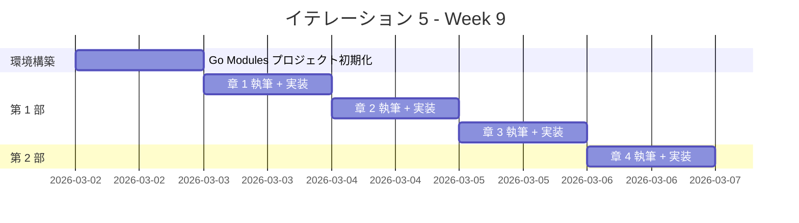
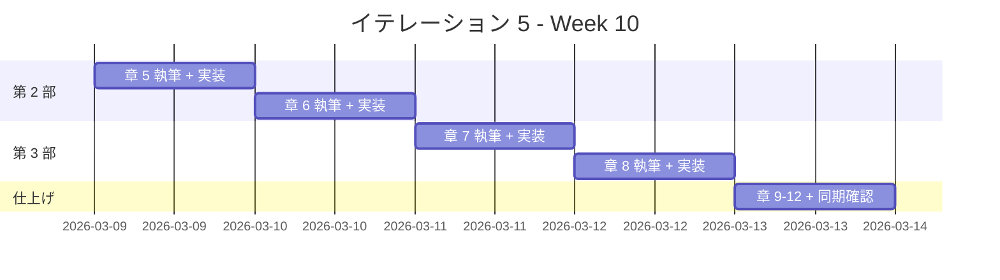

# イテレーション 5 計画

## 概要

| 項目 | 内容 |
|------|------|
| **イテレーション** | 5 |
| **期間** | Week 9-10（2 週間） |
| **ゴール** | Go の全 12 章の記事執筆と実装を完了する |
| **目標 SP** | 10 |

---

## ゴール

### イテレーション終了時の達成状態

1. **記事**: Go の 12 章すべてが `docs/article/go/` に執筆完了
2. **実装**: `apps/go/` に TDD で実装したコードが動作する状態
3. **品質**: テスト全パス、golangci-lint 違反ゼロ、カバレッジ 80% 以上

### 成功基準

- [x] docs/article/go/index.md と 12 章の記事ファイルが作成済み
- [x] apps/go/ の Go テストがすべてパス（109 テスト PASS）
- [x] mkdocs.yml に Go セクションが追加され、プレビュー確認済み
- [ ] テストカバレッジ 80% 以上
- [x] golangci-lint 違反ゼロ
- [x] 記事内コード例と apps/go/ の実コードが同期

---

## ベロシティトレンド分析（4 イテレーション実績）

### 実績データ

| イテレーション | 言語 | 計画 SP | 実績 SP | 達成率 |
|---------------|------|---------|---------|--------|
| IT1 | Java | 10 | 10 | 100% |
| IT2 | Python | 10 | 10 | 100% |
| IT3 | Node（JS/TS） | 13 | 13 | 100% |
| IT4 | Ruby | 13 | 13 | 100% |
| **平均** | | **11.5** | **11.5** | **100%** |

### 分析

- **平均ベロシティ**: 11.5 SP/イテレーション
- **最大ベロシティ**: 13 SP（IT3, IT4）
- **達成率**: 全イテレーション 100%
- **トレンド**: 安定（テンプレート再利用効果が定着）

### IT5 見通し

- IT5 の目標 10 SP は Phase 1 の平均（11.5 SP）を下回り、達成可能性が高い
- Go は 3 エピソード言語のため第 4 部は Go 固有の FP 機能（ファーストクラス関数、クロージャ、ジェネリクス）で構成
- Wiki に Go エピソード 1-3 の参照資料が揃っており、テンプレート適用が容易
- Go はシンプルな言語設計のため、環境構築と実装の複雑度が低い

---

## ユーザーストーリー

### 対象ストーリー

| ID | ユーザーストーリー | SP | 優先度 |
|----|-------------------|----|----|
| US-005 | Go の TDD 入門記事の執筆と実装 | 10 | 中 |
| **合計** | | **10** | |

### ストーリー詳細

#### US-005: Go の TDD 入門記事の執筆と実装

**ストーリー**:

> プログラミング学習者として、Go で TDD を体験する記事を読みたい。なぜなら、TDD の基本サイクルと Go の特徴（シンプルな型システム、インターフェース、goroutine）を同時に学べるからだ。

**受入条件**:

1. FizzBuzz 問題を題材に TDD サイクル（Red-Green-Refactor）が体験できる
2. 開発環境の構築手順（Go Modules、testing パッケージ、golangci-lint）が記載されている
3. OOP 設計（カプセル化、インターフェースによるポリモーフィズム、デザインパターン）が段階的に解説されている
4. Go 固有の関数型機能（ファーストクラス関数、クロージャ、ジェネリクス）が解説されている
5. 記事内のコード例と apps/go/ の実装が一致している

### タスク

#### 0. 環境構築（1 SP）

| # | タスク | 見積もり | 担当 | 状態 |
|---|--------|---------|------|------|
| 0.1 | apps/go/ に Go Modules プロジェクトを初期化（go mod init） | 0.5h | AI | [x] |
| 0.2 | testing パッケージ + testify（任意）のセットアップ | 0.5h | AI | [x] |
| 0.3 | golangci-lint 設定ファイル（.golangci.yml）の作成 | 0.5h | AI | [x] |
| 0.4 | Makefile（テスト・lint・カバレッジタスク）の作成 | 0.5h | AI | [x] |
| 0.5 | docs/article/go/index.md を作成 | 0.5h | AI | [x] |

**小計**: 2.5h（理想時間）

#### 1. 第 1 部: TDD の基本サイクル（3 SP）

| # | タスク | 見積もり | 担当 | 状態 |
|---|--------|---------|------|------|
| 1.1 | 章 1: TODO リストと最初のテスト - 執筆 | 2h | AI | [x] |
| 1.2 | 章 1: TODO リストと最初のテスト - 実装 | 1h | AI | [x] |
| 1.3 | 章 2: 仮実装と三角測量 - 執筆 | 2h | AI | [x] |
| 1.4 | 章 2: 仮実装と三角測量 - 実装 | 1h | AI | [x] |
| 1.5 | 章 3: 明白な実装とリファクタリング - 執筆 | 2h | AI | [x] |
| 1.6 | 章 3: 明白な実装とリファクタリング - 実装 | 1h | AI | [x] |

**小計**: 9h（理想時間）

**参照**:

- `tmp/k2works-wiki/記事/開発/テスト駆動開発から始めるXX入門/テスト駆動開発から始めるGo入門1.md`

#### 2. 第 2 部: 開発環境と自動化（3 SP）

| # | タスク | 見積もり | 担当 | 状態 |
|---|--------|---------|------|------|
| 2.1 | 章 4: バージョン管理と Conventional Commits - 執筆 | 2h | AI | [x] |
| 2.2 | 章 4: Git 設定と Conventional Commits の適用 - 実装 | 1h | - | [x] |
| 2.3 | 章 5: パッケージ管理と静的解析 - 執筆 | 2h | AI | [x] |
| 2.4 | 章 5: Go Modules / golangci-lint の導入と設定 - 実装 | 1h | Codex | [x] |
| 2.5 | 章 6: タスクランナーと CI/CD - 執筆 | 2h | AI | [x] |
| 2.6 | 章 6: Makefile + GitHub Actions CI 設定 - 実装 | 1h | Codex | [x] |

**小計**: 9h（理想時間）

**参照**:

- `tmp/k2works-wiki/記事/開発/テスト駆動開発から始めるXX入門/テスト駆動開発から始めるGo入門2.md`

#### 3. 第 3 部: オブジェクト指向設計（3 SP）

| # | タスク | 見積もり | 担当 | 状態 |
|---|--------|---------|------|------|
| 3.1 | 章 7: カプセル化とポリモーフィズム - 執筆 | 3h | AI | [x] |
| 3.2 | 章 7: 非公開フィールド / インターフェースによるポリモーフィズム - 実装 | 2h | Codex | [x] |
| 3.3 | 章 8: デザインパターンの適用 - 執筆 | 3h | AI | [x] |
| 3.4 | 章 8: Value Object / First-Class Collection / Command - 実装 | 2h | Codex | [x] |
| 3.5 | 章 9: SOLID 原則とモジュール設計 - 執筆 | 3h | AI | [x] |
| 3.6 | 章 9: パッケージ分割（domain/type, domain/model, application） - 実装 | 2h | Codex | [x] |

**小計**: 15h（理想時間）

**参照**:

- `tmp/k2works-wiki/記事/開発/テスト駆動開発から始めるXX入門/テスト駆動開発から始めるGo入門3.md`

#### 4. 第 4 部: 関数型プログラミング（0 SP — バッファ内）

Go は 3 エピソード言語のため、第 4 部は Go で利用可能な関数型機能の範囲で執筆する。

| # | タスク | 見積もり | 担当 | 状態 |
|---|--------|---------|------|------|
| 4.1 | 章 10: 高階関数と関数合成 - 執筆 | 2h | AI | [x] |
| 4.2 | 章 10: ファーストクラス関数 / クロージャ / 関数合成 - 実装 | 1h | Codex | [x] |
| 4.3 | 章 11: 不変データとパイプライン処理 - 執筆 | 2h | AI | [x] |
| 4.4 | 章 11: スライス操作パイプライン / 不変設計パターン - 実装 | 1h | Codex | [x] |
| 4.5 | 章 12: エラーハンドリングと型安全性 - 執筆 | 2h | AI | [x] |
| 4.6 | 章 12: ジェネリクス / error インターフェース / 型スイッチ - 実装 | 1h | Codex | [x] |
| 4.7 | 記事と実装の同期確認 | 1h | AI | [x] |
| 4.8 | mkdocs.yml 更新とプレビュー確認 | 0.5h | AI | [x] |

**小計**: 10.5h（理想時間）

#### タスク合計

| カテゴリ | SP | 理想時間 | 状態 |
|---------|----|----|------|
| 環境構築 | 1 | 2.5h | [x] |
| 第 1 部: TDD の基本サイクル | 3 | 9h | [x] |
| 第 2 部: 開発環境と自動化 | 3 | 9h | [x] |
| 第 3 部: オブジェクト指向設計 | 3 | 15h | [x] |
| 第 4 部: 関数型プログラミング + 同期確認 | 0 | 10.5h | [x] |
| **合計** | **10** | **46h** | |

**1 SP あたり**: 約 4.6h

---

## スケジュール

### Week 9（Day 1-5）



| 日 | タスク |
|----|--------|
| Day 1 | 環境構築: Go Modules + testing + golangci-lint セットアップ、index.md 作成 |
| Day 2 | 章 1: TODO リストと最初のテスト |
| Day 3 | 章 2: 仮実装と三角測量 |
| Day 4 | 章 3: 明白な実装とリファクタリング |
| Day 5 | 章 4: バージョン管理と Conventional Commits |

### Week 10（Day 6-10）



| 日 | タスク |
|----|--------|
| Day 6 | 章 5: パッケージ管理と静的解析（Go Modules、golangci-lint） |
| Day 7 | 章 6: タスクランナーと CI/CD（Makefile、GitHub Actions） |
| Day 8 | 章 7: カプセル化とポリモーフィズム（非公開フィールド、インターフェース） |
| Day 9 | 章 8: デザインパターンの適用（Command、Factory） |
| Day 10 | 章 9-12 仕上げ、同期確認、mkdocs 更新 |

---

## 設計メモ

### 他言語との対比

| 概念 | Java（IT1） | Python（IT2） | Node/TS（IT3） | Ruby（IT4） | Go（IT5） |
|------|-----------|-------------|---------------|------------|-----------|
| テストフレームワーク | JUnit 5 | pytest | Vitest | Minitest | testing（標準） |
| パッケージマネージャ | Gradle | uv | npm | Bundler | Go Modules |
| リンター | Checkstyle + PMD | Ruff | ESLint | RuboCop | golangci-lint |
| フォーマッター | Checkstyle | Ruff（統合） | Prettier | RuboCop（統合） | gofmt（標準） |
| カバレッジ | JaCoCo | pytest-cov | c8 | SimpleCov | go test -cover |
| タスクランナー | Gradle タスク | tox | npm scripts / Gulp | Rake | Makefile |
| 抽象クラス | abstract class | abc.ABC | abstract class（TS） | モジュール / ダックタイピング | インターフェース |
| カプセル化 | private + getter | @property | private（TS） | attr_reader / attr_accessor | 非公開フィールド（小文字） |
| 型安全 | コンパイル時型検査 | mypy | tsc | RBS / Steep（任意） | コンパイル時型検査 |
| インターフェース | interface | Protocol / ABC | interface（TS） | ダックタイピング / module | interface（暗黙的） |

### ディレクトリ構成（予定）

```
apps/go/
├── go.mod
├── go.sum
├── Makefile
├── .golangci.yml
├── main.go                          (エントリポイント)
├── fizzbuzz.go                      (バレルファイル / パッケージ)
├── fizzbuzz_test.go                 (テスト)
├── domain/
│   ├── model/
│   │   ├── fizz_buzz_value.go       (値オブジェクト)
│   │   ├── fizz_buzz_value_test.go
│   │   ├── fizz_buzz_list.go        (ファーストクラスコレクション)
│   │   └── fizz_buzz_list_test.go
│   └── type/
│       ├── fizz_buzz_type.go        (インターフェース + ファクトリ)
│       ├── fizz_buzz_type_01.go     (タイプ 1: 通常)
│       ├── fizz_buzz_type_02.go     (タイプ 2: 数値のみ)
│       ├── fizz_buzz_type_03.go     (タイプ 3: FizzBuzz のみ)
│       └── fizz_buzz_type_test.go
└── application/
    ├── fizz_buzz_command.go          (コマンドインターフェース)
    ├── fizz_buzz_value_command.go    (単一値コマンド)
    ├── fizz_buzz_list_command.go     (リストコマンド)
    └── fizz_buzz_command_test.go
```

### テスティングフレームワーク

| ツール | 用途 |
|--------|------|
| testing（標準） | ユニットテスト |
| go test -cover | カバレッジ計測 |
| golangci-lint | リンター（複数ルール統合） |
| gofmt | フォーマッター（標準） |
| Makefile | タスクランナー |

### Go 固有の特徴

| 機能 | 章 | 内容 |
|------|-----|------|
| インターフェース（暗黙的実装） | 7 | ダックタイピング的なインターフェース |
| 構造体埋め込み（Embedding） | 8 | 継承の代わりのコンポジション |
| パッケージによるカプセル化 | 9 | 大文字/小文字による公開/非公開 |
| ファーストクラス関数 | 10 | 関数型、クロージャ |
| スライス操作 | 11 | map/filter/reduce 相当の実装 |
| ジェネリクス（Go 1.18+） | 12 | 型パラメータ、型制約 |
| error インターフェース | 12 | Go 固有のエラーハンドリング |
| 型スイッチ（type switch） | 12 | パターンマッチング相当 |

---

## Nix 環境

```
nix develop .#go
```

| パッケージ | バージョン |
|-----------|-----------|
| Go | 1.25.5 |
| gopls | 0.21.0 |
| gotools | 0.34.0 |
| delve | 1.26.0（デバッガ） |
| golangci-lint | 2.7.2 |

---

## IT1-IT4 からの学び（適用事項）

| 学び | IT5 での適用 |
|------|-------------|
| 1 章単位の Codex 委託が最適 | 同じ粒度で委託する |
| 部完了時に進捗更新 | 部完了ごとに進捗ドキュメントを更新する |
| カバレッジは equals/hashCode 等の分岐に注意 | Go の String()/Equal() メソッドのテストを含める |
| fullCheck を CI で自動化推奨 | Makefile で lint + test + coverage を統合し CI で実行 |
| テンプレート再利用が効果的 | IT1-IT4 の記事テンプレートを Go 向けに適用する |
| 循環参照回避パターンを指示に含める | Go のパッケージ循環インポート禁止ルールを指示に明示する |
| 3 エピソード言語の第 4 部テンプレートを標準化 | Go 固有の FP 機能（関数型、ジェネリクス）で第 4 部を構成 |
| Python の uv 等、Nix 環境内のツール確認が重要 | Go は標準ツール（go test, gofmt）が中心で問題が少ない |

---

## リスクと対策

| リスク | 影響度 | 対策 |
|--------|--------|------|
| Go にクラスがないため OOP 章の構成が難しい | 中 | インターフェース + 構造体埋め込みで OOP パターンを表現 |
| Go の標準 testing に assert がない | 低 | テーブル駆動テストと t.Errorf で十分対応可能、必要なら testify を導入 |
| 第 4 部の関数型機能が他言語より限定的 | 中 | ジェネリクス（1.18+）と error 型で Go らしい FP を表現 |
| Go のパッケージ循環インポート禁止 | 低 | ディレクトリ設計時にパッケージ依存方向を明確化 |
| Go の暗黙的インターフェース実装で混乱 | 低 | 記事で Java/TS のインターフェースとの違いを明示的に解説 |

---

## 完了条件

### Definition of Done

- [ ] 12 章の記事ファイルが docs/article/go/ に存在
- [ ] apps/go/ の全テストがパス
- [ ] テストカバレッジ 80% 以上
- [ ] golangci-lint 違反ゼロ
- [ ] mkdocs.yml に Go セクションが追加済み
- [ ] ローカルプレビューで表示確認済み
- [ ] 記事内コード例と apps/go/ の実コードが同期

### デモ項目

1. FizzBuzz の TDD サイクルを実演（Red → Green → Refactor）
2. OOP リファクタリングの段階を示す（関数 → 構造体 → インターフェースポリモーフィズム）
3. Go 固有の FP 機能を示す（ファーストクラス関数、クロージャ、ジェネリクス）
4. テーブル駆動テストの実演
5. MkDocs で Go 記事をブラウザ表示

---

## 更新履歴

| 日付 | 更新内容 | 更新者 |
|------|---------|--------|
| 2026-03-02 | 初版作成 | AI |

---

## 関連ドキュメント

- [リリース計画](./release_plan.md)
- [イテレーション 1 計画](./iteration_plan-1.md)
- [イテレーション 1 完了報告書](./iteration_report-1.md)
- [イテレーション 2 計画](./iteration_plan-2.md)
- [イテレーション 2 完了報告書](./iteration_report-2.md)
- [イテレーション 3 計画](./iteration_plan-3.md)
- [イテレーション 3 完了報告書](./iteration_report-3.md)
- [イテレーション 4 計画](./iteration_plan-4.md)
- [イテレーション 4 完了報告書](./iteration_report-4.md)
- [執筆計画アウトライン](../article/outline.md)
- [執筆ワークフロー](../article/workflow.md)
- [Wiki 参照: Go エピソード 1](../../tmp/k2works-wiki/記事/開発/テスト駆動開発から始めるXX入門/テスト駆動開発から始めるGo入門1.md)
- [Wiki 参照: Go エピソード 2](../../tmp/k2works-wiki/記事/開発/テスト駆動開発から始めるXX入門/テスト駆動開発から始めるGo入門2.md)
- [Wiki 参照: Go エピソード 3](../../tmp/k2works-wiki/記事/開発/テスト駆動開発から始めるXX入門/テスト駆動開発から始めるGo入門3.md)
