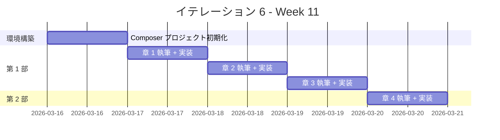
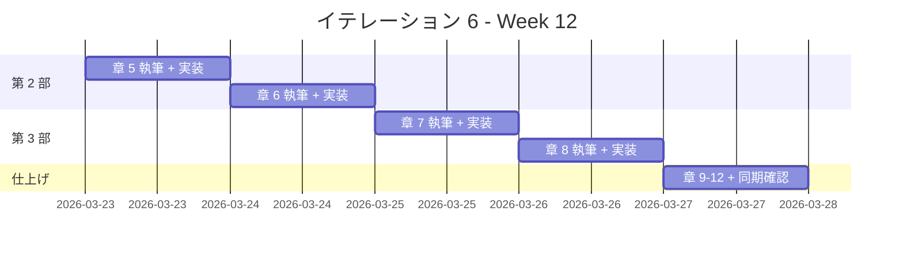

# イテレーション 6 計画

## 概要

| 項目 | 内容 |
|------|------|
| **イテレーション** | 6 |
| **期間** | Week 11-12（2 週間） |
| **ゴール** | PHP の全 12 章の記事執筆と実装を完了する |
| **目標 SP** | 10 |

---

## ゴール

### イテレーション終了時の達成状態

1. **記事**: PHP の 12 章すべてが `docs/article/php/` に執筆完了
2. **実装**: `apps/php/` に TDD で実装したコードが動作する状態
3. **品質**: テスト全パス、PHP_CodeSniffer / PHPStan 違反ゼロ、カバレッジ 80% 以上

### 成功基準

- [ ] docs/article/php/index.md と 12 章の記事ファイルが作成済み
- [ ] apps/php/ の PHPUnit テストがすべてパス
- [ ] mkdocs.yml に PHP セクションが追加され、プレビュー確認済み
- [ ] テストカバレッジ 80% 以上
- [ ] PHP_CodeSniffer / PHPStan 違反ゼロ
- [ ] 記事内コード例と apps/php/ の実コードが同期

---

## ベロシティトレンド分析（5 イテレーション実績）

### 実績データ

| イテレーション | 言語 | 計画 SP | 実績 SP | 達成率 |
|---------------|------|---------|---------|--------|
| IT1 | Java | 10 | 10 | 100% |
| IT2 | Python | 10 | 10 | 100% |
| IT3 | Node（JS/TS） | 13 | 13 | 100% |
| IT4 | Ruby | 13 | 13 | 100% |
| IT5 | Go | 10 | 10 | 100% |
| **平均** | | **11.2** | **11.2** | **100%** |

### 分析

- **平均ベロシティ**: 11.2 SP/イテレーション
- **最大ベロシティ**: 13 SP（IT3, IT4）
- **達成率**: 全イテレーション 100%
- **トレンド**: 安定（テンプレート再利用効果が定着）

### IT6 見通し

- IT6 の目標 10 SP は平均ベロシティ（11.2 SP）を下回り、達成可能性が高い
- PHP は 3 エピソード言語のため第 4 部は PHP 固有の FP 機能（アロー関数、array_map/filter/reduce、クロージャ）で構成
- Wiki に PHP エピソード 1-3 の参照資料（計 2,557 行）が揃っており、テンプレート適用が容易
- PHP は Web 開発で広く使われる言語で、Composer + PHPUnit の環境構築は標準的

---

## ユーザーストーリー

### 対象ストーリー

| ID | ユーザーストーリー | SP | 優先度 |
|----|-------------------|----|----|
| US-006 | PHP の TDD 入門記事の執筆と実装 | 10 | 中 |
| **合計** | | **10** | |

### ストーリー詳細

#### US-006: PHP の TDD 入門記事の執筆と実装

**ストーリー**:

> プログラミング学習者として、PHP で TDD を体験する記事を読みたい。なぜなら、TDD の基本サイクルと PHP の特徴（型宣言、名前空間、Composer エコシステム）を同時に学べるからだ。

**受入条件**:

1. FizzBuzz 問題を題材に TDD サイクル（Red-Green-Refactor）が体験できる
2. 開発環境の構築手順（Composer、PHPUnit、PHP_CodeSniffer / PHPStan）が記載されている
3. OOP 設計（カプセル化、インターフェースによるポリモーフィズム、デザインパターン）が段階的に解説されている
4. PHP 固有の関数型機能（アロー関数、array_map/filter/reduce、クロージャ）が解説されている
5. 記事内のコード例と apps/php/ の実装が一致している

### タスク

#### 0. 環境構築（1 SP）

| # | タスク | 見積もり | 担当 | 状態 |
|---|--------|---------|------|------|
| 0.1 | apps/php/ に Composer プロジェクトを初期化（composer init） | 0.5h | AI | [x] |
| 0.2 | PHPUnit のセットアップ（phpunit.xml 作成） | 0.5h | AI | [x] |
| 0.3 | PHP_CodeSniffer / PHPStan 設定ファイルの作成 | 0.5h | AI | [x] |
| 0.4 | Composer scripts（テスト・lint・カバレッジタスク）の設定 | 0.5h | AI | [x] |
| 0.5 | docs/article/php/index.md を作成 | 0.5h | AI | [x] |

**小計**: 2.5h（理想時間）

#### 1. 第 1 部: TDD の基本サイクル（3 SP）

| # | タスク | 見積もり | 担当 | 状態 |
|---|--------|---------|------|------|
| 1.1 | 章 1: TODO リストと最初のテスト - 執筆 | 2h | AI | [x] |
| 1.2 | 章 1: TODO リストと最初のテスト - 実装 | 1h | Codex | [x] |
| 1.3 | 章 2: 仮実装と三角測量 - 執筆 | 2h | AI | [x] |
| 1.4 | 章 2: 仮実装と三角測量 - 実装 | 1h | Codex | [x] |
| 1.5 | 章 3: 明白な実装とリファクタリング - 執筆 | 2h | AI | [x] |
| 1.6 | 章 3: 明白な実装とリファクタリング - 実装 | 1h | Codex | [x] |

**小計**: 9h（理想時間）

**参照**:

- `tmp/k2works-wiki/記事/開発/テスト駆動開発から始めるXX入門/テスト駆動開発から始めるPHP入門1.md`

#### 2. 第 2 部: 開発環境と自動化（3 SP）

| # | タスク | 見積もり | 担当 | 状態 |
|---|--------|---------|------|------|
| 2.1 | 章 4: バージョン管理と Conventional Commits - 執筆 | 2h | AI | [x] |
| 2.2 | 章 4: Git 設定と Conventional Commits の適用 - 実装 | 1h | - | [x] |
| 2.3 | 章 5: パッケージ管理と静的解析 - 執筆 | 2h | AI | [x] |
| 2.4 | 章 5: Composer / PHP_CodeSniffer / PHPStan の導入と設定 - 実装 | 1h | Codex | [x] |
| 2.5 | 章 6: タスクランナーと CI/CD - 執筆 | 2h | AI | [x] |
| 2.6 | 章 6: Composer scripts + GitHub Actions CI 設定 - 実装 | 1h | Codex | [x] |

**小計**: 9h（理想時間）

**参照**:

- `tmp/k2works-wiki/記事/開発/テスト駆動開発から始めるXX入門/テスト駆動開発から始めるPHP入門2.md`

#### 3. 第 3 部: オブジェクト指向設計（3 SP）

| # | タスク | 見積もり | 担当 | 状態 |
|---|--------|---------|------|------|
| 3.1 | 章 7: カプセル化とポリモーフィズム - 執筆 | 3h | AI | [ ] |
| 3.2 | 章 7: readonly プロパティ / インターフェースによるポリモーフィズム - 実装 | 2h | Codex | [ ] |
| 3.3 | 章 8: デザインパターンの適用 - 執筆 | 3h | AI | [ ] |
| 3.4 | 章 8: Value Object / First-Class Collection / Command - 実装 | 2h | Codex | [ ] |
| 3.5 | 章 9: SOLID 原則とモジュール設計 - 執筆 | 3h | AI | [ ] |
| 3.6 | 章 9: 名前空間分割（Domain/Type, Domain/Model, Application） - 実装 | 2h | Codex | [ ] |

**小計**: 15h（理想時間）

**参照**:

- `tmp/k2works-wiki/記事/開発/テスト駆動開発から始めるXX入門/テスト駆動開発から始めるPHP入門3.md`

#### 4. 第 4 部: 関数型プログラミング（0 SP — バッファ内）

PHP は 3 エピソード言語のため、第 4 部は PHP で利用可能な関数型機能の範囲で執筆する。

| # | タスク | 見積もり | 担当 | 状態 |
|---|--------|---------|------|------|
| 4.1 | 章 10: 高階関数と関数合成 - 執筆 | 2h | AI | [ ] |
| 4.2 | 章 10: アロー関数 / クロージャ / array_map - 実装 | 1h | Codex | [ ] |
| 4.3 | 章 11: 不変データとパイプライン処理 - 執筆 | 2h | AI | [ ] |
| 4.4 | 章 11: array_filter / array_reduce / パイプライン - 実装 | 1h | Codex | [ ] |
| 4.5 | 章 12: エラーハンドリングと型安全性 - 執筆 | 2h | AI | [ ] |
| 4.6 | 章 12: 例外 / 列挙型（PHP 8.1+）/ match 式 - 実装 | 1h | Codex | [ ] |
| 4.7 | 記事と実装の同期確認 | 1h | AI | [ ] |
| 4.8 | mkdocs.yml 更新とプレビュー確認 | 0.5h | AI | [ ] |

**小計**: 10.5h（理想時間）

#### タスク合計

| カテゴリ | SP | 理想時間 | 状態 |
|---------|----|----|------|
| 環境構築 | 1 | 2.5h | [ ] |
| 第 1 部: TDD の基本サイクル | 3 | 9h | [ ] |
| 第 2 部: 開発環境と自動化 | 3 | 9h | [ ] |
| 第 3 部: オブジェクト指向設計 | 3 | 15h | [ ] |
| 第 4 部: 関数型プログラミング + 同期確認 | 0 | 10.5h | [ ] |
| **合計** | **10** | **46h** | |

**1 SP あたり**: 約 4.6h

---

## スケジュール

### Week 11（Day 1-5）



| 日 | タスク |
|----|--------|
| Day 1 | 環境構築: Composer + PHPUnit + PHP_CodeSniffer + PHPStan セットアップ、index.md 作成 |
| Day 2 | 章 1: TODO リストと最初のテスト |
| Day 3 | 章 2: 仮実装と三角測量 |
| Day 4 | 章 3: 明白な実装とリファクタリング |
| Day 5 | 章 4: バージョン管理と Conventional Commits |

### Week 12（Day 6-10）



| 日 | タスク |
|----|--------|
| Day 6 | 章 5: パッケージ管理と静的解析（Composer、PHP_CodeSniffer、PHPStan） |
| Day 7 | 章 6: タスクランナーと CI/CD（Composer scripts、GitHub Actions） |
| Day 8 | 章 7: カプセル化とポリモーフィズム（readonly プロパティ、インターフェース） |
| Day 9 | 章 8: デザインパターンの適用（Command、Factory） |
| Day 10 | 章 9-12 仕上げ、同期確認、mkdocs 更新 |

---

## 設計メモ

### 他言語との対比

| 概念 | Java（IT1） | Python（IT2） | Node/TS（IT3） | Ruby（IT4） | Go（IT5） | PHP（IT6） |
|------|-----------|-------------|---------------|------------|-----------|-----------|
| テストフレームワーク | JUnit 5 | pytest | Vitest | Minitest | testing（標準） | PHPUnit |
| パッケージマネージャ | Gradle | uv | npm | Bundler | Go Modules | Composer |
| リンター | Checkstyle + PMD | Ruff | ESLint | RuboCop | golangci-lint | PHP_CodeSniffer |
| 静的解析 | - | mypy | tsc | Steep（任意） | go vet | PHPStan |
| フォーマッター | Checkstyle | Ruff（統合） | Prettier | RuboCop（統合） | gofmt（標準） | PHP CS Fixer |
| カバレッジ | JaCoCo | pytest-cov | c8 | SimpleCov | go test -cover | PHPUnit --coverage |
| タスクランナー | Gradle タスク | tox | npm scripts / Gulp | Rake | Makefile | Composer scripts |
| 抽象クラス | abstract class | abc.ABC | abstract class（TS） | モジュール / ダックタイピング | インターフェース | abstract class / interface |
| カプセル化 | private + getter | @property | private（TS） | attr_reader / attr_accessor | 非公開フィールド（小文字） | private + readonly（8.1+） |
| 型安全 | コンパイル時型検査 | mypy | tsc | RBS / Steep（任意） | コンパイル時型検査 | 型宣言 + PHPStan |
| インターフェース | interface | Protocol / ABC | interface（TS） | ダックタイピング / module | interface（暗黙的） | interface（明示的） |

### ディレクトリ構成（予定）

```
apps/php/
├── composer.json
├── composer.lock
├── phpunit.xml
├── phpstan.neon
├── phpcs.xml
├── src/
│   ├── FizzBuzz.php                         (公開 API)
│   ├── Domain/
│   │   ├── Model/
│   │   │   ├── FizzBuzzValue.php            (値オブジェクト)
│   │   │   └── FizzBuzzList.php             (ファーストクラスコレクション)
│   │   └── Type/
│   │       ├── FizzBuzzType.php             (インターフェース)
│   │       ├── FizzBuzzType01.php           (タイプ 1: 通常)
│   │       ├── FizzBuzzType02.php           (タイプ 2: 数値のみ)
│   │       └── FizzBuzzType03.php           (タイプ 3: FizzBuzz のみ)
│   └── Application/
│       ├── FizzBuzzCommand.php              (コマンドインターフェース)
│       ├── FizzBuzzValueCommand.php         (単一値コマンド)
│       └── FizzBuzzListCommand.php          (リストコマンド)
└── tests/
    ├── FizzBuzzTest.php                     (統合テスト)
    ├── Domain/
    │   ├── Model/
    │   │   ├── FizzBuzzValueTest.php
    │   │   └── FizzBuzzListTest.php
    │   └── Type/
    │       └── FizzBuzzTypeTest.php
    └── Application/
        └── FizzBuzzCommandTest.php
```

### テスティングフレームワーク

| ツール | 用途 |
|--------|------|
| PHPUnit | ユニットテスト |
| PHPUnit --coverage | カバレッジ計測 |
| PHP_CodeSniffer（phpcs） | コーディング規約チェック |
| PHPStan | 静的解析 |
| PHP CS Fixer（任意） | コードフォーマット |
| Composer scripts | タスクランナー |

### PHP 固有の特徴

| 機能 | 章 | 内容 |
|------|-----|------|
| 型宣言（Type Declarations） | 1-3 | int, string, array の型指定 |
| 名前空間（Namespaces） | 5, 9 | PSR-4 オートロード、名前空間によるモジュール分割 |
| readonly プロパティ（PHP 8.1+） | 7 | 不変なプロパティ宣言 |
| インターフェース（interface） | 7 | 明示的な契約、implements キーワード |
| enum（PHP 8.1+） | 8, 12 | 列挙型によるタイプセーフな定数 |
| match 式（PHP 8.0+） | 3, 12 | switch の型安全な代替 |
| アロー関数（fn =>） | 10 | 簡潔な無名関数構文 |
| array_map / array_filter / array_reduce | 10, 11 | 配列操作の関数型アプローチ |
| クロージャ（Closure） | 10 | 無名関数とスコープバインディング |
| 例外処理（try-catch） | 9, 12 | SPL 例外クラス、カスタム例外 |
| コンストラクタプロモーション（PHP 8.0+） | 7 | `__construct(private readonly ...)` |

---

## Nix 環境

```
nix develop .#php
```

| パッケージ | 用途 |
|-----------|------|
| PHP | 実行環境（8.3+） |
| Composer | パッケージ管理 |
| PHPActor | LSP サーバー |

**注**: PHPUnit、PHP_CodeSniffer、PHPStan は Composer の dev-dependencies として管理する。

---

## IT1-IT5 からの学び（適用事項）

| 学び | IT6 での適用 |
|------|-------------|
| 1 章単位の Codex 委託が最適 | 同じ粒度で委託する |
| 部完了時に進捗更新 | 部完了ごとに進捗ドキュメントを更新する |
| カバレッジは equals/hashCode 等の分岐に注意 | PHP の __toString() / equals() メソッドのテストを含める |
| fullCheck を CI で自動化推奨 | Composer scripts で lint + test + coverage を統合し CI で実行 |
| テンプレート再利用が効果的 | IT1-IT5 の記事テンプレートを PHP 向けに適用する |
| 循環参照回避パターンを指示に含める | PHP の名前空間依存方向を指示に明示する |
| 3 エピソード言語の第 4 部テンプレートを標準化 | PHP 固有の FP 機能（アロー関数、array_* 関数）で第 4 部を構成 |
| golangci-lint の Nix 環境依存に注意（IT5） | PHPUnit / phpcs / phpstan は Composer 管理のため環境依存が少ない |

---

## リスクと対策

| リスク | 影響度 | 対策 |
|--------|--------|------|
| PHP のバージョン差異（8.0 vs 8.1 vs 8.3） | 中 | readonly、enum は PHP 8.1+ を前提とし、Nix 環境で 8.3+ を使用 |
| PHP_CodeSniffer と PHPStan の設定が複雑 | 低 | PSR-12 をベースに最小限の設定で開始 |
| PHP の配列が複合型（連想配列 + インデックス配列） | 低 | 型宣言と PHPStan の array shape で明示的に型を指定 |
| Composer オートロードの PSR-4 設定 | 低 | 標準的な PSR-4 設定を適用（src/ → App\） |
| PHP にジェネリクスがない | 中 | PHPStan の @template アノテーションで擬似的に対応、記事で Go/TS との違いを解説 |

---

## 完了条件

### Definition of Done

- [ ] 12 章の記事ファイルが docs/article/php/ に存在
- [ ] apps/php/ の全テストがパス
- [ ] テストカバレッジ 80% 以上
- [ ] PHP_CodeSniffer / PHPStan 違反ゼロ
- [ ] mkdocs.yml に PHP セクションが追加済み
- [ ] ローカルプレビューで表示確認済み
- [ ] 記事内コード例と apps/php/ の実コードが同期

### デモ項目

1. FizzBuzz の TDD サイクルを実演（Red → Green → Refactor）
2. OOP リファクタリングの段階を示す（関数 → クラス → インターフェースポリモーフィズム）
3. PHP 固有の FP 機能を示す（アロー関数、array_map/filter/reduce、クロージャ）
4. PHP 8.1+ の機能を示す（readonly プロパティ、enum、match 式）
5. MkDocs で PHP 記事をブラウザ表示

---

## 更新履歴

| 日付 | 更新内容 | 更新者 |
|------|---------|--------|
| 2026-03-02 | 初版作成 | AI |

---

## 関連ドキュメント

- [リリース計画](./release_plan.md)
- [イテレーション 5 計画](./iteration_plan-5.md)
- [イテレーション 5 完了報告書](./iteration_report-5.md)
- [執筆計画アウトライン](../article/outline.md)
- [執筆ワークフロー](../article/workflow.md)
- [Wiki 参照: PHP エピソード 1](../../tmp/k2works-wiki/記事/開発/テスト駆動開発から始めるXX入門/テスト駆動開発から始めるPHP入門1.md)
- [Wiki 参照: PHP エピソード 2](../../tmp/k2works-wiki/記事/開発/テスト駆動開発から始めるXX入門/テスト駆動開発から始めるPHP入門2.md)
- [Wiki 参照: PHP エピソード 3](../../tmp/k2works-wiki/記事/開発/テスト駆動開発から始めるXX入門/テスト駆動開発から始めるPHP入門3.md)
