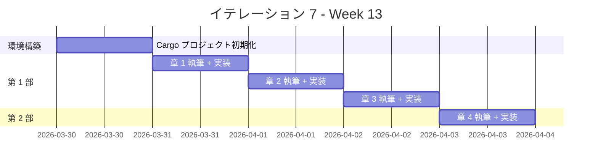
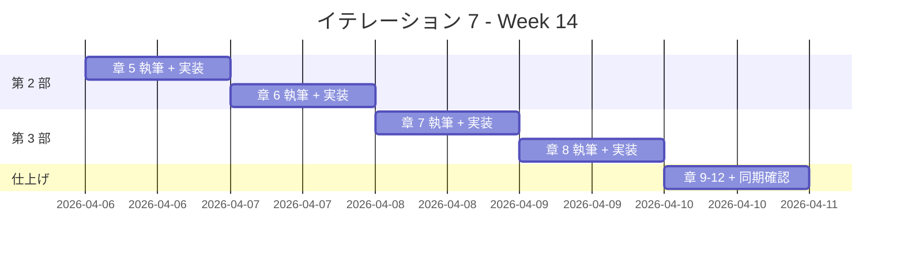

# イテレーション 7 計画

## 概要

| 項目 | 内容 |
|------|------|
| **イテレーション** | 7 |
| **期間** | Week 13-14（2 週間） |
| **ゴール** | Rust の全 12 章の記事執筆と実装を完了する |
| **目標 SP** | 10 |

---

## ゴール

### イテレーション終了時の達成状態

1. **記事**: Rust の 12 章すべてが `docs/article/rust/` に執筆完了
2. **実装**: `apps/rust/` に TDD で実装したコードが動作する状態
3. **品質**: テスト全パス、Clippy / rustfmt 違反ゼロ、カバレッジ 80% 以上

### 成功基準

- [x] docs/article/rust/index.md と 12 章の記事ファイルが作成済み
- [x] apps/rust/ の cargo test がすべてパス（47 テスト）
- [x] mkdocs.yml に Rust セクションが追加され、プレビュー確認済み
- [x] Clippy 警告ゼロ
- [x] rustfmt 違反ゼロ
- [x] 記事内コード例と apps/rust/ の実コードが同期

---

## ベロシティトレンド分析（6 イテレーション実績）

### 実績データ

| イテレーション | 言語 | 計画 SP | 実績 SP | 達成率 |
|---------------|------|---------|---------|--------|
| IT1 | Java | 10 | 10 | 100% |
| IT2 | Python | 10 | 10 | 100% |
| IT3 | Node（JS/TS） | 13 | 13 | 100% |
| IT4 | Ruby | 13 | 13 | 100% |
| IT5 | Go | 10 | 10 | 100% |
| IT6 | PHP | 10 | 10 | 100% |
| **平均** | | **11.0** | **11.0** | **100%** |

### 分析

- **平均ベロシティ**: 11.0 SP/イテレーション
- **最大ベロシティ**: 13 SP（IT3, IT4）
- **達成率**: 全イテレーション 100%
- **トレンド**: 安定（テンプレート再利用効果が定着）

### IT7 見通し

- IT7 の目標 10 SP は平均ベロシティ（11.0 SP）を下回り、達成可能性が高い
- Rust は 3 エピソード言語のため第 4 部は Rust 固有の FP 機能（クロージャ、イテレータ、Result/Option）で構成
- Wiki に Rust エピソード 1-3 の参照資料（計 3,260 行）が揃っており、テンプレート適用が容易
- Rust は所有権・借用・ライフタイムが独自の概念であり、他言語との差異が大きい
- Nix 環境で rustc 1.91.1 + cargo 1.91.0 が利用可能

---

## ユーザーストーリー

### 対象ストーリー

| ID | ユーザーストーリー | SP | 優先度 |
|----|-------------------|----|----|
| US-007 | Rust の TDD 入門記事の執筆と実装 | 10 | 中 |
| **合計** | | **10** | |

### ストーリー詳細

#### US-007: Rust の TDD 入門記事の執筆と実装

**ストーリー**:

> プログラミング学習者として、Rust で TDD を体験する記事を読みたい。なぜなら、TDD の基本サイクルと Rust の特徴（所有権、トレイト、Result 型、モジュールシステム）を同時に学べるからだ。

**受入条件**:

1. FizzBuzz 問題を題材に TDD サイクル（Red-Green-Refactor）が体験できる
2. 開発環境の構築手順（Cargo、Clippy、rustfmt）が記載されている
3. OOP 設計（カプセル化、トレイトによるポリモーフィズム、デザインパターン）が段階的に解説されている
4. Rust 固有の機能（所有権・借用、クロージャ、イテレータ、Result/Option 型）が解説されている
5. 記事内のコード例と apps/rust/ の実装が一致している

### タスク

#### 0. 環境構築（1 SP）

| # | タスク | 見積もり | 担当 | 状態 |
|---|--------|---------|------|------|
| 0.1 | apps/rust/ に Cargo プロジェクトを初期化（cargo new） | 0.5h | AI | [x] |
| 0.2 | テスト構成の確認（cargo test） | 0.5h | AI | [x] |
| 0.3 | Clippy / rustfmt 設定の確認 | 0.5h | AI | [x] |
| 0.4 | CI ワークフロー（.github/workflows/rust-ci.yml）の作成 | 0.5h | AI | [x] |
| 0.5 | docs/article/rust/index.md を作成 | 0.5h | AI | [x] |

**小計**: 2.5h（理想時間）

#### 1. 第 1 部: TDD の基本サイクル（3 SP）

| # | タスク | 見積もり | 担当 | 状態 |
|---|--------|---------|------|------|
| 1.1 | 章 1: TODO リストと最初のテスト - 執筆 | 2h | AI | [x] |
| 1.2 | 章 1: TODO リストと最初のテスト - 実装 | 1h | Codex | [x] |
| 1.3 | 章 2: 仮実装と三角測量 - 執筆 | 2h | AI | [x] |
| 1.4 | 章 2: 仮実装と三角測量 - 実装 | 1h | Codex | [x] |
| 1.5 | 章 3: 明白な実装とリファクタリング - 執筆 | 2h | AI | [x] |
| 1.6 | 章 3: 明白な実装とリファクタリング - 実装 | 1h | Codex | [x] |

**小計**: 9h（理想時間）

**参照**:

- `tmp/k2works-wiki/記事/開発/テスト駆動開発から始めるXX入門/テスト駆動開発から始めるRust入門1.md`

#### 2. 第 2 部: 開発環境と自動化（3 SP）

| # | タスク | 見積もり | 担当 | 状態 |
|---|--------|---------|------|------|
| 2.1 | 章 4: バージョン管理と Conventional Commits - 執筆 | 2h | AI | [x] |
| 2.2 | 章 4: Git 設定と Conventional Commits の適用 - 実装 | 1h | - | [x] |
| 2.3 | 章 5: パッケージ管理と静的解析 - 執筆 | 2h | AI | [x] |
| 2.4 | 章 5: Cargo / Clippy / rustfmt の導入と設定 - 実装 | 1h | Codex | [x] |
| 2.5 | 章 6: タスクランナーと CI/CD - 執筆 | 2h | AI | [x] |
| 2.6 | 章 6: Makefile + GitHub Actions CI 設定 - 実装 | 1h | Codex | [x] |

**小計**: 9h（理想時間）

**参照**:

- `tmp/k2works-wiki/記事/開発/テスト駆動開発から始めるXX入門/テスト駆動開発から始めるRust入門2.md`

#### 3. 第 3 部: オブジェクト指向設計（3 SP）

| # | タスク | 見積もり | 担当 | 状態 |
|---|--------|---------|------|------|
| 3.1 | 章 7: カプセル化とポリモーフィズム - 執筆 | 3h | AI | [x] |
| 3.2 | 章 7: struct + impl / trait によるポリモーフィズム - 実装 | 2h | Codex | [x] |
| 3.3 | 章 8: デザインパターンの適用 - 執筆 | 3h | AI | [x] |
| 3.4 | 章 8: Value Object / First-Class Collection / Command - 実装 | 2h | Codex | [x] |
| 3.5 | 章 9: SOLID 原則とモジュール設計 - 執筆 | 3h | AI | [x] |
| 3.6 | 章 9: モジュール分割（domain/types, domain/model, application） - 実装 | 2h | Codex | [x] |

**小計**: 15h（理想時間）

**参照**:

- `tmp/k2works-wiki/記事/開発/テスト駆動開発から始めるXX入門/テスト駆動開発から始めるRust入門3.md`

#### 4. 第 4 部: 関数型プログラミング（0 SP — バッファ内）

Rust は 3 エピソード言語のため、第 4 部は Rust で利用可能な関数型機能の範囲で執筆する。

| # | タスク | 見積もり | 担当 | 状態 |
|---|--------|---------|------|------|
| 4.1 | 章 10: 高階関数と関数合成 - 執筆 | 2h | AI | [x] |
| 4.2 | 章 10: クロージャ / イテレータ / map・filter - 実装 | 1h | Codex | [x] |
| 4.3 | 章 11: 不変データとパイプライン処理 - 執筆 | 2h | AI | [x] |
| 4.4 | 章 11: イテレータチェーン / collect / fold - 実装 | 1h | Codex | [x] |
| 4.5 | 章 12: エラーハンドリングと型安全性 - 執筆 | 2h | AI | [x] |
| 4.6 | 章 12: Result / Option / enum パターンマッチ - 実装 | 1h | Codex | [x] |
| 4.7 | 記事と実装の同期確認 | 1h | AI | [x] |
| 4.8 | mkdocs.yml 更新とプレビュー確認 | 0.5h | AI | [x] |

**小計**: 10.5h（理想時間）

#### タスク合計

| カテゴリ | SP | 理想時間 | 状態 |
|---------|----|----|------|
| 環境構築 | 1 | 2.5h | [x] |
| 第 1 部: TDD の基本サイクル | 3 | 9h | [x] |
| 第 2 部: 開発環境と自動化 | 3 | 9h | [x] |
| 第 3 部: オブジェクト指向設計 | 3 | 15h | [x] |
| 第 4 部: 関数型プログラミング + 同期確認 | 0 | 10.5h | [x] |
| **合計** | **10** | **46h** | |

**1 SP あたり**: 約 4.6h

---

## スケジュール

### Week 13（Day 1-5）



| 日 | タスク |
|----|--------|
| Day 1 | 環境構築: Cargo + Clippy + rustfmt セットアップ、index.md 作成 |
| Day 2 | 章 1: TODO リストと最初のテスト |
| Day 3 | 章 2: 仮実装と三角測量 |
| Day 4 | 章 3: 明白な実装とリファクタリング |
| Day 5 | 章 4: バージョン管理と Conventional Commits |

### Week 14（Day 6-10）



| 日 | タスク |
|----|--------|
| Day 6 | 章 5: パッケージ管理と静的解析（Cargo、Clippy、rustfmt） |
| Day 7 | 章 6: タスクランナーと CI/CD（Makefile、GitHub Actions） |
| Day 8 | 章 7: カプセル化とポリモーフィズム（struct + impl、trait） |
| Day 9 | 章 8: デザインパターンの適用（Command、Strategy、Value Object） |
| Day 10 | 章 9-12 仕上げ、同期確認、mkdocs 更新 |

---

## 設計メモ

### 他言語との対比

| 概念 | Java（IT1） | Python（IT2） | Node/TS（IT3） | Ruby（IT4） | Go（IT5） | PHP（IT6） | Rust（IT7） |
|------|-----------|-------------|---------------|------------|-----------|-----------|------------|
| テストフレームワーク | JUnit 5 | pytest | Vitest | Minitest | testing（標準） | PHPUnit | cargo test（標準） |
| パッケージマネージャ | Gradle | uv | npm | Bundler | Go Modules | Composer | Cargo |
| リンター | Checkstyle + PMD | Ruff | ESLint | RuboCop | golangci-lint | PHP_CodeSniffer + PHPMD | Clippy |
| 静的解析 | - | mypy | tsc | Steep（任意） | go vet | PHPStan | rustc（コンパイラ） |
| フォーマッター | Checkstyle | Ruff（統合） | Prettier | RuboCop（統合） | gofmt（標準） | phpcbf | rustfmt（標準） |
| カバレッジ | JaCoCo | pytest-cov | c8 | SimpleCov | go test -cover | PHPUnit --coverage | cargo-tarpaulin |
| タスクランナー | Gradle タスク | tox | npm scripts / Gulp | Rake | Makefile | Composer scripts | Makefile / cargo-make |
| 抽象クラス | abstract class | abc.ABC | abstract class（TS） | モジュール / ダックタイピング | インターフェース | abstract class / interface | trait |
| カプセル化 | private + getter | @property | private（TS） | attr_reader | 非公開フィールド（小文字） | private + readonly | pub / 非公開（デフォルト） |
| 型安全 | コンパイル時型検査 | mypy | tsc | RBS / Steep（任意） | コンパイル時型検査 | 型宣言 + PHPStan | コンパイル時型検査 + 所有権 |
| インターフェース | interface | Protocol / ABC | interface（TS） | ダックタイピング | interface（暗黙的） | interface（明示的） | trait（明示的） |

### ディレクトリ構成（予定）

```
apps/rust/
├── Cargo.toml
├── Cargo.lock
├── Makefile
├── src/
│   ├── main.rs                              (エントリポイント)
│   ├── lib.rs                               (ライブラリルート)
│   ├── fizz_buzz.rs                         (公開 API)
│   ├── domain/
│   │   ├── mod.rs
│   │   ├── model/
│   │   │   ├── mod.rs
│   │   │   ├── fizz_buzz_value.rs           (値オブジェクト)
│   │   │   └── fizz_buzz_list.rs            (ファーストクラスコレクション)
│   │   └── types/
│   │       ├── mod.rs
│   │       ├── fizz_buzz_type.rs            (トレイト)
│   │       ├── fizz_buzz_type01.rs          (タイプ 1: 通常)
│   │       ├── fizz_buzz_type02.rs          (タイプ 2: 数値のみ)
│   │       └── fizz_buzz_type03.rs          (タイプ 3: FizzBuzz のみ)
│   └── application/
│       ├── mod.rs
│       ├── fizz_buzz_command.rs             (コマンドトレイト)
│       ├── fizz_buzz_value_command.rs       (単一値コマンド)
│       └── fizz_buzz_list_command.rs        (リストコマンド)
└── tests/
    └── integration_test.rs                  (統合テスト)
```

### テスティングフレームワーク

| ツール | 用途 |
|--------|------|
| cargo test | ユニットテスト + 統合テスト |
| cargo-tarpaulin | カバレッジ計測（任意） |
| Clippy | Lint + コード品質チェック |
| rustfmt | コードフォーマット |
| Makefile | タスクランナー |

### Rust 固有の特徴

| 機能 | 章 | 内容 |
|------|-----|------|
| 所有権と借用（Ownership & Borrowing） | 1-3 | ムーブセマンティクス、参照と借用 |
| struct + impl | 7 | 構造体とメソッド実装 |
| trait | 7, 9 | ポリモーフィズム、trait オブジェクト（dyn Trait） |
| enum + パターンマッチ | 3, 12 | 代数的データ型、match 式 |
| Result / Option | 9, 12 | エラーハンドリング、? 演算子 |
| モジュールシステム（mod） | 5, 9 | pub / mod による可視性制御 |
| クロージャ（Closure） | 10 | Fn / FnMut / FnOnce トレイト |
| イテレータ（Iterator） | 10, 11 | map / filter / fold / collect |
| ライフタイム（Lifetime） | 7, 12 | 参照の有効期間 |
| マクロ（macro_rules!） | 3 | assert_eq! / vec! などの標準マクロ |

---

## Nix 環境

```
nix develop .#rust
```

| パッケージ | 用途 |
|-----------|------|
| rustc | コンパイラ（1.91.1） |
| cargo | パッケージマネージャ（1.91.0） |
| rustfmt | コードフォーマッター |
| clippy | Linter |
| rust-analyzer | LSP サーバー |

---

## IT1-IT6 からの学び（適用事項）

| 学び | IT7 での適用 |
|------|-------------|
| 1 章単位の Codex 委託が最適 | 同じ粒度で委託する |
| 部完了時に進捗更新 | 部完了ごとに進捗ドキュメントを更新する |
| Nix 環境を必ず使用する（IT6 の学び） | `nix develop .#rust` で全操作を実行 |
| fullCheck を CI で自動化推奨 | Makefile で lint + test を統合し CI で実行 |
| テンプレート再利用が効果的 | IT1-IT6 の記事テンプレートを Rust 向けに適用する |
| 3 エピソード言語の第 4 部テンプレートを標準化 | Rust 固有の FP 機能（クロージャ、イテレータ、Result/Option）で第 4 部を構成 |
| GitHub Issue の同期を忘れない（IT6 の学び） | 完了時に Issue #7 をクローズする |
| PHPMD 相当の複雑度チェックを導入（IT6 の学び） | Clippy に複雑度関連ルールが内蔵されているため追加設定不要 |

---

## リスクと対策

| リスク | 影響度 | 対策 |
|--------|--------|------|
| 所有権・借用の概念が複雑で記事説明が難しい | 高 | 段階的に導入し、他言語との比較で理解を補助 |
| Rust のコンパイルエラーが厳格で TDD サイクルが遅くなる | 中 | cargo test --lib で素早くフィードバックを得る |
| trait オブジェクト（dyn Trait）と静的ディスパッチの使い分け | 中 | FizzBuzz の規模では Box<dyn Trait> で統一し、記事で違いを解説 |
| Cargo には npm scripts のような簡易タスクランナーがない | 低 | Makefile を採用（Go と同じアプローチ） |
| cargo-tarpaulin が Nix 環境で動作しない可能性 | 低 | カバレッジは任意とし、テスト網羅率で代替 |

---

## 完了条件

### Definition of Done

- [x] 12 章の記事ファイルが docs/article/rust/ に存在
- [x] apps/rust/ の全テストがパス（47 テスト）
- [x] Clippy 警告ゼロ
- [x] rustfmt 違反ゼロ
- [x] mkdocs.yml に Rust セクションが追加済み
- [x] ローカルプレビューで表示確認済み
- [x] 記事内コード例と apps/rust/ の実コードが同期

### デモ項目

1. FizzBuzz の TDD サイクルを実演（Red → Green → Refactor）
2. OOP リファクタリングの段階を示す（関数 → struct → trait ポリモーフィズム）
3. Rust 固有の機能を示す（所有権、借用、trait、enum パターンマッチ）
4. FP 機能を示す（クロージャ、イテレータチェーン、Result/Option）
5. MkDocs で Rust 記事をブラウザ表示

---

## 更新履歴

| 日付 | 更新内容 | 更新者 |
|------|---------|--------|
| 2026-03-02 | 初版作成 | AI |
| 2026-03-02 | 全タスク完了、47 テストパス、Clippy/rustfmt 違反ゼロ | AI |

---

## 関連ドキュメント

- [リリース計画](./release_plan.md)
- [イテレーション 6 計画](./iteration_plan-6.md)
- [執筆計画アウトライン](../article/outline.md)
- [執筆ワークフロー](../article/workflow.md)
- [Wiki 参照: Rust エピソード 1](../../tmp/k2works-wiki/記事/開発/テスト駆動開発から始めるXX入門/テスト駆動開発から始めるRust入門1.md)
- [Wiki 参照: Rust エピソード 2](../../tmp/k2works-wiki/記事/開発/テスト駆動開発から始めるXX入門/テスト駆動開発から始めるRust入門2.md)
- [Wiki 参照: Rust エピソード 3](../../tmp/k2works-wiki/記事/開発/テスト駆動開発から始めるXX入門/テスト駆動開発から始めるRust入門3.md)
