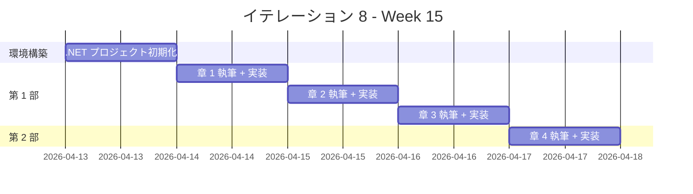
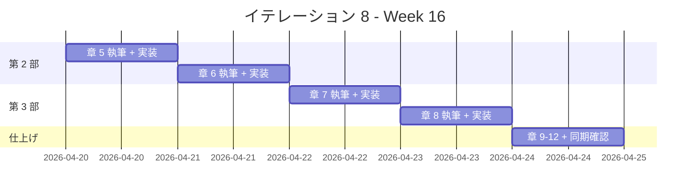

# イテレーション 8 計画

## 概要

| 項目 | 内容 |
|------|------|
| **イテレーション** | 8 |
| **期間** | Week 15-16（2 週間） |
| **ゴール** | C#/F# の全 12 章の記事執筆と実装を完了し、Phase 2 を完了する |
| **目標 SP** | 13 |

---

## ゴール

### イテレーション終了時の達成状態

1. **記事（C#）**: C# の 9 章（第 1-3 部）が `docs/article/csharp/` に執筆完了
2. **記事（F#）**: F# の 3 章（第 4 部）が `docs/article/fsharp/` に執筆完了
3. **実装**: `apps/dotnet/` に TDD で実装したコードが動作する状態
4. **品質**: テスト全パス、dotnet-format 違反ゼロ
5. **Phase 2 完了**: IT5-IT8 の全 4 言語が完了し、Release 2.0 準備完了

### 成功基準

- [ ] docs/article/csharp/index.md と 9 章の記事ファイルが作成済み
- [ ] docs/article/fsharp/index.md と 3 章の記事ファイルが作成済み
- [ ] apps/dotnet/ の dotnet test がすべてパス
- [ ] mkdocs.yml に C# セクションと F# セクションが追加され、プレビュー確認済み
- [ ] dotnet-format 違反ゼロ
- [ ] 記事内コード例と apps/dotnet/ の実コードが同期
- [ ] C# と F# の記事が分離されている

---

## ベロシティトレンド分析（7 イテレーション実績）

### 実績データ

| イテレーション | 言語 | 計画 SP | 実績 SP | 達成率 |
|---------------|------|---------|---------|--------|
| IT1 | Java | 10 | 10 | 100% |
| IT2 | Python | 10 | 10 | 100% |
| IT3 | Node（JS/TS） | 13 | 13 | 100% |
| IT4 | Ruby | 13 | 13 | 100% |
| IT5 | Go | 10 | 10 | 100% |
| IT6 | PHP | 10 | 10 | 100% |
| IT7 | Rust | 10 | 10 | 100% |
| **平均** | | **10.9** | **10.9** | **100%** |

### 分析

- **平均ベロシティ**: 10.9 SP/イテレーション
- **最大ベロシティ**: 13 SP（IT3, IT4）
- **達成率**: 全イテレーション 100%
- **トレンド**: 安定（テンプレート再利用効果が定着）

### IT8 見通し

- IT8 の目標 13 SP は最大ベロシティと同等で、達成可能性が高い
- C#/F# は 4 エピソード言語のため全 4 部構成（C# 第 1-3 部 + F# 第 4 部）
- Wiki に C# エピソード 1-3（計 3,082 行）と F# エピソード 1-4（計 2,863 行）の参照資料が揃っている
- .NET は C# と F# の両言語をサポートし、共通のテストフレームワーク（xUnit）を使用
- Nix 環境で dotnet-sdk が利用可能（`nix develop .#dotnet`）

---

## ユーザーストーリー

### 対象ストーリー

| ID | ユーザーストーリー | SP | 優先度 |
|----|-------------------|----|----|
| US-008 | C#/F#（dotnet）の TDD 入門記事の執筆と実装 | 13 | 中 |
| **合計** | | **13** | |

### ストーリー詳細

#### US-008: C#/F#（dotnet）の TDD 入門記事の執筆と実装

**ストーリー**:

> プログラミング学習者として、C#/F# で TDD を体験する記事を読みたい。なぜなら、TDD の基本サイクルと C# の OOP 機能（interface、abstract class、プロパティ）および F# の関数型プログラミング（判別共用体、パイプライン、パターンマッチ）を同時に学べるからだ。

**受入条件**:

1. FizzBuzz 問題を題材に TDD サイクル（Red-Green-Refactor）が体験できる
2. 開発環境の構築手順（.NET SDK、NuGet、dotnet-format）が記載されている
3. C# の OOP 設計（カプセル化、interface/abstract class によるポリモーフィズム、デザインパターン）が段階的に解説されている
4. F# の関数型プログラミング（パイプライン演算子、判別共用体、パターンマッチ、Result 型）が解説されている
5. 記事内のコード例と apps/dotnet/ の実装が一致している

### タスク

#### 0. 環境構築（1 SP）

| # | タスク | 見積もり | 担当 | 状態 |
|---|--------|---------|------|------|
| 0.1 | apps/dotnet/ に .NET ソリューション + xUnit プロジェクトを作成 | 0.5h | AI | [ ] |
| 0.2 | .gitignore 先行設定（bin/, obj/, .vs/ 除外） | 0.5h | AI | [ ] |
| 0.3 | テスト構成の確認（dotnet test） | 0.5h | AI | [ ] |
| 0.4 | Makefile 作成（check タスク統合） | 0.5h | AI | [ ] |
| 0.5 | CI ワークフロー（.github/workflows/dotnet-ci.yml）の作成 | 0.5h | AI | [ ] |
| 0.6 | docs/article/dotnet/index.md を作成 | 0.5h | AI | [ ] |

**小計**: 3h（理想時間）

#### 1. 第 1 部: TDD の基本サイクル（3 SP）

| # | タスク | 見積もり | 担当 | 状態 |
|---|--------|---------|------|------|
| 1.1 | 章 1: TODO リストと最初のテスト - 執筆 | 2h | AI | [ ] |
| 1.2 | 章 1: TODO リストと最初のテスト - 実装 | 1h | Codex | [ ] |
| 1.3 | 章 2: 仮実装と三角測量 - 執筆 | 2h | AI | [ ] |
| 1.4 | 章 2: 仮実装と三角測量 - 実装 | 1h | Codex | [ ] |
| 1.5 | 章 3: 明白な実装とリファクタリング - 執筆 | 2h | AI | [ ] |
| 1.6 | 章 3: 明白な実装とリファクタリング - 実装 | 1h | Codex | [ ] |

**小計**: 9h（理想時間）

**参照**:

- `tmp/k2works-wiki/記事/開発/テスト駆動開発から始めるXX入門/テスト駆動開発から始めるCSharp入門1.md`

#### 2. 第 2 部: 開発環境と自動化（3 SP）

| # | タスク | 見積もり | 担当 | 状態 |
|---|--------|---------|------|------|
| 2.1 | 章 4: バージョン管理と Conventional Commits - 執筆 | 2h | AI | [ ] |
| 2.2 | 章 4: Git 設定と Conventional Commits の適用 - 実装 | 1h | - | [ ] |
| 2.3 | 章 5: パッケージ管理と静的解析 - 執筆 | 2h | AI | [ ] |
| 2.4 | 章 5: NuGet / dotnet-format の導入と設定 - 実装 | 1h | Codex | [ ] |
| 2.5 | 章 6: タスクランナーと CI/CD - 執筆 | 2h | AI | [ ] |
| 2.6 | 章 6: Makefile + GitHub Actions CI 設定 - 実装 | 1h | Codex | [ ] |

**小計**: 9h（理想時間）

**参照**:

- `tmp/k2works-wiki/記事/開発/テスト駆動開発から始めるXX入門/テスト駆動開発から始めるCSharp入門2.md`

#### 3. 第 3 部: オブジェクト指向設計（3 SP）

| # | タスク | 見積もり | 担当 | 状態 |
|---|--------|---------|------|------|
| 3.1 | 章 7: カプセル化とポリモーフィズム - 執筆 | 3h | AI | [ ] |
| 3.2 | 章 7: interface / abstract class によるポリモーフィズム - 実装 | 2h | Codex | [ ] |
| 3.3 | 章 8: デザインパターンの適用 - 執筆 | 3h | AI | [ ] |
| 3.4 | 章 8: Value Object / First-Class Collection / Command - 実装 | 2h | Codex | [ ] |
| 3.5 | 章 9: SOLID 原則とモジュール設計 - 執筆 | 3h | AI | [ ] |
| 3.6 | 章 9: namespace 分割（Domain/Types, Domain/Model, Application） - 実装 | 2h | Codex | [ ] |

**小計**: 15h（理想時間）

**参照**:

- `tmp/k2works-wiki/記事/開発/テスト駆動開発から始めるXX入門/テスト駆動開発から始めるCSharp入門3.md`

#### 4. 第 4 部: 関数型プログラミング（3 SP）

C#/F# は 4 エピソード言語のため、第 4 部は F# の関数型プログラミング機能で構成する。

| # | タスク | 見積もり | 担当 | 状態 |
|---|--------|---------|------|------|
| 4.1 | 章 10: 高階関数と関数合成 - 執筆 | 2h | AI | [ ] |
| 4.2 | 章 10: F# のパイプライン演算子 / 高階関数 - 実装 | 1h | Codex | [ ] |
| 4.3 | 章 11: 不変データとパイプライン処理 - 執筆 | 2h | AI | [ ] |
| 4.4 | 章 11: 判別共用体 / パターンマッチ / List モジュール - 実装 | 1h | Codex | [ ] |
| 4.5 | 章 12: エラーハンドリングと型安全性 - 執筆 | 2h | AI | [ ] |
| 4.6 | 章 12: Result / Option / 計算式 - 実装 | 1h | Codex | [ ] |
| 4.7 | 記事と実装の同期確認 | 1h | AI | [ ] |
| 4.8 | mkdocs.yml 更新とプレビュー確認 | 0.5h | AI | [ ] |

**小計**: 10.5h（理想時間）

**参照**:

- `tmp/k2works-wiki/WIP/テスト駆動開発から始めるXX入門/テスト駆動開発から始めるFSharp入門1.md`
- `tmp/k2works-wiki/WIP/テスト駆動開発から始めるXX入門/テスト駆動開発から始めるFSharp入門2.md`
- `tmp/k2works-wiki/WIP/テスト駆動開発から始めるXX入門/テスト駆動開発から始めるFSharp入門3.md`
- `tmp/k2works-wiki/WIP/テスト駆動開発から始めるXX入門/テスト駆動開発から始めるFSharp入門4.md`

#### タスク合計

| カテゴリ | SP | 理想時間 | 状態 |
|---------|----|----|------|
| 環境構築 | 1 | 3h | [ ] |
| 第 1 部: TDD の基本サイクル | 3 | 9h | [ ] |
| 第 2 部: 開発環境と自動化 | 3 | 9h | [ ] |
| 第 3 部: オブジェクト指向設計 | 3 | 15h | [ ] |
| 第 4 部: 関数型プログラミング + 同期確認 | 3 | 10.5h | [ ] |
| **合計** | **13** | **46.5h** | |

**1 SP あたり**: 約 3.6h

---

## スケジュール

### Week 15（Day 1-5）



| 日 | タスク |
|----|--------|
| Day 1 | 環境構築: .NET SDK + xUnit セットアップ、.gitignore 設定、index.md 作成 |
| Day 2 | 章 1: TODO リストと最初のテスト |
| Day 3 | 章 2: 仮実装と三角測量 |
| Day 4 | 章 3: 明白な実装とリファクタリング |
| Day 5 | 章 4: バージョン管理と Conventional Commits |

### Week 16（Day 6-10）



| 日 | タスク |
|----|--------|
| Day 6 | 章 5: パッケージ管理と静的解析（NuGet、dotnet-format） |
| Day 7 | 章 6: タスクランナーと CI/CD（Makefile、GitHub Actions） |
| Day 8 | 章 7: カプセル化とポリモーフィズム（interface、abstract class） |
| Day 9 | 章 8: デザインパターンの適用（Command、Strategy、Value Object） |
| Day 10 | 章 9-12 仕上げ（SOLID + F# FP）、同期確認、mkdocs 更新 |

---

## 設計メモ

### 他言語との対比

| 概念 | Java（IT1） | Python（IT2） | Node/TS（IT3） | Ruby（IT4） | Go（IT5） | PHP（IT6） | Rust（IT7） | C#/F#（IT8） |
|------|-----------|-------------|---------------|------------|-----------|-----------|------------|-------------|
| テストフレームワーク | JUnit 5 | pytest | Vitest | Minitest | testing（標準） | PHPUnit | cargo test（標準） | xUnit |
| パッケージマネージャ | Gradle | uv | npm | Bundler | Go Modules | Composer | Cargo | NuGet |
| リンター | Checkstyle + PMD | Ruff | ESLint | RuboCop | golangci-lint | PHP_CodeSniffer + PHPMD | Clippy | dotnet-format + StyleCop |
| 静的解析 | - | mypy | tsc | Steep（任意） | go vet | PHPStan | rustc（コンパイラ） | C# コンパイラ（Roslyn） |
| フォーマッター | Checkstyle | Ruff（統合） | Prettier | RuboCop（統合） | gofmt（標準） | phpcbf | rustfmt（標準） | dotnet-format |
| カバレッジ | JaCoCo | pytest-cov | c8 | SimpleCov | go test -cover | PHPUnit --coverage | cargo-tarpaulin | coverlet |
| タスクランナー | Gradle タスク | tox | npm scripts / Gulp | Rake | Makefile | Composer scripts | Makefile / cargo-make | Makefile / dotnet CLI |
| 抽象クラス | abstract class | abc.ABC | abstract class（TS） | モジュール / ダックタイピング | インターフェース | abstract class / interface | trait | abstract class / interface |
| カプセル化 | private + getter | @property | private（TS） | attr_reader | 非公開フィールド（小文字） | private + readonly | pub / 非公開（デフォルト） | private + property |
| 型安全 | コンパイル時型検査 | mypy | tsc | RBS / Steep（任意） | コンパイル時型検査 | 型宣言 + PHPStan | コンパイル時型検査 + 所有権 | コンパイル時型検査 |
| インターフェース | interface | Protocol / ABC | interface（TS） | ダックタイピング | interface（暗黙的） | interface（明示的） | trait（明示的） | interface（明示的） |
| FP 機能 | Stream API | ジェネレータ / functools | Arrow Functions | ブロック / Proc | ファーストクラス関数 | アロー関数 / array_map | クロージャ / イテレータ | F#（判別共用体 / パイプライン） |

### ディレクトリ構成（予定）

```
apps/dotnet/
├── FizzBuzz.sln
├── Makefile
├── .gitignore
├── FizzBuzz/
│   ├── FizzBuzz.csproj
│   ├── FizzBuzz.cs                              (公開 API)
│   ├── Domain/
│   │   ├── Model/
│   │   │   ├── FizzBuzzValue.cs                 (値オブジェクト)
│   │   │   └── FizzBuzzList.cs                  (ファーストクラスコレクション)
│   │   └── Type/
│   │       ├── IFizzBuzzType.cs                 (インターフェース)
│   │       ├── FizzBuzzType01.cs                (タイプ 1: 通常)
│   │       ├── FizzBuzzType02.cs                (タイプ 2: 数値のみ)
│   │       └── FizzBuzzType03.cs                (タイプ 3: FizzBuzz のみ)
│   └── Application/
│       ├── IFizzBuzzCommand.cs                  (コマンドインターフェース)
│       ├── FizzBuzzValueCommand.cs              (単一値コマンド)
│       └── FizzBuzzListCommand.cs               (リストコマンド)
├── FizzBuzzTest/
│   ├── FizzBuzzTest.csproj
│   └── FizzBuzzTest.cs                          (テストクラス)
└── FizzBuzzFSharp/
    ├── FizzBuzzFSharp.fsproj
    └── FizzBuzz.fs                              (F# 実装)
```

### テスティングフレームワーク

| ツール | 用途 |
|--------|------|
| xUnit | ユニットテスト + 統合テスト |
| coverlet | カバレッジ計測（任意） |
| dotnet-format | コードフォーマット |
| StyleCop.Analyzers | Lint + コード品質チェック（任意） |
| Makefile | タスクランナー |

### C#/F# 固有の特徴

| 機能 | 章 | 内容 |
|------|-----|------|
| プロパティ（Property） | 1-3 | auto-implemented properties、get/set |
| LINQ | 3, 10 | クエリ構文、メソッド構文 |
| interface | 7, 9 | 明示的インターフェース実装 |
| abstract class | 7, 9 | 抽象クラスと仮想メソッド |
| namespace | 5, 9 | 名前空間によるモジュール分割 |
| NuGet | 5 | パッケージ管理 |
| F# パイプライン（\|>） | 10 | 関数合成、データ変換 |
| F# 判別共用体（Discriminated Union） | 11, 12 | 代数的データ型 |
| F# パターンマッチ | 10-12 | match 式、アクティブパターン |
| F# Result / Option | 12 | 関数型エラーハンドリング |
| F# List モジュール | 11 | List.map / List.filter / List.fold |

---

## Nix 環境

```
nix develop .#dotnet
```

| パッケージ | 用途 |
|-----------|------|
| dotnet-sdk | .NET SDK（C# + F# コンパイラ、NuGet、dotnet CLI） |

---

## IT1-IT7 からの学び（適用事項）

| 学び | IT8 での適用 |
|------|-------------|
| 1 章単位の Codex 委託が最適 | 同じ粒度で委託する |
| 部完了時に進捗更新 | 部完了ごとに進捗ドキュメントを更新する |
| Nix 環境を必ず使用する | `nix develop .#dotnet` で全操作を実行 |
| fullCheck を CI で自動化推奨 | Makefile で lint + test を統合し CI で実行 |
| テンプレート再利用が効果的 | IT1-IT7 の記事テンプレートを C#/F# 向けに適用する |
| 4 エピソード言語の第 4 部構成 | F# の関数型プログラミング機能で第 4 部を構成 |
| GitHub Issue の同期を忘れない | 完了時に Issue #8 をクローズする |
| .gitignore を最初に作成する（IT7 の学び） | bin/, obj/, .vs/ を最初に除外設定 |
| 複雑度チェックを導入 | dotnet-format + StyleCop で品質を確保 |

---

## リスクと対策

| リスク | 影響度 | 対策 |
|--------|--------|------|
| C# と F# の 2 言語対応で作業量が増加 | 高 | C# は第 1-3 部、F# は第 4 部と明確に分割 |
| .NET SDK 環境構築の Nix 対応 | 中 | flake.nix に既に定義済み、事前に動作確認 |
| F# の関数型概念の記事説明が複雑 | 中 | 判別共用体やパイプラインは図示で理解を補助 |
| bin/ obj/ の誤コミット | 低 | 最初に .gitignore 設定（IT7 の学び） |
| xUnit と .NET のバージョン互換性 | 低 | Nix で固定バージョンを使用 |

---

## 完了条件

### Definition of Done

- [ ] 12 章の記事ファイルが docs/article/dotnet/ に存在
- [ ] apps/dotnet/ の全テストがパス
- [ ] dotnet-format 違反ゼロ
- [ ] mkdocs.yml に C#/F# セクションが追加済み
- [ ] ローカルプレビューで表示確認済み
- [ ] 記事内コード例と apps/dotnet/ の実コードが同期
- [ ] C# と F# 両方の記事を含む
- [ ] GitHub Issue #8 がクローズ済み

### デモ項目

1. FizzBuzz の TDD サイクルを実演（Red → Green → Refactor）
2. OOP リファクタリングの段階を示す（関数 → class → interface ポリモーフィズム）
3. C# 固有の機能を示す（プロパティ、LINQ、interface、abstract class）
4. F# の関数型機能を示す（パイプライン、判別共用体、パターンマッチ、Result）
5. MkDocs で C#/F# 記事をブラウザ表示

---

## 更新履歴

| 日付 | 更新内容 | 更新者 |
|------|---------|--------|
| 2026-03-02 | 初版作成 | AI |

---

## 関連ドキュメント

- [リリース計画](./release_plan.md)
- [イテレーション 7 計画](./iteration_plan-7.md)
- [執筆計画アウトライン](../article/outline.md)
- [執筆ワークフロー](../article/workflow.md)
- [Wiki 参照: C# エピソード 1](../../tmp/k2works-wiki/記事/開発/テスト駆動開発から始めるXX入門/テスト駆動開発から始めるCSharp入門1.md)
- [Wiki 参照: C# エピソード 2](../../tmp/k2works-wiki/記事/開発/テスト駆動開発から始めるXX入門/テスト駆動開発から始めるCSharp入門2.md)
- [Wiki 参照: C# エピソード 3](../../tmp/k2works-wiki/記事/開発/テスト駆動開発から始めるXX入門/テスト駆動開発から始めるCSharp入門3.md)
- [Wiki 参照: F# エピソード 1](../../tmp/k2works-wiki/WIP/テスト駆動開発から始めるXX入門/テスト駆動開発から始めるFSharp入門1.md)
- [Wiki 参照: F# エピソード 2](../../tmp/k2works-wiki/WIP/テスト駆動開発から始めるXX入門/テスト駆動開発から始めるFSharp入門2.md)
- [Wiki 参照: F# エピソード 3](../../tmp/k2works-wiki/WIP/テスト駆動開発から始めるXX入門/テスト駆動開発から始めるFSharp入門3.md)
- [Wiki 参照: F# エピソード 4](../../tmp/k2works-wiki/WIP/テスト駆動開発から始めるXX入門/テスト駆動開発から始めるFSharp入門4.md)
