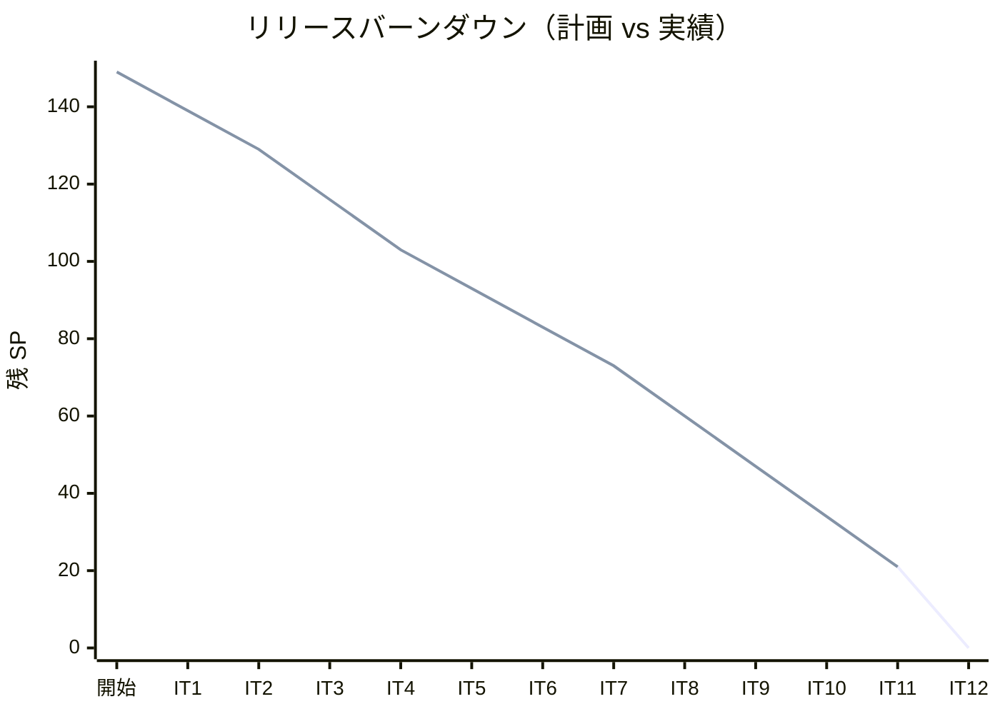
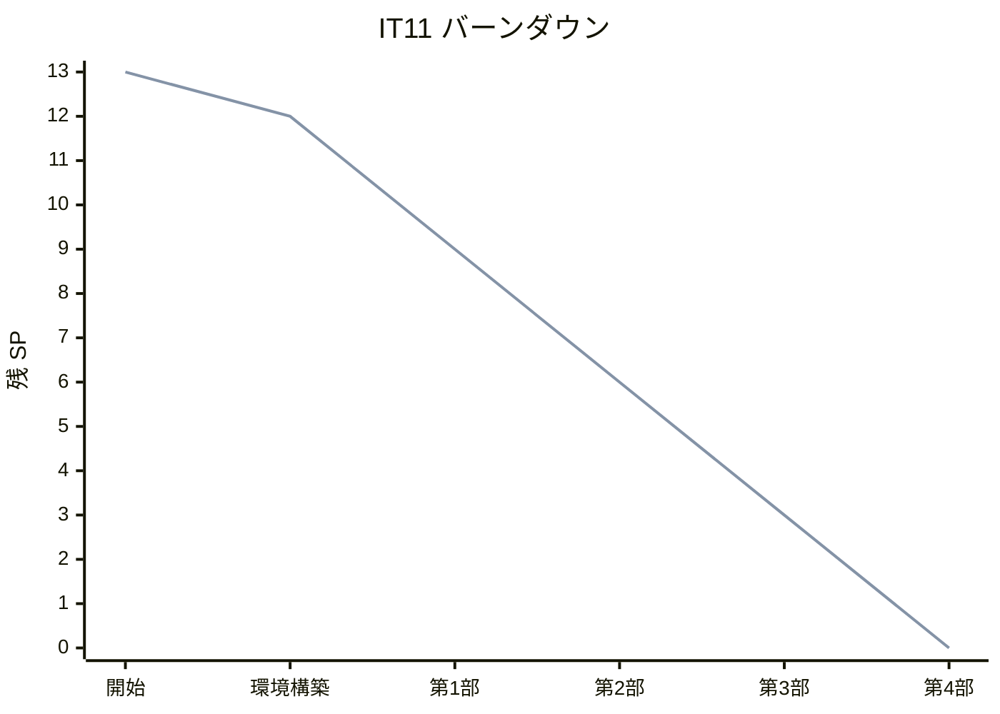
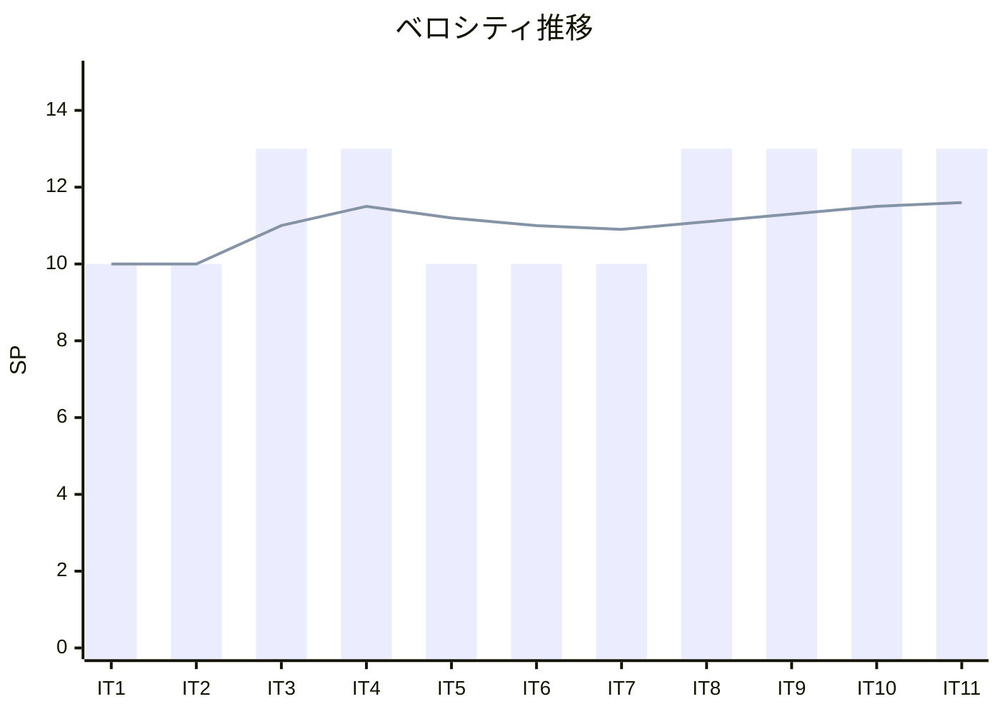

# イテレーション 11 完了報告書

## プロジェクト概要

| 項目 | 内容 |
|------|------|
| **プロジェクト名** | テスト駆動開発から始めるXX入門 |
| **イテレーション** | 11 |
| **対象言語** | Elixir |
| **開始日** | 2026-03-03 |
| **終了日** | 2026-03-03 |
| **作業日数** | 1 日（AI 自動化） |

### 要員

| 項目 | 予定 | 実績 |
|------|------|------|
| **作業日数** | 10 日 | 1 日 |
| **開発者** | 1 名 + AI | 1 名 + AI |

---

## 指標

### ビルド結果

| 項目 | 結果 |
|------|------|
| テスト（mix test） | ✅ 32 tests PASS |
| フォーマット（mix format） | ✅ 適用済み |
| 循環複雑度（complexity.sh） | ✅ 28 関数、違反ゼロ（閾値 10） |

### リリースバーンダウン

### イテレーションバーンダウン

### ベロシティ

| イテレーション | 計画 SP | 実績 SP | 累計 SP |
|---------------|---------|---------|---------|
| IT1（Java） | 10 | 10 | 10 |
| IT2（Python） | 10 | 10 | 20 |
| IT3（Node/TS） | 13 | 13 | 33 |
| IT4（Ruby） | 13 | 13 | 46 |
| IT5（Go） | 10 | 10 | 56 |
| IT6（PHP） | 10 | 10 | 66 |
| IT7（Rust） | 10 | 10 | 76 |
| IT8（C#/F#） | 13 | 13 | 89 |
| IT9（Clojure） | 13 | 13 | 102 |
| IT10（Scala） | 13 | 13 | 115 |
| IT11（Elixir） | 13 | 13 | 128 |
| **平均** | **11.6** | **11.6** | |

---

## 実施内容と評価

### 完了したタスク

| # | タスク | 状態 |
|---|--------|------|
| 0 | 環境構築（Mix + ExUnit + Credo + Nix CI） | ✅ |
| 1 | 第 1 部: TDD の基本サイクル（章 1-3）執筆・実装 | ✅ |
| 2 | 第 2 部: 開発環境と自動化（章 4-6）執筆 | ✅ |
| 3 | 第 3 部: OOP 設計（章 7-9）執筆・実装 | ✅ |
| 4 | 第 4 部: FP（章 10-12）執筆・実装 | ✅ |

### 成果物

| カテゴリ | 成果物 |
|---------|--------|
| 記事 | docs/article/elixir/（index.md + 12 章） |
| 実装 | apps/elixir/（Mix プロジェクト、32 テスト） |
| CI | .github/workflows/elixir-ci.yml（Nix ベース） |
| 品質ツール | apps/elixir/scripts/complexity.sh |
| タスクランナー | apps/elixir/Makefile |

### テスト内訳

| スイート | テスト数 |
|---------|---------|
| FizzBuzzTest（コア + FP 拡張） | 15 |
| TypeTest（Type01/02/03 + ファクトリ） | 12 |
| CommandTest（Value/List コマンド） | 5 |
| **合計** | **32** |

### 技術トピック

| 章 | トピック |
|----|---------|
| 1-3 | ExUnit（test/assert）、def/defp、cond、パイプライン |> 初歩 |
| 4-6 | Git、Conventional Commits、Mix、Credo、Nix、Makefile、GitHub Actions |
| 7-9 | defstruct、defprotocol/defimpl、@behaviour/@callback、パターンマッチ、ガード節 |
| 10-12 | 高階関数、パイプライン |>、Stream、遅延評価、{:ok, _}/{:error, _}、with 構文 |

---

## リスク実績

| リスク | 影響度 | 発生 | 対応 |
|--------|--------|------|------|
| Mix 依存パッケージ取得の Nix 環境制約 | 中 | — | Nix 環境内で mix deps.get が問題なく動作 |
| Elixir のマクロ活用が記事説明で複雑 | 中 | — | マクロ自体は扱わず、ExUnit テストマクロ利用に留めた |
| OOP 概念のプロトコル/ビヘイビアへの対応が分かりにくい | 中 | — | Scala との比較表で段階的に解説 |
| Credo --strict の最終確認漏れ | 低 | △ | CI では設定済み、ローカルでの明示的実行が欠落 |
| _build/ deps/ の誤コミット | 低 | — | .gitignore ファースト戦略で回避 |

---

## Phase 3 進捗サマリー

| イテレーション | 言語 | SP | 状態 |
|---------------|------|-----|------|
| IT9 | Clojure | 13 | ✅ 完了 |
| IT10 | Scala | 13 | ✅ 完了 |
| IT11 | Elixir | 13 | ✅ 完了 |
| IT12 | Haskell + 統合 | 21 | 未着手 |
| **Phase 3 合計** | | **60** | **39/60 SP 完了（65.0%）** |

---

## 次のステップ

1. IT12（Haskell + 統合解説）イテレーション計画を作成
2. 統合解説（US-013、8 SP）の構成を事前設計
3. 最終確認で `make check` を必ず実行する（IT11 改善）
4. Phase 3 完了後に Release 3.0 を準備

---

## 更新履歴

| 日付 | 更新内容 | 更新者 |
|------|---------|--------|
| 2026-03-03 | 初版作成 | AI |
