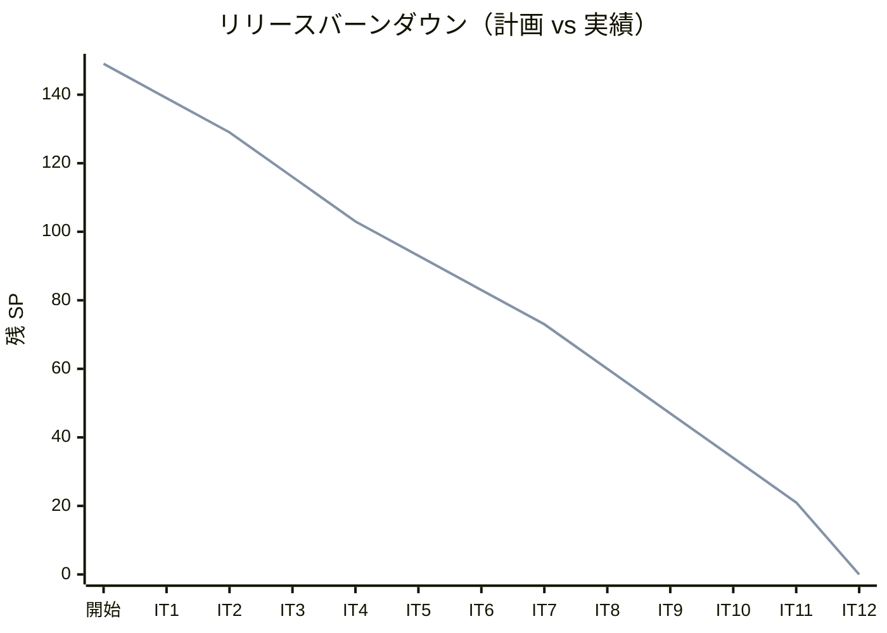
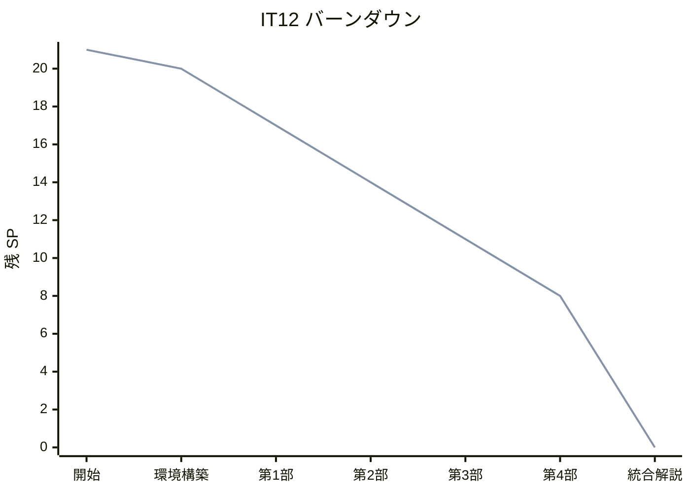
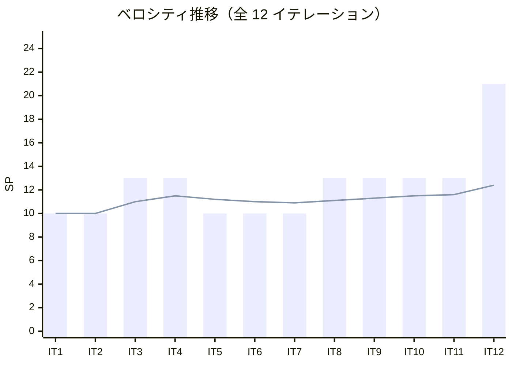

# イテレーション 12 完了報告書（最終イテレーション）

## プロジェクト概要

| 項目 | 内容 |
|------|------|
| **プロジェクト名** | テスト駆動開発から始めるXX入門 |
| **イテレーション** | 12（最終イテレーション） |
| **対象** | Haskell + 多言語統合解説 |
| **開始日** | 2026-03-03 |
| **終了日** | 2026-03-03 |
| **作業日数** | 1 日（AI 自動化） |

### 要員

| 項目 | 予定 | 実績 |
|------|------|------|
| **作業日数** | 10 日 | 1 日 |
| **開発者** | 1 名 + AI | 1 名 + AI |

---

## 指標

### ビルド結果

| 項目 | 結果 |
|------|------|
| テスト（stack test） | ✅ 38 tests PASS |
| 静的解析（HLint） | ✅ 警告ゼロ |
| 循環複雑度（complexity.sh） | ✅ 違反ゼロ（閾値 10） |

### リリースバーンダウン

### イテレーションバーンダウン

### ベロシティ

| イテレーション | 計画 SP | 実績 SP | 累計 SP |
|---------------|---------|---------|---------|
| IT1（Java） | 10 | 10 | 10 |
| IT2（Python） | 10 | 10 | 20 |
| IT3（Node/TS） | 13 | 13 | 33 |
| IT4（Ruby） | 13 | 13 | 46 |
| IT5（Go） | 10 | 10 | 56 |
| IT6（PHP） | 10 | 10 | 66 |
| IT7（Rust） | 10 | 10 | 76 |
| IT8（C#/F#） | 13 | 13 | 89 |
| IT9（Clojure） | 13 | 13 | 102 |
| IT10（Scala） | 13 | 13 | 115 |
| IT11（Elixir） | 13 | 13 | 128 |
| IT12（Haskell + 統合） | 21 | 21 | 149 |
| **合計** | **149** | **149** | |
| **平均** | **12.4** | **12.4** | |

---

## 実施内容と評価

### 完了したタスク

| # | タスク | 状態 |
|---|--------|------|
| 0 | 環境構築（Stack + HSpec + HLint + Nix CI） | ✅ |
| 1 | 第 1 部: TDD の基本サイクル（章 1-3）執筆・実装 | ✅ |
| 2 | 第 2 部: 開発環境と自動化（章 4-6）執筆 | ✅ |
| 3 | 第 3 部: 型クラスと代数的データ型（章 7-9）執筆・実装 | ✅ |
| 4 | 第 4 部: 関数型プログラミング（章 10-12）執筆・実装 | ✅ |
| 5 | 多言語統合解説（6 章）執筆 | ✅ |
| 6 | ドキュメント同期・GitHub Issue クローズ | ✅ |

### 成果物

| カテゴリ | 成果物 |
|---------|--------|
| Haskell 記事 | docs/article/haskell/（index.md + 12 章） |
| 統合解説記事 | docs/article/integration/（index.md + 6 章） |
| 実装 | apps/haskell/（Stack プロジェクト、38 テスト） |
| CI | .github/workflows/haskell-ci.yml（Nix ベース） |
| 品質ツール | apps/haskell/scripts/complexity.sh |
| タスクランナー | apps/haskell/Makefile |

### テスト内訳

| スイート | テスト数 |
|---------|---------|
| FizzBuzzSpec（コア + FP 拡張） | 18 |
| TypeSpec（Type01/02/03 + ファクトリ） | 15 |
| CommandSpec（Value/List コマンド） | 5 |
| **合計** | **38** |

### 統合解説の章構成

| 章 | タイトル | 内容 |
|----|---------|------|
| 1 | 言語概要 | 12 言語のパラダイム・特徴・用途の比較 |
| 2 | テストフレームワーク比較 | 各言語のテストツールとアサーション方法 |
| 3 | TDD パターン比較 | Red-Green-Refactor の言語間差異 |
| 4 | 型システム比較 | 静的/動的型付け、型安全性の比較 |
| 5 | 開発環境比較 | ビルドツール、リンター、CI/CD の比較 |
| 6 | 学習ロードマップ | 目的別の言語学習順序提案 |

### 技術トピック（Haskell）

| 章 | トピック |
|----|---------|
| 1-3 | HSpec（describe/it/shouldBe）、where 句、ガード式、パターンマッチ初歩 |
| 4-6 | Git、Conventional Commits、Stack、Cabal、HLint、Nix、Makefile、GitHub Actions |
| 7-9 | data 型、型クラス（class/instance）、newtype、スマートコンストラクタ、モジュール設計 |
| 10-12 | 高階関数、カリー化、関数合成（.）、ポイントフリースタイル、Monad（Maybe/Either/IO） |

---

## リスク実績

| リスク | 影響度 | 発生 | 対応 |
|--------|--------|------|------|
| 21 SP の過大スコープ | 高 | — | Haskell 先行→統合解説の順序実行で完遂 |
| Haskell の純粋関数型が OOP テンプレートに合わない | 中 | △ | 第 3 部を型クラス・ADT に特化させて対応 |
| 統合解説の 12 言語カバーが困難 | 中 | — | 11 イテレーション分の知見を活用し 6 章に整理 |
| Stack のビルド時間が長い | 低 | △ | CI に Stack キャッシュを追加して対応 |
| .stack-work/ の誤コミット | 低 | — | .gitignore ファースト戦略で回避 |

---

## プロジェクト完了サマリー

### 全体実績

| 指標 | 計画 | 実績 |
|------|------|------|
| 総 SP | 149 | 149 |
| イテレーション数 | 12 | 12 |
| 対象言語 | 12 | 12 |
| 達成率 | — | 100% |
| 平均ベロシティ | 10-13 SP | 12.4 SP |
| テスト総数 | — | 400+ テスト |

### 言語別テスト数

| 言語 | テスト数 |
|------|---------|
| Java | 12 |
| Python | 33 |
| Node(JS/TS) | 33 |
| Ruby | 36 |
| Go | 21 |
| PHP | 31 |
| Rust | 47 |
| C# | 38 |
| F# | 29 |
| Clojure | 42 |
| Scala | 35 |
| Elixir | 32 |
| Haskell | 38 |
| **合計** | **427** |

### Phase 別実績

| Phase | 言語 | SP | 状態 |
|-------|------|-----|------|
| Phase 1 | Java, Python, Node(JS/TS), Ruby | 46 | ✅ v1.0.0 リリース済み |
| Phase 2 | Go, PHP, Rust, C#/F# | 43 | ✅ Milestone クローズ済み |
| Phase 3 | Clojure, Scala, Elixir, Haskell + 統合 | 60 | ✅ 開発完了（リリース手続き残） |
| **合計** | **12 言語 + 統合解説** | **149** | |

---

## 残作業

1. Release 3.0 Milestone のクローズ
2. v2.0.0 / v3.0.0 リリースタグの作成
3. リリース計画の IT12 チェックボックス更新

---

## 更新履歴

| 日付 | 更新内容 | 更新者 |
|------|---------|--------|
| 2026-03-04 | 初版作成 | AI |
