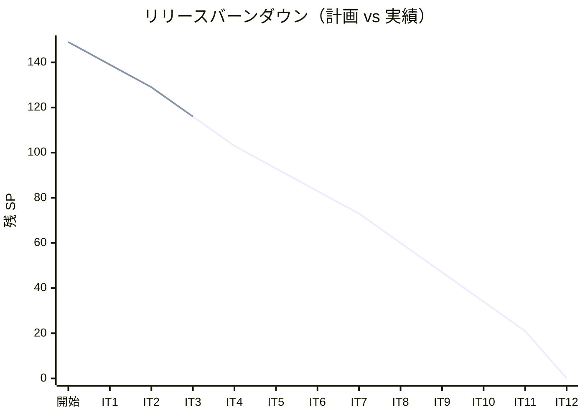
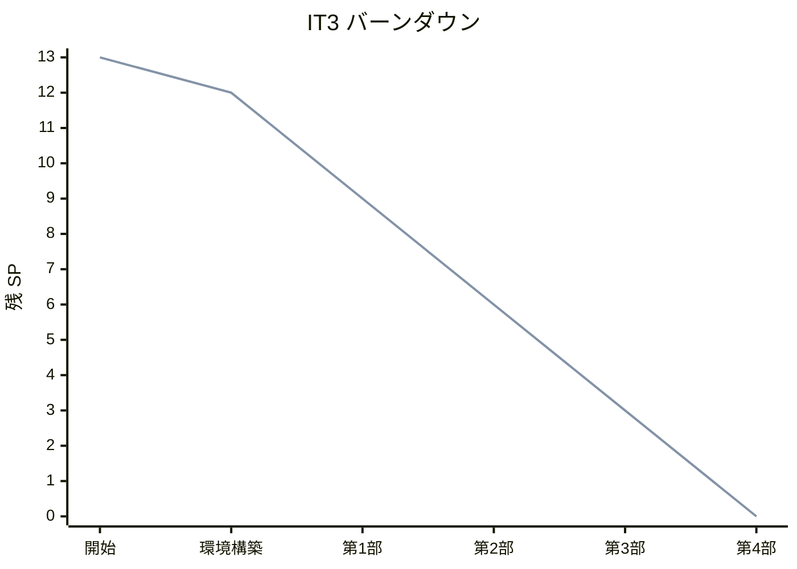
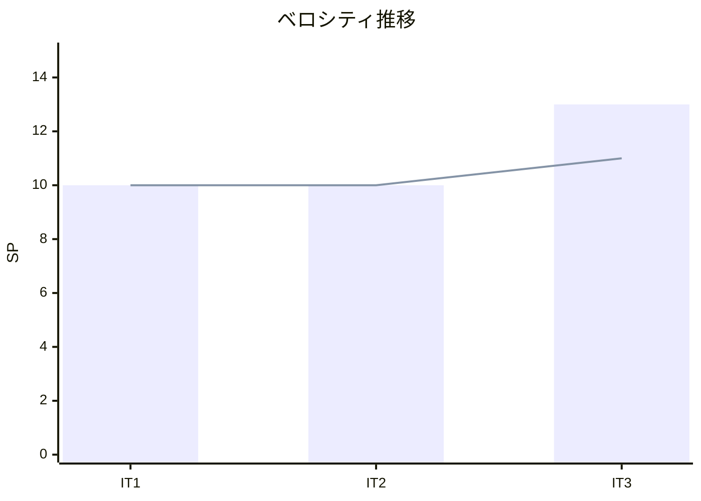

# イテレーション 3 完了報告書

## プロジェクト概要

| 項目 | 内容 |
|------|------|
| **プロジェクト名** | テスト駆動開発から始めるXX入門 |
| **イテレーション** | 3 |
| **対象言語** | JavaScript / TypeScript（Node） |
| **開始日** | 2026-03-01 |
| **終了日** | 2026-03-01 |
| **作業日数** | 1 日（AI + Codex 自動化） |

### 要員

| 項目 | 予定 | 実績 |
|------|------|------|
| **作業日数** | 10 日 | 1 日 |
| **開発者** | 1 名 + AI | 1 名 + AI + Codex |

---

## 指標

### ビルド結果

| 項目 | 結果 |
|------|------|
| テスト（Vitest） | ✅ 53 passed |
| ESLint | ✅ エラーなし |
| TypeScript（tsc --noEmit） | ✅ エラーなし |
| Prettier | ✅ 全ファイル準拠 |

### リリースバーンダウン



### イテレーションバーンダウン



### ベロシティ



| イテレーション | 計画 SP | 実績 SP | 累計 SP |
|---------------|---------|---------|---------|
| IT1（Java） | 10 | 10 | 10 |
| IT2（Python） | 10 | 10 | 20 |
| IT3（Node/TS） | 13 | 13 | 33 |
| **平均** | **11** | **11** | |

---

## 実施内容と評価

### 完了ストーリー一覧

| ID | ストーリー | 結果 | 予定 SP | 完了 SP |
|----|-----------|------|---------|---------|
| US-003 | Node（JS/TS）の TDD 入門記事の執筆と実装 | ✅ 完了 | 13 | 13 |

### 達成率

| 項目 | 計画 | 実績 | 達成率 |
|------|------|------|--------|
| ストーリーポイント | 13 SP | 13 SP | 100% |
| ストーリー数 | 1 | 1 | 100% |
| 記事数 | 12 章 | 12 章 | 100% |
| テスト数 | - | 53 | - |

---

## 成果物詳細

### US-003: Node（JS/TS）の TDD 入門記事の執筆と実装

#### 記事

| ファイル | 章タイトル | 行数 |
|---------|-----------|------|
| `01-todo-list-and-first-test.md` | TODO リストと最初のテスト | 244 |
| `02-fake-it-and-triangulation.md` | 仮実装と三角測量 | 262 |
| `03-obvious-implementation-and-refactoring.md` | 明白な実装とリファクタリング | 169 |
| `04-version-control-and-conventional-commits.md` | バージョン管理と Conventional Commits | 112 |
| `05-package-management-and-static-analysis.md` | パッケージ管理と静的解析 | 314 |
| `06-task-runner-and-ci-cd.md` | タスクランナーと CI/CD | 235 |
| `07-encapsulation-and-polymorphism.md` | カプセル化とポリモーフィズム | 327 |
| `08-design-patterns.md` | デザインパターンの適用 | 322 |
| `09-solid-principles-and-module-design.md` | SOLID 原則とモジュール設計 | 285 |
| `10-higher-order-functions-and-composition.md` | 高階関数と関数合成 | 199 |
| `11-immutable-data-and-pipeline.md` | 不変データとパイプライン処理 | 207 |
| `12-error-handling-and-type-safety.md` | エラーハンドリングと型安全性 | 295 |
| **合計** | | **2,971** |

#### 実装

```
apps/node/src/fizzbuzz/
├── index.ts                          (バレルファイル)
├── domain/
│   ├── model/
│   │   ├── fizz-buzz-value.ts       (値オブジェクト)
│   │   └── fizz-buzz-list.ts        (ファーストクラスコレクション + FP)
│   └── type/
│       ├── fizz-buzz-type.ts        (抽象クラス + ファクトリ)
│       ├── fizz-buzz-type-name.ts   (型安全 enum)
│       ├── fizz-buzz-type-01.ts     (タイプ 1: 通常)
│       ├── fizz-buzz-type-02.ts     (タイプ 2: 数値のみ)
│       ├── fizz-buzz-type-03.ts     (タイプ 3: FizzBuzz のみ)
│       └── fizz-buzz-util.ts        (関数合成 + 述語 + Type Guards)
└── application/
    ├── fizz-buzz-command.ts         (コマンドインターフェース)
    ├── fizz-buzz-value-command.ts   (単一値コマンド)
    └── fizz-buzz-list-command.ts    (リストコマンド)
```

#### コード規模

| 対象 | ファイル数 | 行数 |
|------|----------|------|
| ソースコード | 12 | 312 |
| テストコード | 5 | 416 |
| 合計 | 17 | 728 |

#### 主要な設計パターン

| パターン | 適用箇所 |
|---------|---------|
| Strategy | FizzBuzzType + 具体タイプ |
| Factory Method | FizzBuzzType.create() / tryCreate() |
| Value Object | FizzBuzzValue |
| First-Class Collection | FizzBuzzList |
| Command | FizzBuzzCommand + 実装クラス |

#### Java/Python との対比

| 概念 | Java | Python | TypeScript |
|------|------|--------|-----------|
| 抽象クラス | `abstract class` | `abc.ABC` | `abstract class` |
| テストフレームワーク | JUnit 5 | pytest | Vitest |
| パッケージ管理 | Maven/Gradle | uv/poetry | npm |
| 静的解析 | Checkstyle + PMD | Ruff + mypy | ESLint + tsc |
| 不変性 | `final` | `@dataclass(frozen=True)` | `readonly` + `Object.freeze()` |
| Null 安全 | `Optional<T>` | `T \| None` | `T \| undefined` |
| 列挙型 | `enum` | `enum.Enum` | `enum` |
| 関数合成 | `Function.andThen()` | `functools.reduce` | `compose()` / `pipe()` |

---

## 品質メトリクス

### テストカバレッジ

| モジュール | Statements | Branches | Functions | Lines |
|-----------|-----------|----------|-----------|-------|
| application/ | 100% | 100% | 100% | 100% |
| domain/model/ | 96.03% | 97.14% | 96% | 96.03% |
| domain/type/ | 97.59% | 100% | 94.11% | 97.59% |
| **全体** | **97.27%** | **98.71%** | **95.91%** | **97.27%** |

### テスト数

| テストファイル | テスト数 |
|--------------|---------|
| fizz-buzz-type.test.ts | 19 |
| fizz-buzz-list.test.ts | 19 |
| fizz-buzz-util.test.ts | 8 |
| fizz-buzz-value.test.ts | 4 |
| fizz-buzz-command.test.ts | 3 |
| **合計** | **53** |

### コード品質

| ツール | 結果 |
|--------|------|
| ESLint | エラー 0、警告 0 |
| TypeScript（tsc） | エラー 0 |
| Prettier | 全ファイル準拠 |

### コミット統計

| 種別 | 数 |
|------|-----|
| feat | 4 |
| docs | 4 |
| **合計** | **8** |

### コード変更量

| 対象 | 追加行数 |
|------|---------|
| ソース + テスト | 728 行 |
| 記事 | 2,971 行 |
| CI 設定 | 54 行 |

---

## イテレーションレビュー

### 成功した点

- **Codex 分業の安定運用**: 第 3 部（章 7-9）・第 4 部（章 10-12）とも Codex に章単位で委譲し、全て初回成功
- **13 SP の完走**: IT1/IT2 の 10 SP から 3 SP 増加したが、テンプレート再利用と Codex 効率化で問題なく完了
- **TypeScript 固有の FP 機能**: Generics、Union Types、Type Guards、enum を活用した型安全な実装を実現
- **Jest → Vitest 移行**: ESM 互換性の問題を Vitest 移行で解決し、以降の章の実装がスムーズに

### 技術的課題と解決策

| 課題 | 状態 | 解決策 |
|------|------|--------|
| Jest の ESM 非互換 | ✅ 解決 | Vitest に移行 |
| FizzBuzzList.generate() の循環参照 | ✅ 解決 | 構造的型付け（FizzBuzzGenerator 型） |
| JS/TS 両方のコード例確保 | ⚠️ 部分対応 | TypeScript 中心、JS 固有例は限定的 |

### アクションアイテム

| # | アクション | 担当 | 期限 | 状態 |
|---|-----------|------|------|------|
| 1 | IT4（Ruby）計画作成 | AI | IT4 開始時 | 未着手 |
| 2 | 3 IT 実績でベロシティトレンド分析 | AI | IT4 開始時 | 未着手 |
| 3 | Release 1.0 準備状況の確認 | AI | IT4 終了時 | 未着手 |

---

## リリース状況

### Release 1.0 達成条件

| 条件 | 状態 |
|------|------|
| Java 全 12 章の記事・実装完了 | ✅ |
| Python 全 12 章の記事・実装完了 | ✅ |
| Node（JS/TS）全 12 章の記事・実装完了 | ✅ |
| Ruby 全 12 章の記事・実装完了 | 未着手 |
| 全記事のレビュー完了 | 未着手 |
| MkDocs プレビュー確認 | ✅（各言語ごと） |

### 全体リリース進捗

```mermaid
xychart-beta
    title "Phase 1 進捗"
    x-axis ["IT1 Java", "IT2 Python", "IT3 Node", "IT4 Ruby"]
    y-axis "SP" 0 --> 15
    bar "計画" [10, 10, 13, 13]
    bar "実績" [10, 10, 13, 0]
```



| フェーズ | 計画 SP | 完了 SP | 残 SP | 進捗率 |
|---------|---------|---------|-------|--------|
| Phase 1 | 46 | 33 | 13 | 72% |
| Phase 2 | 43 | 0 | 43 | 0% |
| Phase 3 | 60 | 0 | 60 | 0% |
| **全体** | **149** | **33** | **116** | **22%** |

### IT1/IT2 との比較

| メトリクス | IT1（Java） | IT2（Python） | IT3（Node/TS） |
|-----------|------------|--------------|---------------|
| 言語 | Java | Python | TypeScript |
| SP | 10 | 10 | 13 |
| 達成率 | 100% | 100% | 100% |
| テスト数 | 27 | 23 | 53 |
| カバレッジ | 97%+ | 98%+ | 97.27% |
| ソース行数 | 約 300 | 約 280 | 312 |
| テスト行数 | 約 250 | 約 220 | 416 |
| 記事行数 | 約 2,500 | 約 2,700 | 2,971 |
| コミット数 | 8 | 7 | 8 |
| テスト/ソース比 | 0.83 | 0.79 | 1.33 |

---

## 総括

IT3（Node/JavaScript/TypeScript）では、13 SP の計画を 100% 達成した。IT1/IT2 で確立したテンプレートとワークフローを活用し、3 SP 増加分（第 4 部: 関数型プログラミング）も含めてスムーズに完了できた。

特に、Codex 分業体制が安定し、章単位の実装委譲で全て初回成功となった点は大きな成果である。TypeScript 固有の機能（Generics、Union Types、Type Guards、enum）を活用した型安全な設計も記事・実装ともに充実させることができた。

3 イテレーション（IT1-IT3）の実績ベロシティは平均 11 SP/イテレーションとなり、Release 1.0 の残り IT4（Ruby、13 SP）は予定通り完了可能と見込まれる。

---

## 更新履歴

| 日付 | 更新内容 | 更新者 |
|------|---------|--------|
| 2026-03-01 | 初版作成 | AI |

---

## 関連ドキュメント

- [イテレーション 3 計画](./iteration_plan-3.md)
- [イテレーション 3 ふりかえり](./retrospective-3.md)
- [リリース計画](./release_plan.md)
