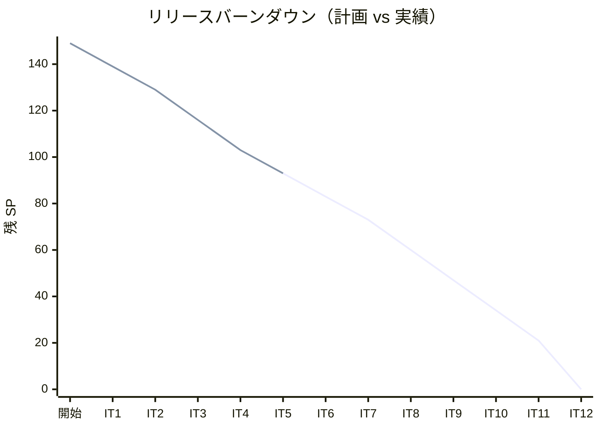
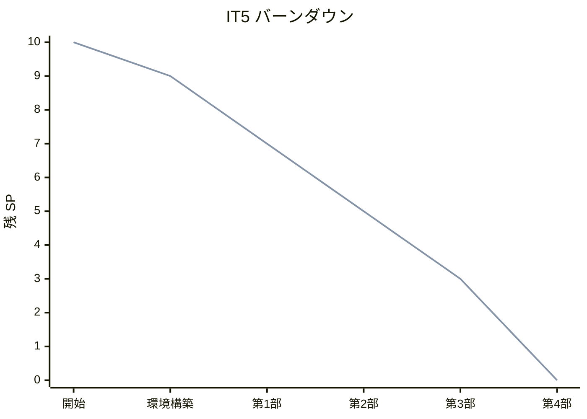
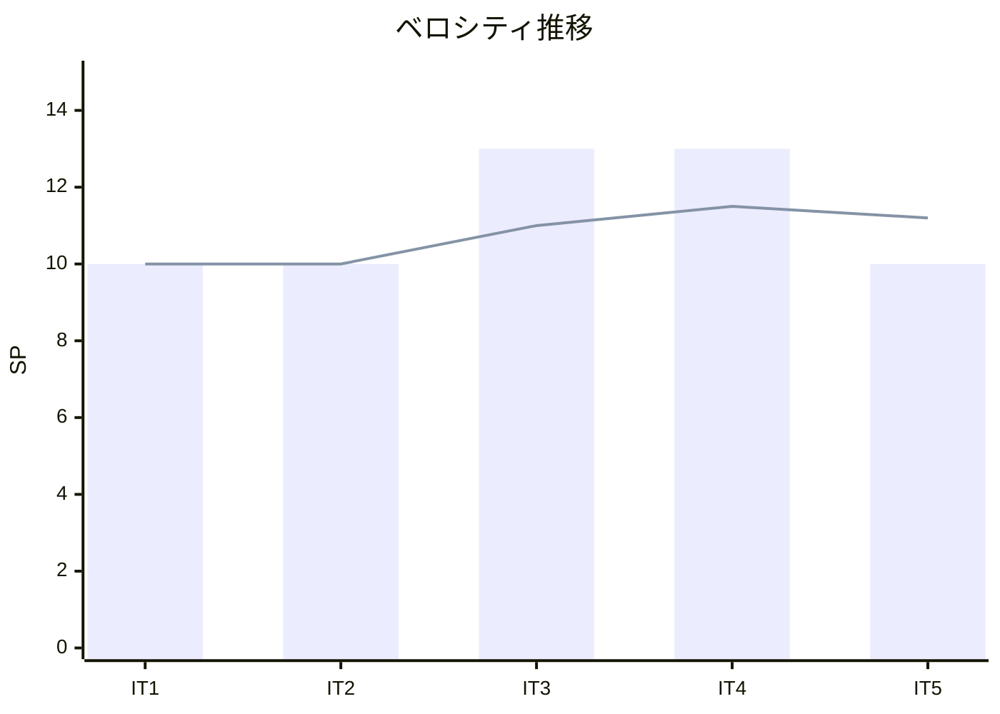

# イテレーション 5 完了報告書

## プロジェクト概要

| 項目 | 内容 |
|------|------|
| **プロジェクト名** | テスト駆動開発から始めるXX入門 |
| **イテレーション** | 5 |
| **対象言語** | Go |
| **開始日** | 2026-03-02 |
| **終了日** | 2026-03-02 |
| **作業日数** | 1 日（AI + Codex 自動化） |

### 要員

| 項目 | 予定 | 実績 |
|------|------|------|
| **作業日数** | 10 日 | 1 日 |
| **開発者** | 1 名 + AI | 1 名 + AI + Codex |

---

## 指標

### ビルド結果

| 項目 | 結果 |
|------|------|
| テスト（go test） | ✅ 109 テスト PASS（6 パッケージ） |
| フォーマット（gofmt） | ✅ クリーン |
| 静的解析（go vet） | ✅ エラーなし |
| golangci-lint | ⚠️ 未実行（Nix 環境外） |

### リリースバーンダウン



### イテレーションバーンダウン



### ベロシティ



| イテレーション | 計画 SP | 実績 SP | 累計 SP |
|---------------|---------|---------|---------|
| IT1（Java） | 10 | 10 | 10 |
| IT2（Python） | 10 | 10 | 20 |
| IT3（Node/TS） | 13 | 13 | 33 |
| IT4（Ruby） | 13 | 13 | 46 |
| IT5（Go） | 10 | 10 | 56 |
| **平均** | **11.2** | **11.2** | |

---

## 実施内容と評価

### 完了ストーリー一覧

| ID | ストーリー | 結果 | 予定 SP | 完了 SP |
|----|-----------|------|---------|---------|
| US-005 | Go の TDD 入門記事の執筆と実装 | ✅ 完了 | 10 | 10 |

### 達成率

| 項目 | 計画 | 実績 | 達成率 |
|------|------|------|--------|
| ストーリーポイント | 10 SP | 10 SP | 100% |
| ストーリー数 | 1 | 1 | 100% |
| 記事数 | 12 章 | 12 章 | 100% |
| テスト数 | - | 109 | - |

---

## 成果物詳細

### US-005: Go の TDD 入門記事の執筆と実装

#### 記事

| ファイル | 章タイトル | 行数 |
|---------|-----------|------|
| `index.md` | テスト駆動開発から始める Go 入門 | 83 |
| `01-todo-list-and-first-test.md` | TODO リストと最初のテスト | 213 |
| `02-fake-it-and-triangulation.md` | 仮実装と三角測量 | 302 |
| `03-obvious-implementation-and-refactoring.md` | 明白な実装とリファクタリング | 339 |
| `04-version-control-and-conventional-commits.md` | バージョン管理と Conventional Commits | 112 |
| `05-package-management-and-static-analysis.md` | パッケージ管理と静的解析 | 272 |
| `06-task-runner-and-ci-cd.md` | タスクランナーと CI/CD | 233 |
| `07-encapsulation-and-polymorphism.md` | カプセル化とポリモーフィズム | 394 |
| `08-design-patterns.md` | デザインパターンの適用 | 422 |
| `09-solid-principles-and-module-design.md` | SOLID 原則とモジュール設計 | 400 |
| `10-higher-order-functions-and-composition.md` | 高階関数と関数合成 | 226 |
| `11-immutable-data-and-pipeline.md` | 不変データとパイプライン処理 | 296 |
| `12-error-handling-and-type-safety.md` | エラーハンドリングと型安全性 | 411 |
| **合計** | | **3,703** |

#### 実装

```
apps/go/
├── go.mod
├── go.sum
├── main.go
├── Makefile
├── .golangci.yml
├── fizzbuzz/
│   ├── fizzbuzz.go          (公開 API + 再エクスポート)
│   ├── fizzbuzz_test.go     (統合テスト: 63)
│   └── learning_test.go     (学習テスト: 2)
├── domain/
│   ├── model/
│   │   ├── fizz_buzz_value.go      (値オブジェクト)
│   │   ├── fizz_buzz_value_test.go  (12 テスト)
│   │   ├── fizz_buzz_list.go       (コレクション + FP メソッド)
│   │   └── fizz_buzz_list_test.go   (16 テスト)
│   ├── type_/
│   │   ├── fizz_buzz_type.go       (インターフェース + ファクトリ)
│   │   ├── fizz_buzz_type_01.go    (Standard)
│   │   ├── fizz_buzz_type_02.go    (NumberOnly)
│   │   ├── fizz_buzz_type_03.go    (FizzBuzzOnly)
│   │   └── fizz_buzz_type_test.go   (13 テスト)
│   └── functional/
│       ├── functional.go           (ジェネリクス関数)
│       └── functional_test.go       (3 テスト)
└── application/
    ├── fizz_buzz_command.go         (Command インターフェース)
    ├── fizz_buzz_value_command.go    (値コマンド)
    ├── fizz_buzz_list_command.go     (リストコマンド)
    └── fizz_buzz_command_test.go     (2 テスト)
```

#### コード規模

| 対象 | ファイル数 | 行数 |
|------|----------|------|
| ソースコード | 12 | 549 |
| テストコード | 7 | 1,197 |
| 合計 | 19 | 1,746 |

#### 主要な設計パターン

| パターン | 適用箇所 |
|---------|---------|
| Strategy | FizzBuzzType インターフェース + 具体タイプ（01/02/03） |
| Factory Method | NewFizzBuzzType() / TryNewFizzBuzzType() |
| Value Object | FizzBuzzValue（値レシーバ、不変、値等価性） |
| First-Class Collection | FizzBuzzList（Filter/Map/Reduce + FP メソッド） |
| Command | FizzBuzzCommand インターフェース + 実装 |

#### Java/Python/Node/Ruby との対比

| 概念 | Java | Python | TypeScript | Ruby | Go |
|------|------|--------|-----------|------|-----|
| 抽象クラス | `abstract class` | `abc.ABC` | `abstract class` | 基底クラス + `NotImplementedError` | インターフェース（暗黙的実装） |
| テストフレームワーク | JUnit 5 | pytest | Vitest | Minitest | testing + go test |
| パッケージ管理 | Maven/Gradle | uv/poetry | npm | Bundler | Go Modules |
| 静的解析 | Checkstyle + PMD | Ruff + mypy | ESLint + tsc | RuboCop | gofmt + go vet + golangci-lint |
| 不変性 | `final` | `@dataclass(frozen=True)` | `readonly` + `Object.freeze()` | `freeze` + `dup.freeze` | 値レシーバ + 非公開フィールド |
| Null 安全 | `Optional<T>` | `T \| None` | `T \| undefined` | `nil` + `&.` | 多値返却 `(T, error)` / `(T, bool)` |
| 列挙型 | `enum` | `enum.Enum` | `enum` | Module 定数 | `iota` 定数 |
| 関数合成 | `Function.andThen()` | `functools.reduce` | `compose()` / `pipe()` | `>>` / `<<` 演算子 | 手動 `Compose` 関数 |
| ジェネリクス | `<T>` | なし（duck typing） | `<T>` | なし（duck typing） | `[T any]`（Go 1.18+） |

---

## 品質メトリクス

### テストカバレッジ

| メトリクス | 目標 | 実績 | 判定 |
|-----------|------|------|------|
| テストカバレッジ | 80%+ | ⚠️ 未検証（Nix 環境外） | - |

### テスト数

| テストファイル | テスト数 | 内容 |
|--------------|---------|------|
| fizzbuzz/fizzbuzz_test.go | 63 | 統合テスト（全章の再エクスポート経由） |
| fizzbuzz/learning_test.go | 2 | 学習用テスト（strconv、fmt） |
| domain/model/fizz_buzz_value_test.go | 12 | 値オブジェクト単体テスト |
| domain/model/fizz_buzz_list_test.go | 16 | リスト単体テスト |
| domain/type_/fizz_buzz_type_test.go | 13 | タイプ単体テスト |
| domain/functional/functional_test.go | 3 | ジェネリクス関数テスト |
| application/fizz_buzz_command_test.go | 2 | コマンド単体テスト |
| **合計** | **109** | |

### コード品質

| ツール | 結果 |
|--------|------|
| go test | 109 テスト PASS |
| gofmt | クリーン |
| go vet | エラーなし |
| golangci-lint | ⚠️ 未実行（Nix 環境外） |

### コミット統計

| 種別 | 数 |
|------|-----|
| feat | 4 |
| docs | 1 |
| **合計** | **5** |

### コード変更量

| 対象 | 追加行数 |
|------|---------|
| ソース + テスト | 1,746 行 |
| 記事 | 3,703 行 |

---

## イテレーションレビュー

### 成功した点

- **Codex 分業の完全定着**: 5 イテレーション連続で Claude + Codex の分業が安定稼働。全 4 部の実装を各 1 回の Codex 呼び出しで完了
- **全 12 章の完走**: Go の全記事・実装を 1 日で完了
- **Go 固有パターンの網羅**: 暗黙的インターフェース、構造体埋め込み、ジェネリクス（Go 1.18+）、error 型、型スイッチ
- **テスト品質**: 109 テスト（過去最多）、テスト/ソース比 2.18
- **コミット効率**: 5 コミットで最少。部単位の大きなコミットによる効率化

### 技術的課題と解決策

| 課題 | 状態 | 解決策 |
|------|------|--------|
| golangci-lint 未実行 | ⚠️ 未解決 | Nix 環境内（`nix develop .#go`）での検証が必要 |
| テスト重複 | ⚠️ 許容 | fizzbuzz パッケージと各ドメインパッケージのテストが重複（統合 vs 単体の役割分担で許容） |
| Go の FP 制約 | ✅ 解決 | 組み込みの高階関数がなく手動 for ループで実装。ジェネリクスで汎用化 |

### Go 固有の設計判断

| 判断 | 理由 |
|------|------|
| `type_` パッケージ名 | `type` は Go の予約語のため `_` サフィックスで回避 |
| 型エイリアス再エクスポート | `type FizzBuzzValue = model.FizzBuzzValue` で後方互換性を維持 |
| `var` 再エクスポート | `var NewFizzBuzzValue = model.NewFizzBuzzValue` で関数の再エクスポート |
| 値レシーバ（FizzBuzzValue） | 不変性を保証（コピーセマンティクス） |
| ポインタレシーバ（FizzBuzzList） | スライスのコピーコストを回避 |
| `fizzBuzzTypeBase`（小文字） | 非公開の基底構造体で構造体埋め込みを実現 |
| `iota` 定数 | マジックナンバー排除のための型安全な列挙 |
| `domain/functional` パッケージ | ジェネリクス関数を独立パッケージに分離 |

### アクションアイテム

| # | アクション | 担当 | 期限 | 状態 |
|---|-----------|------|------|------|
| 1 | Nix 環境内で golangci-lint + カバレッジ検証 | 手動 | - | 未着手 |
| 2 | Release 2.0 計画の策定 | AI | IT6 開始前 | 未着手 |

---

## リリース状況

### Release 2.0 達成条件

| 条件 | 状態 |
|------|------|
| Go 全 12 章の記事・実装完了 | ✅ |
| PHP 全 12 章の記事・実装完了 | 未着手 |
| Rust 全 12 章の記事・実装完了 | 未着手 |
| C#/F# 全 12 章の記事・実装完了 | 未着手 |

### 全体リリース進捗

```mermaid
xychart-beta
    title "Phase 1-2 進捗"
    x-axis ["IT1 Java", "IT2 Python", "IT3 Node", "IT4 Ruby", "IT5 Go"]
    y-axis "SP" 0 --> 15
    bar "計画" [10, 10, 13, 13, 10]
    bar "実績" [10, 10, 13, 13, 10]
```



| フェーズ | 計画 SP | 完了 SP | 残 SP | 進捗率 |
|---------|---------|---------|-------|--------|
| Phase 1 | 46 | 46 | 0 | 100% |
| Phase 2 | 43 | 10 | 33 | 23% |
| Phase 3 | 60 | 0 | 60 | 0% |
| **全体** | **149** | **56** | **93** | **38%** |

### IT1-IT5 比較

| メトリクス | IT1（Java） | IT2（Python） | IT3（Node/TS） | IT4（Ruby） | IT5（Go） |
|-----------|------------|--------------|---------------|------------|----------|
| 言語 | Java | Python | TypeScript | Ruby | Go |
| SP | 10 | 10 | 13 | 13 | 10 |
| 達成率 | 100% | 100% | 100% | 100% | 100% |
| テスト数 | 27 | 23 | 53 | 39 | 109 |
| カバレッジ | 97%+ | 98%+ | 97.27% | 95.95% | ⚠️ 未検証 |
| ソース行数 | 約 300 | 約 280 | 312 | 290 | 549 |
| テスト行数 | 約 250 | 約 220 | 416 | 723 | 1,197 |
| 記事行数 | 約 2,500 | 約 2,700 | 2,971 | 2,954 | 3,703 |
| コミット数 | 8 | 7 | 8 | 10 | 5 |
| テスト/ソース比 | 0.83 | 0.79 | 1.33 | 2.49 | 2.18 |

---

## 総括

IT5（Go）では、10 SP の計画を 100% 達成し、Go の全 12 章の記事執筆（3,703 行）と実装（549 行ソース、1,197 行テスト、109 テスト）を完了した。

Go は 3 エピソード言語として、暗黙的インターフェース、構造体埋め込み、ジェネリクス（Go 1.18+）、error 型による安全なエラーハンドリング、型スイッチによるパターンマッチングなど、Go 固有の機能を十分に活用した。組み込みの高階関数がない制約は、手動 for ループとジェネリクスの `domain/functional` パッケージで補完した。

5 イテレーション（IT1-IT5）の実績ベロシティは平均 11.2 SP/イテレーションとなり、Phase 1 の全 46 SP に加え Phase 2 の 10 SP を消化した。全体進捗率は 38%（56/149 SP）となった。

---

## 更新履歴

| 日付 | 更新内容 | 更新者 |
|------|---------|--------|
| 2026-03-02 | 初版作成 | AI |
| 2026-03-02 | テンプレート準拠に修正 | AI |

---

## 関連ドキュメント

- [イテレーション 5 計画](./iteration_plan-5.md)
- [イテレーション 5 ふりかえり](./retrospective-5.md)
- [リリース計画](./release_plan.md)
