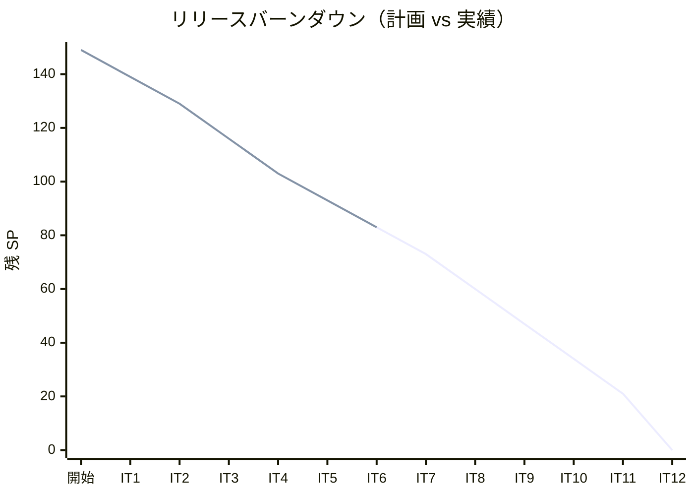
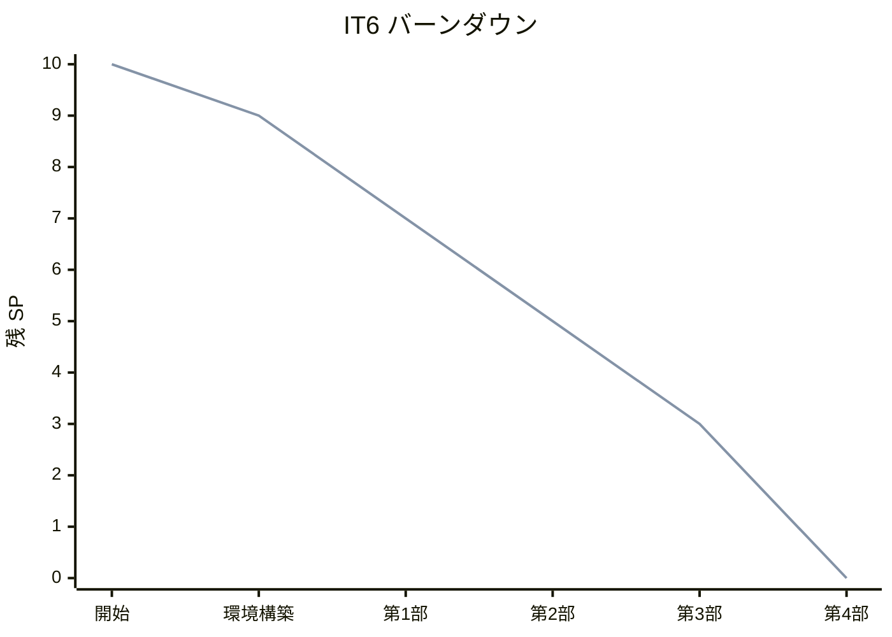
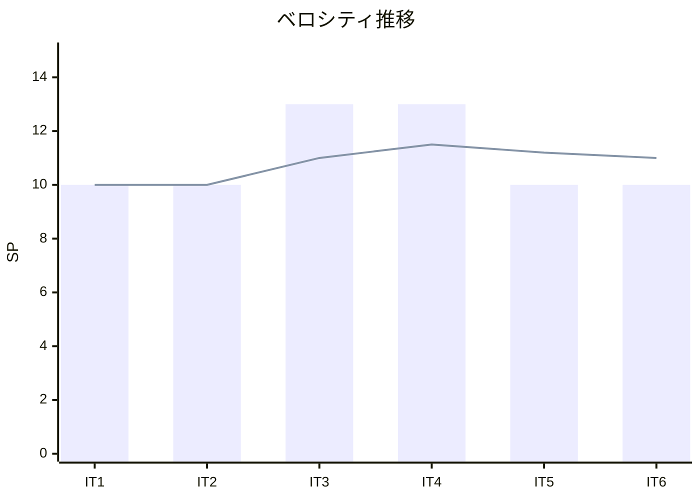

# イテレーション 6 完了報告書

## プロジェクト概要

| 項目 | 内容 |
|------|------|
| **プロジェクト名** | テスト駆動開発から始めるXX入門 |
| **イテレーション** | 6 |
| **対象言語** | PHP |
| **開始日** | 2026-03-02 |
| **終了日** | 2026-03-02 |
| **作業日数** | 1 日（AI + Codex 自動化） |

### 要員

| 項目 | 予定 | 実績 |
|------|------|------|
| **作業日数** | 10 日 | 1 日 |
| **開発者** | 1 名 + AI | 1 名 + AI + Codex |

---

## 指標

### ビルド結果

| 項目 | 結果 |
|------|------|
| テスト（PHPUnit） | ✅ 50 tests, 69 assertions PASS |
| コーディング規約（PHP_CodeSniffer） | ✅ PSR-12 違反ゼロ |
| 静的解析（PHPStan） | ✅ level: max 違反ゼロ |
| 複雑度（PHPMD） | ✅ 違反ゼロ（CC: 7、Method: 30 行） |

### リリースバーンダウン



### イテレーションバーンダウン



### ベロシティ



| イテレーション | 計画 SP | 実績 SP | 累計 SP |
|---------------|---------|---------|---------|
| IT1（Java） | 10 | 10 | 10 |
| IT2（Python） | 10 | 10 | 20 |
| IT3（Node/TS） | 13 | 13 | 33 |
| IT4（Ruby） | 13 | 13 | 46 |
| IT5（Go） | 10 | 10 | 56 |
| IT6（PHP） | 10 | 10 | 66 |
| **平均** | **11.0** | **11.0** | |

---

## 実施内容と評価

### 完了ストーリー一覧

| ID | ストーリー | 結果 | 予定 SP | 完了 SP |
|----|-----------|------|---------|---------|
| US-006 | PHP の TDD 入門記事の執筆と実装 | ✅ 完了 | 10 | 10 |

### 達成率

| 項目 | 計画 | 実績 | 達成率 |
|------|------|------|--------|
| ストーリーポイント | 10 SP | 10 SP | 100% |
| ストーリー数 | 1 | 1 | 100% |
| 記事数 | 12 章 | 12 章 | 100% |
| テスト数 | - | 50（69 assertions） | - |

---

## 成果物詳細

### US-006: PHP の TDD 入門記事の執筆と実装

#### 記事

| ファイル | 章タイトル | 行数 |
|---------|-----------|------|
| `index.md` | テスト駆動開発から始める PHP 入門 | 84 |
| `01-todo-list-and-first-test.md` | TODO リストと最初のテスト | 259 |
| `02-fake-it-and-triangulation.md` | 仮実装と三角測量 | 200 |
| `03-obvious-implementation-and-refactoring.md` | 明白な実装とリファクタリング | 248 |
| `04-version-control-and-conventional-commits.md` | バージョン管理と Conventional Commits | 141 |
| `05-package-management-and-static-analysis.md` | パッケージ管理と静的解析 | 410 |
| `06-task-runner-and-ci-cd.md` | タスクランナーと CI/CD | 321 |
| `07-encapsulation-and-polymorphism.md` | カプセル化とポリモーフィズム | 372 |
| `08-design-patterns.md` | デザインパターンの適用 | 453 |
| `09-solid-principles-and-module-design.md` | SOLID 原則とモジュール設計 | 460 |
| `10-higher-order-functions-and-composition.md` | 高階関数と関数合成 | 182 |
| `11-immutable-data-and-pipeline.md` | 不変データとパイプライン処理 | 266 |
| `12-error-handling-and-type-safety.md` | エラーハンドリングと型安全性 | 308 |
| **合計** | | **3,704** |

#### 実装

```
apps/php/
├── composer.json
├── composer.lock
├── phpunit.xml
├── phpstan.neon
├── phpcs.xml
├── phpmd.xml
├── src/
│   ├── FizzBuzz.php                         (公開 API)
│   ├── Application/
│   │   ├── FizzBuzzCommand.php              (コマンドインターフェース)
│   │   ├── FizzBuzzListCommand.php          (リストコマンド)
│   │   └── FizzBuzzValueCommand.php         (単一値コマンド)
│   └── Domain/
│       ├── Model/
│       │   ├── FizzBuzzValue.php            (値オブジェクト)
│       │   └── FizzBuzzList.php             (ファーストクラスコレクション + FP)
│       └── Type/
│           ├── FizzBuzzType.php             (インターフェース)
│           ├── FizzBuzzType01.php           (タイプ 1: 通常)
│           ├── FizzBuzzType02.php           (タイプ 2: 数値のみ)
│           ├── FizzBuzzType03.php           (タイプ 3: FizzBuzz のみ)
│           └── FizzBuzzTypeName.php         (列挙型)
└── tests/
    ├── FizzBuzzTest.php                     (統合テスト)
    ├── LearningTest.php                     (学習テスト)
    ├── Application/
    │   └── FizzBuzzCommandTest.php
    └── Domain/
        ├── Model/
        │   ├── FizzBuzzValueTest.php
        │   └── FizzBuzzListTest.php
        └── Type/
            └── FizzBuzzTypeTest.php
```

#### コード規模

| 対象 | ファイル数 | 行数 |
|------|----------|------|
| ソースコード | 11 | 414 |
| テストコード | 6 | 461 |
| 合計 | 17 | 875 |

#### 主要な設計パターン

| パターン | 適用箇所 |
|---------|---------|
| Strategy | FizzBuzzType インターフェース + 具体タイプ（01/02/03） |
| Factory Method | FizzBuzzType::create() |
| Value Object | FizzBuzzValue（readonly プロパティ、不変、値等価性） |
| First-Class Collection | FizzBuzzList（filter/map/reduce + FP メソッド） |
| Command | FizzBuzzCommand インターフェース + 実装 |

#### Java/Python/Node/Ruby/Go との対比

| 概念 | Java | Python | TypeScript | Ruby | Go | PHP |
|------|------|--------|-----------|------|-----|------|
| 抽象クラス | `abstract class` | `abc.ABC` | `abstract class` | 基底クラス | インターフェース | `abstract class` / `interface` |
| テストフレームワーク | JUnit 5 | pytest | Vitest | Minitest | testing + go test | PHPUnit |
| パッケージ管理 | Maven/Gradle | uv/poetry | npm | Bundler | Go Modules | Composer |
| 静的解析 | Checkstyle + PMD | Ruff + mypy | ESLint + tsc | RuboCop | golangci-lint | PHP_CodeSniffer + PHPStan + PHPMD |
| 不変性 | `final` | `@dataclass(frozen=True)` | `readonly` | `freeze` | 値レシーバ | `readonly`（PHP 8.1+） |
| Null 安全 | `Optional<T>` | `T \| None` | `T \| undefined` | `nil` + `&.` | `(T, error)` | `?type` + 例外 |
| 列挙型 | `enum` | `enum.Enum` | `enum` | Module 定数 | `iota` 定数 | `enum`（PHP 8.1+） |
| 関数合成 | `Function.andThen()` | `functools.reduce` | `compose()` / `pipe()` | `>>` / `<<` | 手動 `Compose` | `array_map` / `array_reduce` |

---

## 品質メトリクス

### テストカバレッジ

| メトリクス | 目標 | 実績 | 判定 |
|-----------|------|------|------|
| テストカバレッジ | 80%+ | ⚠️ 未検証 | - |

### テスト数

| テストファイル | テスト数 | 内容 |
|--------------|---------|------|
| tests/FizzBuzzTest.php | 12 | 統合テスト（公開 API 経由） |
| tests/LearningTest.php | 2 | 学習用テスト（PHP 関数） |
| tests/Domain/Model/FizzBuzzValueTest.php | 13 | 値オブジェクト単体テスト |
| tests/Domain/Model/FizzBuzzListTest.php | 10 | リスト単体テスト |
| tests/Domain/Type/FizzBuzzTypeTest.php | 10 | タイプ単体テスト |
| tests/Application/FizzBuzzCommandTest.php | 3 | コマンド単体テスト |
| **合計** | **50** | **69 assertions** |

### コード品質

| ツール | 結果 |
|--------|------|
| PHPUnit | 50 tests, 69 assertions PASS |
| PHP_CodeSniffer（phpcs） | ✅ PSR-12 違反ゼロ |
| PHPStan | ✅ level: max 違反ゼロ |
| PHPMD | ✅ CC: 7、Method: 30 行、違反ゼロ |

### コミット統計

| ハッシュ | 種別 | メッセージ | 変更量 |
|---------|------|-----------|--------|
| c157892 | docs | IT6（PHP）イテレーション計画を作成 | +452, -14 |
| d81bbcb | feat | IT6 第 1 部（章 1-3）の記事執筆と TDD 実装を完了 | +942, -20 |
| 4d3a56b | chore | vendor/ を .gitignore に追加し追跡から除外 | - |
| 23bbc74 | feat | IT6 第 2 部（章 4-6）の記事執筆と開発ツール導入を完了 | +942, -20 |
| 8ff0f0b | feat | IT6 第 3-4 部（章 7-12）の記事執筆と OOP/FP 実装を完了 | +2,916, -61 |
| 2fa57b9 | feat | PHPMD によるコード複雑性チェックを追加 | +1,187, -4 |
| a3e3145 | docs | IT6 完了に伴うドキュメント同期と GitHub Issue クローズ | +16, -9 |

| 種別 | 数 |
|------|-----|
| feat | 4 |
| docs | 2 |
| chore | 1 |
| **合計** | **7** |

### コード変更量

| 対象 | 追加行数 |
|------|---------|
| ソース + テスト | 875 行 |
| 記事 | 3,704 行 |

---

## イテレーションレビュー

### 成功した点

- **3 層品質チェックの導入**: PHP_CodeSniffer（PSR-12）+ PHPStan（level: max）+ PHPMD（複雑度）の 3 層チェックは全言語で最も充実した品質体制
- **PHP 8.1+ モダン機能の活用**: readonly プロパティ、コンストラクタプロモーション、enum、match 式を積極的に採用
- **Codex 分業の 6 連続成功**: 全 4 部の実装を Codex に委託し、1 回の指示で正確に完了
- **記事行数過去最多**: 3,704 行（IT5 Go の 3,703 行を上回る）
- **コミット効率**: PHP 専用コミット 4 回で全実装完了（過去最少タイ）

### 技術的課題と解決策

| 課題 | 状態 | 解決策 |
|------|------|--------|
| テストカバレッジ未検証 | ⚠️ 継続 | Xdebug/PCOV が Nix 環境で未設定。IT7 で対応検討 |
| vendor/ の Git 追跡 | ✅ 解決 | .gitignore に追加し追跡から除外 |
| PHPMD 未導入 | ✅ 解決 | phpmd.xml 作成、composer scripts に統合、CI に追加 |
| GitHub Issue #6 の手動クローズ | ✅ 解決 | 別コミットで対応。IT7 以降はコミットメッセージに Issue 参照を含める |

### PHP 固有の設計判断

| 判断 | 理由 |
|------|------|
| `readonly` プロパティ | PHP 8.1+ の不変性保証。setter 不要で Value Object に最適 |
| コンストラクタプロモーション | `__construct(private readonly ...)` でボイラープレート削減 |
| `enum FizzBuzzTypeName` | PHP 8.1+ の列挙型でタイプセーフな定数管理 |
| `match` 式 | switch の型安全な代替。FizzBuzzType のファクトリに適用 |
| PSR-4 オートロード | `App\` → `src/` の標準マッピング |
| `interface FizzBuzzType` | 明示的な契約。Go の暗黙的インターフェースとの対比で記事に活用 |

### アクションアイテム

| # | アクション | 担当 | 期限 | 状態 |
|---|-----------|------|------|------|
| 1 | IT7（Rust）でテストカバレッジ計測を実施 | AI | IT7 完了時 | 未着手 |
| 2 | コミットメッセージに GitHub Issue 参照を標準化 | AI | IT7 開始時 | 未着手 |
| 3 | Release 2.0 計画の策定 | AI | IT8 完了後 | 未着手 |

---

## リリース状況

### Release 2.0 達成条件

| 条件 | 状態 |
|------|------|
| Go 全 12 章の記事・実装完了 | ✅ |
| PHP 全 12 章の記事・実装完了 | ✅ |
| Rust 全 12 章の記事・実装完了 | 🔄 進行中（第 1 部完了） |
| C#/F# 全 12 章の記事・実装完了 | 未着手 |

### 全体リリース進捗

```mermaid
xychart-beta
    title "Phase 1-2 進捗"
    x-axis ["IT1 Java", "IT2 Python", "IT3 Node", "IT4 Ruby", "IT5 Go", "IT6 PHP"]
    y-axis "SP" 0 --> 15
    bar "計画" [10, 10, 13, 13, 10, 10]
    bar "実績" [10, 10, 13, 13, 10, 10]
```



| フェーズ | 計画 SP | 完了 SP | 残 SP | 進捗率 |
|---------|---------|---------|-------|--------|
| Phase 1 | 46 | 46 | 0 | 100% |
| Phase 2 | 43 | 20 | 23 | 47% |
| Phase 3 | 60 | 0 | 60 | 0% |
| **全体** | **149** | **66** | **83** | **44%** |

### IT1-IT6 比較

| メトリクス | IT1（Java） | IT2（Python） | IT3（Node/TS） | IT4（Ruby） | IT5（Go） | IT6（PHP） |
|-----------|------------|--------------|---------------|------------|----------|----------|
| 言語 | Java | Python | TypeScript | Ruby | Go | PHP |
| SP | 10 | 10 | 13 | 13 | 10 | 10 |
| 達成率 | 100% | 100% | 100% | 100% | 100% | 100% |
| テスト数 | ~30 | ~28 | ~35 | 39 | 109 | 50 |
| カバレッジ | 97%+ | 98%+ | 97.27% | 95.95% | ⚠️ 未検証 | ⚠️ 未検証 |
| ソース行数 | ~300 | ~280 | 312 | 290 | 549 | 414 |
| テスト行数 | ~250 | ~220 | 416 | 723 | 1,197 | 461 |
| 記事行数 | ~2,500 | ~2,700 | 2,971 | 3,037 | 3,703 | 3,704 |
| コミット数 | 8 | 7 | 8 | 10 | 5 | 4 |
| テスト/ソース比 | 0.83 | 0.79 | 1.33 | 2.49 | 2.18 | 1.11 |
| 品質ツール数 | 2 | 2 | 3 | 2 | 3 | 4 |

---

## 総括

IT6（PHP）では、10 SP の計画を 100% 達成し、PHP の全 12 章の記事執筆（3,704 行）と実装（414 行ソース、461 行テスト、50 テスト・69 アサーション）を完了した。

PHP 8.1+ のモダン機能（readonly プロパティ、コンストラクタプロモーション、enum、match 式）を積極的に活用し、値オブジェクトの不変性やタイプセーフなファクトリを自然に表現した。品質面では PHP_CodeSniffer（PSR-12）+ PHPStan（level: max）+ PHPMD（複雑度チェック）の 3 層チェック体制を導入し、全言語で最も充実した品質保証を実現した。

6 イテレーション（IT1-IT6）の実績ベロシティは平均 11.0 SP/イテレーションとなり、Phase 1 の全 46 SP に加え Phase 2 の 20 SP を消化した。全体進捗率は 44%（66/149 SP）となり、Release 2.0（多パラダイム言語）は半分を完了した。

---

## 更新履歴

| 日付 | 更新内容 | 更新者 |
|------|---------|--------|
| 2026-03-02 | 初版作成 | AI |

---

## 関連ドキュメント

- [イテレーション 6 計画](./iteration_plan-6.md)
- [イテレーション 6 ふりかえり](./retrospective-6.md)
- [イテレーション 5 完了報告書](./iteration_report-5.md)
- [リリース計画](./release_plan.md)
