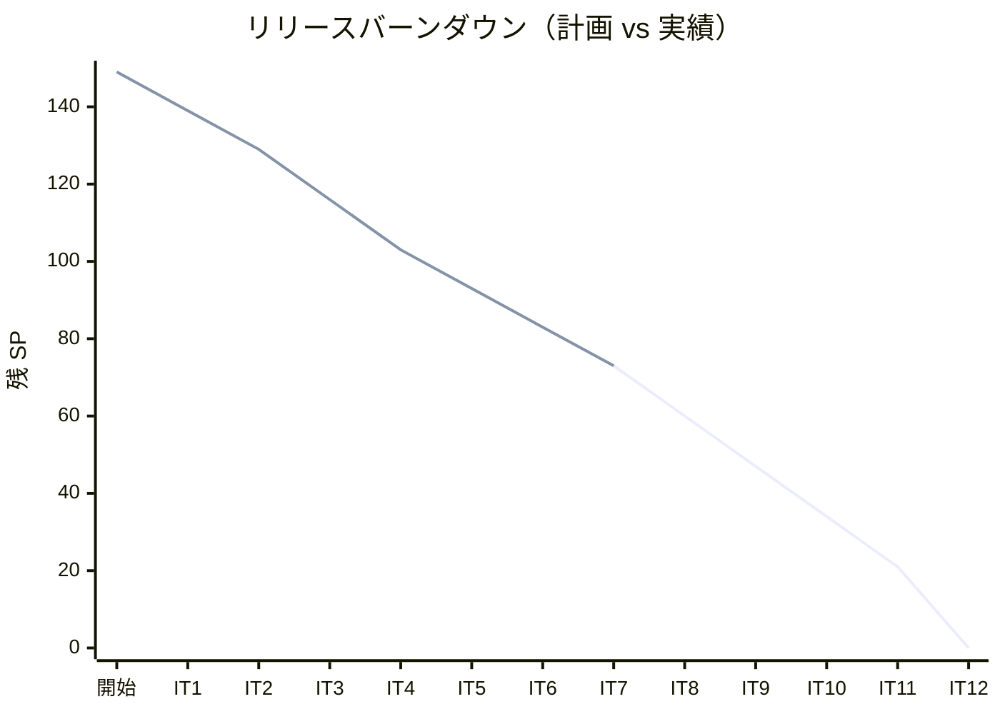
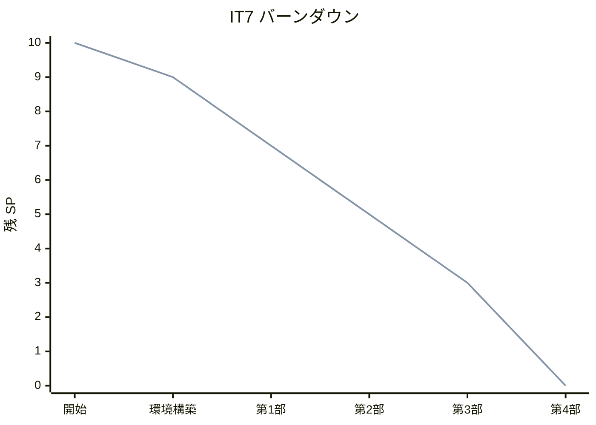
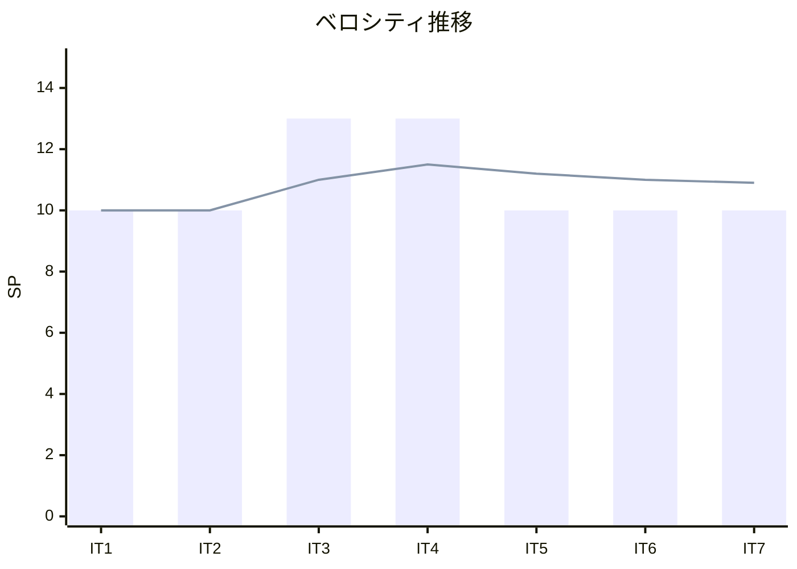

# イテレーション 7 完了報告書

## プロジェクト概要

| 項目 | 内容 |
|------|------|
| **プロジェクト名** | テスト駆動開発から始めるXX入門 |
| **イテレーション** | 7 |
| **対象言語** | Rust |
| **開始日** | 2026-03-02 |
| **終了日** | 2026-03-02 |
| **作業日数** | 1 日（AI + Codex 自動化） |

### 要員

| 項目 | 予定 | 実績 |
|------|------|------|
| **作業日数** | 10 日 | 1 日 |
| **開発者** | 1 名 + AI | 1 名 + AI + Codex |

---

## 指標

### ビルド結果

| 項目 | 結果 |
|------|------|
| テスト（cargo test） | ✅ 47 tests PASS |
| リンター（Clippy） | ✅ 警告ゼロ |
| フォーマッター（rustfmt） | ✅ 違反ゼロ |

### リリースバーンダウン

### イテレーションバーンダウン

### ベロシティ

| イテレーション | 計画 SP | 実績 SP | 累計 SP |
|---------------|---------|---------|---------|
| IT1（Java） | 10 | 10 | 10 |
| IT2（Python） | 10 | 10 | 20 |
| IT3（Node/TS） | 13 | 13 | 33 |
| IT4（Ruby） | 13 | 13 | 46 |
| IT5（Go） | 10 | 10 | 56 |
| IT6（PHP） | 10 | 10 | 66 |
| IT7（Rust） | 10 | 10 | 76 |
| **平均** | **10.9** | **10.9** | |

---

## 実施内容と評価

### 完了したタスク

| # | タスク | 状態 |
|---|--------|------|
| 0 | 環境構築（Cargo + Clippy + rustfmt + CI） | ✅ |
| 1 | 第 1 部: TDD の基本サイクル（章 1-3）執筆・実装 | ✅ |
| 2 | 第 2 部: 開発環境と自動化（章 4-6）執筆・ツール導入 | ✅ |
| 3 | 第 3 部: OOP 設計（章 7-9）執筆・実装 | ✅ |
| 4 | 第 4 部: FP（章 10-12）執筆・実装 + 同期確認 | ✅ |

### 成果物

| カテゴリ | 成果物 |
|---------|--------|
| 記事 | docs/article/rust/ （index.md + 12 章） |
| 実装 | apps/rust/ （Cargo プロジェクト、47 テスト） |
| CI | .github/workflows/rust-ci.yml |
| タスクランナー | apps/rust/Makefile |

### テスト内訳

| モジュール | テスト数 |
|-----------|---------|
| fizz_buzz（公開 API + Part 1） | 17 |
| domain::model::fizz_buzz_value | 5 |
| domain::model::fizz_buzz_list | 10 |
| domain::types::fizz_buzz_type01 | 3 |
| domain::types::fizz_buzz_type02 | 3 |
| domain::types::fizz_buzz_type03 | 3 |
| domain::types::fizz_buzz_type_name | 4 |
| application::fizz_buzz_value_command | 1 |
| application::fizz_buzz_list_command | 1 |
| **合計** | **47** |

### Rust 固有の技術トピック

| 章 | トピック |
|----|---------|
| 1-3 | 所有権と借用、`&str` vs `String`、match タプルパターン |
| 4-6 | Cargo、Clippy、rustfmt、Makefile、GitHub Actions |
| 7-9 | struct + impl、trait（dyn Trait）、pub/非公開、SOLID + モジュール |
| 10-12 | クロージャ（Fn/FnMut/FnOnce）、イテレータチェーン、Result/Option、enum |

---

## リスク実績

| リスク | 影響度 | 発生 | 対応 |
|--------|--------|------|------|
| 所有権・借用の概念が複雑 | 高 | ○ | 他言語との比較表で理解を補助 |
| Rust のコンパイルエラーが厳格 | 中 | △ | Codex が適切に対応 |
| target/ の誤コミット | 低 | ○ | .gitignore 追加 + git rm --cached で修正 |
| cargo-tarpaulin が Nix で未検証 | 低 | — | カバレッジはスキップ（テスト網羅率で代替） |

---

## Phase 2 進捗サマリー

| イテレーション | 言語 | SP | 状態 |
|---------------|------|-----|------|
| IT5 | Go | 10 | ✅ 完了 |
| IT6 | PHP | 10 | ✅ 完了 |
| IT7 | Rust | 10 | ✅ 完了 |
| IT8 | C#/F# | 13 | 未着手 |
| **Phase 2 合計** | | **43** | 30/43 SP 完了（70%） |

---

## 次のステップ

1. IT8（C#/F#）イテレーション計画を作成
2. apps/dotnet/ プロジェクト初期化（.NET + xUnit）
3. C#/F# 第 1〜12 章の執筆・実装を完了
4. Phase 2 完了後、Release 2.0 準備

---

## 更新履歴

| 日付 | 更新内容 | 更新者 |
|------|---------|--------|
| 2026-03-02 | 初版作成 | AI |
