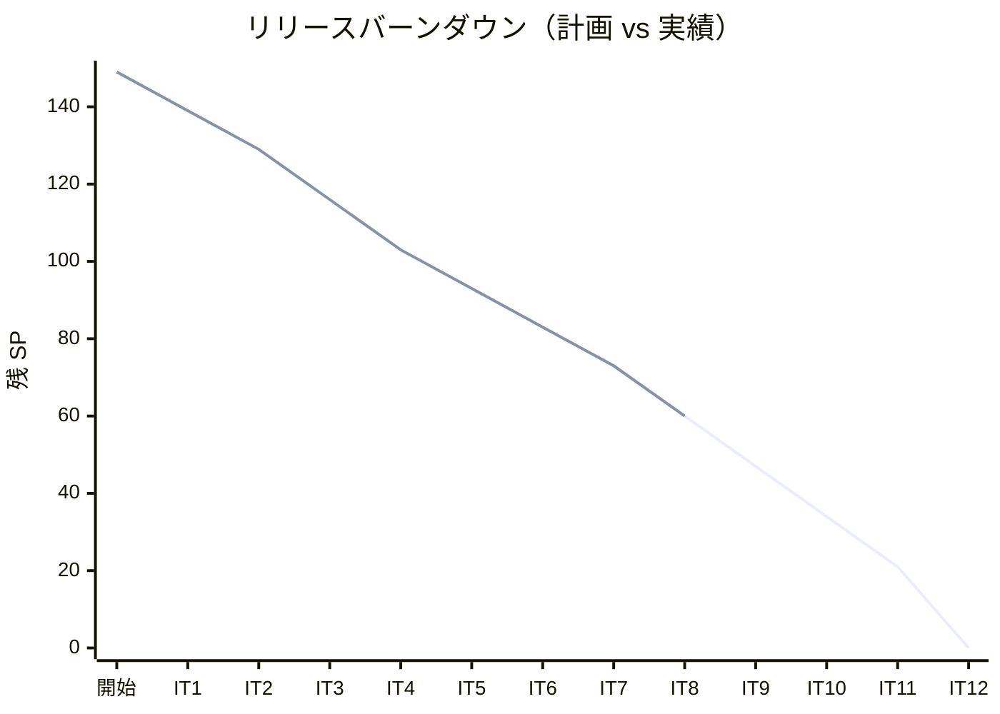
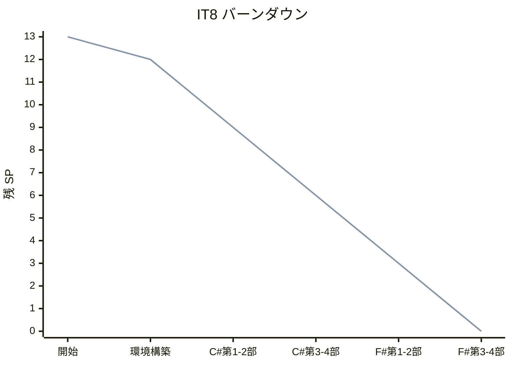
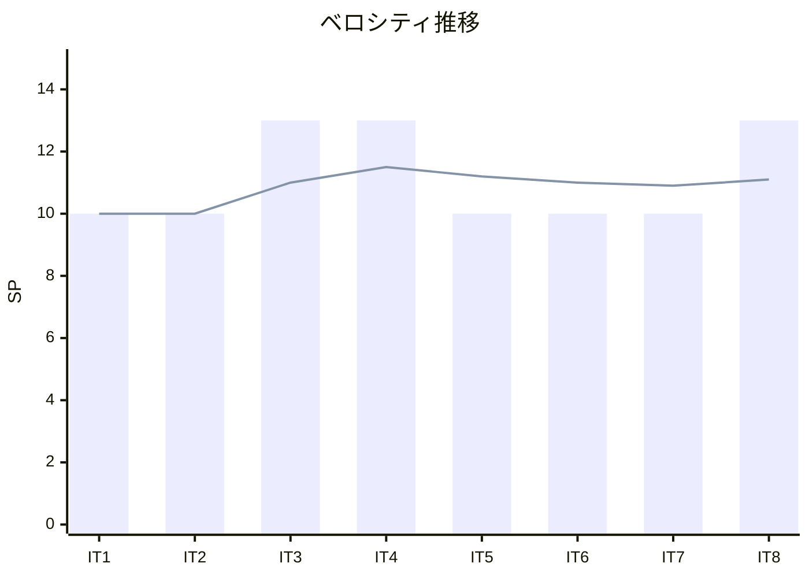

# イテレーション 8 完了報告書

## プロジェクト概要

| 項目 | 内容 |
|------|------|
| **プロジェクト名** | テスト駆動開発から始めるXX入門 |
| **イテレーション** | 8 |
| **対象言語** | C# / F# |
| **開始日** | 2026-03-02 |
| **終了日** | 2026-03-02 |
| **作業日数** | 1 日（AI 自動化） |

### 要員

| 項目 | 予定 | 実績 |
|------|------|------|
| **作業日数** | 10 日 | 1 日 |
| **開発者** | 1 名 + AI | 1 名 + AI |

---

## 指標

### ビルド結果

| 項目 | 結果 |
|------|------|
| テスト（dotnet test） | ✅ 67 tests PASS（C# 38 + F# 29） |
| Cake ビルド（Check） | ✅ 成功 |

### リリースバーンダウン

### イテレーションバーンダウン

### ベロシティ

| イテレーション | 計画 SP | 実績 SP | 累計 SP |
|---------------|---------|---------|---------|
| IT1（Java） | 10 | 10 | 10 |
| IT2（Python） | 10 | 10 | 20 |
| IT3（Node/TS） | 13 | 13 | 33 |
| IT4（Ruby） | 13 | 13 | 46 |
| IT5（Go） | 10 | 10 | 56 |
| IT6（PHP） | 10 | 10 | 66 |
| IT7（Rust） | 10 | 10 | 76 |
| IT8（C#/F#） | 13 | 13 | 89 |
| **平均** | **11.1** | **11.1** | |

---

## 実施内容と評価

### 完了したタスク

| # | タスク | 状態 |
|---|--------|------|
| 0 | 環境構築（.NET + xUnit + Cake + CI） | ✅ |
| 1 | C# 第 1 部: TDD の基本サイクル（章 1-3）執筆・実装 | ✅ |
| 2 | C# 第 2 部: 開発環境と自動化（章 4-6）執筆 | ✅ |
| 3 | C# 第 3 部: OOP 設計（章 7-9）執筆・実装 | ✅ |
| 4 | C# 第 4 部: FP（章 10-12）執筆・実装 | ✅ |
| 5 | F# 第 1 部: TDD の基本サイクル（章 1-3）執筆・実装 | ✅ |
| 6 | F# 第 2 部: 開発環境と自動化（章 4-6）執筆 | ✅ |
| 7 | F# 第 3 部: 関数型アプローチ（章 7-9）執筆・実装 | ✅ |
| 8 | F# 第 4 部: FP（章 10-12）執筆・実装 | ✅ |

### 成果物

| カテゴリ | 成果物 |
|---------|--------|
| 記事（C#） | docs/article/csharp/（index.md + 12 章） |
| 記事（F#） | docs/article/fsharp/（index.md + 12 章） |
| 実装 | apps/dotnet/（.NET ソリューション、67 テスト） |
| CI | .github/workflows/dotnet-ci.yml |
| タスクランナー | apps/dotnet/build.cake（Cake）、apps/dotnet/Makefile（ラッパー） |

### テスト内訳

#### C#（38 テスト）

| クラス | テスト数 |
|--------|---------|
| FizzBuzzRunnerTest | 6 |
| FizzBuzzValueTest | 6 |
| FizzBuzzListTest | 10 |
| FizzBuzzType01Test | 4 |
| FizzBuzzType02Test | 1 |
| FizzBuzzType03Test | 2 |
| FizzBuzzTypeFactoryTest | 6 |
| FizzBuzzCommandTest | 3 |
| **小計** | **38** |

#### F#（29 テスト）

| モジュール | テスト数 |
|-----------|---------|
| FizzBuzzRunnerTests | 6 |
| FizzBuzzValueTests | 5 |
| FizzBuzzListTests | 8 |
| FizzBuzzTypeTests | 8 |
| ApplicationTests | 2 |
| **小計** | **29** |

### 技術トピック

#### C# 固有

| 章 | トピック |
|----|---------|
| 1-3 | xUnit、Assert、var 型推論、三項演算子、リストと LINQ |
| 4-6 | Git、Conventional Commits、NuGet、dotnet format、Cake、GitHub Actions |
| 7-9 | class + interface、IEquatable、Strategy パターン、Command パターン、SOLID |
| 10-12 | LINQ、Func/Action デリゲート、ラムダ式、Nullable 参照型、switch 式 |

#### F# 固有

| 章 | トピック |
|----|---------|
| 1-3 | let バインディング、match 式、パイプライン演算子 `\|>`、List.map |
| 4-6 | Git、NuGet、Fantomas、Cake、GitHub Actions |
| 7-9 | レコード型、判別共用体、モジュール設計、型による設計 |
| 10-12 | 部分適用、カリー化、関数合成 `>>`、Option/Result 型、計算式 |

---

## リスク実績

| リスク | 影響度 | 発生 | 対応 |
|--------|--------|------|------|
| C#/F# 2 言語で各 12 章の作業量 | 高 | ○ | 並列エージェントで記事生成を効率化 |
| .NET SDK 環境構築の Nix 対応 | 中 | — | .NET SDK 8.0.416 が Nix で問題なく動作 |
| F# の関数型概念の記事説明が複雑 | 中 | △ | 判別共用体やパイプラインをコード例で解説 |
| bin/ obj/ の誤コミット | 低 | — | IT7 の学びを活かし .gitignore を先行設定 |
| Codex サンドボックスの書き込み制限 | 中 | ○ | 直接実装に切り替えて対応 |
| IFizzBuzzCommand の Execute メソッド重複 | 低 | ○ | ExecuteValue/ExecuteList にリネーム |

---

## Phase 2 進捗サマリー

| イテレーション | 言語 | SP | 状態 |
|---------------|------|-----|------|
| IT5 | Go | 10 | ✅ 完了 |
| IT6 | PHP | 10 | ✅ 完了 |
| IT7 | Rust | 10 | ✅ 完了 |
| IT8 | C#/F# | 13 | ✅ 完了 |
| **Phase 2 合計** | | **43** | **43/43 SP 完了（100%）** |

---

## 次のステップ

1. Phase 3（IT9-IT12）の計画を開始
2. IT9（Clojure）イテレーション計画を作成
3. Release 2.0 の準備完了確認
4. Phase 2 全体のふりかえりを実施

---

## 更新履歴

| 日付 | 更新内容 | 更新者 |
|------|---------|--------|
| 2026-03-02 | 初版作成 | AI |
