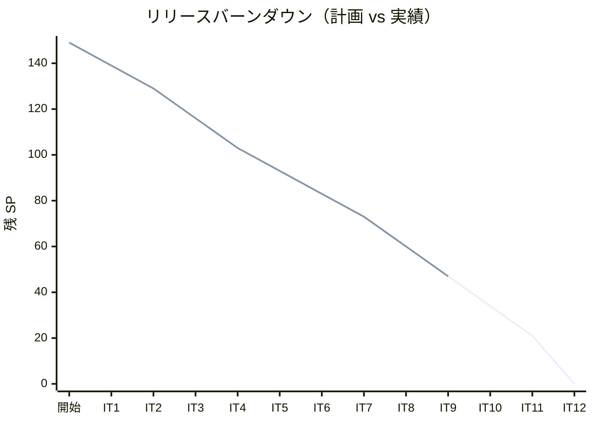
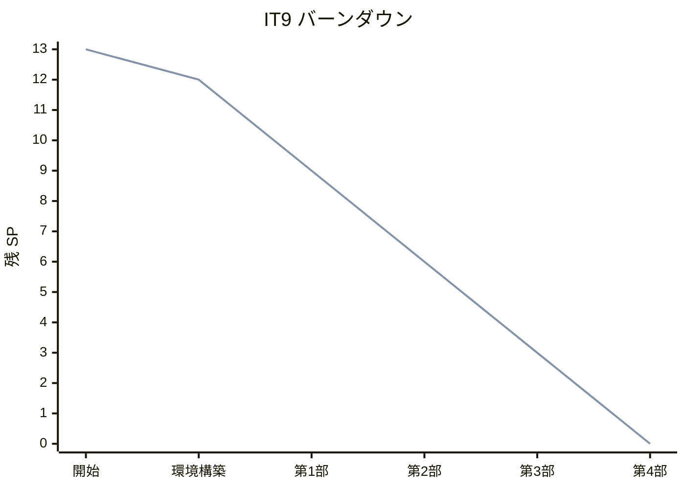
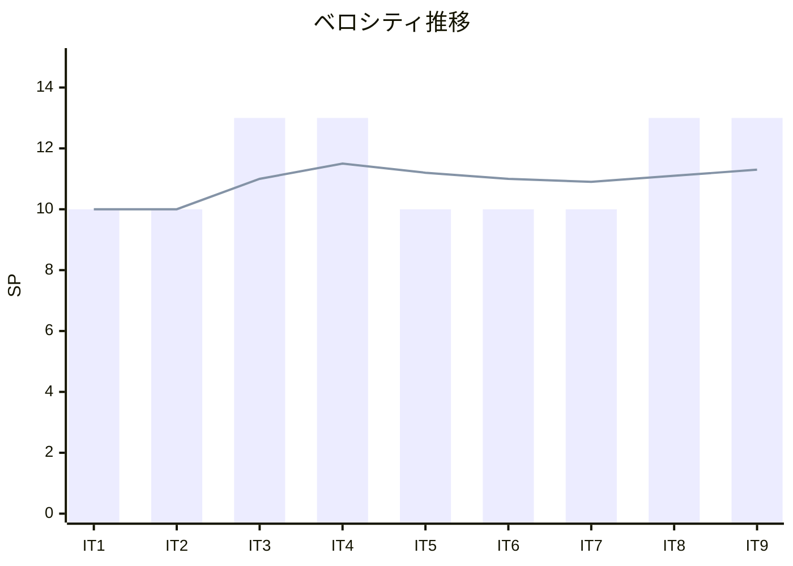

# イテレーション 9 完了報告書

## プロジェクト概要

| 項目 | 内容 |
|------|------|
| **プロジェクト名** | テスト駆動開発から始めるXX入門 |
| **イテレーション** | 9 |
| **対象言語** | Clojure |
| **開始日** | 2026-03-03 |
| **終了日** | 2026-03-03 |
| **作業日数** | 1 日（AI 自動化） |

### 要員

| 項目 | 予定 | 実績 |
|------|------|------|
| **作業日数** | 10 日 | 1 日 |
| **開発者** | 1 名 + AI | 1 名 + AI |

---

## 指標

### ビルド結果

| 項目 | 結果 |
|------|------|
| テスト（lein test） | ✅ 10 tests, 38 assertions PASS |
| Eastwood（静的解析） | ✅ 警告ゼロ |
| Makefile check | ✅ 成功（lint + kibit + complexity + test） |

### リリースバーンダウン

### イテレーションバーンダウン

### ベロシティ

| イテレーション | 計画 SP | 実績 SP | 累計 SP |
|---------------|---------|---------|---------|
| IT1（Java） | 10 | 10 | 10 |
| IT2（Python） | 10 | 10 | 20 |
| IT3（Node/TS） | 13 | 13 | 33 |
| IT4（Ruby） | 13 | 13 | 46 |
| IT5（Go） | 10 | 10 | 56 |
| IT6（PHP） | 10 | 10 | 66 |
| IT7（Rust） | 10 | 10 | 76 |
| IT8（C#/F#） | 13 | 13 | 89 |
| IT9（Clojure） | 13 | 13 | 102 |
| **平均** | **11.3** | **11.3** | |

---

## 実施内容と評価

### 完了したタスク

| # | タスク | 状態 |
|---|--------|------|
| 0 | 環境構築（Leiningen + Eastwood + Kibit + CI） | ✅ |
| 1 | 第 1 部: TDD の基本サイクル（章 1-3）執筆・実装 | ✅ |
| 2 | 第 2 部: 開発環境と自動化（章 4-6）執筆 | ✅ |
| 3 | 第 3 部: プロトコルとマルチメソッド（章 7-9）執筆・実装 | ✅ |
| 4 | 第 4 部: 関数型プログラミング（章 10-12）執筆・実装 | ✅ |

### 成果物

| カテゴリ | 成果物 |
|---------|--------|
| 記事 | docs/article/clojure/（index.md + 12 章） |
| 実装 | apps/clojure/（Leiningen プロジェクト、10 テスト・38 アサーション） |
| CI | .github/workflows/clojure-ci.yml |
| タスクランナー | apps/clojure/Makefile |
| 品質ツール | dev/complexity_checker.clj、scripts/complexity.clj |

### テスト内訳

| テストファイル | テスト数 |
|---------------|---------|
| fizzbuzz/core_test.clj | 3 |
| fizzbuzz/domain/type_test.clj | 4 |
| fizzbuzz/application/command_test.clj | 3 |
| **合計** | **10 テスト、38 アサーション** |

### 技術トピック

| 章 | トピック |
|----|---------|
| 1-3 | S 式、clojure.test（deftest, is, testing）、def / defn、不変バインディング |
| 4-6 | Git、Conventional Commits、Leiningen、Eastwood、Kibit、Makefile、GitHub Actions |
| 7-9 | defprotocol / defrecord、defmulti / defmethod、名前空間（ns）設計 |
| 10-12 | 高階関数（map/filter/reduce）、スレッディングマクロ（->、->>）、永続データ構造、clojure.spec、ex-info |

---

## リスク実績

| リスク | 影響度 | 発生 | 対応 |
|--------|--------|------|------|
| LISP 構文に慣れていない読者への説明が複雑 | 高 | △ | S 式の段階的導入と他言語比較で補助 |
| OOP 概念のプロトコル/マルチメソッドへの対応づけ | 中 | — | IT9 テンプレートとして確立 |
| Leiningen プロジェクト構成の JVM 依存問題 | 中 | — | Nix 環境で JVM を含む全依存を管理 |
| target/ の誤コミット | 低 | — | .gitignore を先行設定（IT7 の学び） |
| 単一コミットでの全体完了 | 中 | ○ | IT10 以降は部ごとのコミット分割で改善予定 |

---

## Phase 3 進捗サマリー

| イテレーション | 言語 | SP | 状態 |
|---------------|------|-----|------|
| IT9 | Clojure | 13 | ✅ 完了 |
| IT10 | Scala | 13 | 未着手 |
| IT11 | Elixir | 13 | 未着手 |
| IT12 | Haskell + 統合 | 21 | 未着手 |
| **Phase 3 合計** | | **60** | **13/60 SP 完了（21.7%）** |

---

## 次のステップ

1. IT10（Scala）イテレーション計画を作成
2. apps/scala/ プロジェクト初期化（sbt + ScalaTest + scalafmt）
3. Scala 第 1〜12 章の執筆・実装を完了
4. IT9 の学びを活かし部ごとにコミットを分割

---

## 更新履歴

| 日付 | 更新内容 | 更新者 |
|------|---------|--------|
| 2026-03-03 | 初版作成 | AI |
