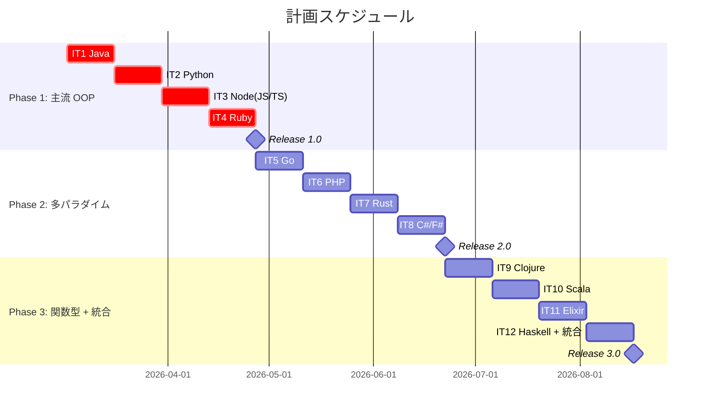
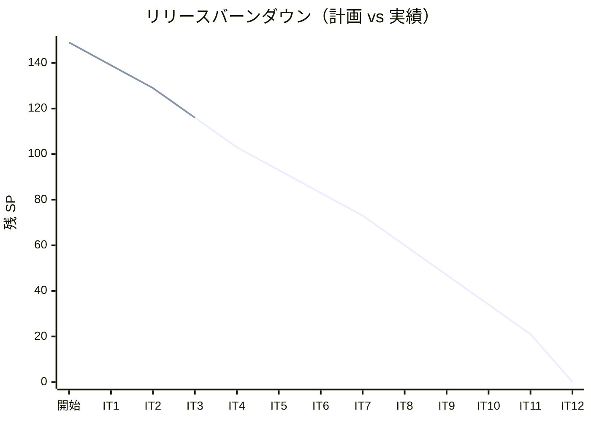

# リリース計画 - テスト駆動開発から始めるXX入門

## 概要

本ドキュメントは、「テスト駆動開発から始めるXX入門」記事シリーズのリリース計画を定義します。

### プロジェクト情報

| 項目 | 内容 |
|------|------|
| **プロジェクト名** | テスト駆動開発から始めるXX入門 |
| **目的** | TDD の実践を通じて 12 言語の特徴を学ぶ記事シリーズの執筆と実装 |
| **対象ユーザー** | プログラミング基礎を持ち、TDD や複数言語に興味がある開発者 |
| **開発チーム** | 1 名 + AI アシスタント |

---

## 満足条件

### スコープ

12 言語 × 4 部（12 章）の記事執筆と実装コードを 3 フェーズに分けてリリースする。

| フェーズ | 内容 | 言語数 |
|---------|------|--------|
| Phase 1 | 主流 OOP 言語 | 4 言語 |
| Phase 2 | 多パラダイム言語 | 4 言語 |
| Phase 3 | 関数型言語 + 統合解説 | 4 言語 + 統合 |
| **合計** | | **12 言語 + 統合解説** |

### スケジュール

- **開発期間**: 24 週間（6 ヶ月）
- **イテレーション**: 2 週間 × 12 イテレーション
- **リリース**: 3 段階リリース（Phase ごと）

### リソース

- **開発者**: 1 名 + AI アシスタント
- **想定稼働時間**: 30 時間/週

---

## ユーザーストーリー一覧とストーリーポイント

### 優先順位マトリックス

4 軸評価で優先順位を決定:

1. **金銭価値（BV）**: 読者への学習価値
2. **コスト（C）**: 執筆・実装コスト
3. **知識習得（KA）**: テンプレート確立・ノウハウ蓄積
4. **リスク軽減（RR）**: 技術的リスクの軽減

### Phase 1: 主流 OOP 言語（イテレーション 1-4）

| ID | ユーザーストーリー | SP | BV | C | KA | RR | 優先度 |
|----|-------------------|----|----|---|----|----|--------|
| US-001 | Java の TDD 入門記事の執筆と実装 | 10 | 高 | 中 | 高 | 高 | 必須 |
| US-002 | Python の TDD 入門記事の執筆と実装 | 10 | 高 | 低 | 中 | 中 | 必須 |
| US-003 | Node（JS/TS）の TDD 入門記事の執筆と実装 | 13 | 高 | 中 | 中 | 中 | 必須 |
| US-004 | Ruby の TDD 入門記事の執筆と実装 | 13 | 中 | 中 | 中 | 低 | 必須 |
| **合計** | | **46** | | | | | |

### Phase 2: 多パラダイム言語（イテレーション 5-8）

| ID | ユーザーストーリー | SP | BV | C | KA | RR | 優先度 |
|----|-------------------|----|----|---|----|----|--------|
| US-005 | Go の TDD 入門記事の執筆と実装 | 10 | 中 | 低 | 中 | 低 | 中 |
| US-006 | PHP の TDD 入門記事の執筆と実装 | 10 | 中 | 低 | 低 | 低 | 中 |
| US-007 | Rust の TDD 入門記事の執筆と実装 | 10 | 高 | 高 | 高 | 中 | 中 |
| US-008 | C#/F#（dotnet）の TDD 入門記事の執筆と実装 | 13 | 中 | 中 | 中 | 中 | 中 |
| **合計** | | **43** | | | | | |

### Phase 3: 関数型言語 + 統合解説（イテレーション 9-12）

| ID | ユーザーストーリー | SP | BV | C | KA | RR | 優先度 |
|----|-------------------|----|----|---|----|----|--------|
| US-009 | Clojure の TDD 入門記事の執筆と実装 | 13 | 中 | 高 | 高 | 中 | 低 |
| US-010 | Scala の TDD 入門記事の執筆と実装 | 13 | 中 | 高 | 中 | 低 | 低 |
| US-011 | Elixir の TDD 入門記事の執筆と実装 | 13 | 中 | 中 | 中 | 低 | 低 |
| US-012 | Haskell の TDD 入門記事の執筆と実装 | 13 | 中 | 高 | 高 | 中 | 低 |
| US-013 | 多言語統合解説の執筆 | 8 | 高 | 中 | 高 | 低 | 低 |
| **合計** | | **60** | | | | | |

### 全体サマリー

| フェーズ | ストーリーポイント | イテレーション |
|---------|-------------------|---------------|
| Phase 1 | 46 SP | 1-4 |
| Phase 2 | 43 SP | 5-8 |
| Phase 3 | 60 SP | 9-12 |
| **合計** | **149 SP** | 12 イテレーション |

### ストーリーポイントの内訳

各言語のユーザーストーリーは以下のサブタスクで構成される:

| サブタスク | 3エピソード言語 | 4エピソード言語 |
|-----------|---------------|---------------|
| 環境構築（apps/{lang}/ 初期化） | 1 SP | 1 SP |
| 第 1 部: TDD の基本サイクル（章 1-3） | 3 SP | 3 SP |
| 第 2 部: 開発環境と自動化（章 4-6） | 3 SP | 3 SP |
| 第 3 部: Oブジェクト指向設計（章 7-9） | 3 SP | 3 SP |
| 第 4 部: 関数型プログラミング（章 10-12） | - | 3 SP |
| **合計** | **10 SP** | **13 SP** |

---

## ベロシティ見積もり

### 初期ベロシティ推定

| 項目 | 値 |
|------|-----|
| **イテレーション期間** | 2 週間 |
| **チーム規模** | 1 名 + AI |
| **想定ベロシティ** | 13-15 SP/イテレーション |
| **バッファ係数** | 0.8（20%バッファ） |
| **実効ベロシティ** | 10-12 SP/イテレーション |

### ベロシティ検証計画

- IT1（Java）完了後に実績ベロシティを計測
- IT3 完了後に計画を見直し（3 イテレーション実績でトレンド分析）

---

## 段階的リリース戦略

### リリーススケジュール

#### 計画スケジュール

### リリース内容

#### Release 1.0（Phase 1 完了）: 主流 OOP 言語

**目標**: Java、Python、Node（JS/TS）、Ruby の記事と実装を公開

**含まれる機能**:

- 4 言語 × 12 章の記事
- 4 言語の TDD 実装コード（apps/ 配下）
- 言語別 index ページ

**リリース条件**:

- [ ] 全記事のレビュー完了
- [ ] 全言語のテストがパス
- [ ] MkDocs でプレビュー確認済み

#### Release 2.0（Phase 2 完了）: 多パラダイム言語

**目標**: Go、PHP、Rust、C#/F# の記事と実装を公開

**含まれる機能**:

- 4 言語 × 12 章の記事
- 4 言語の TDD 実装コード

**リリース条件**:

- [ ] 全記事のレビュー完了
- [ ] 全言語のテストがパス

#### Release 3.0（Phase 3 完了）: 関数型言語 + 統合解説

**目標**: Clojure、Scala、Elixir、Haskell の記事と多言語統合解説を公開

**含まれる機能**:

- 4 言語 × 12 章の記事
- 多言語統合解説
- 全 12 言語の横断比較

**リリース条件**:

- [ ] 全記事のレビュー完了
- [ ] 全言語のテストがパス
- [ ] 統合解説の内容が全言語をカバー

---

## バッファ戦略

### フィーチャバッファ

| フェーズ | 計画 SP | バッファ（30%） | 実効 SP |
|---------|---------|-----------------|---------|
| Phase 1 | 46 | 14 | 32 |
| Phase 2 | 43 | 13 | 30 |
| Phase 3 | 60 | 18 | 42 |

### スケジュールバッファ

- **予備イテレーション**: 各 Phase 終了後に 1 週間の予備期間
- **全体バッファ**: 約 20%

### バッファ消費ルール

1. 第 4 部（関数型）の章を簡略化（3 エピソード言語）
2. 統合解説を段階的に執筆
3. スケジュールバッファは最後の手段

---

## イテレーション計画概要

### イテレーション 1（Week 1-2）

**ゴール**: Java の全 12 章の記事執筆と実装を完了し、テンプレートを確立する

**主なタスク**:

- [x] apps/java/ プロジェクト初期化
- [x] 第 1 部（章 1-3）: TDD 基本サイクルの執筆と実装
- [x] 第 2 部（章 4-6）: 開発環境と自動化の執筆と実装
- [x] 第 3 部（章 7-9）: OOP 設計の執筆と実装

**目標 SP**: 10

詳細は [iteration_plan-1.md](./iteration_plan-1.md) を参照。

### イテレーション 2（Week 3-4）

**ゴール**: Python の全 12 章の記事執筆と実装を完了する

**主なタスク**:

- [x] apps/python/ プロジェクト初期化
- [x] 第 1〜3 部の執筆と実装
- [x] Python 固有の第 4 部（ジェネレータ、デコレータ、functools）

**目標 SP**: 10

詳細は [iteration_plan-2.md](./iteration_plan-2.md) を参照。

### イテレーション 3（Week 5-6）

**ゴール**: Node（JavaScript/TypeScript）の全 12 章の記事執筆と実装を完了する

**主なタスク**:

- [x] apps/node/ に npm プロジェクト初期化（Vitest + ESLint + Prettier + TypeScript）
- [x] 第 1 部（章 1-3）: TDD 基本サイクルの執筆と実装
- [x] 第 2 部（章 4-6）: 開発環境と自動化の執筆と実装
- [x] 第 3 部（章 7-9）: OOP 設計の執筆と実装
- [x] 第 4 部（章 10-12）: 関数型プログラミング（Arrow Functions、Generics、Union Types）

**目標 SP**: 13

詳細は [iteration_plan-3.md](./iteration_plan-3.md) を参照。

### イテレーション 4（Week 7-8）

**ゴール**: Ruby の全 12 章の記事執筆と実装を完了し、Release 1.0 をリリースする

**主なタスク**:

- [ ] apps/ruby/ プロジェクト初期化
- [ ] 第 1〜4 部の執筆と実装（エピソード 4: ベンチマーク含む）
- [ ] Release 1.0 準備（レビュー、MkDocs 最終確認）

**目標 SP**: 13

詳細は [iteration_plan-4.md](./iteration_plan-4.md) を参照。

### イテレーション 5-8（Week 9-16）

Phase 2: Go、PHP、Rust、C#/F# を各イテレーションで執筆・実装。

### イテレーション 9-12（Week 17-24）

Phase 3: Clojure、Scala、Elixir、Haskell を各イテレーションで執筆・実装。IT12 で多言語統合解説を完成。

---

## リスク管理

### 技術リスク

| リスク | 影響度 | 発生確率 | 対策 |
|--------|--------|----------|------|
| 特定言語の環境構築で躓く | 中 | 中 | Nix 環境で事前検証、Wiki 記事を参照 |
| 第 4 部（FP）の内容が 3 エピソード言語で薄くなる | 低 | 高 | 各言語の FP 機能に焦点を当てた独自コンテンツ作成 |
| 記事とコードの同期が取れなくなる | 中 | 中 | workflow.md のチェックリストを厳守 |

### スケジュールリスク

| リスク | 影響度 | 発生確率 | 対策 |
|--------|--------|----------|------|
| 1 言語あたりの執筆時間が想定超過 | 高 | 中 | IT1 の実績で見積もり修正、第 4 部を簡略化 |
| モチベーション低下（12 言語の繰り返し） | 中 | 中 | パラダイムの異なる言語を交互に配置 |

---

## 進捗管理

### メトリクス

| メトリクス | 目標 |
|-----------|------|
| ベロシティ | 10-13 SP/イテレーション |
| テストカバレッジ | 80% 以上（各言語） |
| 記事完成率 | イテレーション終了時に対象言語 100% |
| 予定達成率 | 90% 以上 |

### 進捗状況

| イテレーション | 言語 | 計画 SP | 実績 SP | 達成率 | 状態 |
|---------------|------|---------|---------|--------|------|
| 1 | Java | 10 | 10 | 100% | 完了 |
| 2 | Python | 10 | 10 | 100% | 完了 |
| 3 | Node（JS/TS） | 13 | 13 | 100% | 完了 |
| 4 | Ruby | 13 | - | - | 未着手 |
| 5 | Go | 10 | - | - | 未着手 |
| 6 | PHP | 10 | - | - | 未着手 |
| 7 | Rust | 10 | - | - | 未着手 |
| 8 | C#/F# | 13 | - | - | 未着手 |
| 9 | Clojure | 13 | - | - | 未着手 |
| 10 | Scala | 13 | - | - | 未着手 |
| 11 | Elixir | 13 | - | - | 未着手 |
| 12 | Haskell + 統合 | 21 | - | - | 未着手 |

### バーンダウンチャート

---

## 次のステップ

1. IT4（Ruby）イテレーション計画を作成
2. ベロシティトレンド分析（3 イテレーション実績: 平均 11 SP）
3. apps/ruby/ プロジェクト初期化（Bundler + minitest/RSpec）
4. Ruby 第 1 章の執筆・実装を開始

---

## 更新履歴

| 日付 | 更新内容 | 更新者 |
|------|---------|--------|
| 2026-02-28 | 初版作成 | - |
| 2026-03-01 | IT2 完了（Python 10 SP）、バーンダウン更新 | - |
| 2026-03-01 | IT3 完了（Node/TS 13 SP）、バーンダウン更新、ベロシティ平均 11 SP | - |
